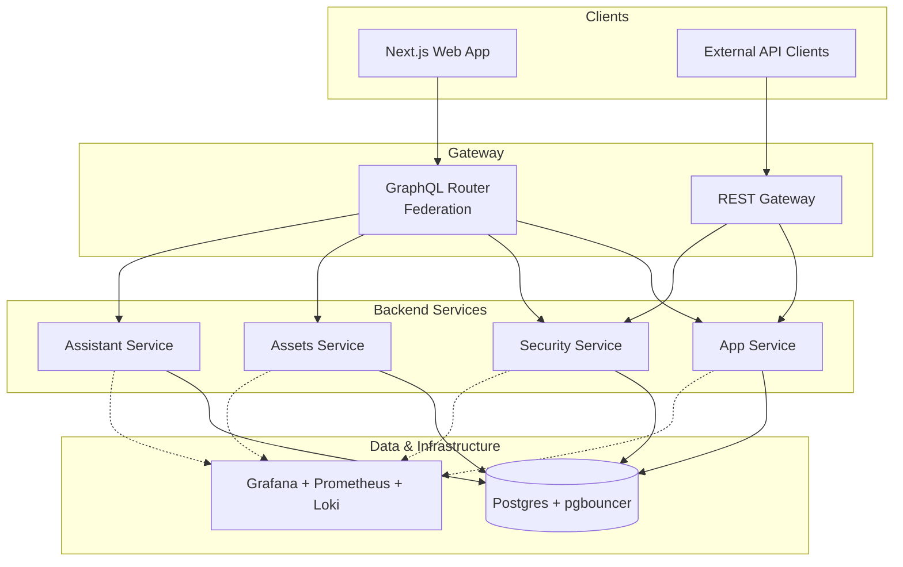

<p align="center">
  
</p>

# NeoTool


[](https://opensource.org/licenses/MIT)

**A production-grade full-stack baseline for building enterprise products without starting from scratch.**

NeoTool is a cohesive monorepo that brings together backend services, frontend apps, API contracts, design assets, and infrastructure in a way that actually works together. It's designed for teams who want to move fast without sacrificing architectural quality or ending up with technical debt six months down the road.

## Why NeoTool?

Most starter projects are either too minimal to be useful or too opinionated to adapt. NeoTool strikes a different balance:

- **Spec-driven development** — Documentation in `docs/` isn't an afterthought; it drives implementation, validation, and code reviews
- **GraphQL federation** — Real federated schemas with multiple subgraphs, not just a single monolithic API
- **Security baked in** — Authentication, authorization, mTLS, audit logging, and RBAC/ABAC patterns ready to go
- **Observable from day one** — Grafana, Prometheus, and Loki integrated locally and in production
- **Cloud-ready tooling** — Docker Compose for local dev, K8s artifacts for deployment, CI/CD guardrails that actually catch issues

Think of it as upstream infrastructure for your products. You can fork it, customize it, and periodically pull improvements back in.

---

## Repository Structure

| Path | What's Inside |
| --- | --- |
| [`web/`](web/) | Next.js + React frontend with GraphQL integration, TypeScript, and comprehensive testing |
| [`service/kotlin/`](service/kotlin/) | Micronaut backend with modular services: App, Security, Assets, Assistant, and Common utilities |
| [`contracts/`](contracts/) | GraphQL federation schemas (supergraph + subgraphs) and OpenAPI specs for REST endpoints |
| [`design/`](design/) | Brand assets, UI tokens, logos (SVG/PNG), icons, and design guidelines |
| [`infra/`](infra/) | Docker Compose for local development, K8s manifests, observability stack configs, GraphQL router setup |
| [`docs/`](docs/) | 94 structured markdown files covering architecture, patterns, standards, workflows, and ADRs |
| [`scripts/cli/`](scripts/cli/) | NeoTool CLI for schema validation, environment checks, Kafka management, and more |

---

## Quick Start

### Prerequisites

- **Node.js 20+** (for frontend)
- **JDK 21+** (for Kotlin backend)
- **Docker** (Colima recommended on macOS/Linux)
- **pnpm** or npm
- Git

### 1. Clone and Verify Tooling

```bash
git clone https://github.com/salomax/neotool.git
cd neotool

# Check that Node, Docker, and JVM are properly installed
./neotool --version
```

### 2. Install Dependencies

```bash
# Frontend
cd web && pnpm install

# Backend
cd ../service/kotlin && ./gradlew build
```

### 3. Spin Up Local Infrastructure

```bash
# Start Postgres, pgbouncer, GraphQL router, and observability stack
docker compose -f infra/docker/docker-compose.local.yml up -d
```

### 4. Run the Applications

```bash
# Web (in one terminal)
cd web && pnpm dev

# Backend services (in another terminal)
cd service/kotlin && ./gradlew run
```

### 5. Configure Environment

- Create `.env.local` files in `infra/` for database credentials, GraphQL endpoints, and API keys
- Add `.env.local` in `web/` for frontend API URLs
- Adjust `project.config.json` if you want to rename the project

---

## Core Services

NeoTool ships with five Kotlin backend modules, each with a clear responsibility:

### **App Service**
Main business logic with domain modeling, GraphQL resolvers, HTTP controllers, and repository layers. Start here for product-specific features.

### **Security Service**
Full authentication and authorization stack:
- **AuthN**: Password-based (Argon2id), OAuth2 (Google), JWT (access + refresh tokens), remember-me, password reset with rate limiting
- **AuthZ**: RBAC + ABAC, resource-level and GraphQL field-level enforcement, permission-based checks
- **Interservice**: mTLS for service-to-service communication, audit logging hooks
- **GraphQL API**: User, role, group, and permission management with pagination and batch operations to avoid N+1 queries

See [`docs/03-features/security/`](docs/03-features/security/) for detailed documentation.

### **Assets Service**
File and media storage management with S3-compatible bucket operations, upload/download handling, and visibility controls. Built for handling product images, documents, and user-generated content.

### **Assistant Service**
AI integration layer with LLM support (Gemini provider), conversation context management, tool registry, and agent-based interactions. Ready for building AI-powered features without reinventing the wheel.

### **Common Module**
Shared utilities across all services: GraphQL federation infrastructure, pagination helpers, JWT handling, entity base classes, exception handling, batch/Kafka utilities, metrics collection, and testing infrastructure.

---

## Frontend

The `web/` directory is a **Next.js + React** application with:

- **TypeScript** throughout
- **Apollo Client** for GraphQL with type-safe operations via GraphQL Code Generator
- **Vitest** for unit tests, **Playwright** for E2E tests
- **Storybook** for component documentation
- **ESLint** and comprehensive linting rules
- **80% minimum code coverage** enforced in CI

It's wired to consume the GraphQL federation API and follows the design tokens from `design/` for consistent branding.

---

## GraphQL Federation

NeoTool uses **real GraphQL federation** with Apollo Router:

```
contracts/graphql/
├── supergraph/
│   ├── supergraph.graphql      # Unified schema
│   ├── supergraph.yaml         # Router configuration
│   └── supergraph.local.yaml   # Local dev overrides
└── subgraphs/
    ├── app/schema.graphqls           # Product & Customer entities
    ├── security/schema.graphqls      # User, Role, Permission types
    └── assistant/schema.graphqls     # AI conversation schema
```

Each service exposes its own subgraph, and the router stitches them together. This means you can evolve each domain independently without breaking the overall API contract.

---

## Infrastructure & Observability

### Local Stack (Docker Compose)
Running `docker compose -f infra/docker/docker-compose.local.yml up` gives you:
- **Postgres** + **pgbouncer** for connection pooling
- **GraphQL Router** for schema federation
- **Grafana** + **Prometheus** + **Loki** + **Promtail** for metrics and log aggregation

Everything is pre-configured with provisioning for dashboards and datasources. You get production-like observability in your local environment.

### Production Deployment
K8s manifests (Kustomize-friendly, ArgoCD-compatible) live in `infra/` alongside router configs for staging and production environments.

---

## NeoTool CLI

The `./neotool` command provides utilities for common operations:

```bash
./neotool --version                 # Verify Node, Docker, JVM versions

./neotool graphql sync              # Interactive schema sync
./neotool graphql validate          # Validate schema consistency
./neotool graphql generate          # Build supergraph schema

./neotool validate                  # Run all validations (web + backend)
./neotool validate --web            # Frontend only
./neotool validate --service        # Backend only

./neotool kafka --topic             # List Kafka topics
./neotool kafka --topic <name>      # Describe specific topic
./neotool kafka --consumer-group    # List consumer groups
./neotool kafka --reset-offsets     # Manage consumer offsets

./neotool upstream                  # Manage .gitattributes merge strategies
```

All commands are also available via `scripts/cli/cli`.

---

## CI/CD Pipeline

NeoTool uses a three-stage pipeline model:

### **Pull Request (Preview)**
- Build, lint, typecheck, unit/integration tests
- **Coverage gates**: Backend 90% unit / 80% integration / 100% security / 80% incremental; Frontend 80% across all metrics
- Preview deployments for testing changes in isolation

### **Staging (Rehearsal)**
- Deploy merged changes using the same image digests that will go to production
- Smoke tests, E2E tests, contract validation with real infrastructure and secrets
- Integration testing across services

### **Production (Promotion)**
- Promote tested image digest via Git tag (`vX.Y.Z`)
- Gated with approvals and optional canary/blue-green deployment
- Automatic rollback on health regression

**Release flow**: `git tag vX.Y.Z && git push origin vX.Y.Z` or create a GitHub release.

---

## Documentation

The `docs/` directory contains **94 structured markdown files** organized for progressive discovery:

- **00-overview**: Architecture, tech stack, quick-start guides
- **01-architecture**: System, service, frontend, data, and API design
- **02-domain**: Domain modeling, glossary, core concepts
- **03-features**: Feature specifications (security, assets)
- **04-patterns**: Backend, frontend, API, and infrastructure patterns
- **05-standards**: Coding, architecture, API, database, testing, security standards
- **06-workflows**: Feature development, code review, testing, deployment workflows
- **07-examples**: Concrete code examples for backend, frontend, and full-stack scenarios
- **08-templates**: Feature forms, AI prompts, code templates, document templates
- **09-adr**: Architecture Decision Records for key technical choices
- **10-reference**: Commands, file structure, GraphQL schema reference, API documentation
- **11-validation**: Checklists and validation scripts

See [`docs/MANIFEST.md`](docs/MANIFEST.md) for the complete document index.

---

## Roadmap

### Near-term
- Entity versioning for optimistic concurrency control
- Enhanced observability with custom SLO definitions and alerting
- Feature flags integration (Unleash)
- Visual regression testing
- JWT ID (JTI) support and access token blacklist — see [Security TODO](docs/03-features/security/README.md#todo)

### Under Consideration
- React Native mobile app (currently not implemented)
- BI service for analytics and reporting
- Webhook management system
- Additional AI agent examples and chat UI templates

---

## Architecture Overview



---

## Contributing

We welcome issues, feature requests, and pull requests. A few guidelines:

- **Keep modules clean**: Follow existing architectural patterns and separation of concerns
- **Align with standards**: Check `docs/05-standards/` before submitting code
- **Favor upstream-friendly changes**: Keep in mind that other products may pull updates from this repo
- **Write tests**: Maintain coverage thresholds (90% unit, 80% integration for backend; 80% overall for frontend)
- **Update docs**: If you change behavior, update the relevant spec in `docs/`

For detailed contribution workflows, see [`docs/06-workflows/code-review.md`](docs/06-workflows/code-review.md).

---

## License

MIT — see [LICENSE](LICENSE) for details.
