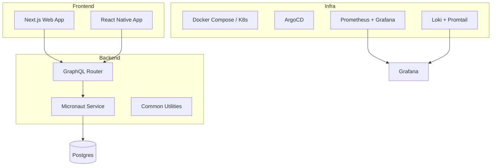
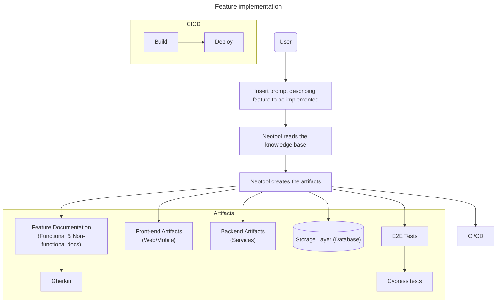

  

# NeoTool — build enterprise solutions smarter and faster

---

NeoTool is a **modular full‑stack boilerplate** designed to **accelerate new app development** while keeping **clean architecture and best practices** baked in from day one.

Think of it as a **foundation framework** that helps you spin up new services or apps (backend, frontend, infra, and design system), all wired together and ready to evolve.

 spec-driven development

---

## ✨ Overview

NeoTool brings together several layers under one monorepo:

| Layer | Description | Tech Stack |
|-------|--------------|-------------|
| **Backend (`service/`)** | Kotlin + Micronaut with GraphQL, modular architecture, reusable components, and testing setup. | Kotlin, Micronaut, GraphQL, Gradle |
| **Frontend (`web/`)** | React + Next.js web app scaffold ready to consume GraphQL APIs. | React, Next.js, TypeScript |
| **Mobile (`mobile/`)** | Expo + React Native setup for cross‑platform mobile apps. | React Native, Expo |
| **Infra (`infra/`)** | Docker Compose, Kubernetes (Kustomize), GitOps (ArgoCD), and observability stack. | Docker, K8s, Grafana, Prometheus, Loki |
| **Contracts (`contracts/`)** | GraphQL Federation + OpenAPI specs for schema standardization. | Apollo Federation, OpenAPI |
| **Design (`design/`)** | Brand assets, UI tokens, icons, and design guidelines. | Figma, Adobe, Tokens |
| **Docs (`docs/`)** | ADRs and developer documentation via Docusaurus. | Markdown, Docusaurus |

---

## 🧩 Architecture

---

## Infrastructure

#TODO

---

## Frontend

#TODO

---

## Backend

#TODO

### APIs (GraphQL and REST)

### Sync services

#TODO

### Async services

#### Messaging

#TODO

#### Webhooks

#TODO

---

## Data storage layer

---

## 🧭 Roadmap

- [ ] Lint
- [ ] Add Security module (Auth, RBAC)
- [ ] Add feature flag service
- [ ] Enable K8s deploy via GitOps  
- [ ] AI-based documentation assistant 🤖

---

## 🤝 Contributing

Pull requests, issues, and ideas are super welcome!  
Just keep the structure clean and consistent with existing modules.
