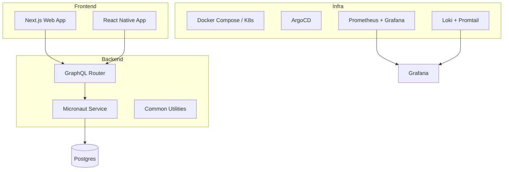
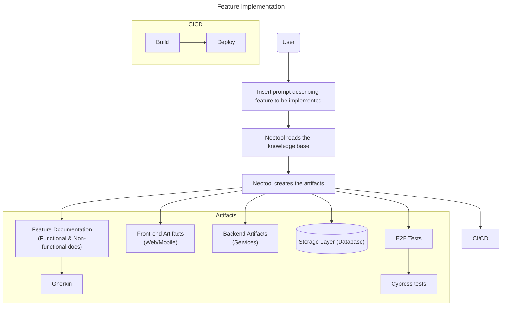

<p align="center">
  
</p>


# NeoTool — build enterprise solutions smarter and faster


[](https://opensource.org/licenses/MIT)

---

NeoTool is a **modular full‑stack boilerplate** designed to **accelerate new app development** while keeping **clean architecture and best practices** baked in from day one.

Think of it as a **foundation framework** that helps you spin up new services or apps (backend, frontend, infra, and design system), all wired together and ready to evolve.

 spec-driven development

---

## ✨ Overview

NeoTool brings together several layers under one monorepo:

| Layer | Description | Tech Stack |
|-------|--------------|-------------|
| **Frontend (`web/`)** | React + Next.js web app scaffold ready to consume GraphQL APIs. | React, Next.js, TypeScript |
| **Mobile (`mobile/`)** | Expo + React Native setup for cross‑platform mobile apps. | React Native, Expo |
| **Backend (`service/`)** | Kotlin + Micronaut with GraphQL, modular architecture, reusable components, and testing setup. | Kotlin, Micronaut, GraphQL, Gradle |
| **Contracts (`contracts/`)** | GraphQL Federation + OpenAPI specs for schema standardization. | Apollo Federation, OpenAPI |
| **Design (`design/`)** | Brand assets, UI tokens, icons, and design guidelines. | Figma, Adobe, Tokens |
| **Infra (`infra/`)** | Docker Compose, Kubernetes (Kustomize), GitOps (ArgoCD), and observability stack. | Docker, K8s, Grafana, Prometheus, Loki |
| **Docs (`docs/`)** | ADRs and developer documentation via Docusaurus. | Markdown, Docusaurus |

---

## Getting Started

### Prerequisites

Before you begin, ensure you have the following installed:

- **Node.js** - Version 18.x or higher (LTS recommended)
- **npm or pnpm** - Package manager for managing dependencies
- **Git** - Version control system
- **Docker** (optional) - For running infrastructure services

### Setup Options

Choose the setup method that best fits your situation:

#### Option 1: Starting a New Project

If you're starting from scratch, clone the starter repository:

```bash
# Clone the repository
git clone https://github.com/salomax/neotool.git
cd neotool

# Install dependencies for web frontend
cd web
npm install
# or
pnpm install

# Install dependencies for Kotlin backend
cd ../service/kotlin
./gradlew build

# Install dependencies for mobile (optional)
cd ../../mobile
npm install
```

#### Option 2: Integrating into an Existing Project

If you already have a project and want to integrate NeoTool into it, merge from remote to preserve commit history:

```bash
# Navigate to your existing project
cd /path/to/your/existing/project

# Add the starter as a remote
git remote add starter https://github.com/salomax/neotool.git

# Fetch the starter repository
git fetch starter

# Merge the starter into your repo
git merge starter/main --allow-unrelated-histories

# Resolve any conflicts, then commit
git add .
git commit -m "Merge NeoTool starter boilerplate"
```

### Customizing Your Project Name

After cloning or integrating the starter, you'll want to customize the project name from "neotool" to your own project name. This includes updating package names, namespaces, database names, and all references throughout the codebase.

**Quick Setup:**

1. Copy the example configuration:
   ```bash
   cp project.config.example.json project.config.json
   ```

2. Edit `project.config.json` with your project details

3. Run the rename script:
   ```bash
   node scripts/rename-project.js
   ```

4. Review and commit the changes:
   ```bash
   git diff
   git add .
   git commit -m "Rename project from neotool to <your-project-name>"
   ```

5. (Optional) Clean up example code:
   ```bash
   node scripts/clean-examples.js
   ```
   
   This removes customer/product example code, keeping only the boilerplate infrastructure. Review changes and commit:
   ```bash
   git diff
   git add .
   git commit -m "Remove customer/product examples"
   ```

For detailed instructions, see the [Project Setup Guide](./docs/PROJECT_SETUP.md).

### Quick Start

Once you have the project set up:

1. **Configure environment variables** - Create `.env.local` files in the `web/` directory with your API URLs
2. **Start the development server** - Run `npm run dev` or `pnpm dev` in the `web/` directory
3. **Start the backend** - Run `./gradlew run` in the `service/kotlin/` directory, or use Docker Compose
4. **Explore the documentation** - Visit the documentation section in the web app for detailed guides

### Post-Integration Steps (For Existing Projects)

If you integrated NeoTool into an existing project, you may need to:

- **Update Configuration Files** - Review and merge `.gitignore`, `package.json`, and other config files
- **Update Package Names** - Update `package.json` and `build.gradle.kts` with your project name
- **Review Documentation** - Update `README.md` and other docs with your project-specific information
- **Check Port Conflicts** - Ensure docker-compose ports don't conflict with existing services

### Next Steps

- Review the [Architecture Documentation](./docs/adr/)
- Check [Service Documentation](./docs/service/)
- Review [Web Documentation](./docs/web/)
- Explore the [Design System](./design/)
- Set up your development environment

## 🧩 Architecture





---

## Infrastructure

#TODO

---

## Frontend

#TODO

---

## Backend

#TODO

### APIs (GraphQL and REST)

### Sync services

#TODO

### Async services

#### Messaging

#TODO

#### Webhooks

#TODO

---

## Data storage layer

---

## 🧭 Roadmap

- [ ] Lint
- [ ] Add Security module (Auth, RBAC)
- [ ] Add feature flag service
- [ ] Enable K8s deploy via GitOps  
- [ ] AI-based documentation assistant 🤖

---

## 🤝 Contributing

Pull requests, issues, and ideas are super welcome!  
Just keep the structure clean and consistent with existing modules.
