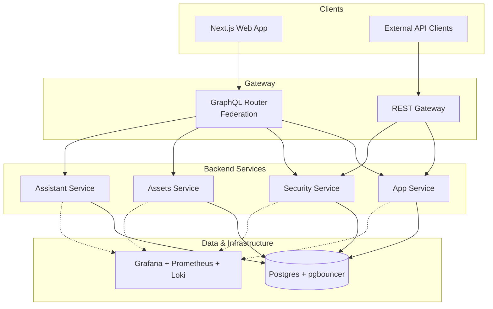
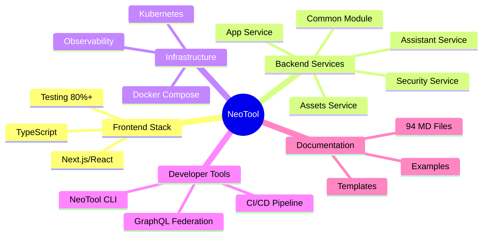

<p align="center">
  
</p>

# NeoTool


[](https://opensource.org/licenses/MIT)

**A production-grade full-stack baseline for building enterprise products without starting from scratch.**

NeoTool is a cohesive monorepo that brings together backend services, frontend apps, API contracts, design assets, and infrastructure in a way that actually works together. It's designed for teams who want to move fast without sacrificing architectural quality or ending up with technical debt six months down the road.

## Why NeoTool?

Most starter projects are either too minimal to be useful or too opinionated to adapt. NeoTool strikes a different balance:

- **Spec-driven development** — Documentation in `docs/` isn't an afterthought; it drives implementation, validation, and code reviews
- **GraphQL federation** — Real federated schemas with multiple subgraphs, not just a single monolithic API
- **Security baked in** — Authentication, authorization, mTLS, audit logging, and RBAC/ABAC patterns ready to go
- **Observable from day one** — Grafana, Prometheus, and Loki integrated locally and in production
- **Cloud-ready tooling** — Docker Compose for local dev, K8s artifacts for deployment, CI/CD guardrails that actually catch issues

Think of it as upstream infrastructure for your products. You can fork it, customize it, and periodically pull improvements back in.

---

## Repository Structure

| Path | What's Inside |
| --- | --- |
| [`web/`](web/) | Next.js + React frontend with GraphQL integration, TypeScript, and comprehensive testing |
| [`service/kotlin/`](service/kotlin/) | Micronaut backend with modular services: App, Security, Assets, Assistant, and Common utilities |
| [`contracts/`](contracts/) | GraphQL federation schemas (supergraph + subgraphs) and OpenAPI specs for REST endpoints |
| [`design/`](design/) | Brand assets, UI tokens, logos (SVG/PNG), icons, and design guidelines |
| [`infra/`](infra/) | Docker Compose for local development, K8s manifests, observability stack configs, GraphQL router setup |
| [`docs/`](docs/) | 94 structured markdown files covering architecture, patterns, standards, workflows, and ADRs |
| [`scripts/cli/`](scripts/cli/) | NeoTool CLI for schema validation, environment checks, Kafka management, and more |

---

## Quick Start

### Prerequisites

- **Node.js 20+** (for frontend)
- **JDK 21+** (for Kotlin backend)
- **Docker** (Colima recommended on macOS/Linux)
- **pnpm** or npm
- Git

### 1. Clone and Verify Tooling

```bash
git clone https://github.com/salomax/neotool.git
cd neotool

# Check that Node, Docker, and JVM are properly installed
./neotool --version
```

### 2. Install Dependencies

```bash
# Frontend
cd web && pnpm install

# Backend
cd ../service/kotlin && ./gradlew build
```

### 3. Spin Up Local Infrastructure

```bash
# Start Postgres, pgbouncer, GraphQL router, and observability stack
docker compose -f infra/docker/docker-compose.local.yml up -d
```

### 4. Run the Applications

```bash
# Web (in one terminal)
cd web && pnpm dev

# Backend services (in another terminal)
cd service/kotlin && ./gradlew run
```

### 5. Configure Environment

- Create `.env.local` files in `infra/` for database credentials, GraphQL endpoints, and API keys
- Add `.env.local` in `web/` for frontend API URLs
- Adjust `project.config.json` if you want to rename the project

---

## Core Services

NeoTool ships with five Kotlin backend modules, each with a clear responsibility:

### **App Service**
Main business logic with domain modeling, GraphQL resolvers, HTTP controllers, and repository layers. Start here for product-specific features.

### **Security Service**
Full authentication and authorization stack:
- **AuthN**: Password-based (Argon2id), OAuth2 (Google), JWT (access + refresh tokens), remember-me, password reset with rate limiting
- **AuthZ**: RBAC + ABAC, resource-level and GraphQL field-level enforcement, permission-based checks
- **Interservice**: mTLS for service-to-service communication, audit logging hooks
- **GraphQL API**: User, role, group, and permission management with pagination and batch operations to avoid N+1 queries

See [`docs/03-features/security/`](docs/03-features/security/) for detailed documentation.

### **Assets Service**
File and media storage management with S3-compatible bucket operations, upload/download handling, and visibility controls. Built for handling product images, documents, and user-generated content.

### **Assistant Service**
AI integration layer with LLM support (Gemini provider), conversation context management, tool registry, and agent-based interactions. Ready for building AI-powered features without reinventing the wheel.

### **Common Module**
Shared utilities across all services: GraphQL federation infrastructure, pagination helpers, JWT handling, entity base classes, exception handling, batch/Kafka utilities, metrics collection, and testing infrastructure.

---

## Frontend

The `web/` directory is a **Next.js + React** application with:

- **TypeScript** throughout
- **Apollo Client** for GraphQL with type-safe operations via GraphQL Code Generator
- **Vitest** for unit tests, **Playwright** for E2E tests
- **Storybook** for component documentation
- **ESLint** and comprehensive linting rules
- **80% minimum code coverage** enforced in CI

It's wired to consume the GraphQL federation API and follows the design tokens from `design/` for consistent branding.

---

## GraphQL Federation

NeoTool uses **real GraphQL federation** with Apollo Router:

```
contracts/graphql/
├── supergraph/
│   ├── supergraph.graphql      # Unified schema
│   ├── supergraph.yaml         # Router configuration
│   └── supergraph.local.yaml   # Local dev overrides
└── subgraphs/
    ├── app/schema.graphqls           # Product & Customer entities
    ├── security/schema.graphqls      # User, Role, Permission types
    └── assistant/schema.graphqls     # AI conversation schema
```

Each service exposes its own subgraph, and the router stitches them together. This means you can evolve each domain independently without breaking the overall API contract.

---

## Infrastructure & Observability

### Local Stack (Docker Compose)
Running `docker compose -f infra/docker/docker-compose.local.yml up` gives you:
- **Postgres** + **pgbouncer** for connection pooling
- **GraphQL Router** for schema federation
- **Grafana** + **Prometheus** + **Loki** + **Promtail** for metrics and log aggregation

Everything is pre-configured with provisioning for dashboards and datasources. You get production-like observability in your local environment.

### Production Deployment
K8s manifests (Kustomize-friendly, ArgoCD-compatible) live in `infra/` alongside router configs for staging and production environments.

---

## NeoTool CLI

The `./neotool` command provides utilities for common operations:

```bash
./neotool --version                 # Verify Node, Docker, JVM versions

./neotool graphql sync              # Interactive schema sync
./neotool graphql validate          # Validate schema consistency
./neotool graphql generate          # Build supergraph schema

./neotool validate                  # Run all validations (web + backend)
./neotool validate --web            # Frontend only
./neotool validate --service        # Backend only

./neotool kafka --topic             # List Kafka topics
./neotool kafka --topic <name>      # Describe specific topic
./neotool kafka --consumer-group    # List consumer groups
./neotool kafka --reset-offsets     # Manage consumer offsets

./neotool vault create-secret <name>  # Create JWT key pair in Vault

./neotool upstream                  # Manage .gitattributes merge strategies
```

All commands are also available via `scripts/cli/cli`.

---

## CI/CD Pipeline

NeoTool uses a three-stage pipeline model:

### **Pull Request (Preview)**
- Build, lint, typecheck, unit/integration tests
- **Coverage gates**: Backend 90% unit / 80% integration / 100% security / 80% incremental; Frontend 80% across all metrics
- Preview deployments for testing changes in isolation

### **Staging (Rehearsal)**
- Deploy merged changes using the same image digests that will go to production
- Smoke tests, E2E tests, contract validation with real infrastructure and secrets
- Integration testing across services

### **Production (Promotion)**
- Promote tested image digest via Git tag (`vX.Y.Z`)
- Gated with approvals and optional canary/blue-green deployment
- Automatic rollback on health regression

**Release flow**: `git tag vX.Y.Z && git push origin vX.Y.Z` or create a GitHub release.

---

## Documentation

The `docs/` directory contains **94 structured markdown files** organized for progressive discovery:

- **00-overview**: Architecture, tech stack, quick-start guides
- **01-architecture**: System, service, frontend, data, and API design
- **02-domain**: Domain modeling, glossary, core concepts
- **03-features**: Feature specifications (security, assets)
- **04-patterns**: Backend, frontend, API, and infrastructure patterns
- **05-standards**: Coding, architecture, API, database, testing, security standards
- **06-workflows**: Feature development, code review, testing, deployment workflows
- **07-examples**: Concrete code examples for backend, frontend, and full-stack scenarios
- **08-templates**: Feature forms, AI prompts, code templates, document templates
- **09-adr**: Architecture Decision Records for key technical choices
- **10-reference**: Commands, file structure, GraphQL schema reference, API documentation
- **11-validation**: Checklists and validation scripts

See [`docs/MANIFEST.md`](docs/MANIFEST.md) for the complete document index.

---

## Roadmap

### Near-term
- Entity versioning for optimistic concurrency control
- Enhanced observability with custom SLO definitions and alerting
- Feature flags integration (Unleash)
- Visual regression testing
- JWT ID (JTI) support and access token blacklist — see [Security TODO](docs/03-features/security/README.md#todo)

### Under Consideration
- React Native mobile app (currently not implemented)
- BI service for analytics and reporting
- Webhook management system
- Additional AI agent examples and chat UI templates

---

## Architecture Overview



---

## Feature Capability Matrix

### High-Level Overview



### Detailed Capability Breakdown

<details>
<summary><strong>Frontend Capabilities</strong></summary>

#### Core Stack
| Category | Technologies | Status |
|----------|-------------|--------|
| **Framework** | Next.js 14+ with App Router | ✅ Production-ready |
| **Language** | TypeScript with strict mode | ✅ Type-safe |
| **GraphQL** | Apollo Client + Code Generator | ✅ Fully typed |
| **Testing** | Vitest (unit), Playwright (E2E) | ✅ 80%+ coverage |
| **Documentation** | Storybook component library | ✅ Interactive docs |
| **Code Quality** | ESLint with comprehensive rules | ✅ Enforced in CI |

#### Key Features
- **Type-Safe GraphQL**: Auto-generated TypeScript types from GraphQL schemas with Apollo Code Generator
- **Optimistic UI Updates**: Instant feedback with optimistic mutations and cache updates
- **Component Library**: Storybook-documented shared components with design tokens
- **Accessibility-First**: WCAG 2.1 AA compliant patterns and semantic HTML
- **Performance Optimized**: Code splitting, lazy loading, and Next.js optimizations
- **E2E Testing**: Real browser tests with Playwright covering critical user flows

#### Implementation Patterns
- [GraphQL Query Pattern](docs/07-frontend/patterns/graphql-query-pattern.md) - Fetching data with caching
- [GraphQL Mutation Pattern](docs/07-frontend/patterns/graphql-mutation-pattern.md) - Optimistic updates
- [Management Pattern](docs/07-frontend/patterns/management-pattern.md) - CRUD interfaces
- [Toast Notification Pattern](docs/07-frontend/patterns/toast-notification-pattern.md) - User feedback
- [E2E Testing Pattern](docs/07-frontend/patterns/e2e-testing-pattern.md) - Browser automation

**📖 Full Documentation**: [docs/07-frontend/](docs/07-frontend/)

</details>

<details>
<summary><strong>Backend Services Capabilities</strong></summary>

### App Service
**Domain-Driven Business Logic Layer**

Core business functionality with clean architecture patterns:
- **Domain Modeling**: Rich domain models with business rules and validations
- **GraphQL API**: Federated subgraph with resolvers and custom scalars
- **Repository Pattern**: Type-safe database access with optimized queries
- **Entity Management**: Product and customer lifecycle with versioning
- **Batch Processing**: Kafka-based event streaming and ETL workflows

**📖 Documentation**: [docs/05-backend/patterns/](docs/05-backend/patterns/) | [CRUD Example](docs/90-examples/backend/crud-example/)

---

### Security Service
**Enterprise-Grade Authentication & Authorization**

Production-ready security infrastructure with zero-trust principles:

| Feature Area | Capabilities | Status |
|--------------|-------------|--------|
| **Authentication** | Password (Argon2id), OAuth2 (Google), JWT access + refresh tokens, Remember-me, Password reset with rate limiting | ✅ 100% tested |
| **Authorization** | RBAC + ABAC, Resource ownership, GraphQL field-level, Permission-based access control | ✅ Production-ready |
| **Interservice Security** | mTLS for service-to-service, Audit logging, Request principal tracking | ✅ Zero-trust ready |
| **User Management** | CRUD operations, Role/Group assignment, Enable/Disable users, Batch operations | ✅ N+1 query safe |

**Key Security Features:**
- 🔐 **Argon2id Password Hashing**: Industry-leading resistance to brute-force attacks
- 🎫 **JWT with Refresh Tokens**: Secure token rotation with configurable TTLs
- 🚦 **Rate Limiting**: Protect against abuse on authentication endpoints
- 📊 **Audit Logging**: Complete security event tracking for compliance
- 🛡️ **Defense in Depth**: Multiple security layers from edge to database
- 🔑 **OAuth 2.0 Ready**: Google provider with extensible OAuth framework

**Security Philosophy:**
- **Security by Default**: All endpoints protected unless explicitly public
- **Zero Trust Architecture**: Every request authenticated and authorized
- **Principle of Least Privilege**: Minimal necessary permissions granted

**📖 Full Security Documentation**: [docs/03-features/security/](docs/03-features/security/)
- [Authentication Guide](docs/03-features/security/authentication/)
- [Authorization Guide](docs/03-features/security/authorization/)
- [Resource Ownership](docs/03-features/security/authorization/resource-ownership.md)

---

### Assets Service
**S3-Compatible Media & File Management**

Scalable asset storage with CDN-ready delivery:
- 📦 **S3-Compatible Storage**: Works with Cloudflare R2, AWS S3, MinIO
- 🔒 **Dual Visibility Model**: PUBLIC (CDN URLs) vs PRIVATE (presigned URLs)
- ⚡ **Direct Upload Flow**: Presigned URLs for client-to-storage uploads (no proxy overhead)
- 📋 **Namespace-Based Organization**: Configurable key templates and validation rules
- ✅ **Content Validation**: MIME type verification, dimension checks, size limits
- 🎯 **Rate Limiting & Quotas**: Per-owner and per-namespace controls

**Upload Flow:**
1. Request upload URL with namespace and metadata
2. Client uploads directly to storage (no backend proxy)
3. Confirm upload to mark asset as `READY`
4. Access via stable CDN URL (public) or presigned download URL (private)

**📖 Full Assets Documentation**: [docs/03-features/assets/asset-service/](docs/03-features/assets/asset-service/)

---

### Assistant Service
**AI Integration Layer for LLM-Powered Features**

Extensible AI infrastructure for building intelligent features:
- 🤖 **LLM Support**: Gemini provider with pluggable architecture for other models
- 💬 **Conversation Management**: Context tracking across multi-turn interactions
- 🔧 **Tool Registry**: Extensible function calling for agent-based workflows
- 🎯 **Agent Patterns**: Pre-built patterns for common AI use cases
- 📝 **Prompt Engineering**: Structured prompt templates and versioning

**Use Cases:**
- Chatbots with conversation history
- Code generation and analysis
- Content creation assistants
- Data extraction and summarization

**📖 Documentation**: [service/kotlin/assistant/](service/kotlin/assistant/)

---

### Common Module
**Shared Infrastructure & Utilities**

Foundation layer used across all backend services:

**GraphQL Federation:**
- Schema stitching and resolver composition
- Type extensions and entity references
- Federated tracing and metrics

**Data Access:**
- Pagination helpers (cursor-based, offset-based)
- Entity base classes with audit fields
- UUID v7 generation for sortable IDs

**Security Utilities:**
- JWT token encoding/decoding
- Principal extraction and context
- Permission validation helpers

**Batch & Events:**
- Kafka consumer/producer abstractions
- DLQ handling and retry logic
- Batch processing patterns

**Observability:**
- Micrometer metrics collection
- Structured logging with context
- Distributed tracing support

**Testing Infrastructure:**
- Integration test base classes
- Test containers setup
- Mock factories and fixtures

**📖 Documentation**: [docs/05-backend/](docs/05-backend/)

</details>

<details>
<summary><strong>API & Contracts</strong></summary>

### GraphQL Federation Architecture
**Real Federation with Apollo Router (Not a Monolith)**

NeoTool implements true GraphQL federation, allowing independent service evolution:

```
contracts/graphql/
├── supergraph/
│   ├── supergraph.graphql      # Composed unified schema
│   ├── supergraph.yaml         # Router configuration
│   └── supergraph.local.yaml   # Local dev overrides
└── subgraphs/
    ├── app/schema.graphqls           # Product, Customer entities
    ├── security/schema.graphqls      # User, Role, Permission types
    └── assistant/schema.graphqls     # Conversation, Message types
```

**Federation Benefits:**
- 🔗 **Schema Composition**: Services define their own schemas, router stitches them together
- 🚀 **Independent Deployment**: Update one subgraph without touching others
- 🎯 **Type Sharing**: Extend types across services (e.g., User extended with custom fields)
- 📊 **Distributed Execution**: Router handles query planning and service orchestration
- 🔍 **Unified API**: Single GraphQL endpoint for all clients

**Apollo Router Features:**
- Query planning and optimization
- Distributed tracing
- Caching and batching
- Authentication/authorization hooks

**📖 Documentation**:
- [GraphQL Standards](docs/06-contracts/graphql-standards.md)
- [Query Patterns](docs/06-contracts/graphql-query-pattern.md)
- [Schema Reference](docs/93-reference/graphql-schema.md)

---

### OpenAPI REST Gateway
**REST Compatibility Layer**

- REST endpoints for external integrations and non-GraphQL clients
- OpenAPI 3.0 specifications for code generation
- Swagger UI for interactive API exploration
- Consistent error responses and status codes

**📖 Documentation**: [docs/93-reference/api-endpoints.md](docs/93-reference/api-endpoints.md)

</details>

<details>
<summary><strong>Infrastructure & Deployment</strong></summary>

### Local Development Stack
**Production-Like Environment on Your Laptop**

Single command gets you a complete stack:
```bash
docker compose -f infra/docker/docker-compose.local.yml up -d
```

**What You Get:**
| Service | Purpose | Access |
|---------|---------|--------|
| **Postgres 18** | Primary database with UUID v7 support | `localhost:5432` |
| **pgbouncer** | Connection pooling (transaction mode) | `localhost:6432` |
| **GraphQL Router** | Apollo Router for federation | `localhost:4000` |
| **Grafana** | Observability dashboards | `localhost:3001` |
| **Prometheus** | Metrics collection and queries | `localhost:9090` |
| **Loki** | Log aggregation and search | `localhost:3100` |
| **Promtail** | Log shipping from services | - |

**Pre-Configured:**
- Grafana datasources (Prometheus, Loki) auto-provisioned
- Service discovery for metrics scraping
- Persistent volumes for data retention
- Health checks and restart policies

**📖 Setup Guide**: [docs/01-overview/getting-started.md](docs/01-overview/getting-started.md)

---

### Production Deployment
**Kubernetes-Native with GitOps**

NeoTool ships with production-ready Kubernetes manifests:

**Architecture:**
- **Containerized Services**: Multi-stage Docker builds with distroless base images
- **Kubernetes**: Deployments, Services, ConfigMaps, Secrets
- **Kustomize**: Environment overlays (dev, staging, production)
- **ArgoCD Compatible**: GitOps continuous deployment
- **Horizontal Scaling**: HPA configured for traffic-based scaling

**Infrastructure as Code:**
```
infra/
├── docker/
│   ├── docker-compose.local.yml    # Local development
│   └── Dockerfile.*                 # Service-specific builds
├── kubernetes/
│   ├── base/                        # Base manifests
│   └── overlays/                    # Environment-specific
└── router/
    ├── supergraph.yaml              # Production router config
    └── supergraph.staging.yaml      # Staging router config
```

**Deployment Environments:**
- **Local**: Docker Compose for development
- **Staging**: Full K8s stack with production-like configuration
- **Production**: Multi-region with HA database and CDN

**📖 Documentation**:
- [Infrastructure Architecture](docs/02-architecture/infrastructure-architecture.md)
- [Deployment Workflow](docs/08-workflows/deployment-workflow.md)
- [Deployment Guide](docs/11-infrastructure/deployment-guide.md)

---

### Observability Stack
**Production-Grade Monitoring from Day One**

Complete observability with pre-configured dashboards:

| Component | Purpose | What It Does |
|-----------|---------|--------------|
| **Prometheus** | Metrics collection | Scrapes `/prometheus` endpoints from all services every 15s |
| **Loki** | Log aggregation | Centralized log storage with label-based querying |
| **Promtail** | Log shipping | Ships logs from services to Loki with automatic labeling |
| **Grafana** | Visualization | Pre-built dashboards for JVM, HTTP, database, business metrics |

**Pre-Built Dashboards:**
- 📊 **Service Health**: Request rate, latency, error rate (RED metrics)
- 💾 **JVM Metrics**: Heap, GC, threads, CPU usage
- 🗄️ **Database**: Connection pool, query duration, transaction metrics
- 🔒 **Security**: Authentication attempts, authorization failures, rate limit hits
- 📈 **Business**: Custom metrics per service

**Alerting Ready:**
- Alert rule templates for common failure scenarios
- Integration with PagerDuty, Slack, email
- SLO-based alerting on error budgets

**Log Queries:**
- Structured JSON logging with request IDs
- Correlation across services via trace IDs
- Search by user, endpoint, error type, or custom labels

**📖 Documentation**: [docs/10-observability/observability-overview.md](docs/10-observability/observability-overview.md)

</details>

<details>
<summary><strong>CI/CD Pipeline</strong></summary>

### Three-Stage Deployment Model
**Image Digest Promotion (Not Branch Promotion)**

NeoTool uses a sophisticated CI/CD pipeline that promotes **tested image digests** through environments:

#### Stage 1: Pull Request (Preview)
**Fast Feedback on Every PR**

| Check | Requirement | Enforcement |
|-------|------------|-------------|
| **Build** | All services compile successfully | ❌ Blocking |
| **Lint** | ESLint (frontend), ktlint (backend) pass | ❌ Blocking |
| **Typecheck** | TypeScript strict mode passes | ❌ Blocking |
| **Unit Tests** | Backend: 90% coverage, Frontend: 80% | ❌ Blocking |
| **Integration Tests** | Backend: 80% coverage | ❌ Blocking |
| **Security Tests** | Security service: 100% coverage | ❌ Blocking |
| **Incremental Coverage** | New code: 80% coverage | ❌ Blocking |
| **Preview Deploy** | Ephemeral environment for manual testing | ✅ Non-blocking |

**Preview Deployments:**
- Unique URL per PR (e.g., `pr-123.preview.neotool.dev`)
- Full stack with database and observability
- Auto-cleanup on PR close
- Share with stakeholders for early feedback

---

#### Stage 2: Staging (Rehearsal)
**Production Dress Rehearsal**

Once merged to main, the **exact same image digests** deploy to staging:

| Check | Purpose | Details |
|-------|---------|---------|
| **Smoke Tests** | Basic service health | HTTP 200s, database connectivity, API liveness |
| **E2E Tests** | Critical user flows | Playwright tests against staging environment |
| **Contract Validation** | GraphQL schema compatibility | No breaking changes to federated schemas |
| **Integration Tests** | Cross-service communication | mTLS, authentication, authorization flows |
| **Performance Tests** | Latency and throughput | p95 latency SLOs, query performance benchmarks |

**Staging Environment:**
- Production-like infrastructure (K8s, managed Postgres, CDN)
- Real secrets and third-party integrations (OAuth, email, storage)
- Same observability stack as production
- Persistent between deployments

**What Gets Tested:**
- Service-to-service authentication (mTLS)
- GraphQL federation query planning
- Database migrations
- OAuth flows end-to-end
- Asset upload/download with real S3

---

#### Stage 3: Production (Promotion)
**Git Tag-Based Releases**

Promote tested image digests to production via Git tags:

```bash
git tag v1.2.3
git push origin v1.2.3
```

**Deployment Strategy:**
| Feature | Implementation |
|---------|----------------|
| **Approval Gate** | Manual approval required (configurable) |
| **Deployment Strategy** | Canary (10% → 50% → 100%) or Blue-Green |
| **Health Checks** | HTTP liveness/readiness, database connectivity |
| **Auto-Rollback** | Automatic rollback on error rate spike or latency regression |
| **Observability** | Real-time dashboards, alerts to Slack/PagerDuty |

**Rollback Triggers:**
- Error rate >5% for 5 minutes
- p95 latency >500ms for 5 minutes
- Health check failures
- Manual trigger via GitHub Actions

---

### Pipeline Architecture

**Key Principles:**
- 🎯 **Immutable Artifacts**: Build once, promote the same digest everywhere
- 🔒 **No Code in Production**: Only tested, signed container images
- 🚀 **Fast Feedback**: PR checks complete in <10 minutes
- 📊 **Observability**: Every deployment traced and monitored
- 🔄 **Rollback-Ready**: One-click rollback to previous version

**📖 Documentation**:
- [Deployment Workflow](docs/08-workflows/deployment-workflow.md)
- [Testing Workflow](docs/08-workflows/testing-workflow.md)
- [PR Checklist](docs/94-validation/pr-checklist.md)

</details>

<details>
<summary><strong>Documentation Structure</strong></summary>

### Spec-Driven Development Documentation
**94 Markdown Files Organized for Progressive Discovery**

NeoTool's documentation isn't an afterthought—it **drives implementation**:

| Category | Count | Purpose | Key Documents |
|----------|-------|---------|---------------|
| **00-overview/** | 5 | Architecture, tech stack, getting started | [Architecture at a Glance](docs/01-overview/architecture-at-a-glance.md), [Core Principles](docs/01-overview/core-principles.md) |
| **01-architecture/** | 7 | System design, service boundaries | [System Architecture](docs/02-architecture/system-architecture.md), [API Architecture](docs/02-architecture/api-architecture.md) |
| **02-domain/** | 5 | Domain models, glossary, concepts | [Domain Model](docs/04-domain/domain-model.md), [UUID v7 Standard](docs/04-domain/uuid-v7-standard.md) |
| **03-features/** | 8+ | Feature specifications (security, assets) | [Security Service](docs/03-features/security/), [Assets Service](docs/03-features/assets/asset-service/) |
| **04-patterns/** | 15+ | Implementation patterns for all layers | [GraphQL Resolver Pattern](docs/05-backend/patterns/graphql-resolver-pattern.md), [Pagination Pattern](docs/05-backend/patterns/pagination-pattern.md) |
| **05-standards/** | 12+ | Code quality, testing, security standards | [Coding Standards](docs/05-backend/kotlin/coding-standards.md), [Testing Standards](docs/05-backend/kotlin/testing-standards.md) |
| **06-workflows/** | 6 | Development processes | [Feature Development](docs/08-workflows/feature-development.md), [Code Review](docs/08-workflows/code-review.md) |
| **07-examples/** | 10+ | Working code examples | [CRUD Example](docs/90-examples/backend/crud-example/), [Batch Workflows](docs/90-examples/backend/batch-workflows/) |
| **08-templates/** | 8+ | Templates for features, docs, AI prompts | [Feature Form](docs/91-templates/feature-templates/feature-creation/feature-form.md), [AI Prompts](docs/91-templates/ai-prompts/) |
| **09-adr/** | 8 | Architecture Decision Records | [Monorepo Architecture](docs/92-adr/0001-monorepo-architecture.md), [GraphQL Federation](docs/92-adr/) |
| **10-reference/** | 8 | Quick reference, commands, schemas | [Commands](docs/93-reference/commands.md), [GraphQL Schema](docs/93-reference/graphql-schema.md) |
| **11-validation/** | 5 | Checklists, validation scripts | [Feature Checklist](docs/94-validation/feature-checklist.md), [PR Checklist](docs/94-validation/pr-checklist.md) |

### Documentation Philosophy

**Spec-Driven Development:**
1. **Write Spec First**: Document the feature before writing code
2. **Validate Against Spec**: Code reviews check spec compliance
3. **Keep Docs Updated**: Documentation changes are part of PRs
4. **Progressive Disclosure**: Start with overview, drill into details as needed

**AI-Optimized:**
- Structured frontmatter with metadata
- Search keywords for discoverability
- Related document links for context
- Clear section headers for navigation

**📖 Full Index**: [docs/MANIFEST.md](docs/MANIFEST.md)

</details>

<details>
<summary><strong>Developer Tools</strong></summary>

### NeoTool CLI
**Development Workflow Automation**

Single command for common operations:

#### Environment Management
```bash
./neotool --version              # Verify Node.js, Docker, JVM versions
```
Checks all prerequisites and displays versions for debugging.

---

#### GraphQL Federation Tools
**Manage federated schemas across services:**

```bash
# Interactive schema synchronization
./neotool graphql sync
# Prompts for which subgraphs to sync, validates compatibility

# Validate schema consistency
./neotool graphql validate
# Checks for breaking changes, validates federation directives

# Generate supergraph schema
./neotool graphql generate
# Composes subgraphs into unified supergraph.graphql
```

**What It Does:**
- Detects schema changes in subgraphs
- Validates federation directives (`@key`, `@extends`, `@external`)
- Checks for breaking changes before deployment
- Generates router configuration automatically

---

#### Validation & Testing
```bash
# Run all validations (frontend + backend)
./neotool validate

# Frontend only (TypeScript, ESLint, tests)
./neotool validate --web

# Backend only (Kotlin, ktlint, tests)
./neotool validate --service
```

**Validation Checks:**
- Code compilation (TypeScript, Kotlin)
- Linting rules (ESLint, ktlint)
- Unit tests with coverage thresholds
- Integration tests
- GraphQL schema compatibility

---

#### Kafka Management
**Inspect and manage Kafka topics and consumer groups:**

```bash
# List all topics
./neotool kafka --topic

# Describe specific topic
./neotool kafka --topic user-events

# List consumer groups
./neotool kafka --consumer-group

# Reset consumer offsets (for replaying events)
./neotool kafka --reset-offsets
```

**Use Cases:**
- Debug event processing issues
- Monitor consumer lag
- Replay failed events from DLQ
- Inspect message schemas

---

#### Vault Management
**Create JWT key pairs in HashiCorp Vault:**

```bash
# Create a new JWT key pair
./neotool vault create-secret kid-1

# Create with custom key size
./neotool vault create-secret kid-2 --key-bits 2048

# Overwrite existing secret
./neotool vault create-secret kid-1 --force
```

**Use Cases:**
- Quick setup of JWT signing keys for local development
- Generate new key pairs for key rotation
- Automate secret creation in development environments

**Features:**
- Automatically generates RSA key pairs (4096-bit default)
- Stores keys in Vault at `secret/jwt/keys/<key-name>`
- Works with local Vault CLI or Docker containers
- Validates key names and prevents accidental overwrites

---

#### Upstream Management
```bash
./neotool upstream               # Manage .gitattributes merge strategies
```
Configure merge strategies for pulling upstream changes from the NeoTool baseline.

---

### Additional Developer Tools

**Pre-Commit Hooks:**
- Automatic linting on commit
- Type checking before push
- Unit test execution

**IDE Integration:**
- IntelliJ IDEA run configurations
- VSCode launch configurations
- Debugging profiles for services

**Database Tools:**
- Flyway migrations
- pgAdmin integration
- Database seed scripts

**📖 Full CLI Reference**: [docs/93-reference/commands.md](docs/93-reference/commands.md)

</details>

---

## Contributing

We welcome issues, feature requests, and pull requests. A few guidelines:

- **Keep modules clean**: Follow existing architectural patterns and separation of concerns
- **Align with standards**: Check `docs/05-standards/` before submitting code
- **Favor upstream-friendly changes**: Keep in mind that other products may pull updates from this repo
- **Write tests**: Maintain coverage thresholds (90% unit, 80% integration for backend; 80% overall for frontend)
- **Update docs**: If you change behavior, update the relevant spec in `docs/`

For detailed contribution workflows, see [`docs/06-workflows/code-review.md`](docs/06-workflows/code-review.md).

---

## License

MIT — see [LICENSE](LICENSE) for details.
