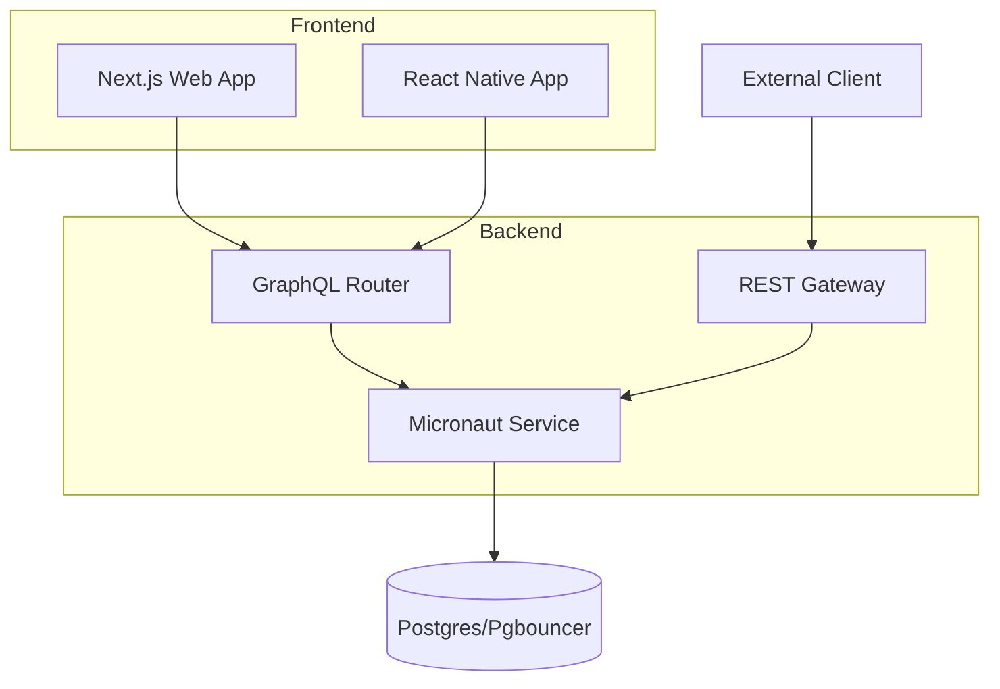

<p align="center">
  
</p>

# NeoTool — build enterprise solutions smarter and faster


[](https://opensource.org/licenses/MIT)

NeoTool is a **modular full‑stack baseline** for building new products quickly without sacrificing architecture quality. It ships a cohesive monorepo with backend, frontend, contracts, design assets, and infra that are ready to customize.

**What sets it apart**
- Spec‑Driven Development: documentation in `docs/` drives implementation, validation, and reviews.
- GraphQL‑first contracts with federation support and OpenAPI for REST.
- Security‑first patterns out of the box (AuthN/Z, mTLS, audit hooks).
- Cloud‑ready tooling: local Docker stack, K8s/GitOps artifacts, and CI/CD guardrails.
- Productization path: treat this repo as upstream and pull improvements into your products.

---

## Repository map

| Area | Path | Notes |
| --- | --- | --- |
| **Frontend** | `web/` | Next.js + React scaffold wired for GraphQL APIs. |
| **Mobile** | `mobile/` | Expo + React Native starter (optional). |
| **Backend** | `service/kotlin/` | Micronaut services (GraphQL, modular architecture, tests). |
| **Contracts** | `contracts/` | GraphQL federation schemas and OpenAPI specs. |
| **Design** | `design/` | Brand assets, UI tokens, icons, guidelines. |
| **Infra** | `infra/` | Docker Compose for local, K8s/GitOps artifacts, observability stack. |
| **Docs** | `docs/` | ADRs, feature specs, standards, and checklists. |
| **CLI** | `neotool` | Helper for validation, schema sync, Kafka, and more. |

---

## Quick start

### Prerequisites
- Node.js 20+
- JDK 21+
- Docker Engine (Colima recommended on macOS/Linux)
- Git, `pnpm` or `npm`

### Bootstrap the stack
```bash
git clone https://github.com/salomax/neotool.git
cd neotool

# Verify tooling (Node, Docker, JVM)
./neotool --version
```

Install dependencies:
```bash
# Web
cd web && pnpm install   # or npm install

# Backend
cd ../service/kotlin && ./gradlew build
```

Run local infrastructure (Postgres, router, etc.):
```bash
docker compose -f infra/docker/docker-compose.local.yml up -d
```

Start the apps:
```bash
# Web
cd web && pnpm dev

# Backend
cd service/kotlin && ./gradlew run
```

Environment configuration:
- Add `.env.local` files under `infra/` (database, GraphQL endpoint, AI keys).
- Add `.env.local` under `web/` for API URLs.
- Adjust `project.config.json` to rename the project.

---

## NeoTool CLI

```bash
./neotool --version                 # Verify toolchain

./neotool graphql sync              # Interactive schema sync
./neotool graphql validate          # Validate schema consistency
./neotool graphql generate          # Build supergraph schema

./neotool validate                  # Run all validations
./neotool validate --web            # Frontend only
./neotool validate --service        # Backend only

./neotool kafka --topic             # List topics
./neotool kafka --topic <name>      # Describe topic
./neotool kafka --consumer-group    # List consumer groups
```

All commands are also available via `scripts/cli/cli`.

---

## Architecture



---

## Frontend

Next.js + React foundation aimed at consuming GraphQL APIs. Includes TypeScript, linting, testing, and environment-driven configuration. Aligns with the design tokens and assets in `design/` for consistent branding across products.

---

## Backend

Kotlin + Micronaut services with modular boundaries, GraphQL endpoints, and testable components. Gradle tasks cover unit/integration tests, coverage (Kover), and incremental coverage enforcement for PRs. See `docs/service/` for module details.

### Security module
Built-in authentication and authorization:
- Password auth with Argon2id, OAuth2 (Google), JWT (access + refresh), remember-me, reset with rate limiting.
- RBAC + ABAC, permission-based checks, resource-level and GraphQL field-level enforcement.
- Interservice auth with mTLS, principals for users/services, audit logging hooks.
- GraphQL API for user management, pagination, and batch operations to avoid N+1.

More details: `docs/03-features/security/`.

### APIs
- GraphQL federation as the primary contract surface.
- REST gateway where needed, with OpenAPI specs in `contracts/`.

---

## Infrastructure

Local stack via Docker Compose (`infra/docker/`), including database, pgbouncer, and GraphQL router. K8s/GitOps artifacts (Kustomize, ArgoCD-friendly) live in `infra/`, alongside observability pieces (Grafana/Prometheus/Loki) and router configs. Environment samples are provided in `infra/.env.local`.

---

## Data layer

Postgres (fronted by pgbouncer) is the default store. Migrations and persistence strategies are defined per service; see service-specific docs for schema design and migration workflow.

---

## CI/CD model

Pipeline emphasizes preview validation, staging rehearsal, and digest promotion to production:
- PR: build, lint, typecheck, unit/integration tests, coverage gates, preview deployments.
- Staging: deploy merged changes using the same image digests; smoke/E2E/contract checks with real infra and secrets.
- Production: promote the tested digest via tag/release, gated with approvals and canary/blue-green options; automatic rollback on health regression.

Coverage thresholds:
- Backend: unit 90%, integration 80%, security services 100%, incremental coverage 80% on changed lines.
- Frontend: minimum 80% for branches/functions/lines/statements.

Release promotion: `git tag vX.Y.Z && git push origin vX.Y.Z` (or create a GitHub release to tag automatically).

---

## Roadmap (snapshot)

- Entity versioning for concurrency control
- CI/CD + K8s artifacts hardening and GitOps enablement
- Observability: logging (promtail/Loki), monitoring alerts, SLO definitions
- Feature flags (Unleash), Vault service integration
- Visual regression testing
- AI agents, BI service, webhook and AI chat examples
- Mobile improvements (multi-env, Expo)

---

## Contributing

Issues, ideas, and PRs are welcome. Keep modules clean, align with the existing architecture, and favor upstream-friendly changes so products can easily pull updates.***
