<p align="center">
  
</p>


# NeoTool — build enterprise solutions smarter and faster


[](https://opensource.org/licenses/MIT)

---

NeoTool is a **modular full‑stack boilerplate** designed to **accelerate new app development** while keeping **clean architecture and best practices** baked in from day one.

Think of it as a **foundation framework** that helps you spin up new services or apps (backend, frontend, infra, and design system), all wired together and ready to evolve.

 spec-driven development

---

## ✨ Overview

NeoTool brings together several layers under one monorepo:

| Layer | Description | Tech Stack |
|-------|--------------|-------------|
| **Frontend (`web/`)** | React + Next.js web app scaffold ready to consume GraphQL APIs. | React, Next.js, TypeScript |
| **Mobile (`mobile/`)** | Expo + React Native setup for cross‑platform mobile apps. | React Native, Expo |
| **Backend (`service/`)** | Kotlin + Micronaut with GraphQL, modular architecture, reusable components, and testing setup. | Kotlin, Micronaut, GraphQL, Gradle |
| **Contracts (`contracts/`)** | GraphQL Federation + OpenAPI specs for schema standardization. | Apollo Federation, OpenAPI |
| **Design (`design/`)** | Brand assets, UI tokens, icons, and design guidelines. | Figma, Adobe, Tokens |
| **Infra (`infra/`)** | Docker Compose, Kubernetes (Kustomize), GitOps (ArgoCD), and observability stack. | Docker, K8s, Grafana, Prometheus, Loki |
| **Docs (`docs/`)** | ADRs and developer documentation via Docusaurus. | Markdown, Docusaurus |

---

## Getting Started

### Prerequisites

Before you begin, ensure you have the following installed:

- **Node.js** - Version 20.x or higher (LTS recommended)
- **JDK** - Version 21 or higher
- **nvm** (Node Version Manager) - For managing Node.js versions
- **sdkman** (SDK Manager) - For managing JDK and other SDKs
- **Git** - Version control system
- **Docker Engine** - For running infrastructure services (via Colima on Mac/Linux)
- **Colima** - For running Docker Engine on Mac/Linux without Docker Desktop

**What is Colima?** Colima (Containers on Linux on Mac) is a lightweight, open-source alternative to Docker Desktop. It runs Docker containers using a Linux virtual machine, providing a native Docker experience without the overhead of Docker Desktop.

#### Installation Instructions

##### macOS

```bash
# Install Homebrew (if not already installed)
/bin/bash -c "$(curl -fsSL https://raw.githubusercontent.com/Homebrew/install/HEAD/install.sh)"

# Install Git
brew install git

# Install nvm (Node Version Manager)
curl -o- https://raw.githubusercontent.com/nvm-sh/nvm/v0.39.1/install.sh | bash

# Reload your shell configuration
source ~/.zshrc  # or ~/.bash_profile if using bash

# Install Node.js 20.x LTS using nvm
nvm install 20
nvm use 20
nvm alias default 20

# Install sdkman (SDK Manager)
curl -s "https://get.sdkman.io" | bash
source "$HOME/.sdkman/bin/sdkman-init.sh"

# Install JDK 21 using sdkman
sdk install java 21-tem
# Or list available versions: sdk list java
# Then install a specific version: sdk install java <version>

# Install Colima (Docker Engine alternative)
brew install colima docker docker-compose

# Start Colima
colima start

# Verify installations
node --version    # Should show v20.x.x
java --version    # Should show openjdk 21.x.x
git --version     # Should show git version
docker --version  # Should show Docker version
```

##### Linux

```bash
# Install Git
sudo apt update  # For Debian/Ubuntu
sudo apt install -y git
# OR for Fedora/RHEL
sudo dnf install -y git

# Install nvm (Node Version Manager)
curl -o- https://raw.githubusercontent.com/nvm-sh/nvm/v0.39.1/install.sh | bash

# Reload your shell configuration
source ~/.bashrc  # or ~/.zshrc if using zsh

# Install Node.js 20.x LTS using nvm
nvm install 20
nvm use 20
nvm alias default 20

# Install sdkman (SDK Manager)
curl -s "https://get.sdkman.io" | bash
source "$HOME/.sdkman/bin/sdkman-init.sh"

# Install JDK 21 using sdkman
sdk install java 21-tem
# Or list available versions: sdk list java
# Then install a specific version: sdk install java <version>

# Install Colima (Docker Engine alternative)
# For Debian/Ubuntu
sudo apt install -y colima docker.io docker-compose
# OR for Fedora/RHEL
sudo dnf install -y colima docker docker-compose

# Start Colima (provides Docker Engine)
colima start

# Verify installations
node --version    # Should show v20.x.x
java --version    # Should show openjdk 21.x.x
git --version     # Should show git version
docker --version  # Should show Docker version
```

**Note:** After installing nvm or sdkman, you may need to restart your terminal or run `source ~/.zshrc` (or `~/.bashrc`) for the changes to take effect.


### Setup Options

Choose the setup method that best fits your situation:

#### Option 1: Starting a New Project

If you're starting from scratch, clone the starter repository:

```bash
# Clone the repository
git clone https://github.com/salomax/neotool.git
cd neotool

# Install dependencies for web frontend
cd web
npm install
# or
pnpm install

# Install dependencies for Kotlin backend
cd ../service/kotlin
./gradlew build

# Install dependencies for mobile (optional)
cd ../../mobile
npm install
```

#### Option 2: Integrating into an Existing Project

If you already have a project and want to integrate NeoTool into it, merge from remote to preserve commit history:

```bash
# Navigate to your existing project
cd /path/to/your/existing/project

# Add the starter as a remote
git remote add starter https://github.com/salomax/neotool.git

# Fetch the starter repository
git fetch starter

# Merge the starter into your repo
git merge starter/main --allow-unrelated-histories

# Resolve any conflicts, then commit
git add .
git commit -m "Merge NeoTool starter boilerplate"
```

### Customizing Your Project Name

After cloning or integrating the starter, you'll want to customize the project name from "neotool" to your own project name. This includes updating package names, namespaces, database names, and all references throughout the codebase.

**Quick Setup:**

1. **Check system requirements:**
   ```bash
   ./neotool --version
   ```
   This verifies that Node.js, Docker, and JVM are installed.

2. **Edit `project.config.json`** with your project details

3. **Run setup commands:**
   ```bash
   # Setup project (rename from neotool)
   ./neotool setup
   
   # Clean up examples (optional)
   ./neotool clean --dry-run  # Preview changes
   ./neotool clean             # Apply changes
   ```

4. **Review and commit the changes:**
   ```bash
   git diff
   git add .
   git commit -m "Rename project from neotool to <your-project-name>"
   ```

For detailed instructions, see the [Project Setup Guide](./docs/PROJECT_SETUP.md).

### Neotool CLI

The project includes a CLI tool for common tasks:

```bash
# Check system requirements (Node.js, Docker, JVM)
./neotool --version

# Setup project (rename from neotool to your project name)
./neotool setup

# Clean up example code
./neotool clean [--dry-run]

# Show help
./neotool help
```

All commands can also be accessed via `scripts/cli/cli` if you prefer.

### Quick Start

Once you have the project set up:

1. **Configure environment variables for infra** - Create `.env.local` files in the `infra/` directory

```plaintext
# --- Global ---
APP_NAME=neotool
APP_LOCALE=en-US
GRAPHQL_ENDPOINT=http://router:4000/graphql

# --- Database ---
POSTGRES_USER=neotool
POSTGRES_PASSWORD=neotool
POSTGRES_DB=neotool_db
POSTGRES_HOST=postgres
POSTGRES_PORT=5432
DATABASE_URL=jdbc:postgresql://postgres:5432/neotool_db

# --- Grafana ---
GF_SECURITY_ADMIN_USER=admin
GF_SECURITY_ADMIN_PASSWORD=admin

# --- AI ---
GEMINI_API_KEY=<enter Gemini key here>
```

2. **Configure environment variables for web** - Create `.env.local` files in the `web/` directory with your API URLs
3. **Start the development server** - Run `npm run dev` or `pnpm dev` in the `web/` directory
4. **Start the backend** - Run `./gradlew run` in the `service/kotlin/` directory, or use Docker Compose
5. **Explore the documentation** - Visit the documentation section in the web app for detailed guides

### Next Steps

- Review the [Architecture Documentation](./docs/adr/)
- Check [Service Documentation](./docs/service/)
- Review [Web Documentation](./docs/web/)
- Explore the [Design System](./design/)
- Set up your development environment

## 🧩 Architecture


---

## Infrastructure

#TODO

---

## Frontend

#TODO

---

## Backend

#TODO

### APIs (GraphQL and REST)

### Sync services

#TODO

### Async services

#### Messaging

#TODO

#### Webhooks

#TODO

---

## Data storage layer

# CI/CD

## Test → Build → CR → Preview → Staging → Production 

This model validates code quality before merge (Preview Apps), validates system integration after merge (Staging), and promotes the same artifact digest to Production with gates, rollouts, and fast rollback.

### Goals & Principles

- Shift-left quality: catch issues in PR with automated checks + preview environments.

- Staging as rehearsal: validate real infra, configs, and secrets after merge.

- Promote, don’t rebuild: production uses the exact image digest tested in staging.

- Safe releases: environments, approvals, canaries/blue-green, and automatic rollback.


## Stages & Purpose

### Pull Request CI + Preview App (Ephemeral)

Test, build, lint, typecheck, security scan; deploy a temporary environment per PR

PR is approved only after preview validation (automated + manual)

### Staging (Shared, Persistent)

Upon merge to main, deploy to staging using the built images (by tag/digest).

Automated smoke/E2E tests, validate end-to-end integration (infra/secrets/DB migrations) close to prod.

### Promotion to Production (Tag/Release)

Deterministic deployments, create a semantic tag vX.Y.Z; promote the same digest from staging to prod.

Gate via GitHub Environments (approvals), roll out (canary/blue-green), monitor, and auto-rollback if metrics degrade.

Also, provide the release notes.

To trigger it:

```bash
git tag v1.0.0 && git push origin v1.0.0
```
Or create a release in the GitHub UI, which can also create the tag automatically

### 🚨 Emergency Fixes (Using Regular Flow)

For emergency production fixes, we use the **same regular deployment flow** to ensure consistency and full validation.

### Post-Release Verification & Rollback

Health checks, SLO/SLA monitors, error-rate guards.

Stable prod with auditable release trail.

## Flowchart

```mermaid
graph TD
  START1[✨ New Feature] --> A[Developer opens PR]
  START2[🐛 Bug Fix / 🚨 Emergency Fix] --> A
  A --> B[PR CI: build/lint/test]
  B --> C{Build OK?}
  C -- no --> C1[Fix & push]
  C1 --> B
  C -- yes --> D[Deploy Preview App]
  D --> E[Validation on Preview App]
  E --> F{Approve PR?}
  F -- no --> C1
  F -- yes --> G[Merge to main]
  G --> H[Deploy to Staging using same images]
  H --> I[Run DB migrations along first execution]
  I --> J[Smoke + E2E + Contract tests + Observability checks]
  J --> K{All checks green?}
  K -- no --> H1[Fix → new PR cycle]
  H1 --> A
  K -- yes --> L[Create Tag with GitHub Release]
  L --> M[Deploy to Production with Canary/Blue-Green]
  M --> N[Post-release health checks & SLO guardrails]
  N --> O{Healthy?}
  O -- no --> P[Auto-rollback to previous digest]
  O -- yes --> Q[Complete Release]
```



## Pipeline validations

### Pull Request (Preview) Stage

#### Backend Validations

**Unit Tests** (runs for each service: app, assistant, security, common):
```bash
cd service/kotlin
./gradlew :common:test --no-daemon
./gradlew :[module]:test --no-daemon
```

**Unit Tests with Coverage** (generates Kover reports and validates thresholds):
```bash
cd service/kotlin
./gradlew :[module]:test :[module]:koverXmlReport :[module]:koverHtmlReport :[module]:koverVerify --no-daemon
```

**Integration Tests** (runs for each service except common):
```bash
cd service/kotlin
./gradlew :[module]:testIntegration --no-daemon
```

**Integration Tests with Coverage** (generates Kover reports and validates thresholds):
```bash
cd service/kotlin
./gradlew :[module]:testIntegration :[module]:koverXmlReport :[module]:koverHtmlReport :[module]:koverVerify --no-daemon
```

**Run all backend tests with coverage**:
```bash
cd service/kotlin
./gradlew test testIntegration koverRootReport --no-daemon
```

**Coverage Thresholds**:
- Unit Tests: 90% minimum coverage (full codebase)
- Integration Tests: 80% minimum coverage (full codebase)
- Security Services (`io.github.salomax.neotool.security.service.*`): 100% coverage required
- **Incremental Coverage (PRs)**: 80% minimum for changed lines only (prevents paying past debt)
- Coverage reports are generated in `build/reports/kover/` directory

**Incremental Coverage for PRs**:
For Pull Requests, coverage is checked only for lines changed in the PR, not the entire codebase. This prevents failing PRs due to existing low coverage:
```bash
# Check incremental coverage for a module
./gradlew :[module]:koverIncrementalCoverageCheck \
  -Pcoverage.baseBranch=main \
  -Pcoverage.incrementalThreshold=80
```

#### Frontend Validations

```bash
# Type checking
pnpm run typecheck

# Linting
pnpm run lint

# Unit tests
pnpm run test

# Tests in watch mode
pnpm run test:watch

# Tests with coverage
pnpm run test:coverage
```

**Coverage Thresholds**:
- Minimum 80% coverage required for branches, functions, lines, and statements
- Coverage reports are generated in `web/coverage/` directory
- CI/CD validates coverage thresholds and fails if not met

**All CI validations**:
```bash
pnpm run ci:unit
```

#### Security Validations

**Vulnerability scanning** (runs Trivy in CI):
- Scans filesystem for CRITICAL and HIGH severity vulnerabilities
- Results uploaded to GitHub Security tab
- Can be run locally with: `trivy fs .`

---

## 🧭 Roadmap

### Architecture/Infra
- [ ] FE and BE coverage tests (metrics and validation)
- [ ] Distriuted Cache for Security
- [ ] CI/CD (mock deployment)
- [ ] Mobile with React Native and Expo
- [ ] Logging (promtail, loki)
- [ ] Purge after a period of time (logs and workflow ru on GH)
- [ ] E2E tests with cypress (running on CI/CD and test the AuthN and AuthZ)
- [ ] Visual regression testing (cypress-image-diff)
- [ ] AI agents
- [ ] BI service
- [ ] File storage abstraction
- [ ] Monitoring alerts and SLO definitions
- [ ] Feature flag service (unleash)
- [ ] Vault service (HashiCorp)
- [ ] Enable K8s deploy via GitOps  
- [ ] K8S Autoscaling
- [ ] Error tracker / Update Frontend / see Sentry (self-hosted or cloud)
- [ ] Metrics tracker / Google Analytics
- [ ] CDN integration


### Security
- [ ] Security part 2 (User Managment and Oauth2/JWT/API])
- [ ] Security part 3 (Permission management: RBAC and ABAC)
- [ ] Audit trail

### Authorization

- [ ] Add short-lived (30s-60s) caching for RBAC lookups – Introduce @Cacheable layers around collectUserRoleIds and getUserPermissions to cut repeated DB fetches within a pod while honoring per-user invalidation hooks (role assignment changes, group updates).

- [ ] Share cache state across instances – Back the caches with a distributed store or event-driven invalidation (e.g., Redis/Memcached or Kafka-based cache busting) so permission changes on one container instantly purge stale entries on all others.

- [ ] Guardrails and observability – Define TTLs, hit/miss metrics, and a fallback strategy (force bypass on critical actions) to ensure RBAC decisions remain accurate even if the cache is out-of-sync or unavailable.

### Examples / Built-in features
- [ ] Batch job example (Scheduled tasks (cron-like))
- [ ] Messaging example with Kafka
- [ ] Redis cache
- [ ] Webhook example
- [ ] AI Chat

### Spec
- [ ] Service monitoring Dashboards 
- [ ] Mobile implementation

---

## 🤝 Contributing

Pull requests, issues, and ideas are super welcome!  
Just keep the structure clean and consistent with existing modules.
