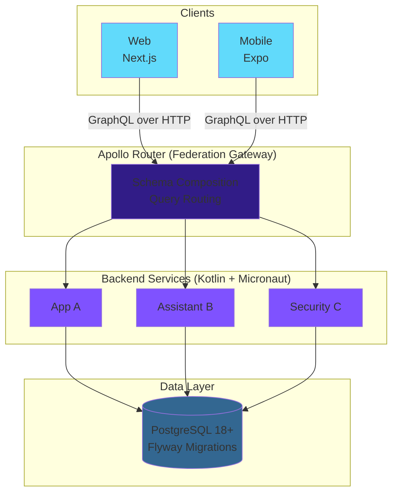
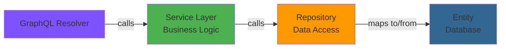
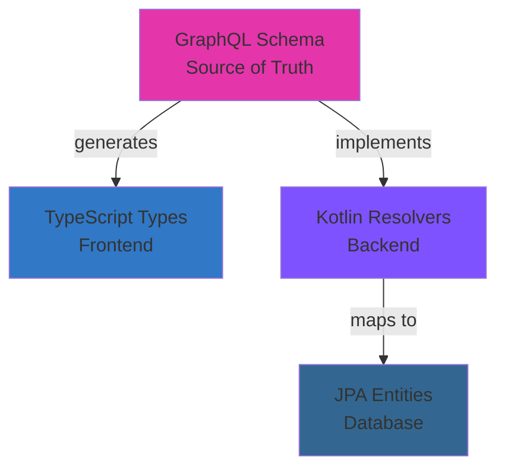
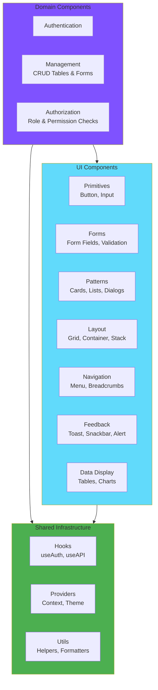
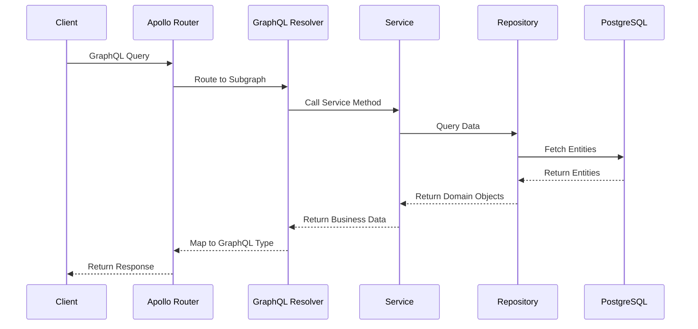
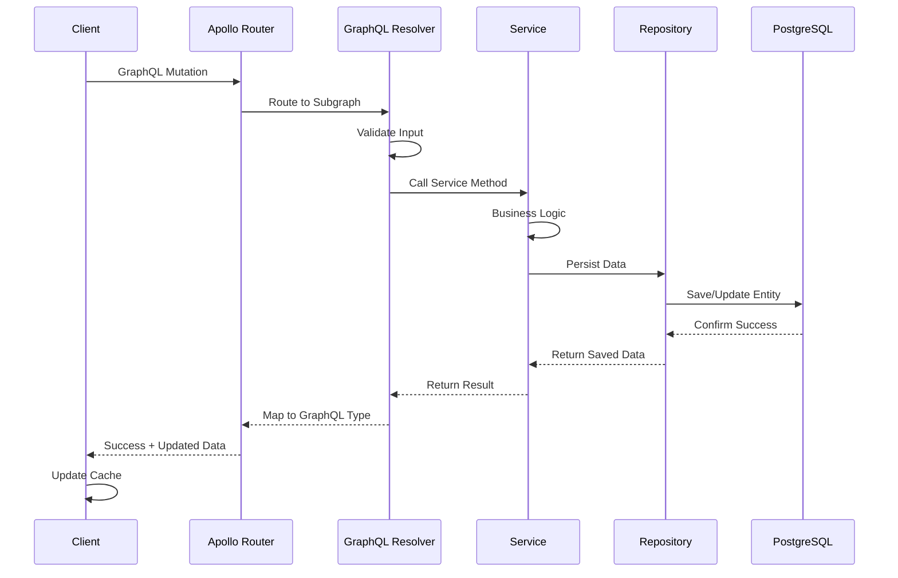

# Architecture at a Glance

> **Goal**: Understand NeoTool's system design and technology choices in 5 minutes.

## System Overview

NeoTool is a **type-safe, federated GraphQL platform** built on a **monorepo architecture** with **containerized microservices**.



**Key Characteristics:**
- ✅ **Type-Safe End-to-End**: GraphQL schema → TypeScript + Kotlin types
- ✅ **Federated**: Independent services, composed schema
- ✅ **Containerized**: Docker + Kubernetes ready
- ✅ **Observable**: Prometheus + Grafana + Loki built-in
- ✅ **Cloud-Agnostic**: Runs anywhere Docker/K8s runs

---

## Technology Stack

### Why These Technologies?

We chose technologies based on **industry adoption and ecosystem maturity**:

1. **Proven at Scale**: Used by major tech companies (Google, Netflix, Uber, LinkedIn)
2. **Rich Ecosystem**: Extensive libraries, tools, and community support
3. **Developer Pool**: Large talent pool with production experience
4. **Best Practices**: Well-documented patterns and anti-patterns
5. **Vendor Neutrality**: Portable across clouds, no lock-in

---

## Backend Stack

### Kotlin + Micronaut + GraphQL

**Why Kotlin?**
- ✅ Modern JVM language
- ✅ Concise syntax (less verbose than Java)
- ✅ Excellent IDE support (IntelliJ)
- ✅ Java interoperability

**Why Micronaut?**
- ✅ Fast startup (< 1 second)
- ✅ Injection in compilation time
- ✅ Low memory footprint
- ✅ Ahead-of-time compilation (GraalVM ready)
- ✅ Built-in GraphQL support

**Why GraphQL?**
- ✅ Replace a BFF in most of the cases
- ✅ Type-safe API contract
- ✅ Fetch exactly what you need (no over/under-fetching)
- ✅ Schema stitching via Federation
- ✅ Introspection and tooling

| Component | Technology | Version | Purpose |
|-----------|-----------|---------|---------|
| **Language** | Kotlin | Latest | Type-safe, concise JVM language |
| **Runtime** | Java (JDK) | 21+ | JVM with Virtual Threads |
| **Framework** | Micronaut | 4.x | Lightweight, fast startup |
| **Build** | Gradle | 8.x | Dependency management |
| **API** | GraphQL (Apollo Federation) | Latest | Type-safe API layer |
| **ORM** | Micronaut Data (JPA) | Latest | Database access |
| **DB Driver** | PostgreSQL JDBC | Latest | Database connectivity |
| **Migrations** | Flyway | Latest | Schema versioning |
| **Testing** | JUnit 5 + TestContainers | Latest | Unit + integration tests |
| **Mocking** | MockK | Latest | Kotlin-friendly mocking |
| **Metrics** | Micrometer | Latest | Observability |

**See**: [ADR-0003: Kotlin/Micronaut Backend](../92-adr/0003-kotlin-micronaut-backend.md)

---

## Frontend Stack

### Next.js + React + TypeScript + Apollo Client

**Why Next.js 14+?**
- ✅ App Router with Server Components
- ✅ Built-in API routes
- ✅ Excellent performance (Core Web Vitals)
- ✅ File-based routing

**Why React 18+?**
- ✅ Industry standard
- ✅ Massive ecosystem
- ✅ Server + Client Components
- ✅ Concurrent rendering

**Why TypeScript?**
- ✅ Type safety from API to UI
- ✅ Auto-generated from GraphQL schema
- ✅ Better refactoring
- ✅ Superior IDE support

| Component | Technology | Version | Purpose |
|-----------|-----------|---------|---------|
| **Plataform** | Node | 20+ | JavaScript runtime environment |
| **Framework** | Next.js | 14+ | React meta-framework |
| **Library** | React | 18+ | UI components |
| **Language** | TypeScript | Latest | Type-safe JavaScript |
| **API Client** | Apollo Client | Latest | GraphQL client + cache |
| **State** | React Context + Hooks | Built-in | Global state |
| **Styling** | Material-UI (MUI) + Emotion | Latest | Component library |
| **Forms** | React Hook Form | Latest | Form state management |
| **Code Gen** | GraphQL Code Generator | Latest | TS types from schema |
| **Testing** | Vitest + React Testing Library | Latest | Unit tests |
| **E2E Testing** | Playwright | Latest | Browser automation |
| **i18n** | next-intl | Latest | Internationalization |

**See**: [ADR-0004: TypeScript/Next.js Frontend](../92-adr/0004-typescript-nextjs-frontend.md)

---

## Data Layer

### PostgreSQL 18+ with Type-Safe Access

**Why PostgreSQL?**
- ✅ ACID compliance
- ✅ Rich feature set (JSON, full-text search, etc.)
- ✅ Excellent performance
- ✅ Open source, no vendor lock-in

| Component | Technology | Purpose |
|-----------|-----------|---------|
| **Database** | PostgreSQL | 18+ | Primary data store |
| **ORM** | Micronaut Data (JPA/Hibernate) | Type-safe queries |
| **Migrations** | Flyway | Schema version control |
| **Connection Pool** | HikariCP | Connection management |
| **Primary Keys** | UUID v7 | Time-ordered UUIDs |

**See**: [ADR-0005: PostgreSQL Database](../92-adr/0005-postgresql-database.md)

---

## API Layer

### GraphQL Federation with Apollo Router

**Why GraphQL Federation?**
- ✅ Independent service schemas
- ✅ Unified API for clients
- ✅ Type composition across services
- ✅ Gradual schema evolution

| Component | Technology | Purpose |
|-----------|-----------|---------|
| **Gateway** | Apollo Router | Schema composition + routing |
| **Subgraphs** | Micronaut GraphQL | Independent service schemas |
| **Schema Language** | GraphQL SDL | Type-safe contract |
| **Introspection** | GraphQL built-in | Auto-generated docs |

**Architecture**:
```
Client Request
    ↓
Apollo Router (reads supergraph)
    ↓
Routes to appropriate subgraph(s)
    ↓
Subgraph resolves fields
    ↓
Router composes response
    ↓
Returns to client
```

**See**: [GraphQL Standards](../06-contracts/graphql-standards.md)

---

## Infrastructure Stack

### Docker + Kubernetes + IaC

**Why Containers?**
- ✅ Consistent environments (dev = prod)
- ✅ Easy scaling
- ✅ Portable across clouds

**Why Kubernetes?**
- ✅ Industry-standard orchestration
- ✅ Auto-scaling, self-healing
- ✅ Declarative configuration

**Why Terraform?**
- ✅ Industry-standard IaC
- ✅ Multi-cloud support
- ✅ Declarative infrastructure
- ✅ Large provider ecosystem

| Component | Technology | Purpose |
|-----------|-----------|---------|
| **Containers** | Docker | Application packaging |
| **Local Dev** | Docker Compose | Multi-container orchestration |
| **Orchestration** | Kubernetes | Production container management |
| **Infrastructure** | Terraform | Infrastructure as Code |
| **CI/CD** | GitHub Actions | Build + test + publish |

---

## Observability Stack

### Prometheus + Grafana + Loki

**Why Observability?**
- ✅ Understand system behavior
- ✅ Debug production issues
- ✅ Track SLOs/SLAs
- ✅ Proactive alerting

| Component | Technology | Purpose |
|-----------|-----------|---------|
| **Metrics** | Prometheus | Time-series metrics |
| **Dashboards** | Grafana | Visualization |
| **Logging** | Loki | Log aggregation |
| **Log Shipping** | Promtail | Log collection |
| **Tracing** | (Planned) OpenTelemetry | Distributed tracing |

**See**: [Observability Overview](../10-observability/observability-overview.md)

---

## Development Tools

### Code Quality + Automation

| Tool | Purpose |
|------|---------|
| **ktlint** | Kotlin code formatting |
| **Detekt** | Kotlin static analysis |
| **ESLint** | TypeScript linting |
| **Prettier** | Code formatting |
| **Husky** | Git hooks |
| **Kover** | Kotlin code coverage |

---

## Key Architectural Patterns

### 1. Clean Architecture (Backend)

**Layers** (dependencies point inward):



**Benefits**:
- ✅ Testable (mock dependencies)
- ✅ Clear responsibilities
- ✅ Flexible (swap implementations)

**See**: [Backend Patterns](../05-backend/patterns/)

---

### 2. Domain-Driven Design

**Concepts**:
- **Entities**: Rich domain models
- **Repositories**: Data access abstraction
- **Services**: Business logic orchestration
- **Value Objects**: Immutable domain concepts

**See**: [Domain Model](../04-domain/domain-model.md)

---

### 3. Type-Safe End-to-End

**Flow**:



**Result**: Compile-time type errors from DB to UI

**See**: [GraphQL Standards](../06-contracts/graphql-standards.md)

---

### 4. Component-Driven Development (Frontend)

**Functional Component Organization**:



**Structure**:
```
shared/components/
├── ui/              (primitives, forms, patterns, layout, navigation, feedback, data-display)
├── auth/            (authentication components)
├── management/      (CRUD tables, forms)
└── authorization/   (role checks, permissions)
```

**See**: [Frontend Patterns](../07-frontend/patterns/)

---

## Data Flow

### Read Flow (Query)



### Write Flow (Mutation)



---

## Security Architecture

### Authentication & Authorization

**JWT-based Authentication**:
- **Access Tokens**: Short-lived (15 min), stateless
- **Refresh Tokens**: Long-lived (7 days), stored in DB
- **Algorithm**: HMAC-SHA256 (HS256)
- **Rotation**: Refresh token rotation on use

**Authorization** (Planned):
- Role-Based Access Control (RBAC)
- GraphQL field-level authorization
- Attribute-Based Access Control (ABAC)

**See**: [Authentication Standards](../09-security/authentication.md)

---

## Scalability Strategy

### Horizontal Scaling
- ✅ **Stateless services**: Scale by adding pods
- ✅ **Kubernetes HPA**: Auto-scale based on CPU/memory
- ✅ **Database read replicas**: Scale reads
- ✅ **Connection pooling**: Efficient DB connections

### Performance Optimizations
- ✅ **GraphQL DataLoader**: Batch + cache DB queries
- ✅ **Apollo Client cache**: Reduce redundant requests
- ✅ **Database indexes**: Fast lookups
- ✅ **CDN**: Static asset delivery

---

## Deployment Architecture

### Local Development
```
Docker Compose
├── PostgreSQL (port 5432)
├── Grafana (port 3001)
├── Prometheus (port 9090)
└── Loki (port 3100)

Kotlin Service (port 8080)
Next.js Dev Server (port 3000)
Apollo Router (port 4000)
```

### Production (Kubernetes)
```
Kubernetes Cluster
├── Namespace: neotool-prod
│   ├── Deployment: app-service (replicas: 3)
│   ├── Deployment: security-service (replicas: 2)
│   ├── Deployment: router (replicas: 2)
│   ├── StatefulSet: postgresql (replicas: 1 + read replicas)
│   └── Service: LoadBalancer (external IP)
├── Namespace: neotool-staging
└── Namespace: observability
    ├── Prometheus
    ├── Grafana
    └── Loki
```

**See**: [Deployment Workflow](../08-workflows/deployment-workflow.md)

---

## Project Structure (Monorepo)

```
neotool/
├── service/kotlin/       # Backend services
│   ├── app/              # Main application
│   ├── security/         # Auth service
│   ├── common/           # Shared code
│   └── gateway/          # Apollo Router config
├── web/                  # Frontend
│   ├── src/app/          # Next.js pages (App Router)
│   ├── src/shared/       # Shared components
│   └── src/lib/          # Utilities
├── contracts/graphql/    # GraphQL schemas
│   ├── subgraphs/        # Individual service schemas
│   └── supergraph/       # Composed schema
├── infra/                # Infrastructure
│   ├── docker/           # Docker Compose files
│   ├── k8s/              # Kubernetes manifests
│   └── observability/    # Grafana dashboards
├── docs/                 # This specification
└── design/               # Design assets
```

**See**: [Project Structure (detailed)](../93-reference/file-structure.md)

---

## Technology Decision Matrix

| Decision | Options Considered | Chosen | Rationale |
|----------|-------------------|--------|-----------|
| **Backend Language** | Java, Kotlin, Go | **Kotlin** | Type safety + conciseness + JVM ecosystem |
| **Backend Framework** | Spring Boot, Micronaut, Quarkus | **Micronaut** | Fast startup, low memory, AOT ready |
| **Frontend Framework** | Next.js, Remix, SvelteKit | **Next.js** | Maturity, ecosystem, App Router |
| **Database** | PostgreSQL, MySQL, MongoDB | **PostgreSQL** | ACID, features, performance |
| **API Style** | REST, GraphQL, gRPC | **GraphQL** | Type safety, federation, client efficiency |
| **Orchestration** | Docker Compose, Kubernetes, ECS | **Kubernetes** | Industry standard, portable |
| **Observability** | ELK, PLG, Datadog | **PLG** (Prometheus, Loki, Grafana) | Open source, powerful, self-hosted |

**See**: [All ADRs](../92-adr/) for detailed decision rationale.

---

## Quick Reference

### URLs (Local Development)
- Frontend: http://localhost:3000
- Backend API: http://localhost:8080
- GraphQL Playground: http://localhost:4000/graphql
- Grafana: http://localhost:3001 (admin/admin)
- Prometheus: http://localhost:9090

### Key Commands
```bash
# Start infrastructure
cd infra/docker && docker-compose -f docker-compose.local.yml up -d

# Start backend
cd service/kotlin && ./gradlew run

# Start frontend
cd web && npm run dev

# Run tests
./gradlew test  # Backend
npm test        # Frontend

# Build
./gradlew build
npm run build
```

**See**: [Commands Reference](../93-reference/commands.md)

---

## Next Steps

### Deep Dives
- [System Architecture (detailed)](../02-architecture/system-architecture.md)
- [Domain Model](../04-domain/domain-model.md)
- [Backend Patterns](../05-backend/patterns/)
- [Frontend Patterns](../07-frontend/patterns/)

### Get Started
- [Getting Started Guide](./getting-started.md)
- [Feature Development Workflow](../08-workflows/feature-development.md)
- [Core Principles](./core-principles.md)

### Decisions & Examples
- [All ADRs](../92-adr/)
- [Code Examples](../90-examples/)
- [Templates](../91-templates/)

---

**Version**: 3.0.0 (2026-01-02)
**Stack**: Kotlin + Micronaut + PostgreSQL + GraphQL | Next.js + React + TypeScript
**Philosophy**: Type-safe, federated, observable, cloud-agnostic

*Modern technology choices for production-ready applications.*
