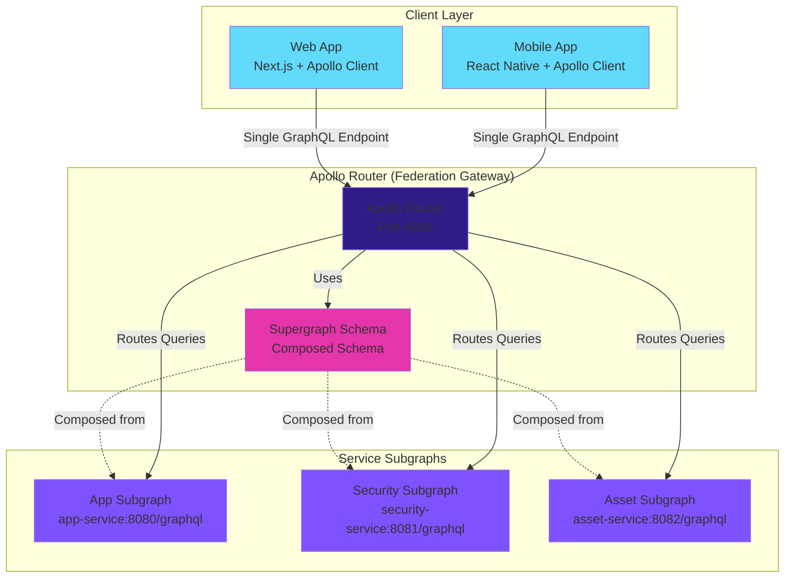
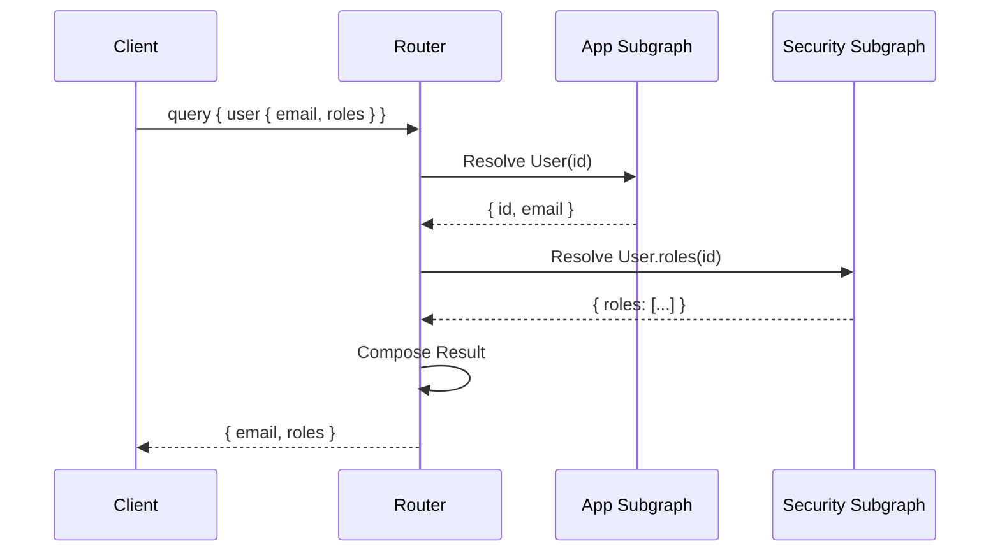
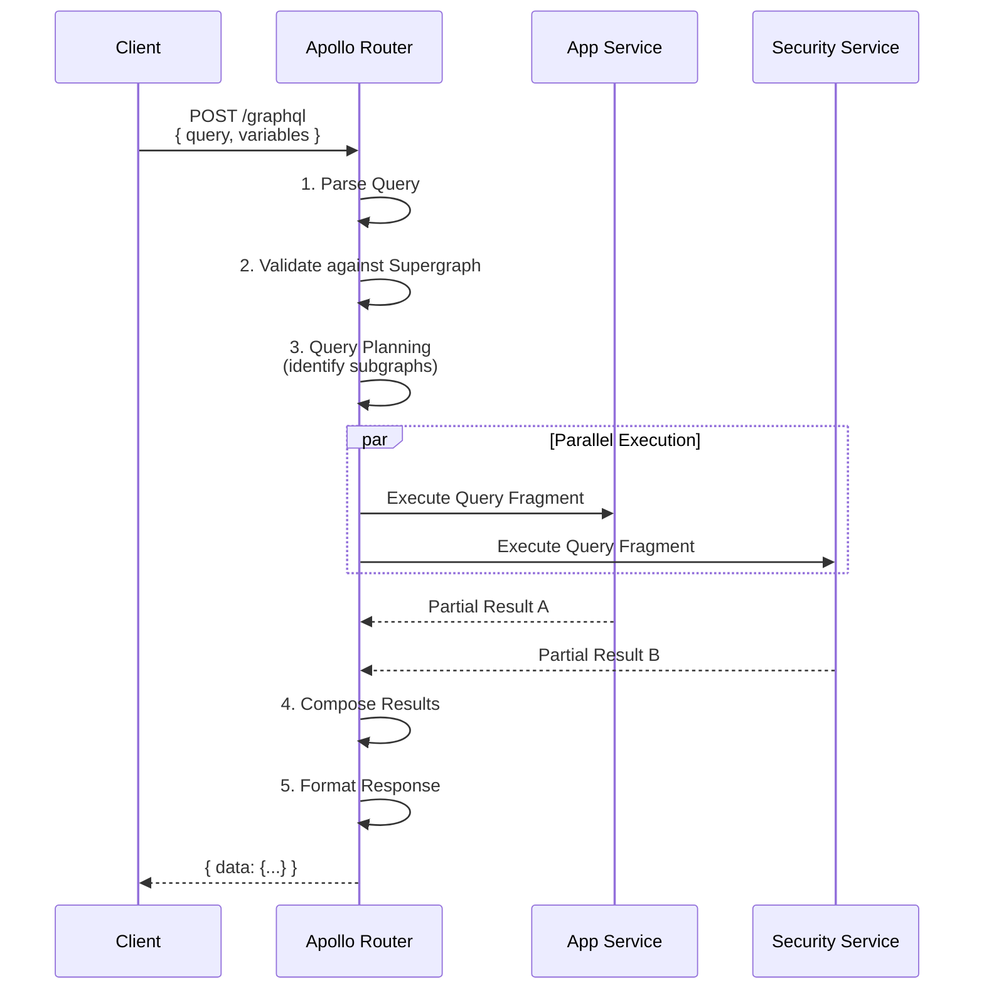
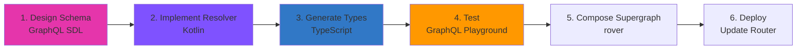

# API Architecture

> **Purpose**: Deep-dive into GraphQL Federation architecture, Apollo Router configuration, schema design, API patterns, and performance optimization in NeoTool.

## Overview

NeoTool uses **GraphQL Federation** to compose multiple service schemas into a unified API. The **Apollo Router** acts as the gateway, routing queries to appropriate subgraphs and composing results for clients.

### Key Characteristics

- **GraphQL Federation v2**: Schema composition from multiple services
- **Apollo Router**: High-performance Rust-based gateway
- **Type-Safe**: Auto-generated TypeScript types for frontend
- **Subgraph per Service**: Each microservice owns its schema
- **Client-Driven**: Clients query exactly what they need
- **Versioning**: Schema evolution without breaking changes

**See**: [GraphQL Standards](../06-contracts/graphql-standards.md) for detailed conventions.

---

## GraphQL Federation Architecture

### Federation Overview



**Components**:

| Component | Responsibility | Technology |
|-----------|---------------|------------|
| **Apollo Router** | Query routing, schema composition, caching | Rust (high-performance) |
| **Supergraph Schema** | Composed schema from all subgraphs | GraphQL SDL |
| **Subgraphs** | Service-specific schemas and resolvers | Kotlin + Micronaut GraphQL |
| **Clients** | Query composition, caching, UI rendering | TypeScript + Apollo Client |

---

## Apollo Router Configuration

### Router Setup

```yaml
# router.yaml
supergraph:
  path: ./supergraph-schema.graphql  # Composed schema

# Subgraph endpoints
override_subgraph_url:
  app: http://app-service:8080/graphql
  security: http://security-service:8081/graphql
  asset: http://asset-service:8082/graphql

# CORS configuration
cors:
  origins:
    - http://localhost:3000      # Local dev
    - https://app.neotool.io     # Production
  allow_credentials: true
  allow_headers:
    - Content-Type
    - Authorization

# Headers forwarded to subgraphs
headers:
  all:
    request:
      - propagate:
          named: Authorization  # JWT token
      - propagate:
          named: X-User-Id      # User context
      - propagate:
          named: X-User-Roles   # User roles

# Performance
traffic_shaping:
  all:
    timeout: 30s
    rate_limit:
      capacity: 100
      interval: 1s

# Caching (planned)
apq:
  enabled: true  # Automatic Persisted Queries

# Telemetry
telemetry:
  metrics:
    prometheus:
      enabled: true
      path: /metrics
```

**See**: [Apollo Router Docs](https://www.apollographql.com/docs/router/) for full configuration.

---

## Schema Composition

### Subgraph Schemas

**App Subgraph** (`app-service`):
```graphql
# app.graphql
extend schema
  @link(url: "https://specs.apollo.dev/federation/v2.0", import: ["@key", "@shareable"])

type User @key(fields: "id") {
  id: ID!
  email: String!
  fullName: String
  createdAt: DateTime!
}

type Query {
  user(id: ID!): User
  users(page: Int, size: Int): UserPage!
}

type Mutation {
  createUser(input: CreateUserInput!): User!
  updateUser(id: ID!, input: UpdateUserInput!): User!
}
```

**Security Subgraph** (`security-service`):
```graphql
# security.graphql
extend schema
  @link(url: "https://specs.apollo.dev/federation/v2.0", import: ["@key"])

# Extend User type from app subgraph
extend type User @key(fields: "id") {
  id: ID! @external
  roles: [Role!]!
  permissions: [Permission!]!
}

type Query {
  me: User  # Current authenticated user
}

type Mutation {
  login(email: String!, password: String!): AuthPayload!
  refreshToken(refreshToken: String!): AuthPayload!
}

type AuthPayload {
  accessToken: String!
  refreshToken: String!
  user: User!
}
```

**Asset Subgraph** (`asset-service`):
```graphql
# asset.graphql
extend schema
  @link(url: "https://specs.apollo.dev/federation/v2.0", import: ["@key"])

extend type User @key(fields: "id") {
  id: ID! @external
  uploads: [Asset!]!
}

type Asset @key(fields: "id") {
  id: ID!
  filename: String!
  url: String!
  uploadedBy: User!
}

type Mutation {
  uploadAsset(file: Upload!): Asset!
}
```

### Supergraph Composition

**Composed Schema** (generated):
```graphql
# supergraph-schema.graphql (auto-generated)
type User {
  # From app subgraph
  id: ID!
  email: String!
  fullName: String
  createdAt: DateTime!

  # From security subgraph
  roles: [Role!]!
  permissions: [Permission!]!

  # From asset subgraph
  uploads: [Asset!]!
}
```

**Client Query** (uses composed schema):
```graphql
query {
  user(id: "123") {
    # From app
    email
    fullName
    # From security
    roles
    # From asset
    uploads {
      filename
      url
    }
  }
}
```

**Router Execution**:
1. Parse query and identify required subgraphs
2. Execute parallel queries to app, security, asset subgraphs
3. Compose results based on entity keys (`@key(fields: "id")`)
4. Return unified response to client

---

## Federation Patterns

### Entity References (`@key`)

**Pattern**: Extend types across subgraphs

```graphql
# App subgraph defines User
type User @key(fields: "id") {
  id: ID!
  email: String!
}

# Security subgraph extends User
extend type User @key(fields: "id") {
  id: ID! @external
  roles: [Role!]!
}
```

**Resolver** (security subgraph):
```kotlin
@GraphQLQuery
fun user(@GraphQLArgument id: UUID): User {
    // Resolve User reference (called by Apollo Router)
    return User(id = id)
}

@SchemaMapping(typeName = "User")
fun roles(user: User): List<Role> {
    // Resolve roles field for User entity
    return roleService.findByUserId(user.id)
}
```

### Shared Types (`@shareable`)

**Pattern**: Type defined in multiple subgraphs (same shape)

```graphql
# Common types in multiple subgraphs
type DateTime @shareable {
  iso: String!
  unix: Int!
}
```

### Reference Resolution

**Pattern**: Fetch entity data from owning subgraph



---

## Query Patterns

### Query Execution Flow



### Batching with DataLoader

**Problem**: N+1 queries when resolving lists

```graphql
query {
  users {        # 1 query
    id
    uploads {    # N queries (one per user)
      filename
    }
  }
}
```

**Solution**: DataLoader batches requests

```kotlin
@Singleton
class AssetDataLoader(
    private val assetService: AssetService
) : DataLoader<UUID, List<Asset>> {

    override suspend fun load(userIds: List<UUID>): List<List<Asset>> {
        // Batch load assets for all users in one query
        return assetService.findByUserIds(userIds)
    }
}

// Resolver uses DataLoader
@SchemaMapping
suspend fun uploads(user: User): List<Asset> {
    return assetDataLoader.load(user.id)
}
```

**Result**: 1 query for users + 1 batched query for all uploads

---

## Error Handling

### Standard Error Format

```json
{
  "errors": [
    {
      "message": "User not found",
      "extensions": {
        "code": "NOT_FOUND",
        "userId": "550e8400-e29b-41d4-a716-446655440000"
      },
      "path": ["user"],
      "locations": [{ "line": 2, "column": 3 }]
    }
  ],
  "data": {
    "user": null
  }
}
```

### Error Codes

| Code | HTTP Equivalent | Meaning | Retry? |
|------|----------------|---------|--------|
| `UNAUTHENTICATED` | 401 | No valid JWT token | No (login required) |
| `FORBIDDEN` | 403 | Insufficient permissions | No (access denied) |
| `NOT_FOUND` | 404 | Resource doesn't exist | No |
| `BAD_USER_INPUT` | 400 | Invalid input data | No (fix input) |
| `INTERNAL_SERVER_ERROR` | 500 | Unexpected error | Yes (transient) |
| `SERVICE_UNAVAILABLE` | 503 | Service down | Yes (retry) |

### Error Handling Pattern

```kotlin
@Singleton
class GraphQLExceptionHandler : GraphQLErrorHandler {

    override fun handleError(error: Throwable): GraphQLError {
        return when (error) {
            is NotFoundException -> graphqlError(
                message = error.message ?: "Not found",
                errorType = ErrorType.NOT_FOUND
            )
            is UnauthorizedException -> graphqlError(
                message = "Authentication required",
                errorType = ErrorType.UNAUTHENTICATED
            )
            is ForbiddenException -> graphqlError(
                message = "Insufficient permissions",
                errorType = ErrorType.FORBIDDEN
            )
            else -> graphqlError(
                message = "Internal server error",
                errorType = ErrorType.INTERNAL_ERROR
            )
        }
    }
}
```

---

## Performance Optimization

### Caching Strategies

**1. Apollo Client Cache** (Client-side):
```typescript
// Normalized cache with type policies
const cache = new InMemoryCache({
  typePolicies: {
    User: {
      keyFields: ["id"],
      fields: {
        uploads: {
          merge: false  // Replace array on update
        }
      }
    }
  }
});
```

**2. Automatic Persisted Queries (APQ)**:
```yaml
# router.yaml
apq:
  enabled: true
```

Benefits:
- Reduced payload size (hash instead of full query)
- Improved CDN caching
- Protection against query complexity attacks

**3. Response Caching** (Planned):
```graphql
type Query {
  user(id: ID!): User @cacheControl(maxAge: 60)
  users: [User!]! @cacheControl(maxAge: 30)
}
```

### Query Complexity Limits

```yaml
# router.yaml
limits:
  max_depth: 10           # Prevent deeply nested queries
  max_aliases: 30         # Limit query aliases
  max_root_fields: 20     # Limit root-level fields
```

### Field-Level Authorization

```kotlin
@GraphQLQuery
@Secured("ROLE_ADMIN")  // Requires admin role
fun users(): List<User> {
    return userService.findAll()
}

@SchemaMapping
fun sensitiveData(user: User): String? {
    // Field-level authorization
    if (!authContext.hasPermission("VIEW_SENSITIVE_DATA")) {
        return null
    }
    return user.sensitiveData
}
```

---

## Schema Evolution

### Versioning Strategy

**Approach**: Additive changes only (no breaking changes)

✅ **Safe Changes** (non-breaking):
- Add new types
- Add new fields to existing types
- Add new optional arguments
- Deprecate fields (with `@deprecated`)

```graphql
type User {
  id: ID!
  name: String! @deprecated(reason: "Use fullName instead")
  fullName: String!  # New field
}
```

❌ **Breaking Changes** (avoid):
- Remove types or fields
- Change field types
- Make optional arguments required
- Rename fields

**Migration Pattern**:
1. Add new field (e.g., `fullName`)
2. Deprecate old field (e.g., `name`)
3. Update clients to use new field
4. Remove old field after grace period (3-6 months)

### Schema Checks (CI/CD)

```bash
# Validate schema changes don't break clients
rover subgraph check my-graph@prod \
  --schema ./schema.graphql \
  --name app-service
```

---

## Monitoring & Observability

### Metrics

**Apollo Router Metrics** (Prometheus):
```
# Request metrics
apollo_router_http_requests_total
apollo_router_http_request_duration_seconds

# GraphQL operation metrics
apollo_router_graphql_requests_total
apollo_router_graphql_field_executions_total

# Subgraph metrics
apollo_router_subgraph_requests_total
apollo_router_subgraph_request_duration_seconds
```

### Tracing (Planned)

**Distributed Tracing** with OpenTelemetry:
```yaml
# router.yaml
telemetry:
  tracing:
    otlp:
      enabled: true
      endpoint: http://jaeger:4317
```

**Trace Flow**:
```
Client Request → Apollo Router → App Subgraph → Database
                              → Security Subgraph → Database
```

---

## Development Workflow

### Schema Development Process



**Commands**:
```bash
# 1. Design schema (manual)
# Edit contracts/graphql/subgraphs/app.graphql

# 2. Implement resolver
# Create Kotlin resolver in service/kotlin/app/src/main/kotlin/graphql/

# 3. Generate TypeScript types
cd web && npm run codegen

# 4. Test in GraphQL Playground
# Open http://localhost:8080/graphql

# 5. Compose supergraph
rover supergraph compose --config supergraph.yaml > supergraph-schema.graphql

# 6. Deploy (automatic in CI/CD)
# Router auto-reloads supergraph schema
```

---

## Related Documentation

### Architecture
- [Architecture Hub](./README.md)
- [System Architecture](./system-architecture.md)
- [Service Architecture](./service-architecture.md)
- [Frontend Architecture](./frontend-architecture.md)

### Standards & Patterns
- [GraphQL Standards](../06-contracts/graphql-standards.md)
- [Resolver Pattern](../05-backend/patterns/resolver-pattern.md)
- [GraphQL Query Pattern](../07-frontend/patterns/graphql-query-pattern.md)

---

**Version**: 1.0.0 (2026-01-02)
**Stack**: GraphQL Federation v2 + Apollo Router
**Philosophy**: Unified API. Independent schemas. Client-driven queries.

*Compose APIs that scale with your architecture.*
