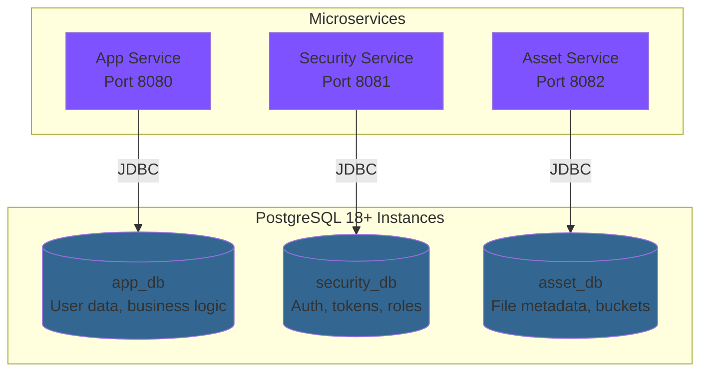
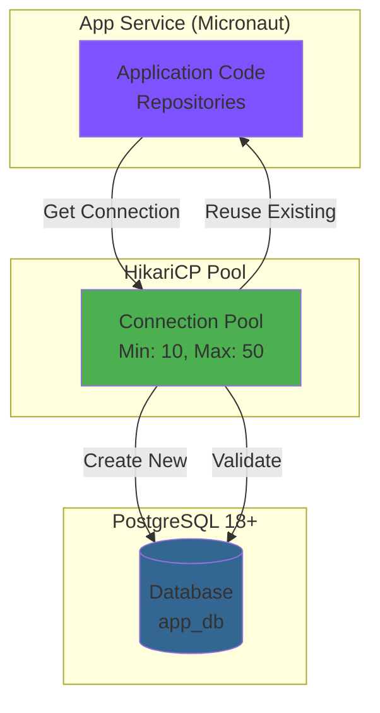
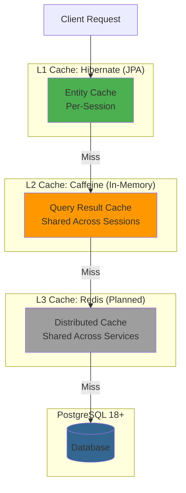
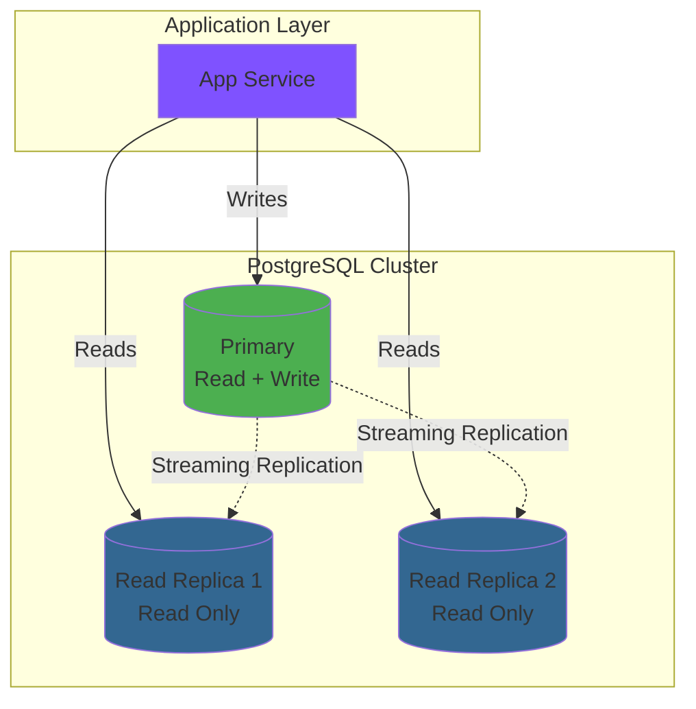

# Data Architecture

> **Purpose**: Deep-dive into PostgreSQL 18+ database setup, data modeling patterns, migration strategies, connection management, caching, replication, and backup strategies in NeoTool.

## Overview

NeoTool uses **PostgreSQL 18+** as the primary relational database, following a **database-per-service** pattern for service isolation. Each service owns its schema, migrations, and data access patterns, ensuring clear boundaries and independent evolution.

### Key Characteristics

- **PostgreSQL 18+**: Latest features (performance, JSON enhancements, security)
- **Database per Service**: Each microservice has its own database
- **Type-Safe Access**: Micronaut Data (JPA/Hibernate) with compile-time queries
- **Schema Versioning**: Flyway migrations as code
- **Connection Pooling**: HikariCP for efficient connection management
- **Caching Strategy**: Multi-level caching (L1: Hibernate, L2: Caffeine, Planned: Redis)
- **Replication**: Primary + read replicas for scaling reads

**See**: [ADR-0005: PostgreSQL Database](../92-adr/0005-postgresql-database.md) for technology choice rationale.

---

## Database Topology

### Database-per-Service Pattern



**Database Ownership**:

| Database | Owner Service | Schema | Purpose |
|----------|--------------|--------|---------|
| `app_db` | App Service | `public` | Core business logic, user profiles, application data |
| `security_db` | Security Service | `public` | Authentication, authorization, JWT refresh tokens, RBAC |
| `asset_db` | Asset Service | `public` | File metadata, bucket configuration, visibility rules |

**Benefits**:
- ✅ **Service Independence**: Services can evolve schemas independently
- ✅ **Data Isolation**: Clear ownership and access boundaries
- ✅ **Technology Diversity**: Services could use different databases (if needed)
- ✅ **Scaling**: Independent scaling per database workload
- ✅ **Fault Isolation**: Database failure affects only one service

**Trade-offs**:
- ❌ **No Joins**: Cross-service data requires GraphQL Federation
- ❌ **Data Duplication**: Some denormalization for performance
- ❌ **Distributed Transactions**: Eventual consistency (saga pattern)

**See**: [Service Architecture](./service-architecture.md) for service boundaries.

---

## PostgreSQL 18+ Features

### Why PostgreSQL 18+?

PostgreSQL 18 (released 2025) brings significant improvements over 17 and earlier:

| Feature | PostgreSQL 18+ | Benefit to NeoTool |
|---------|---------------|-------------------|
| **Parallel Query** | Enhanced parallel processing | Faster complex queries, analytics |
| **JSON Improvements** | Better JSONB indexing, operators | Flexible schema, audit logs |
| **Partitioning** | Declarative partitioning | Time-series data scaling |
| **Incremental Backup** | pg_backrest improvements | Faster backups, lower impact |
| **Logical Replication** | Improved performance | Better read scaling |
| **Security** | Enhanced row-level security | Fine-grained access control |
| **Performance** | JIT compilation, vacuum improvements | Lower latency, higher throughput |

**New in PostgreSQL 18** (highlights):
- Improved vacuum performance
- Better JSON performance with new operators
- Enhanced statistics for query planning
- Security improvements (TLS 1.3, SCRAM-SHA-256)

**See**: [PostgreSQL 18 Release Notes](https://www.postgresql.org/docs/18/release-18.html) for complete changelog.

### Data Types Used

| Type | Usage | Example |
|------|-------|---------|
| **UUID** | Primary keys (UUID v7) | `550e8400-e29b-41d4-a716-446655440000` |
| **VARCHAR** | Text fields (email, name) | `user@example.com` |
| **TEXT** | Long text (descriptions) | User bio, article content |
| **TIMESTAMP WITH TIME ZONE** | Dates and times | `2026-01-02T12:34:56.789Z` |
| **BOOLEAN** | Flags | `enabled`, `verified` |
| **INTEGER** / **BIGINT** | Counters, quantities | `user_count`, `file_size_bytes` |
| **JSONB** | Flexible data, metadata | `{"theme": "dark", "lang": "en"}` |
| **ENUM** | Fixed sets | `enum user_role { ADMIN, USER }` |

**UUID v7 for Primary Keys**:
```sql
-- UUID v7 provides time-ordered UUIDs (better performance than UUID v4)
CREATE EXTENSION IF NOT EXISTS "uuid-ossp";

-- Generated in application code (Kotlin)
val id = UuidV7.generate()  -- Time-ordered, database-friendly
```

**Benefits of UUID v7**:
- ✅ Time-ordered (better B-tree index performance than UUID v4)
- ✅ Globally unique (no coordination needed)
- ✅ No auto-increment contention
- ✅ Secure (unpredictable, unlike sequential IDs)

**See**: [UUID v7 Pattern](../05-backend/patterns/uuid-v7-pattern.md)

---

## Database Schema Design

### Example Schema: Users Table

```sql
-- V1__create_users_table.sql
CREATE TABLE users (
    id UUID PRIMARY KEY,                          -- UUID v7
    email VARCHAR(255) NOT NULL UNIQUE,           -- Unique constraint
    password_hash VARCHAR(255) NOT NULL,          -- BCrypt hash
    full_name VARCHAR(255),
    roles VARCHAR(50)[] NOT NULL DEFAULT '{USER}', -- Array of roles
    enabled BOOLEAN NOT NULL DEFAULT true,
    email_verified BOOLEAN NOT NULL DEFAULT false,
    metadata JSONB DEFAULT '{}',                  -- Flexible metadata
    created_at TIMESTAMP WITH TIME ZONE NOT NULL DEFAULT NOW(),
    updated_at TIMESTAMP WITH TIME ZONE NOT NULL DEFAULT NOW(),
    deleted_at TIMESTAMP WITH TIME ZONE           -- Soft delete
);

-- Indexes
CREATE INDEX idx_users_email ON users(email);                    -- Login queries
CREATE INDEX idx_users_created_at ON users(created_at DESC);     -- Recent users
CREATE INDEX idx_users_deleted_at ON users(deleted_at) WHERE deleted_at IS NULL;  -- Partial index for active users
CREATE INDEX idx_users_metadata ON users USING GIN (metadata);   -- JSONB queries

-- Full-text search (if needed)
CREATE INDEX idx_users_full_name_fts ON users USING GIN (to_tsvector('english', full_name));
```

### Design Principles

**Naming Conventions**:
- Tables: `snake_case`, plural (`users`, `refresh_tokens`)
- Columns: `snake_case` (`created_at`, `password_hash`)
- Indexes: `idx_{table}_{column(s)}` (`idx_users_email`)
- Foreign keys: `fk_{table}_{referenced_table}` (`fk_tokens_user_id`)
- Constraints: `uq_{table}_{column}` (unique), `ck_{table}_{check}` (check)

**Standard Columns** (every table):
```sql
-- Audit columns
id UUID PRIMARY KEY,                           -- UUID v7
created_at TIMESTAMP WITH TIME ZONE NOT NULL DEFAULT NOW(),
updated_at TIMESTAMP WITH TIME ZONE NOT NULL DEFAULT NOW(),
deleted_at TIMESTAMP WITH TIME ZONE            -- NULL = active, timestamp = soft deleted
```

**Soft Delete Pattern**:
```sql
-- Don't physically delete rows (for audit, recovery)
UPDATE users SET deleted_at = NOW() WHERE id = ?;

-- Queries exclude deleted rows
SELECT * FROM users WHERE deleted_at IS NULL;

-- Partial index for performance
CREATE INDEX idx_users_active ON users(id) WHERE deleted_at IS NULL;
```

**See**: [Database Standards](../05-backend/standards/database-standards.md) for complete conventions.

---

## Schema Migration Strategy

### Flyway Migrations

**Directory Structure**:
```
service/kotlin/app/src/main/resources/db/migration/
├── V1__initial_schema.sql           # Initial tables
├── V2__create_users_table.sql       # Add users table
├── V3__add_users_roles_column.sql   # Alter users table
├── V4__create_refresh_tokens.sql    # New table
└── V5__add_users_email_index.sql    # Add index
```

**Naming Convention**:
- **Versioned**: `V{VERSION}__{DESCRIPTION}.sql` (e.g., `V1__initial_schema.sql`)
- **Repeatable**: `R__{DESCRIPTION}.sql` (e.g., `R__create_view_active_users.sql`)

**Migration Best Practices**:

✅ **Do**:
- One logical change per migration
- Increment version sequentially (V1, V2, V3...)
- Use descriptive names
- Test migrations on local database first
- Include rollback plan (manual, Flyway doesn't auto-rollback)
- Add comments explaining complex changes

❌ **Don't**:
- Modify existing migrations (Flyway checksums prevent this)
- Use `DROP TABLE` without backup
- Run DDL and DML in same migration (split into separate files)
- Forget to test with production data volume

### Example Migration

```sql
-- V2__create_users_table.sql
-- Description: Create users table with email, password, roles
-- Author: Development Team
-- Date: 2026-01-02

CREATE TABLE users (
    id UUID PRIMARY KEY,
    email VARCHAR(255) NOT NULL UNIQUE,
    password_hash VARCHAR(255) NOT NULL,
    roles VARCHAR(50)[] NOT NULL DEFAULT '{USER}',
    enabled BOOLEAN NOT NULL DEFAULT true,
    created_at TIMESTAMP WITH TIME ZONE NOT NULL DEFAULT NOW(),
    updated_at TIMESTAMP WITH TIME ZONE NOT NULL DEFAULT NOW()
);

-- Indexes for performance
CREATE INDEX idx_users_email ON users(email);
CREATE INDEX idx_users_created_at ON users(created_at DESC);

-- Comments
COMMENT ON TABLE users IS 'Application users with authentication credentials';
COMMENT ON COLUMN users.email IS 'Unique email address for login';
COMMENT ON COLUMN users.password_hash IS 'BCrypt hashed password';
```

### Schema Versioning Workflow

```mermaid
graph LR
    Develop[1. Develop Migration<br/>Write SQL in V{N}__*.sql]
    Test[2. Test Locally<br/>Run Flyway migrate]
    Review[3. Code Review<br/>PR with migration]
    Merge[4. Merge to Main]
    Deploy[5. Deploy Service<br/>Flyway auto-runs]
    Verify[6. Verify Schema<br/>Check flyway_schema_history]

    Develop --> Test
    Test --> Review
    Review --> Merge
    Merge --> Deploy
    Deploy --> Verify

    style Develop fill:#4caf50
    style Deploy fill:#7f52ff
    style Verify fill:#ff9800
```

**Flyway Configuration**:
```yaml
# application.yml
flyway:
  enabled: true
  locations:
    - classpath:db/migration
  baseline-on-migrate: true
  baseline-version: 0
  validate-on-migrate: true
```

**See**: [Flyway Documentation](https://flywaydb.org/documentation/) for advanced features.

---

## Connection Management

### HikariCP Connection Pooling



**Configuration**:
```yaml
datasources:
  default:
    url: jdbc:postgresql://localhost:5432/app_db
    driverClassName: org.postgresql.Driver
    username: ${DB_USER:postgres}
    password: ${DB_PASSWORD:postgres}

    hikari:
      # Pool sizing
      minimum-idle: 10              # Min idle connections
      maximum-pool-size: 50         # Max connections

      # Connection lifecycle
      connection-timeout: 30000     # 30 seconds
      idle-timeout: 600000          # 10 minutes
      max-lifetime: 1800000         # 30 minutes

      # Validation
      connection-test-query: "SELECT 1"
      validation-timeout: 5000      # 5 seconds

      # Performance
      leak-detection-threshold: 60000  # 60 seconds (detect connection leaks)
      auto-commit: true
```

**Pool Sizing Strategy**:

Formula: `connections = ((core_count * 2) + effective_spindle_count)`

Example:
- **Local Dev**: Min 5, Max 10 (single developer)
- **Production**: Min 10, Max 50 (based on cores and load)

**Monitoring**:
```kotlin
// Metrics exposed via Micrometer
hikaricp.connections.active
hikaricp.connections.idle
hikaricp.connections.pending
hikaricp.connections.timeout
```

**See**: [HikariCP Configuration](https://github.com/brettwooldridge/HikariCP#configuration-knobs-baby) for tuning guide.

---

## Caching Strategy

### Multi-Level Caching



### L1: Hibernate First-Level Cache

**Scope**: Per-session (transaction)
**Lifetime**: Duration of transaction
**Automatic**: Enabled by default

```kotlin
@Transactional
fun findById(id: UUID): User {
    val user1 = entityManager.find(UserEntity::class.java, id)  // DB query
    val user2 = entityManager.find(UserEntity::class.java, id)  // Cache hit (same session)
    // Only one SQL query executed
}
```

**Configuration**: No configuration needed (built-in JPA feature)

### L2: Caffeine Second-Level Cache

**Scope**: Shared across sessions (application-wide)
**Lifetime**: Configurable TTL (Time To Live)
**Manual Setup**: Requires configuration

```kotlin
// Entity-level caching
@Entity
@Cacheable
@org.hibernate.annotations.Cache(usage = CacheConcurrencyStrategy.READ_WRITE)
data class UserEntity(
    @Id val id: UUID,
    val email: String
)
```

**Configuration**:
```yaml
jpa:
  default:
    properties:
      hibernate:
        cache:
          use_second_level_cache: true
          use_query_cache: true
          region:
            factory_class: org.hibernate.cache.caffeine.CaffeineCacheRegionFactory
```

**Use Cases**:
- Read-heavy entities (roles, settings)
- Infrequently updated data
- Reference data (countries, categories)

### L3: Redis Distributed Cache (Planned)

**Scope**: Shared across service instances
**Lifetime**: Configurable TTL
**Future Implementation**: For horizontal scaling

**Use Cases** (when implemented):
- Session storage
- Rate limiting
- GraphQL query caching
- Cross-service data sharing

**See**: Future implementation in infrastructure updates.

### Cache Invalidation

**Strategies**:

1. **Time-Based (TTL)**: Cache expires after duration
   ```kotlin
   @Cacheable(cacheNames = ["users"], ttl = "1h")
   ```

2. **Event-Based**: Invalidate on update/delete
   ```kotlin
   @CacheEvict(cacheNames = ["users"], key = "#id")
   fun update(id: UUID, input: UserInput): User {
       // ... update logic
   }
   ```

3. **Manual**: Explicit cache clear
   ```kotlin
   cacheManager.getCache("users")?.clear()
   ```

---

## Data Access Patterns

### Repository Pattern (Micronaut Data)

```kotlin
// Repository interface (compile-time query generation)
@Repository
interface UserRepository : CrudRepository<UserEntity, UUID> {

    // Method name → SQL query (generated at compile-time)
    fun findByEmail(email: String): Optional<UserEntity>

    fun findByEnabledTrue(): List<UserEntity>

    fun countByRolesContains(role: String): Long

    // Custom query
    @Query("SELECT u FROM UserEntity u WHERE u.createdAt > :since")
    fun findRecentUsers(@Parameter("since") since: Instant): List<UserEntity>

    // Native SQL
    @Query(value = "SELECT * FROM users WHERE email LIKE :pattern", nativeQuery = true)
    fun searchByEmailPattern(@Parameter("pattern") pattern: String): List<UserEntity>
}
```

**Benefits**:
- ✅ **Type-Safe**: Compile-time query validation
- ✅ **No Boilerplate**: No need to write SQL for simple queries
- ✅ **Performance**: No runtime reflection
- ✅ **Readable**: Method names express intent

**See**: [Repository Pattern](../05-backend/patterns/repository-pattern.md)

### Custom Repository Implementation

```kotlin
// Custom interface for complex queries
interface UserRepositoryCustom {
    fun findWithPagination(page: Int, size: Int): Page<UserEntity>
    fun findByComplexCriteria(criteria: SearchCriteria): List<UserEntity>
}

// Implementation
@Singleton
class UserRepositoryCustomImpl(
    private val entityManager: EntityManager
) : UserRepositoryCustom {

    override fun findWithPagination(page: Int, size: Int): Page<UserEntity> {
        val query = entityManager.createQuery(
            "SELECT u FROM UserEntity u ORDER BY u.createdAt DESC",
            UserEntity::class.java
        )
        query.firstResult = page * size
        query.maxResults = size

        return Page.of(query.resultList, Pageable.from(page, size), countAll())
    }
}
```

**See**: [Repository Custom Implementation Pattern](../05-backend/patterns/repository-custom-impl-pattern.md)

---

## Performance Optimization

### Database Indexing

**Index Strategy**:

```sql
-- 1. Primary key (automatic B-tree index)
CREATE TABLE users (
    id UUID PRIMARY KEY  -- Automatic index
);

-- 2. Unique constraints (automatic index)
ALTER TABLE users ADD CONSTRAINT uq_users_email UNIQUE (email);

-- 3. Foreign keys (manual index recommended)
CREATE INDEX idx_tokens_user_id ON refresh_tokens(user_id);

-- 4. Query-specific indexes
CREATE INDEX idx_users_created_at ON users(created_at DESC);  -- Recent users query

-- 5. Partial indexes (for filtered queries)
CREATE INDEX idx_users_active ON users(id) WHERE deleted_at IS NULL;

-- 6. Composite indexes (for multi-column queries)
CREATE INDEX idx_users_email_enabled ON users(email, enabled);

-- 7. GIN indexes (for JSONB, arrays, full-text search)
CREATE INDEX idx_users_metadata ON users USING GIN (metadata);
CREATE INDEX idx_users_roles ON users USING GIN (roles);
```

**Index Types**:

| Type | Use Case | Example |
|------|----------|---------|
| **B-tree** (default) | Equality, range queries | `WHERE id = ?`, `WHERE created_at > ?` |
| **Hash** | Equality only | `WHERE email = ?` (rarely needed, B-tree is better) |
| **GIN** | JSONB, arrays, full-text | `WHERE metadata @> '{"theme": "dark"}'` |
| **GiST** | Geometric, range types | Geospatial queries (PostGIS) |
| **BRIN** | Large tables, sequential | Time-series data (very large tables) |

**Monitoring Indexes**:
```sql
-- Find unused indexes
SELECT
    schemaname, tablename, indexname, idx_scan
FROM pg_stat_user_indexes
WHERE idx_scan = 0 AND indexname NOT LIKE 'pg_%';

-- Find missing indexes (slow queries)
SELECT
    schemaname, tablename, seq_scan, seq_tup_read
FROM pg_stat_user_tables
WHERE seq_scan > 1000 AND seq_tup_read / seq_scan > 10000;
```

### Query Optimization

**EXPLAIN ANALYZE**:
```sql
-- Analyze query performance
EXPLAIN ANALYZE
SELECT * FROM users WHERE email = 'user@example.com';

-- Output shows:
-- - Execution time
-- - Index usage
-- - Rows scanned
```

**Common Optimizations**:

1. **Use Indexes**: Ensure WHERE, ORDER BY, JOIN columns are indexed
2. **Avoid SELECT ***: Fetch only needed columns
3. **Limit Results**: Use `LIMIT` for pagination
4. **Batch Operations**: Use `INSERT INTO ... VALUES (...), (...), (...)` instead of multiple INSERTs
5. **Prepared Statements**: Reuse query plans (automatic with Micronaut Data)

**See**: [PostgreSQL Performance Tuning](https://www.postgresql.org/docs/18/performance-tips.html)

---

## Replication & High Availability

### Primary + Read Replicas



**Replication Setup** (Streaming Replication):

```sql
-- Primary server configuration (postgresql.conf)
wal_level = replica
max_wal_senders = 10
wal_keep_size = 1GB

-- Create replication user
CREATE ROLE replicator WITH REPLICATION PASSWORD 'secure_password' LOGIN;
```

**Read Replica Configuration**:
```yaml
# application-prod.yml
datasources:
  default:  # Primary (writes)
    url: jdbc:postgresql://primary.db:5432/app_db

  read:     # Read replicas (reads)
    url: jdbc:postgresql://replica1.db:5432,replica2.db:5432/app_db
    read-only: true
```

**Routing Reads to Replicas** (planned):
```kotlin
@Transactional(readOnly = true)
fun findAll(): List<User> {
    // Routes to read replica
    return userRepository.findAll()
}

@Transactional
fun create(user: User): User {
    // Routes to primary
    return userRepository.save(user)
}
```

**See**: [PostgreSQL Replication](https://www.postgresql.org/docs/18/warm-standby.html)

---

## Backup & Recovery

### Backup Strategy

**Backup Types**:

| Type | Frequency | Retention | Tool | Purpose |
|------|-----------|-----------|------|---------|
| **Continuous WAL Archiving** | Real-time | 7 days | pgBackRest | Point-in-time recovery |
| **Full Backup** | Daily | 30 days | pgBackRest | Disaster recovery |
| **Logical Backup** | Weekly | 90 days | pg_dump | Schema migration testing |
| **Snapshot** | Before major changes | Until verified | Cloud provider | Quick rollback |

**pgBackRest Configuration** (planned):
```ini
[global]
repo1-path=/var/lib/pgbackrest
repo1-retention-full=30         # Keep 30 days of full backups
process-max=4                    # Parallel backup processes

[app-db]
pg1-path=/var/lib/postgresql/18/main
```

**Backup Commands**:
```bash
# Full backup
pgbackrest backup --stanza=app-db --type=full

# Incremental backup
pgbackrest backup --stanza=app-db --type=incr

# Restore to point-in-time
pgbackrest restore --stanza=app-db --type=time --target="2026-01-02 12:00:00"
```

### Recovery Scenarios

**Scenario 1: Accidental Data Deletion**
```sql
-- Restore from soft delete (if within retention)
UPDATE users SET deleted_at = NULL WHERE id = ?;

-- OR restore from backup (point-in-time recovery)
-- Use pgBackRest to restore to timestamp before deletion
```

**Scenario 2: Database Corruption**
```bash
# 1. Stop application
# 2. Restore from latest backup
pgbackrest restore --stanza=app-db --type=latest

# 3. Start database
systemctl start postgresql

# 4. Verify data integrity
# 5. Restart application
```

**See**: [pgBackRest Documentation](https://pgbackrest.org/user-guide.html)

---

## Monitoring & Observability

### Database Metrics

**Key Metrics** (exposed via Micrometer → Prometheus):

```kotlin
// Custom metrics
@Singleton
class DatabaseMetrics(
    private val meterRegistry: MeterRegistry,
    private val dataSource: DataSource
) {
    @Scheduled(fixedRate = "30s")
    fun recordMetrics() {
        val connection = dataSource.connection
        val metadata = connection.metaData

        // Active connections
        meterRegistry.gauge("db.connections.active", hikariDataSource.hikariPoolMXBean.activeConnections)

        // Idle connections
        meterRegistry.gauge("db.connections.idle", hikariDataSource.hikariPoolMXBean.idleConnections)

        // Connection wait time
        meterRegistry.timer("db.connection.wait")
    }
}
```

**Metrics Collected**:

| Metric | Description | Threshold |
|--------|-------------|-----------|
| `db.connections.active` | Active database connections | < 80% of max pool |
| `db.connections.idle` | Idle connections in pool | > min pool size |
| `db.query.duration` | Query execution time | p99 < 100ms |
| `db.slow_queries` | Queries > 1 second | 0 (investigate if > 0) |
| `db.deadlocks` | Deadlock occurrences | 0 |
| `db.replication_lag` | Replica lag behind primary | < 1 second |

**Grafana Dashboard** (planned):
- Connection pool usage
- Query latency (p50, p95, p99)
- Slow query log
- Table sizes
- Index usage
- Replication lag

**See**: [Observability Overview](../10-observability/observability-overview.md)

---

## Related Documentation

### Architecture
- [Architecture Hub](./README.md) - Navigation hub
- [System Architecture](./system-architecture.md) - High-level overview
- [Service Architecture](./service-architecture.md) - Microservice patterns
- [API Architecture](./api-architecture.md) - GraphQL Federation

### Implementation
- [Repository Pattern](../05-backend/patterns/repository-pattern.md)
- [Entity Pattern](../05-backend/patterns/entity-pattern.md)
- [UUID v7 Pattern](../05-backend/patterns/uuid-v7-pattern.md)
- [Database Standards](../05-backend/standards/database-standards.md)

### Decisions
- [ADR-0005: PostgreSQL Database](../92-adr/0005-postgresql-database.md)

---

**Version**: 1.0.0 (2026-01-02)
**Database**: PostgreSQL 18+
**Philosophy**: Database-per-service. Type-safe access. Schema as code.

*Design data models that scale, perform, and endure.*
