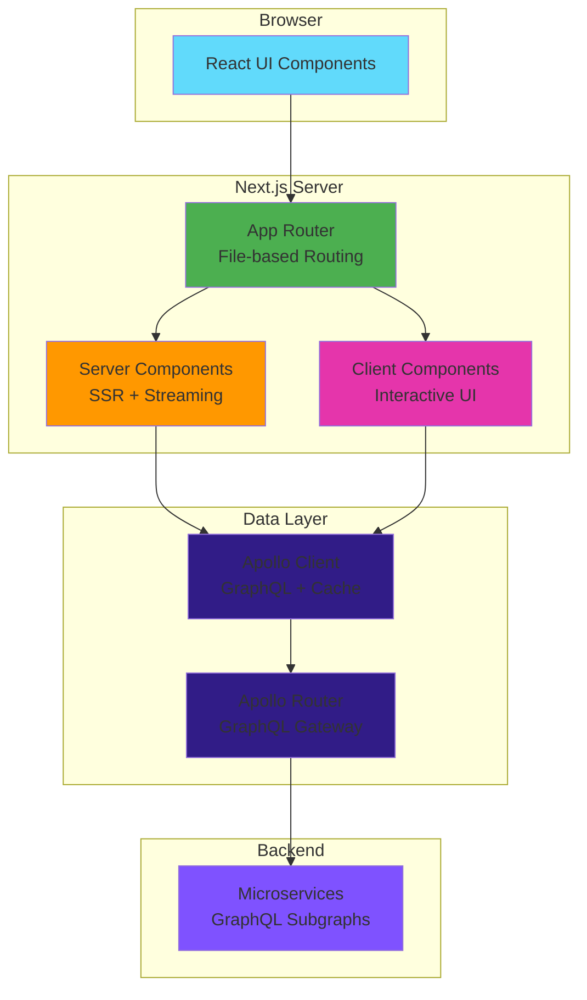
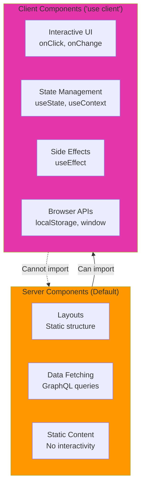
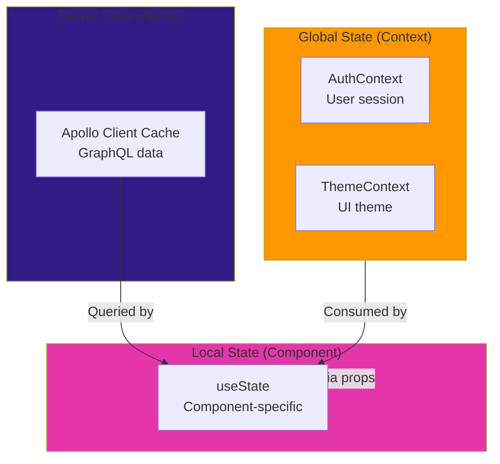

# Frontend Architecture

> **Purpose**: Deep-dive into Next.js 14+ App Router architecture, React patterns, component organization, state management, Apollo Client integration, and performance optimization.

## Overview

NeoTool's frontend is built with **Next.js 14+** using the **App Router**, **React 18+** with Server and Client Components, **TypeScript** for type safety, and **Apollo Client** for GraphQL data fetching.

### Key Characteristics

- **Next.js 14+ App Router**: File-based routing with Server Components
- **React 18+**: Server + Client Components, Suspense, Streaming
- **TypeScript**: Type-safe from GraphQL schema to UI
- **Apollo Client**: GraphQL client with normalized cache
- **Material-UI (MUI)**: Production-ready component library
- **Component-Driven**: Reusable, composable UI components
- **Internationalization**: next-intl for multi-language support

**See**: [ADR-0004: TypeScript/Next.js Frontend](../92-adr/0004-typescript-nextjs-frontend.md) for technology rationale.

---

## Application Architecture

### High-Level Structure



---

## Directory Structure

### Project Layout

```
web/
├── src/
│   ├── app/                        # App Router pages
│   │   ├── (auth)/                 # Route group: Auth pages
│   │   │   ├── login/
│   │   │   │   └── page.tsx       # /login
│   │   │   └── signup/
│   │   │       └── page.tsx       # /signup
│   │   ├── (dashboard)/            # Route group: Dashboard
│   │   │   ├── dashboard/
│   │   │   │   └── page.tsx       # /dashboard
│   │   │   └── users/
│   │   │       ├── page.tsx       # /users (list)
│   │   │       └── [id]/
│   │   │           └── page.tsx   # /users/:id (detail)
│   │   ├── layout.tsx              # Root layout (providers)
│   │   ├── page.tsx                # Home page (/)
│   │   └── loading.tsx             # Loading UI
│   │
│   ├── shared/                     # Shared code
│   │   ├── components/             # React components
│   │   │   ├── ui/                 # UI primitives & patterns
│   │   │   │   ├── primitives/    # Button, Input, etc.
│   │   │   │   ├── forms/         # Form components
│   │   │   │   ├── patterns/      # Card, List, Dialog
│   │   │   │   ├── layout/        # Grid, Container, Stack
│   │   │   │   ├── navigation/    # Menu, Breadcrumbs
│   │   │   │   ├── feedback/      # Toast, Alert, Snackbar
│   │   │   │   └── data-display/  # Table, Charts
│   │   │   ├── auth/               # Auth components
│   │   │   ├── management/         # CRUD tables/forms
│   │   │   └── authorization/      # Permission checks
│   │   ├── hooks/                  # Custom React hooks
│   │   │   ├── useAuth.ts
│   │   │   ├── useToast.ts
│   │   │   └── useLocalStorage.ts
│   │   ├── providers/              # Context providers
│   │   │   ├── ApolloProvider.tsx
│   │   │   ├── AuthProvider.tsx
│   │   │   └── ThemeProvider.tsx
│   │   ├── utils/                  # Utility functions
│   │   │   ├── formatters.ts
│   │   │   └── validators.ts
│   │   └── config/                 # Configuration
│   │       └── apollo.ts
│   │
│   ├── lib/                        # Third-party integrations
│   │   └── apollo-client.ts
│   │
│   └── generated/                  # Auto-generated code
│       └── graphql.ts              # TypeScript types from GraphQL
│
├── public/                         # Static assets
│   ├── images/
│   └── fonts/
├── messages/                       # i18n translations
│   ├── en.json
│   └── pt.json
├── package.json
├── tsconfig.json
└── next.config.js
```

**See**: [File Structure Reference](../93-reference/file-structure.md)

---

## Server vs Client Components

### Component Strategy



### When to Use Each

**Server Components** (default, no 'use client'):
```tsx
// No "use client" directive = Server Component
export default async function UserList() {
  // Fetch data on server
  const users = await fetchUsers();

  return (
    <div>
      {users.map(user => (
        <UserCard key={user.id} user={user} />
      ))}
    </div>
  );
}
```

✅ **Use Server Components for**:
- Data fetching (direct database/API access)
- Rendering static content
- SEO-critical pages
- Layouts and templates
- Large dependencies (reduces client bundle)

**Client Components** ('use client'):
```tsx
'use client';

import { useState } from 'react';

export default function LoginForm() {
  const [email, setEmail] = useState('');

  return (
    <input
      value={email}
      onChange={(e) => setEmail(e.target.value)}
    />
  );
}
```

✅ **Use Client Components for**:
- Interactivity (event handlers)
- State management (useState, useReducer)
- Effects (useEffect, useLayoutEffect)
- Browser APIs (localStorage, window)
- Custom hooks

**See**: [Next.js Server Components](https://nextjs.org/docs/app/building-your-application/rendering/server-components)

---

## Component Organization

### Functional Component Structure

Components organized by **function** (not type):

```
shared/components/
├── ui/                    # UI components (presentation)
│   ├── primitives/        # Basic building blocks
│   │   ├── Button.tsx
│   │   ├── Input.tsx
│   │   └── Select.tsx
│   ├── forms/             # Form-specific components
│   │   ├── TextField.tsx
│   │   └── FormGroup.tsx
│   ├── patterns/          # Common UI patterns
│   │   ├── Card.tsx
│   │   ├── Dialog.tsx
│   │   └── List.tsx
│   ├── layout/            # Layout components
│   │   ├── Grid.tsx
│   │   ├── Container.tsx
│   │   └── Stack.tsx
│   ├── navigation/        # Navigation components
│   │   ├── Menu.tsx
│   │   ├── Breadcrumbs.tsx
│   │   └── Tabs.tsx
│   ├── feedback/          # User feedback
│   │   ├── Toast.tsx
│   │   ├── Alert.tsx
│   │   └── Snackbar.tsx
│   └── data-display/      # Data visualization
│       ├── Table.tsx
│       └── Chart.tsx
│
├── auth/                  # Authentication domain
│   ├── LoginForm.tsx
│   ├── SignupForm.tsx
│   └── PasswordReset.tsx
│
├── management/            # CRUD management
│   ├── UserManagement.tsx
│   ├── UserTable.tsx
│   └── UserForm.tsx
│
└── authorization/         # Authorization domain
    ├── PermissionGate.tsx
    └── RoleCheck.tsx
```

**Benefits**:
- ✅ Clear purpose per directory
- ✅ Easy to find components
- ✅ Scales better than atomic/molecular/organism
- ✅ Reflects how components are actually used

---

## State Management

### State Management Strategy



### Local State (useState)

```tsx
'use client';

export default function Counter() {
  const [count, setCount] = useState(0);

  return (
    <button onClick={() => setCount(count + 1)}>
      Count: {count}
    </button>
  );
}
```

**Use for**: Component-specific UI state (form inputs, toggles, modals)

### Global State (React Context)

```tsx
// shared/providers/AuthProvider.tsx
'use client';

const AuthContext = createContext<AuthContextType | undefined>(undefined);

export function AuthProvider({ children }: { children: ReactNode }) {
  const [user, setUser] = useState<User | null>(null);

  const login = async (email: string, password: string) => {
    const result = await loginMutation({ email, password });
    setUser(result.user);
  };

  return (
    <AuthContext.Provider value={{ user, login }}>
      {children}
    </AuthContext.Provider>
  );
}

// Custom hook
export function useAuth() {
  const context = useContext(AuthContext);
  if (!context) throw new Error('useAuth must be used within AuthProvider');
  return context;
}
```

**Use for**: Cross-cutting concerns (auth, theme, i18n)

### Server State (Apollo Client)

```tsx
'use client';

import { useQuery } from '@apollo/client';
import { GET_USERS } from './queries';

export default function UserList() {
  const { data, loading, error } = useQuery(GET_USERS);

  if (loading) return <Spinner />;
  if (error) return <Error message={error.message} />;

  return (
    <div>
      {data.users.map(user => (
        <UserCard key={user.id} user={user} />
      ))}
    </div>
  );
}
```

**Use for**: GraphQL data (users, posts, etc.)

**See**: [State Management Pattern](../07-frontend/patterns/state-management-pattern.md)

---

## Apollo Client Integration

### Setup

```typescript
// lib/apollo-client.ts
import { ApolloClient, InMemoryCache, createHttpLink } from '@apollo/client';
import { setContext } from '@apollo/client/link/context';

const httpLink = createHttpLink({
  uri: process.env.NEXT_PUBLIC_GRAPHQL_ENDPOINT || 'http://localhost:4000/graphql',
});

const authLink = setContext((_, { headers }) => {
  const token = localStorage.getItem('accessToken');
  return {
    headers: {
      ...headers,
      authorization: token ? `Bearer ${token}` : '',
    },
  };
});

export const apolloClient = new ApolloClient({
  link: authLink.concat(httpLink),
  cache: new InMemoryCache({
    typePolicies: {
      User: {
        keyFields: ['id'],
      },
    },
  }),
});
```

### Provider

```tsx
// shared/providers/ApolloProvider.tsx
'use client';

import { ApolloProvider as BaseApolloProvider } from '@apollo/client';
import { apolloClient } from '@/lib/apollo-client';

export function ApolloProvider({ children }: { children: ReactNode }) {
  return (
    <BaseApolloProvider client={apolloClient}>
      {children}
    </BaseApolloProvider>
  );
}
```

### Usage Patterns

**Query**:
```tsx
const GET_USER = gql`
  query GetUser($id: ID!) {
    user(id: $id) {
      id
      email
      fullName
    }
  }
`;

function UserProfile({ userId }: { userId: string }) {
  const { data, loading } = useQuery(GET_USER, {
    variables: { id: userId },
  });

  return <div>{data?.user.fullName}</div>;
}
```

**Mutation**:
```tsx
const CREATE_USER = gql`
  mutation CreateUser($input: CreateUserInput!) {
    createUser(input: $input) {
      id
      email
    }
  }
`;

function SignupForm() {
  const [createUser, { loading }] = useMutation(CREATE_USER);

  const handleSubmit = async (data: FormData) => {
    await createUser({
      variables: { input: data },
      update: (cache, { data }) => {
        // Update cache
        cache.modify({
          fields: {
            users: (existing) => [...existing, data.createUser],
          },
        });
      },
    });
  };

  return <form onSubmit={handleSubmit}>...</form>;
}
```

**See**: [GraphQL Query Pattern](../07-frontend/patterns/graphql-query-pattern.md)

---

## Type Safety

### GraphQL Code Generation

**Configuration** (codegen.yml):
```yaml
schema: http://localhost:4000/graphql
documents: 'src/**/*.tsx'
generates:
  src/generated/graphql.ts:
    plugins:
      - typescript
      - typescript-operations
      - typescript-react-apollo
    config:
      withHooks: true
      withComponent: false
```

**Generated Types**:
```typescript
// src/generated/graphql.ts (auto-generated)
export type User = {
  __typename?: 'User';
  id: Scalars['ID'];
  email: Scalars['String'];
  fullName?: Maybe<Scalars['String']>;
};

export type GetUserQuery = {
  __typename?: 'Query';
  user?: Maybe<User>;
};

export function useGetUserQuery(
  variables: GetUserQueryVariables,
  options?: QueryHookOptions<GetUserQuery>
) {
  return useQuery<GetUserQuery, GetUserQueryVariables>(GetUserDocument, options);
}
```

**Usage**:
```tsx
import { useGetUserQuery } from '@/generated/graphql';

function UserProfile({ userId }: { userId: string }) {
  const { data } = useGetUserQuery({ variables: { id: userId } });
  //     ^? GetUserQuery (type-safe!)

  return <div>{data?.user?.fullName}</div>;
  //                 ^? string | undefined (type-safe!)
}
```

**See**: [GraphQL Code Generator](https://the-guild.dev/graphql/codegen)

---

## Routing & Navigation

### App Router Structure

```
app/
├── layout.tsx              # Root layout
├── page.tsx                # / (home)
├── loading.tsx             # Loading UI
├── error.tsx               # Error boundary
├── (auth)/                 # Route group (no URL segment)
│   ├── layout.tsx          # Auth layout (centered, no nav)
│   ├── login/
│   │   └── page.tsx        # /login
│   └── signup/
│       └── page.tsx        # /signup
└── (dashboard)/            # Route group
    ├── layout.tsx          # Dashboard layout (sidebar, nav)
    ├── dashboard/
    │   └── page.tsx        # /dashboard
    └── users/
        ├── page.tsx        # /users (list)
        ├── loading.tsx     # Loading for /users
        └── [id]/
            └── page.tsx    # /users/:id (detail)
```

**Route Groups** (`(folder)`):
- Create layouts without affecting URL structure
- Example: `(auth)` and `(dashboard)` share same URL level

**Dynamic Routes** (`[param]`):
- `[id]` → `/users/123`
- `[...slug]` → `/blog/2024/01/post` (catch-all)

### Navigation

```tsx
import { useRouter } from 'next/navigation';
import Link from 'next/link';

export default function Navigation() {
  const router = useRouter();

  return (
    <>
      {/* Declarative (preferred) */}
      <Link href="/users">Users</Link>

      {/* Programmatic */}
      <button onClick={() => router.push('/dashboard')}>
        Go to Dashboard
      </button>
    </>
  );
}
```

---

## Performance Optimization

### Code Splitting

**Automatic** (App Router):
- Each page/route is automatically code-split
- Shared components bundled separately

**Manual** (dynamic imports):
```tsx
import dynamic from 'next/dynamic';

const HeavyComponent = dynamic(() => import('./HeavyComponent'), {
  loading: () => <Spinner />,
  ssr: false,  // Disable SSR for this component
});
```

### Image Optimization

```tsx
import Image from 'next/image';

export default function UserAvatar({ src }: { src: string }) {
  return (
    <Image
      src={src}
      alt="User avatar"
      width={100}
      height={100}
      priority  // Preload for above-the-fold images
    />
  );
}
```

**Benefits**:
- Automatic lazy loading
- Responsive images (srcset)
- Modern formats (WebP, AVIF)
- Placeholder blur

### Streaming & Suspense

```tsx
import { Suspense } from 'react';

export default function Page() {
  return (
    <>
      <Header />
      <Suspense fallback={<Spinner />}>
        <UserList />  {/* Async Server Component */}
      </Suspense>
      <Footer />
    </>
  );
}
```

**Benefits**:
- Progressive rendering
- Faster Time to First Byte (TTFB)
- Better perceived performance

---

## Internationalization (i18n)

### Setup (next-intl)

```typescript
// middleware.ts
import createMiddleware from 'next-intl/middleware';

export default createMiddleware({
  locales: ['en', 'pt'],
  defaultLocale: 'en',
});
```

### Usage

```tsx
import { useTranslations } from 'next-intl';

export default function WelcomeMessage() {
  const t = useTranslations('Home');

  return (
    <h1>{t('title')}</h1>  {/* "Welcome" or "Bem-vindo" */}
  );
}
```

**Translation Files**:
```json
// messages/en.json
{
  "Home": {
    "title": "Welcome"
  }
}

// messages/pt.json
{
  "Home": {
    "title": "Bem-vindo"
  }
}
```

---

## Related Documentation

### Architecture
- [Architecture Hub](./README.md)
- [System Architecture](./system-architecture.md)
- [API Architecture](./api-architecture.md)

### Patterns
- [Frontend Patterns](../07-frontend/patterns/)
- [GraphQL Query Pattern](../07-frontend/patterns/graphql-query-pattern.md)
- [Component Pattern](../07-frontend/patterns/component-pattern.md)

### Decisions
- [ADR-0004: TypeScript/Next.js Frontend](../92-adr/0004-typescript-nextjs-frontend.md)

---

**Version**: 1.0.0 (2026-01-02)
**Stack**: Next.js 14+ + React 18+ + TypeScript + Apollo Client
**Philosophy**: Server-first. Type-safe. Component-driven. Performance-optimized.

*Build UIs that are fast, accessible, and delightful.*
