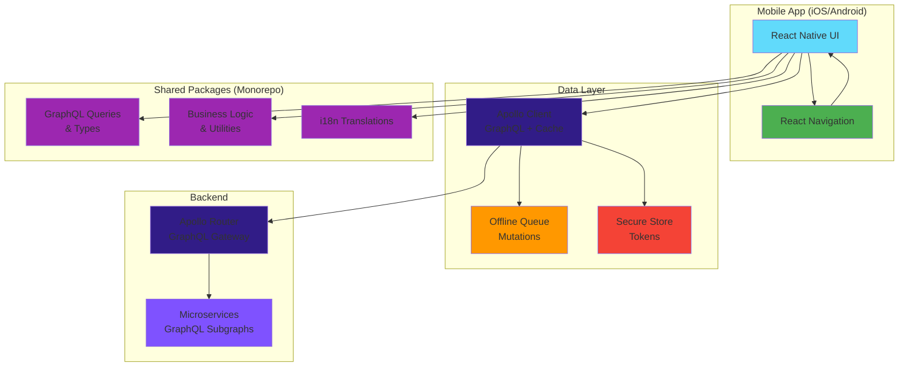
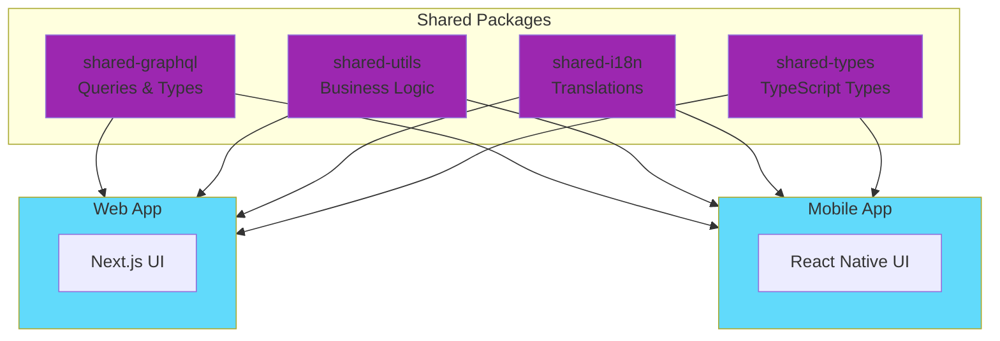
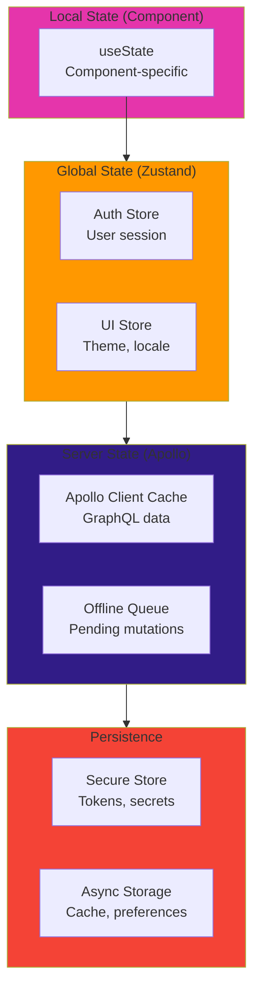

# Mobile Architecture

> **Purpose**: Deep-dive into React Native + Expo architecture, component organization, navigation, state management, Apollo Client integration, offline support, and mobile-specific patterns.

## Overview

NeoTool's mobile application is built with **React Native + Expo**, **TypeScript** for type safety, **Apollo Client** for GraphQL data fetching, and **React Navigation** for navigation. The architecture maximizes code sharing with the web application while leveraging native mobile capabilities.

### Key Characteristics

- **React Native + Expo**: Cross-platform development for iOS and Android
- **TypeScript**: Type-safe from GraphQL schema to UI
- **Apollo Client**: GraphQL client with normalized cache and offline support
- **React Navigation**: Native navigation with type-safe routing
- **Expo Router**: File-based routing (optional, alternative to React Navigation)
- **React Native Paper**: Material Design component library
- **Internationalization**: i18next for multi-language support (shared with web)
- **Code Sharing**: Shared packages with web for business logic, GraphQL, and utilities

**See**: [ADR-0010: React Native + Expo Mobile](../92-adr/0010-react-native-expo-mobile.md) for technology rationale.

---

## Application Architecture

### High-Level Structure



---

## Directory Structure

### Project Layout

```
mobile/
├── app/                          # Expo Router (file-based routing)
│   ├── (auth)/                   # Route group: Auth screens
│   │   ├── login.tsx             # /login
│   │   ├── signup.tsx            # /signup
│   │   └── forgot-password.tsx   # /forgot-password
│   ├── (tabs)/                   # Route group: Tab navigation
│   │   ├── _layout.tsx           # Tab layout
│   │   ├── index.tsx             # /tabs (Dashboard)
│   │   ├── profile.tsx           # /tabs/profile
│   │   └── settings.tsx          # /tabs/settings
│   ├── _layout.tsx               # Root layout (providers)
│   ├── +not-found.tsx            # 404 screen
│   └── index.tsx                 # Entry screen (/)
│
├── src/
│   ├── components/               # React Native components
│   │   ├── ui/                   # UI primitives & patterns
│   │   │   ├── primitives/       # Button, Input, Card
│   │   │   ├── forms/            # Form components
│   │   │   ├── layout/           # Layout components
│   │   │   ├── navigation/       # Navigation components
│   │   │   ├── feedback/         # Toast, Alert, Loading
│   │   │   └── data-display/     # List, Table, Charts
│   │   ├── auth/                 # Auth components
│   │   ├── management/           # CRUD components
│   │   └── shared/               # Shared with web (if possible)
│   │
│   ├── navigation/               # Navigation configuration
│   │   ├── AppNavigator.tsx      # Root navigator
│   │   ├── AuthNavigator.tsx     # Auth stack
│   │   ├── TabNavigator.tsx      # Tab navigator
│   │   └── linking.ts            # Deep linking config
│   │
│   ├── hooks/                    # Custom React hooks
│   │   ├── useAuth.ts            # Auth hook (shared with web)
│   │   ├── useNetworkStatus.ts   # Network detection
│   │   ├── useSecureStorage.ts   # Secure storage hook
│   │   └── useNotifications.ts   # Push notifications
│   │
│   ├── providers/                # Context providers
│   │   ├── ApolloProvider.tsx    # Apollo Client provider
│   │   ├── AuthProvider.tsx      # Auth context (shared)
│   │   ├── ThemeProvider.tsx     # Theme context
│   │   └── NotificationProvider.tsx # Notifications
│   │
│   ├── utils/                    # Utility functions
│   │   ├── formatters.ts         # (shared with web)
│   │   ├── validators.ts         # (shared with web)
│   │   └── platform.ts           # Platform-specific utils
│   │
│   ├── config/                   # Configuration
│   │   ├── apollo.ts             # Apollo Client config
│   │   ├── env.ts                # Environment variables
│   │   └── constants.ts          # App constants
│   │
│   ├── lib/                      # Third-party integrations
│   │   ├── apollo-client.ts      # Apollo Client instance
│   │   └── analytics.ts          # Analytics integration
│   │
│   ├── generated/                # Auto-generated code
│   │   └── graphql.ts            # TypeScript types from GraphQL
│   │
│   └── theme/                    # Theme configuration
│       ├── colors.ts             # Color palette (shared with web)
│       ├── typography.ts         # Typography (shared with web)
│       └── spacing.ts            # Spacing scale (shared with web)
│
├── assets/                       # Static assets
│   ├── images/
│   ├── fonts/
│   └── icons/
│
├── locales/                      # i18n translations (shared with web)
│   ├── en.json
│   └── pt.json
│
├── app.json                      # Expo configuration
├── eas.json                      # EAS Build configuration
├── babel.config.js               # Babel configuration
├── metro.config.js               # Metro bundler configuration
├── tsconfig.json                 # TypeScript configuration
└── package.json
```

**Note**: This structure uses **Expo Router** for file-based routing. Alternatively, you can use **React Navigation** with stack-based routing.

---

## Code Sharing Strategy

### Shared Packages (Monorepo)



### Shared Code Examples

**Shared GraphQL Queries**:
```typescript
// packages/shared-graphql/src/queries/user.ts
import { gql } from '@apollo/client';

export const GET_USER = gql`
  query GetUser($id: ID!) {
    user(id: $id) {
      id
      email
      fullName
      avatar
    }
  }
`;

// Used in both web and mobile
```

**Shared Business Logic**:
```typescript
// packages/shared-utils/src/validation/email.ts
export function isValidEmail(email: string): boolean {
  const regex = /^[^\s@]+@[^\s@]+\.[^\s@]+$/;
  return regex.test(email);
}

// packages/shared-utils/src/formatters/currency.ts
export function formatCurrency(amount: number, locale: string = 'en-US'): string {
  return new Intl.NumberFormat(locale, {
    style: 'currency',
    currency: 'USD',
  }).format(amount);
}
```

**Shared i18n**:
```typescript
// packages/shared-i18n/src/locales/en.json
{
  "auth": {
    "login": "Login",
    "signup": "Sign Up",
    "forgotPassword": "Forgot Password?"
  },
  "common": {
    "save": "Save",
    "cancel": "Cancel",
    "delete": "Delete"
  }
}

// Used in both web (next-intl) and mobile (i18next)
```

### Platform-Specific Code

When code cannot be shared due to platform differences:

```typescript
// utils/platform.ts
import { Platform } from 'react-native';

export const isIOS = Platform.OS === 'ios';
export const isAndroid = Platform.OS === 'android';

export function getHeaderHeight(): number {
  if (isIOS) return 44;
  if (isAndroid) return 56;
  return 60; // web
}
```

---

## Navigation

### Expo Router (File-Based Routing)

Expo Router provides Next.js-style file-based routing for React Native:

```
app/
├── _layout.tsx           # Root layout (providers)
├── index.tsx             # / (Entry screen)
├── (auth)/               # Route group (no URL segment)
│   ├── _layout.tsx       # Auth layout
│   ├── login.tsx         # /login
│   └── signup.tsx        # /signup
└── (tabs)/               # Route group (tab navigation)
    ├── _layout.tsx       # Tab layout
    ├── index.tsx         # /tabs (Dashboard)
    ├── profile.tsx       # /tabs/profile
    └── settings.tsx      # /tabs/settings
```

**Root Layout** (`app/_layout.tsx`):
```tsx
import { Stack } from 'expo-router';
import { ApolloProvider } from '@/providers/ApolloProvider';
import { AuthProvider } from '@/providers/AuthProvider';
import { ThemeProvider } from '@/providers/ThemeProvider';

export default function RootLayout() {
  return (
    <ThemeProvider>
      <ApolloProvider>
        <AuthProvider>
          <Stack screenOptions={{ headerShown: false }}>
            <Stack.Screen name="(auth)" />
            <Stack.Screen name="(tabs)" />
          </Stack>
        </AuthProvider>
      </ApolloProvider>
    </ThemeProvider>
  );
}
```

**Tab Navigator** (`app/(tabs)/_layout.tsx`):
```tsx
import { Tabs } from 'expo-router';
import { Icon } from 'react-native-paper';

export default function TabLayout() {
  return (
    <Tabs>
      <Tabs.Screen
        name="index"
        options={{
          title: 'Dashboard',
          tabBarIcon: ({ color }) => <Icon source="home" color={color} />,
        }}
      />
      <Tabs.Screen
        name="profile"
        options={{
          title: 'Profile',
          tabBarIcon: ({ color }) => <Icon source="account" color={color} />,
        }}
      />
      <Tabs.Screen
        name="settings"
        options={{
          title: 'Settings',
          tabBarIcon: ({ color }) => <Icon source="cog" color={color} />,
        }}
      />
    </Tabs>
  );
}
```

**Navigation**:
```tsx
import { router } from 'expo-router';

// Programmatic navigation
router.push('/login');
router.replace('/tabs');
router.back();

// With parameters
router.push({
  pathname: '/user/[id]',
  params: { id: '123' },
});
```

**Deep Linking**:
```typescript
// app.json
{
  "expo": {
    "scheme": "neotool",
    "web": {
      "bundler": "metro"
    }
  }
}

// Links like neotool://login will open the app
```

### React Navigation (Alternative)

If not using Expo Router, use React Navigation:

```tsx
import { NavigationContainer } from '@react-navigation/native';
import { createNativeStackNavigator } from '@react-navigation/native-stack';
import { createBottomTabNavigator } from '@react-navigation/bottom-tabs';

const Stack = createNativeStackNavigator();
const Tab = createBottomTabNavigator();

function AuthStack() {
  return (
    <Stack.Navigator screenOptions={{ headerShown: false }}>
      <Stack.Screen name="Login" component={LoginScreen} />
      <Stack.Screen name="Signup" component={SignupScreen} />
    </Stack.Navigator>
  );
}

function TabNavigator() {
  return (
    <Tab.Navigator>
      <Tab.Screen name="Dashboard" component={DashboardScreen} />
      <Tab.Screen name="Profile" component={ProfileScreen} />
      <Tab.Screen name="Settings" component={SettingsScreen} />
    </Tab.Navigator>
  );
}

export default function Navigation() {
  const { user } = useAuth();

  return (
    <NavigationContainer>
      {user ? <TabNavigator /> : <AuthStack />}
    </NavigationContainer>
  );
}
```

---

## State Management

### State Management Strategy

Same as web, but with mobile-specific considerations:



### Zustand Store (Global State)

```typescript
// src/store/authStore.ts
import { create } from 'zustand';
import { persist, createJSONStorage } from 'zustand/middleware';
import AsyncStorage from '@react-native-async-storage/async-storage';
import * as SecureStore from 'expo-secure-store';

interface AuthState {
  user: User | null;
  accessToken: string | null;
  refreshToken: string | null;
  setUser: (user: User | null) => void;
  setTokens: (accessToken: string, refreshToken: string) => Promise<void>;
  logout: () => Promise<void>;
}

export const useAuthStore = create<AuthState>()(
  persist(
    (set) => ({
      user: null,
      accessToken: null,
      refreshToken: null,
      setUser: (user) => set({ user }),
      setTokens: async (accessToken, refreshToken) => {
        // Store sensitive tokens in SecureStore
        await SecureStore.setItemAsync('accessToken', accessToken);
        await SecureStore.setItemAsync('refreshToken', refreshToken);
        set({ accessToken, refreshToken });
      },
      logout: async () => {
        await SecureStore.deleteItemAsync('accessToken');
        await SecureStore.deleteItemAsync('refreshToken');
        set({ user: null, accessToken: null, refreshToken: null });
      },
    }),
    {
      name: 'auth-storage',
      storage: createJSONStorage(() => AsyncStorage),
      // Only persist non-sensitive data
      partialize: (state) => ({ user: state.user }),
    }
  )
);
```

### Apollo Client (Server State)

```typescript
// src/lib/apollo-client.ts
import { ApolloClient, InMemoryCache, createHttpLink } from '@apollo/client';
import { setContext } from '@apollo/client/link/context';
import { onError } from '@apollo/client/link/error';
import { RetryLink } from '@apollo/client/link/retry';
import { persistCache, AsyncStorageWrapper } from 'apollo3-cache-persist';
import AsyncStorage from '@react-native-async-storage/async-storage';
import * as SecureStore from 'expo-secure-store';
import NetInfo from '@react-native-community/netinfo';

const httpLink = createHttpLink({
  uri: process.env.EXPO_PUBLIC_GRAPHQL_ENDPOINT || 'http://localhost:4000/graphql',
});

const authLink = setContext(async (_, { headers }) => {
  const token = await SecureStore.getItemAsync('accessToken');
  return {
    headers: {
      ...headers,
      authorization: token ? `Bearer ${token}` : '',
    },
  };
});

const errorLink = onError(({ graphQLErrors, networkError }) => {
  if (graphQLErrors) {
    graphQLErrors.forEach(({ message, locations, path }) => {
      console.error(`[GraphQL error]: Message: ${message}, Path: ${path}`);
    });
  }
  if (networkError) {
    console.error(`[Network error]: ${networkError}`);
  }
});

const retryLink = new RetryLink({
  delay: {
    initial: 300,
    max: Infinity,
    jitter: true,
  },
  attempts: {
    max: 5,
    retryIf: (error, _operation) => !!error && !error.message.includes('401'),
  },
});

const cache = new InMemoryCache({
  typePolicies: {
    User: {
      keyFields: ['id'],
    },
  },
});

// Persist cache to AsyncStorage
await persistCache({
  cache,
  storage: new AsyncStorageWrapper(AsyncStorage),
  maxSize: 1048576 * 10, // 10 MB
});

export const apolloClient = new ApolloClient({
  link: retryLink.concat(errorLink).concat(authLink).concat(httpLink),
  cache,
  defaultOptions: {
    watchQuery: {
      fetchPolicy: 'cache-and-network',
      errorPolicy: 'all',
    },
  },
});

// Network status listener
NetInfo.addEventListener((state) => {
  if (state.isConnected) {
    // Refetch queries when network is back
    apolloClient.refetchQueries({ include: 'active' });
  }
});
```

---

## Offline Support

### Offline Queue

```typescript
// src/lib/offline-queue.ts
import { ApolloClient } from '@apollo/client';
import AsyncStorage from '@react-native-async-storage/async-storage';
import NetInfo from '@react-native-community/netinfo';

interface QueuedMutation {
  id: string;
  mutation: string;
  variables: any;
  timestamp: number;
}

const QUEUE_KEY = '@offline_queue';

export class OfflineQueue {
  private queue: QueuedMutation[] = [];
  private client: ApolloClient<any>;
  private isProcessing = false;

  constructor(client: ApolloClient<any>) {
    this.client = client;
    this.loadQueue();
    this.setupNetworkListener();
  }

  private async loadQueue() {
    const stored = await AsyncStorage.getItem(QUEUE_KEY);
    if (stored) {
      this.queue = JSON.parse(stored);
    }
  }

  private async saveQueue() {
    await AsyncStorage.setItem(QUEUE_KEY, JSON.stringify(this.queue));
  }

  async enqueue(mutation: string, variables: any) {
    const item: QueuedMutation = {
      id: Date.now().toString(),
      mutation,
      variables,
      timestamp: Date.now(),
    };
    this.queue.push(item);
    await this.saveQueue();
  }

  private async processQueue() {
    if (this.isProcessing || this.queue.length === 0) return;

    this.isProcessing = true;

    while (this.queue.length > 0) {
      const item = this.queue[0];
      try {
        await this.client.mutate({
          mutation: item.mutation,
          variables: item.variables,
        });
        this.queue.shift(); // Remove processed item
        await this.saveQueue();
      } catch (error) {
        console.error('Failed to process queued mutation:', error);
        break; // Stop processing on error
      }
    }

    this.isProcessing = false;
  }

  private setupNetworkListener() {
    NetInfo.addEventListener((state) => {
      if (state.isConnected) {
        this.processQueue();
      }
    });
  }
}
```

### Offline-Aware Components

```tsx
// src/hooks/useNetworkStatus.ts
import { useState, useEffect } from 'react';
import NetInfo from '@react-native-community/netinfo';

export function useNetworkStatus() {
  const [isOnline, setIsOnline] = useState(true);
  const [isInternetReachable, setIsInternetReachable] = useState(true);

  useEffect(() => {
    const unsubscribe = NetInfo.addEventListener((state) => {
      setIsOnline(state.isConnected ?? false);
      setIsInternetReachable(state.isInternetReachable ?? false);
    });

    return () => unsubscribe();
  }, []);

  return { isOnline, isInternetReachable };
}

// Usage in component
function UserProfile() {
  const { isOnline } = useNetworkStatus();
  const { data, loading } = useQuery(GET_USER);

  if (!isOnline) {
    return <OfflineBanner />;
  }

  // ...
}
```

---

## Internationalization (i18n)

### i18next Configuration

```typescript
// src/i18n/config.ts
import i18n from 'i18next';
import { initReactI18next } from 'react-i18next';
import * as Localization from 'expo-localization';
import AsyncStorage from '@react-native-async-storage/async-storage';

// Import translations (can be shared with web)
import en from '@/locales/en.json';
import pt from '@/locales/pt.json';

const LANGUAGE_KEY = '@app_language';

i18n
  .use(initReactI18next)
  .init({
    resources: {
      en: { translation: en },
      pt: { translation: pt },
    },
    lng: Localization.locale.split('-')[0], // Device language
    fallbackLng: 'en',
    interpolation: {
      escapeValue: false,
    },
  });

// Load saved language preference
AsyncStorage.getItem(LANGUAGE_KEY).then((lang) => {
  if (lang) {
    i18n.changeLanguage(lang);
  }
});

// Save language preference when changed
i18n.on('languageChanged', (lng) => {
  AsyncStorage.setItem(LANGUAGE_KEY, lng);
});

export default i18n;
```

### Usage

```tsx
import { useTranslation } from 'react-i18next';

function LoginScreen() {
  const { t, i18n } = useTranslation();

  return (
    <View>
      <Text>{t('auth.login')}</Text>
      <Button onPress={() => i18n.changeLanguage('pt')}>
        {t('common.changeLanguage')}
      </Button>
    </View>
  );
}
```

---

## UI Components & Design System

### React Native Paper (Material Design)

```typescript
// src/theme/theme.ts
import { MD3LightTheme, MD3DarkTheme } from 'react-native-paper';

export const lightTheme = {
  ...MD3LightTheme,
  colors: {
    ...MD3LightTheme.colors,
    primary: '#1976d2',
    secondary: '#dc004e',
    background: '#ffffff',
    surface: '#f5f5f5',
    error: '#f44336',
  },
};

export const darkTheme = {
  ...MD3DarkTheme,
  colors: {
    ...MD3DarkTheme.colors,
    primary: '#90caf9',
    secondary: '#f48fb1',
    background: '#121212',
    surface: '#1e1e1e',
    error: '#cf6679',
  },
};
```

**Provider**:
```tsx
import { PaperProvider } from 'react-native-paper';
import { lightTheme, darkTheme } from '@/theme/theme';
import { useColorScheme } from 'react-native';

export function ThemeProvider({ children }: { children: ReactNode }) {
  const colorScheme = useColorScheme();
  const theme = colorScheme === 'dark' ? darkTheme : lightTheme;

  return <PaperProvider theme={theme}>{children}</PaperProvider>;
}
```

**Usage**:
```tsx
import { Button, Card, Text } from 'react-native-paper';

function UserCard({ user }: { user: User }) {
  return (
    <Card>
      <Card.Content>
        <Text variant="titleLarge">{user.fullName}</Text>
        <Text variant="bodyMedium">{user.email}</Text>
      </Card.Content>
      <Card.Actions>
        <Button mode="contained">Edit</Button>
      </Card.Actions>
    </Card>
  );
}
```

### Custom Components

```tsx
// src/components/ui/primitives/Button.tsx
import { Button as PaperButton, ButtonProps } from 'react-native-paper';

export function Button(props: ButtonProps) {
  return (
    <PaperButton
      mode="contained"
      uppercase={false}
      contentStyle={{ paddingVertical: 8 }}
      {...props}
    />
  );
}
```

---

## Forms & Validation

### React Hook Form + Zod (same as web)

```tsx
import { useForm, Controller } from 'react-hook-form';
import { zodResolver } from '@hookform/resolvers/zod';
import { z } from 'zod';
import { TextInput, Button } from 'react-native-paper';
import { View } from 'react-native';

const loginSchema = z.object({
  email: z.string().email('Invalid email'),
  password: z.string().min(8, 'Password must be at least 8 characters'),
});

type LoginFormData = z.infer<typeof loginSchema>;

function LoginForm() {
  const { control, handleSubmit, formState: { errors } } = useForm<LoginFormData>({
    resolver: zodResolver(loginSchema),
  });

  const onSubmit = async (data: LoginFormData) => {
    // Handle login
  };

  return (
    <View>
      <Controller
        control={control}
        name="email"
        render={({ field: { onChange, value } }) => (
          <TextInput
            label="Email"
            value={value}
            onChangeText={onChange}
            error={!!errors.email}
            autoCapitalize="none"
            keyboardType="email-address"
          />
        )}
      />
      {errors.email && <Text>{errors.email.message}</Text>}

      <Controller
        control={control}
        name="password"
        render={({ field: { onChange, value } }) => (
          <TextInput
            label="Password"
            value={value}
            onChangeText={onChange}
            error={!!errors.password}
            secureTextEntry
          />
        )}
      />
      {errors.password && <Text>{errors.password.message}</Text>}

      <Button mode="contained" onPress={handleSubmit(onSubmit)}>
        Login
      </Button>
    </View>
  );
}
```

---

## Performance Optimization

### List Virtualization

```tsx
import { FlatList } from 'react-native';

function UserList({ users }: { users: User[] }) {
  return (
    <FlatList
      data={users}
      keyExtractor={(item) => item.id}
      renderItem={({ item }) => <UserCard user={item} />}
      // Performance optimizations
      removeClippedSubviews={true}
      maxToRenderPerBatch={10}
      updateCellsBatchingPeriod={50}
      initialNumToRender={10}
      windowSize={5}
      // Pull to refresh
      refreshing={loading}
      onRefresh={refetch}
    />
  );
}
```

### Image Optimization

```tsx
import { Image } from 'expo-image';

function UserAvatar({ uri }: { uri: string }) {
  return (
    <Image
      source={{ uri }}
      style={{ width: 100, height: 100, borderRadius: 50 }}
      contentFit="cover"
      transition={200}
      cachePolicy="memory-disk"
      placeholder={{ blurhash: 'L6PZfSi_.AyE_3t7t7R**0o#DgR4' }}
    />
  );
}
```

### Code Splitting

```tsx
import { lazy, Suspense } from 'react';
import { ActivityIndicator } from 'react-native-paper';

const HeavyComponent = lazy(() => import('./HeavyComponent'));

function App() {
  return (
    <Suspense fallback={<ActivityIndicator />}>
      <HeavyComponent />
    </Suspense>
  );
}
```

### Memoization

```tsx
import { memo, useMemo, useCallback } from 'react';

const UserCard = memo(({ user }: { user: User }) => {
  return <Card>...</Card>;
});

function UserList({ users }: { users: User[] }) {
  const sortedUsers = useMemo(
    () => users.sort((a, b) => a.name.localeCompare(b.name)),
    [users]
  );

  const handlePress = useCallback((userId: string) => {
    router.push(`/user/${userId}`);
  }, []);

  return (
    <FlatList
      data={sortedUsers}
      renderItem={({ item }) => <UserCard user={item} />}
    />
  );
}
```

---

## Native Features

### Secure Storage

```typescript
// src/hooks/useSecureStorage.ts
import * as SecureStore from 'expo-secure-store';

export function useSecureStorage() {
  const setItem = async (key: string, value: string) => {
    await SecureStore.setItemAsync(key, value);
  };

  const getItem = async (key: string): Promise<string | null> => {
    return await SecureStore.getItemAsync(key);
  };

  const removeItem = async (key: string) => {
    await SecureStore.deleteItemAsync(key);
  };

  return { setItem, getItem, removeItem };
}
```

### Push Notifications

```typescript
// src/lib/notifications.ts
import * as Notifications from 'expo-notifications';
import * as Device from 'expo-device';
import { Platform } from 'react-native';

export async function registerForPushNotifications() {
  if (!Device.isDevice) {
    alert('Push notifications only work on physical devices');
    return;
  }

  const { status: existingStatus } = await Notifications.getPermissionsAsync();
  let finalStatus = existingStatus;

  if (existingStatus !== 'granted') {
    const { status } = await Notifications.requestPermissionsAsync();
    finalStatus = status;
  }

  if (finalStatus !== 'granted') {
    alert('Failed to get push notification permissions');
    return;
  }

  const token = await Notifications.getExpoPushTokenAsync({
    projectId: process.env.EXPO_PUBLIC_PROJECT_ID,
  });

  if (Platform.OS === 'android') {
    Notifications.setNotificationChannelAsync('default', {
      name: 'default',
      importance: Notifications.AndroidImportance.MAX,
      vibrationPattern: [0, 250, 250, 250],
      lightColor: '#FF231F7C',
    });
  }

  return token.data;
}
```

### Camera & Media

```tsx
import * as ImagePicker from 'expo-image-picker';

function UploadAvatar() {
  const pickImage = async () => {
    const result = await ImagePicker.launchImageLibraryAsync({
      mediaTypes: ImagePicker.MediaTypeOptions.Images,
      allowsEditing: true,
      aspect: [1, 1],
      quality: 0.8,
    });

    if (!result.canceled) {
      // Upload result.assets[0].uri
    }
  };

  return <Button onPress={pickImage}>Upload Avatar</Button>;
}
```

### Biometric Authentication

```typescript
import * as LocalAuthentication from 'expo-local-authentication';

export async function authenticateWithBiometrics(): Promise<boolean> {
  const hasHardware = await LocalAuthentication.hasHardwareAsync();
  if (!hasHardware) {
    return false;
  }

  const isEnrolled = await LocalAuthentication.isEnrolledAsync();
  if (!isEnrolled) {
    return false;
  }

  const result = await LocalAuthentication.authenticateAsync({
    promptMessage: 'Authenticate to access your account',
    fallbackLabel: 'Use passcode',
  });

  return result.success;
}
```

---

## Testing

### Unit Testing

```tsx
// src/components/Button.test.tsx
import { render, fireEvent } from '@testing-library/react-native';
import { Button } from './Button';

describe('Button', () => {
  it('renders correctly', () => {
    const { getByText } = render(<Button>Click me</Button>);
    expect(getByText('Click me')).toBeTruthy();
  });

  it('calls onPress when pressed', () => {
    const onPress = jest.fn();
    const { getByText } = render(<Button onPress={onPress}>Click me</Button>);
    fireEvent.press(getByText('Click me'));
    expect(onPress).toHaveBeenCalled();
  });
});
```

### Integration Testing

```tsx
// src/screens/LoginScreen.test.tsx
import { render, fireEvent, waitFor } from '@testing-library/react-native';
import { MockedProvider } from '@apollo/client/testing';
import { LOGIN_MUTATION } from './queries';
import LoginScreen from './LoginScreen';

const mocks = [
  {
    request: {
      query: LOGIN_MUTATION,
      variables: { email: 'test@example.com', password: 'password123' },
    },
    result: {
      data: {
        login: {
          accessToken: 'token',
          user: { id: '1', email: 'test@example.com' },
        },
      },
    },
  },
];

describe('LoginScreen', () => {
  it('logs in successfully', async () => {
    const { getByPlaceholderText, getByText } = render(
      <MockedProvider mocks={mocks}>
        <LoginScreen />
      </MockedProvider>
    );

    fireEvent.changeText(getByPlaceholderText('Email'), 'test@example.com');
    fireEvent.changeText(getByPlaceholderText('Password'), 'password123');
    fireEvent.press(getByText('Login'));

    await waitFor(() => {
      // Check if navigation happened or success message displayed
    });
  });
});
```

---

## Build & Deployment

### EAS Build

```bash
# Development build
eas build --profile development --platform ios

# Preview build
eas build --profile preview --platform android

# Production build
eas build --profile production --platform all
```

### EAS Submit

```bash
# Submit to App Store
eas submit --platform ios

# Submit to Play Store
eas submit --platform android
```

### Over-The-Air (OTA) Updates

```bash
# Publish update
eas update --branch production --message "Bug fixes"
```

---

## Related Documentation

### Architecture
- [Architecture Hub](./README.md)
- [System Architecture](./system-architecture.md)
- [Frontend Architecture (Web)](./frontend-architecture.md)
- [API Architecture](./api-architecture.md)

### Decisions
- [ADR-0010: React Native + Expo Mobile](../92-adr/0010-react-native-expo-mobile.md)
- [ADR-0004: TypeScript/Next.js Frontend](../92-adr/0004-typescript-nextjs-frontend.md)

---

**Version**: 1.0.0 (2026-02-05)
**Stack**: React Native + Expo + TypeScript + Apollo Client
**Philosophy**: Mobile-first. Type-safe. Cross-platform. Offline-ready.

*Build mobile experiences that are fast, native, and delightful.*
