# Service Architecture

> **Purpose**: Deep-dive into microservice boundaries, communication patterns, inter-service security, and service lifecycle management in NeoTool.

## Overview

NeoTool follows a **microservices architecture** where independent services own specific business domains, communicate via GraphQL Federation, and scale independently. Each service is built with **Kotlin + Micronaut**, follows **clean architecture** principles, and maintains its own database.

### Key Characteristics

- **Domain-Driven Boundaries**: Services aligned with bounded contexts
- **Independent Deployment**: Services can be deployed without coordination
- **GraphQL Federation**: Unified API through schema composition
- **Database per Service**: Each service owns its data
- **Horizontal Scalability**: Stateless services scale independently
- **Observability Built-In**: Metrics, logs, traces for each service

**See**: [System Architecture](./system-architecture.md) for high-level overview.

---

## Service Catalog

### Current Services

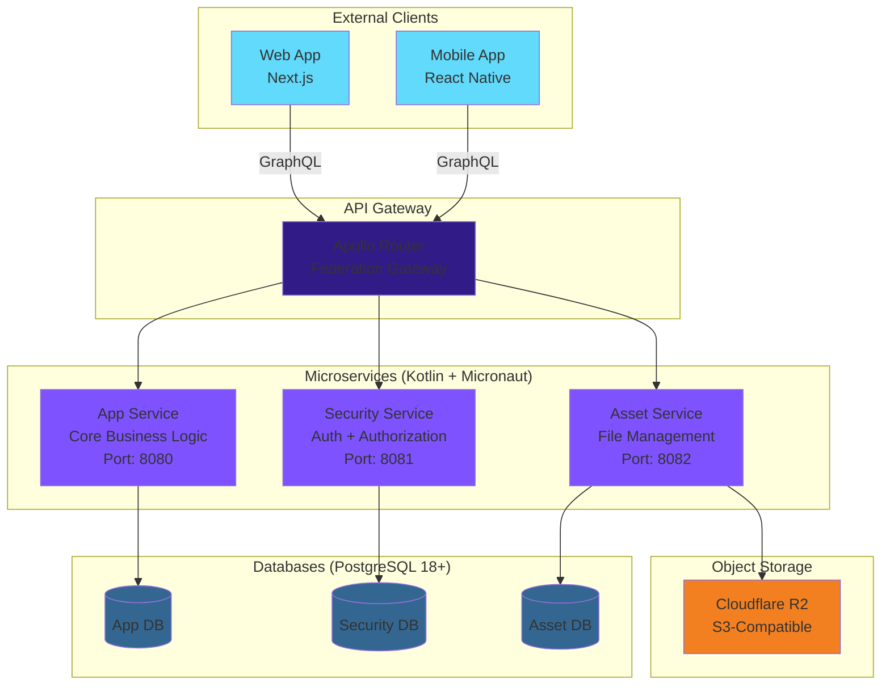

### Service Responsibilities

| Service | Bounded Context | Responsibilities | Port | Database |
|---------|----------------|------------------|------|----------|
| **App Service** | Core business logic | User management, application features, business workflows | 8080 | app_db |
| **Security Service** | Authentication & Authorization | Login, signup, JWT management, RBAC, refresh tokens | 8081 | security_db |
| **Asset Service** | File & media management | Upload, download, bucket management, visibility control | 8082 | asset_db |
| **LLM Orchestrator Service** | AI & LLM orchestration | Prompt management, model routing, tool calling, caching, cost tracking | 8090 | llm_orchestrator_db |

**Future Services** (planned):
- **Notification Service**: Email, SMS, push notifications
- **Analytics Service**: Event tracking, reporting, business intelligence
- **Billing Service**: Subscriptions, payments, invoicing

---

## Service Decomposition Strategy

### Domain-Driven Boundaries

Services are decomposed by **bounded contexts** from Domain-Driven Design:

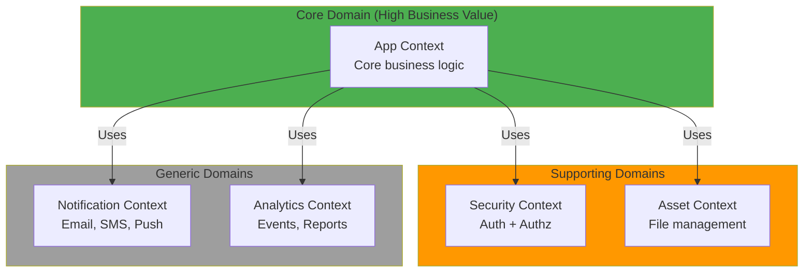

**Decomposition Principles**:
1. **High Cohesion**: Related business capabilities in one service
2. **Low Coupling**: Minimal dependencies between services
3. **Single Responsibility**: Each service owns one bounded context
4. **Independent Evolution**: Services can change without coordination
5. **Team Ownership**: One team owns one or more services

**See**: [Domain Model](../04-domain/domain-model.md) for domain concepts.

### When to Create a New Service

✅ **Create a new service when**:
- **Clear bounded context**: Distinct business domain
- **Independent scalability**: Different scaling requirements
- **Team boundaries**: Separate team ownership
- **Technology needs**: Requires different tech stack
- **Security isolation**: Sensitive data requires separation

❌ **Don't create a new service for**:
- **Small features**: Add to existing service
- **Shared utilities**: Use shared library
- **CRUD operations**: Not a bounded context
- **Premature optimization**: Start monolithic, split later

---

## Service Communication Patterns

### GraphQL Federation (Primary)

**Pattern**: Client → Apollo Router → Service Subgraph

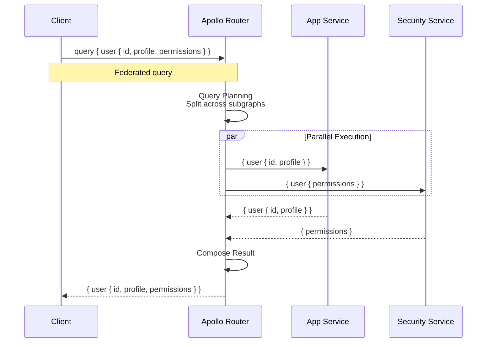

**Benefits**:
- ✅ **Unified API**: Single GraphQL endpoint for clients
- ✅ **Type Composition**: Extend types across services
- ✅ **Client-Driven**: Clients request exactly what they need
- ✅ **Independent Schemas**: Services evolve schemas independently

**Implementation**:
- Each service exposes a GraphQL subgraph
- Apollo Router composes schemas into supergraph
- `@key` directive defines entity references
- Router handles query planning and execution

**See**: [API Architecture](./api-architecture.md) for GraphQL Federation details.

### Service-to-Service Communication (Planned)

**Pattern**: Direct HTTP/gRPC for internal calls

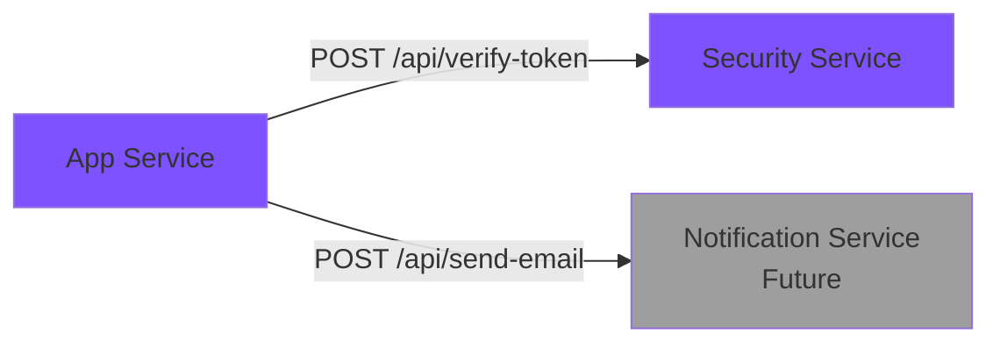

**Use Cases** (when implemented):
- Background jobs requiring service calls
- Internal admin operations
- Health checks and service discovery

**Security**: Service authentication via JWT or mTLS (see [Inter-Service Security](#inter-service-security))

### Event-Driven Communication (Planned)

**Pattern**: Asynchronous events via Kafka

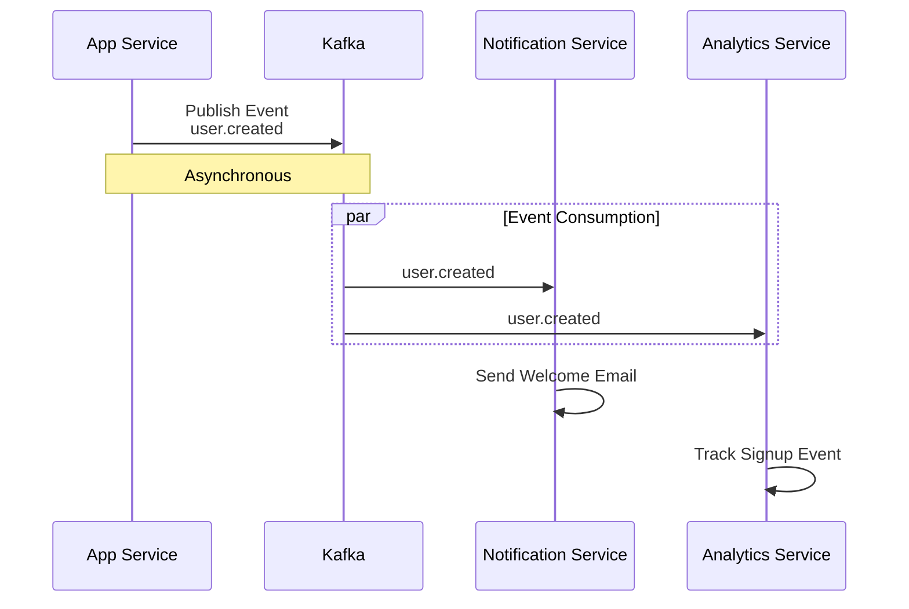

**Use Cases** (when implemented):
- Eventual consistency across services
- Decoupled workflows
- Event sourcing
- Audit logging

**See**: [Kafka Consumer Pattern](../05-backend/patterns/kafka-consumer-pattern.md) (when available)

---

## Clean Architecture within Services

### Layer Responsibilities

Each service follows **clean architecture** with clear layer separation:

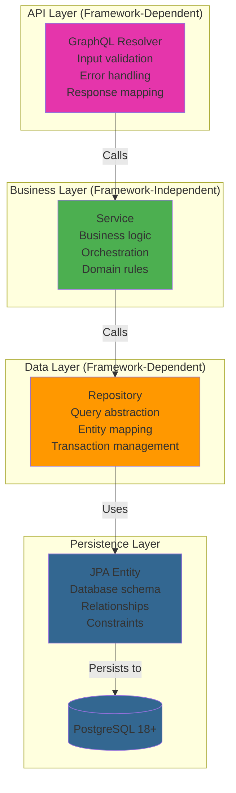

**Layer Rules** (Dependencies point inward):

| Layer | Depends On | Responsibilities | Testing |
|-------|-----------|------------------|---------|
| **GraphQL Resolver** | Service | HTTP handling, input validation, GraphQL mapping | Integration tests |
| **Service** | Repository | Business logic, orchestration, domain validation | Unit tests (mocked repos) |
| **Repository** | Entity | Data access, query abstraction, mapping | Integration tests (Testcontainers) |
| **Entity** | Nothing | Database schema, relationships, constraints | Migration tests |

**See**:
- [Resolver Pattern](../05-backend/patterns/resolver-pattern.md)
- [Service Pattern](../05-backend/patterns/service-pattern.md)
- [Repository Pattern](../05-backend/patterns/repository-pattern.md)
- [Entity Pattern](../05-backend/patterns/entity-pattern.md)

### Example: User Creation Flow

```kotlin
// 1. GraphQL Resolver (API Layer)
@GraphQLMutation
fun createUser(@Valid input: CreateUserInput): User {
    return userService.create(input.toServiceModel())
        .toGraphQLType()
}

// 2. Service (Business Layer)
@Singleton
class UserService(private val userRepository: UserRepository) {
    @Transactional
    fun create(input: UserCreateModel): UserDomain {
        // Business validation
        require(!userRepository.existsByEmail(input.email)) {
            "Email already exists"
        }

        // Create domain object
        val user = UserDomain(
            id = UuidV7.generate(),
            email = input.email,
            passwordHash = hashPassword(input.password)
        )

        // Persist
        return userRepository.save(user)
    }
}

// 3. Repository (Data Layer)
@Repository
interface UserRepository : CrudRepository<UserEntity, UUID> {
    fun existsByEmail(email: String): Boolean
    fun save(user: UserDomain): UserDomain {
        val entity = user.toEntity()
        return entityManager.persist(entity).toDomain()
    }
}

// 4. Entity (Persistence Layer)
@Entity
@Table(name = "users")
data class UserEntity(
    @Id val id: UUID,
    @Column(nullable = false, unique = true) val email: String,
    @Column(nullable = false) val passwordHash: String,
    @Column(nullable = false) val createdAt: Instant
)
```

**Benefits**:
- ✅ **Testable**: Business logic isolated, easy to unit test
- ✅ **Framework-Independent**: Service layer has no framework dependencies
- ✅ **Clear Separation**: Each layer has single responsibility
- ✅ **Flexible**: Easy to swap implementations (e.g., different database)

---

## Service Structure (Monorepo)

### Directory Layout

```
service/kotlin/
├── app/                        # App Service
│   ├── src/main/kotlin/io/github/salomax/neotool/app/
│   │   ├── graphql/            # GraphQL resolvers
│   │   │   ├── UserResolver.kt
│   │   │   ├── dto/            # GraphQL DTOs (input/output)
│   │   │   └── mapper/         # DTO ↔ Domain mappers
│   │   ├── service/            # Business logic
│   │   │   ├── UserService.kt
│   │   │   └── model/          # Domain models
│   │   ├── repository/         # Data access
│   │   │   ├── UserRepository.kt
│   │   │   └── custom/         # Custom queries
│   │   ├── entity/             # JPA entities
│   │   │   └── UserEntity.kt
│   │   └── Application.kt      # Service entry point
│   ├── src/main/resources/
│   │   ├── application.yml     # Configuration
│   │   ├── application-dev.yml # Dev overrides
│   │   ├── application-prod.yml # Prod overrides
│   │   └── db/migration/       # Flyway migrations
│   │       ├── V1__initial_schema.sql
│   │       └── V2__add_users_table.sql
│   ├── src/test/kotlin/        # Tests
│   │   ├── unit/               # Unit tests (mocked)
│   │   └── integration/        # Integration tests (Testcontainers)
│   └── build.gradle.kts        # Service dependencies
│
├── security/                   # Security Service
│   └── (same structure as app/)
│
├── asset/                      # Asset Service
│   └── (same structure as app/)
│
├── common/                     # Shared code
│   ├── src/main/kotlin/io/github/salomax/neotool/common/
│   │   ├── security/           # Shared security utils
│   │   ├── dto/                # Shared DTOs
│   │   ├── exception/          # Common exceptions
│   │   └── util/               # Utilities
│   └── build.gradle.kts
│
└── build.gradle.kts            # Root build configuration
```

**See**: [File Structure Reference](../93-reference/file-structure.md) for complete structure.

### Shared Libraries (`common/`)

**What goes in `common/`**:
- ✅ **Security utilities**: JWT verification, password hashing
- ✅ **Shared DTOs**: Common GraphQL types, error responses
- ✅ **Exceptions**: Standard exception hierarchy
- ✅ **Utilities**: Date formatting, UUID generation, validation

**What stays in services**:
- ❌ **Business logic**: Belongs in service layer
- ❌ **Domain models**: Service-specific
- ❌ **Repositories**: Service-specific data access
- ❌ **Entities**: Service-specific database schema

**Versioning**: `common/` library versioned independently, services depend on specific versions.

---

## Service Configuration

### Configuration Hierarchy

```yaml
# application.yml (base configuration)
micronaut:
  application:
    name: app-service
  server:
    port: 8080
    cors:
      enabled: true

datasources:
  default:
    url: jdbc:postgresql://localhost:5432/app_db
    driverClassName: org.postgresql.Driver
    username: ${DB_USER:postgres}
    password: ${DB_PASSWORD:postgres}

graphql:
  enabled: true
  graphiql:
    enabled: ${GRAPHIQL_ENABLED:true}
```

```yaml
# application-dev.yml (development overrides)
micronaut:
  server:
    cors:
      configurations:
        web:
          allowed-origins:
            - http://localhost:3000

datasources:
  default:
    url: jdbc:postgresql://localhost:5432/app_db_dev

logger:
  levels:
    io.github.salomax.neotool: DEBUG
```

```yaml
# application-prod.yml (production overrides)
datasources:
  default:
    url: ${DATABASE_URL}  # From environment

logger:
  levels:
    io.github.salomax.neotool: INFO

graphql:
  graphiql:
    enabled: false  # Disable in production
```

**Environment Variables** (precedence: ENV > application-{profile}.yml > application.yml):
- `MICRONAUT_ENVIRONMENTS`: Active profiles (e.g., `dev`, `prod`)
- `DATABASE_URL`: Database connection string
- `JWT_SECRET`: Secret for JWT signing
- `LOG_LEVEL`: Logging level override

**See**: [Backend Standards](../05-backend/standards/) for configuration best practices.

---

## Inter-Service Security

### Current: JWT Propagation

**Pattern**: Client JWT propagated through gateway to services

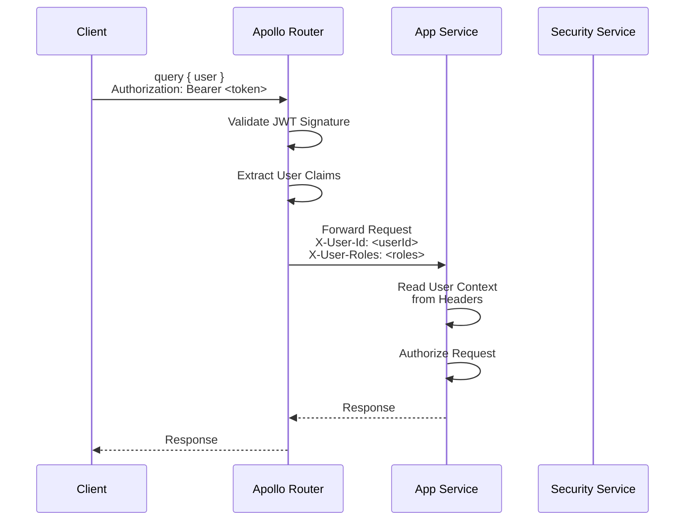

**Implementation**:
```kotlin
// Service reads user context from headers
@Singleton
class AuthContextFactory {
    fun fromRequest(request: HttpRequest<*>): AuthContext {
        val userId = request.headers.get("X-User-Id")
        val roles = request.headers.get("X-User-Roles")?.split(",")

        return AuthContext(
            userId = UUID.fromString(userId),
            roles = roles ?: emptyList()
        )
    }
}
```

**Security Considerations**:
- ✅ Services trust headers from gateway (internal network)
- ✅ Gateway validates JWT before forwarding
- ❌ Services do NOT re-validate JWT (performance)
- ⚠️ Internal network must be secured (Kubernetes NetworkPolicy)

### Future: Service-to-Service Authentication

**Pattern**: Services authenticate background calls with service tokens

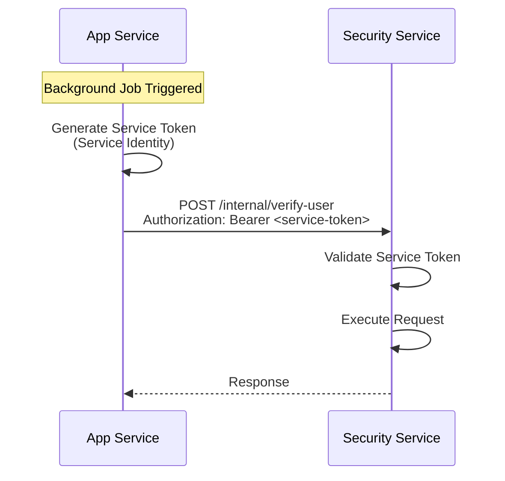

**Implementation** (planned):
- Service-specific JWT or API keys
- Short-lived tokens (5 minutes)
- mTLS for sensitive operations
- Service identity in token claims

**See**: [ADR-0008: Interservice Security](../92-adr/0008-interservice-security.md)

---

## Service Lifecycle

### Service Startup

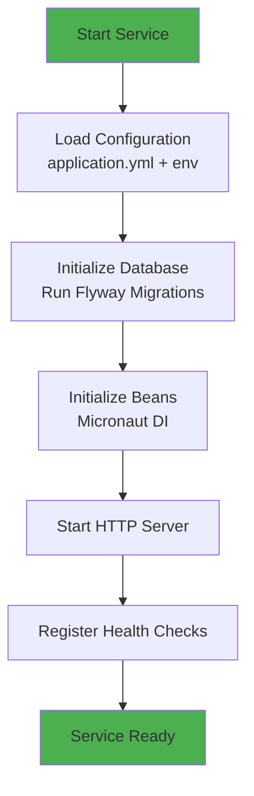

**Startup Sequence**:
1. **Load Configuration**: Merge `application.yml` + environment-specific + env vars
2. **Database Migrations**: Flyway applies pending migrations
3. **Dependency Injection**: Micronaut initializes beans (compile-time DI)
4. **HTTP Server**: Start Netty server on configured port
5. **Health Checks**: Register `/health` endpoint
6. **Ready**: Service accepts traffic

**Startup Time**: < 1 second (Micronaut compile-time DI + fast startup)

### Service Shutdown

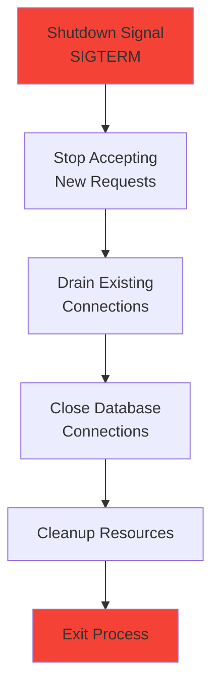

**Graceful Shutdown** (Kubernetes-friendly):
1. **SIGTERM**: Kubernetes sends shutdown signal
2. **Stop Accepting**: Service stops accepting new requests
3. **Drain Connections**: Wait for in-flight requests (max 30 seconds)
4. **Close Database**: Close HikariCP connection pool
5. **Cleanup**: Release resources, flush logs
6. **Exit**: Process terminates

**Configuration**:
```yaml
micronaut:
  server:
    shutdown-timeout: 30s  # Wait up to 30s for connections to drain
```

---

## Service Scalability

### Horizontal Scaling (Stateless)

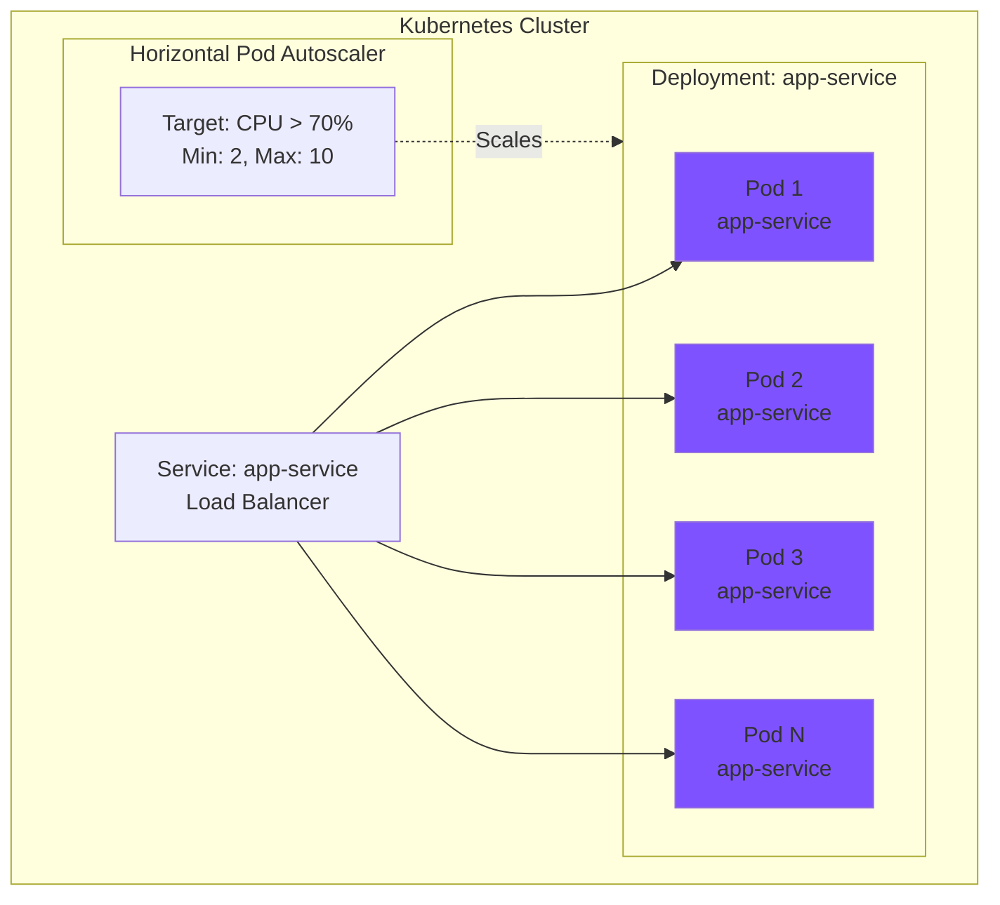

**Scaling Triggers**:
- **CPU utilization** > 70%
- **Memory utilization** > 80%
- **Request rate** > configured threshold
- **Custom metrics** (GraphQL query latency, DB connection pool)

**Configuration** (Kubernetes HPA):
```yaml
apiVersion: autoscaling/v2
kind: HorizontalPodAutoscaler
metadata:
  name: app-service-hpa
spec:
  scaleTargetRef:
    apiVersion: apps/v1
    kind: Deployment
    name: app-service
  minReplicas: 2
  maxReplicas: 10
  metrics:
    - type: Resource
      resource:
        name: cpu
        target:
          type: Utilization
          averageUtilization: 70
```

**Stateless Requirements**:
- ✅ No local state (session data in Redis or database)
- ✅ Shared-nothing architecture
- ✅ Connection pooling (database connections managed per pod)
- ✅ Cache invalidation (distributed cache or event-based)

### Performance Optimization

**Database Query Optimization**:
- Connection pooling (HikariCP)
- Query result caching (Caffeine cache)
- Database indexes on frequently queried columns
- GraphQL DataLoader for batch queries (N+1 problem)

**JVM Tuning**:
- Heap size: `-Xms512m -Xmx2g`
- GC: G1GC for low latency
- Virtual Threads: Java 21+ Project Loom

**Micronaut Optimizations**:
- Compile-time DI (no reflection)
- AOT compilation (GraalVM native image, optional)
- Netty for async I/O

**See**: [Data Architecture](./data-architecture.md) for database scaling.

---

## Health Checks & Observability

### Health Endpoints

```kotlin
// Micronaut built-in health checks
@Endpoint(id = "health")
class HealthEndpoint {

    @ReadOperation
    fun health(): Health {
        return Health.builder()
            .status("UP")
            .details(mapOf(
                "database" to checkDatabase(),
                "diskSpace" to checkDiskSpace()
            ))
            .build()
    }
}
```

**Endpoints**:
- `GET /health`: Overall health status
- `GET /health/liveness`: Kubernetes liveness probe (is service running?)
- `GET /health/readiness`: Kubernetes readiness probe (can service accept traffic?)

**Kubernetes Probes**:
```yaml
livenessProbe:
  httpGet:
    path: /health/liveness
    port: 8080
  initialDelaySeconds: 30
  periodSeconds: 10

readinessProbe:
  httpGet:
    path: /health/readiness
    port: 8080
  initialDelaySeconds: 10
  periodSeconds: 5
```

### Metrics Collection

**Micrometer Integration**:
```kotlin
@Singleton
class UserService(
    private val meterRegistry: MeterRegistry
) {
    private val userCreatedCounter = meterRegistry.counter("users.created")

    fun create(input: UserInput): User {
        val user = // ... create user
        userCreatedCounter.increment()
        return user
    }
}
```

**Metrics Exposed**:
- HTTP request rate, latency, error rate
- GraphQL query rate, resolver latency
- JVM metrics (heap, GC, threads)
- Database connection pool metrics
- Business metrics (signups, logins, feature usage)

**Prometheus Scraping**:
```yaml
# Service annotation for Prometheus scraping
metadata:
  annotations:
    prometheus.io/scrape: "true"
    prometheus.io/port: "8080"
    prometheus.io/path: "/prometheus"
```

**See**: [Observability Overview](../10-observability/observability-overview.md)

---

## Testing Strategy

### Test Pyramid

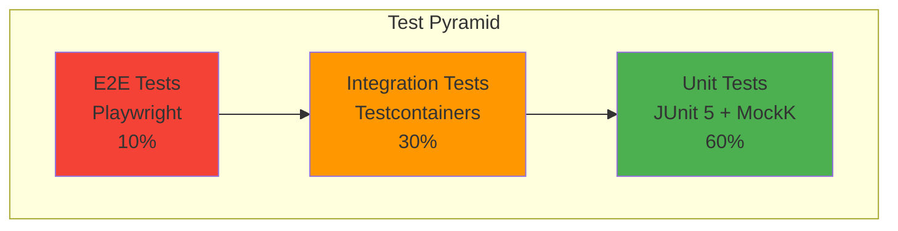

### Unit Tests

**Target**: Service layer (business logic)

**Example**:
```kotlin
@Test
fun `should create user with valid input`() {
    // Given
    val input = UserCreateModel(email = "test@example.com", password = "password")
    val mockRepo = mockk<UserRepository>()
    every { mockRepo.existsByEmail(any()) } returns false
    every { mockRepo.save(any()) } returns UserDomain(...)

    val service = UserService(mockRepo)

    // When
    val result = service.create(input)

    // Then
    assertThat(result.email).isEqualTo("test@example.com")
    verify { mockRepo.save(any()) }
}
```

**Tools**: JUnit 5, MockK, AssertJ

### Integration Tests

**Target**: Full stack (Resolver → Service → Repository → Database)

**Example**:
```kotlin
@MicronautTest
@Testcontainers
class UserResolverIntegrationTest {

    @Container
    val postgres = PostgreSQLContainer<Nothing>("postgres:18")

    @Inject
    lateinit var userResolver: UserResolver

    @Test
    fun `should create and retrieve user`() {
        // When: Create user
        val input = CreateUserInput(email = "test@example.com", password = "password")
        val created = userResolver.createUser(input)

        // Then: Retrieve user
        val retrieved = userResolver.user(created.id)
        assertThat(retrieved.email).isEqualTo("test@example.com")
    }
}
```

**Tools**: Testcontainers (real PostgreSQL 18+ in Docker), JUnit 5

**See**: [Testing Standards](../05-backend/standards/testing-standards.md)

---

## Common Patterns

### Error Handling

```kotlin
// Standardized error response
@GraphQLQuery
fun user(@GraphQLArgument id: UUID): User {
    return userService.findById(id)
        ?: throw NotFoundException("User not found: $id")
}

// Exception mapping
@Singleton
class GraphQLExceptionHandler : GraphQLErrorHandler {
    override fun handleError(error: Throwable): GraphQLError {
        return when (error) {
            is NotFoundException -> GraphQLError.newError()
                .message(error.message)
                .errorType(ErrorType.NOT_FOUND)
                .build()
            else -> GraphQLError.newError()
                .message("Internal server error")
                .errorType(ErrorType.INTERNAL_ERROR)
                .build()
        }
    }
}
```

### Validation

```kotlin
// Input validation with Jakarta Validation
data class CreateUserInput(
    @field:Email(message = "Invalid email format")
    @field:NotBlank(message = "Email is required")
    val email: String,

    @field:Size(min = 8, message = "Password must be at least 8 characters")
    val password: String
)

// Resolver with validation
@GraphQLMutation
fun createUser(@Valid input: CreateUserInput): User {
    // Input is validated before method execution
    return userService.create(input)
}
```

### Logging

```kotlin
@Singleton
class UserService(
    private val logger: Logger = LoggerFactory.getLogger(UserService::class.java)
) {
    fun create(input: UserInput): User {
        logger.info("Creating user with email: {}", input.email)

        try {
            val user = // ... create user
            logger.info("User created successfully: {}", user.id)
            return user
        } catch (e: Exception) {
            logger.error("Failed to create user: {}", e.message, e)
            throw e
        }
    }
}
```

**Log Levels**:
- `ERROR`: Application errors, exceptions
- `WARN`: Potential issues, degraded functionality
- `INFO`: Important business events (user created, login)
- `DEBUG`: Detailed diagnostic (dev/staging only)

---

## Service Development Checklist

When creating a new service:

### Setup
- [ ] Create service directory structure
- [ ] Configure `build.gradle.kts` with dependencies
- [ ] Set up `application.yml` with service config
- [ ] Create database schema (Flyway migrations)
- [ ] Configure health checks

### Implementation
- [ ] Define GraphQL schema (subgraph)
- [ ] Implement entities (JPA)
- [ ] Create repositories (data access)
- [ ] Implement services (business logic)
- [ ] Create resolvers (GraphQL API)
- [ ] Add input/output DTOs
- [ ] Implement mappers (DTO ↔ Domain ↔ Entity)

### Quality
- [ ] Write unit tests (service layer)
- [ ] Write integration tests (full stack + Testcontainers)
- [ ] Add error handling
- [ ] Implement validation
- [ ] Add logging (structured JSON)
- [ ] Configure metrics (Micrometer)

### Deployment
- [ ] Create Dockerfile
- [ ] Create Kubernetes manifests (Deployment, Service, HPA)
- [ ] Configure CI/CD pipeline
- [ ] Set up Grafana dashboards
- [ ] Document in architecture docs

**See**: [Feature Development Workflow](../08-workflows/feature-development.md)

---

## Related Documentation

### Architecture
- [Architecture Hub](./README.md) - Navigation to all architecture docs
- [System Architecture](./system-architecture.md) - High-level system design
- [Data Architecture](./data-architecture.md) - PostgreSQL 18+ setup and patterns
- [API Architecture](./api-architecture.md) - GraphQL Federation details
- [Infrastructure Architecture](./infrastructure-architecture.md) - Deployment and scaling

### Implementation Patterns
- [Backend Patterns](../05-backend/patterns/) - Implementation patterns
- [Service Pattern](../05-backend/patterns/service-pattern.md) - Service layer pattern
- [Repository Pattern](../05-backend/patterns/repository-pattern.md) - Data access pattern
- [Resolver Pattern](../05-backend/patterns/resolver-pattern.md) - GraphQL resolver pattern

### Standards
- [Backend Standards](../05-backend/standards/) - Coding standards
- [Testing Standards](../05-backend/standards/testing-standards.md) - Test strategy
- [GraphQL Standards](../06-contracts/graphql-standards.md) - GraphQL conventions

### Decisions
- [ADR-0003: Kotlin/Micronaut Backend](../92-adr/0003-kotlin-micronaut-backend.md)
- [ADR-0008: Interservice Security](../92-adr/0008-interservice-security.md)

---

**Version**: 1.0.0 (2026-01-02)
**Stack**: Kotlin + Micronaut + PostgreSQL 18+ + GraphQL
**Philosophy**: Domain-driven boundaries. Clean architecture. Independent deployment.

*Build services that scale independently and communicate seamlessly.*
