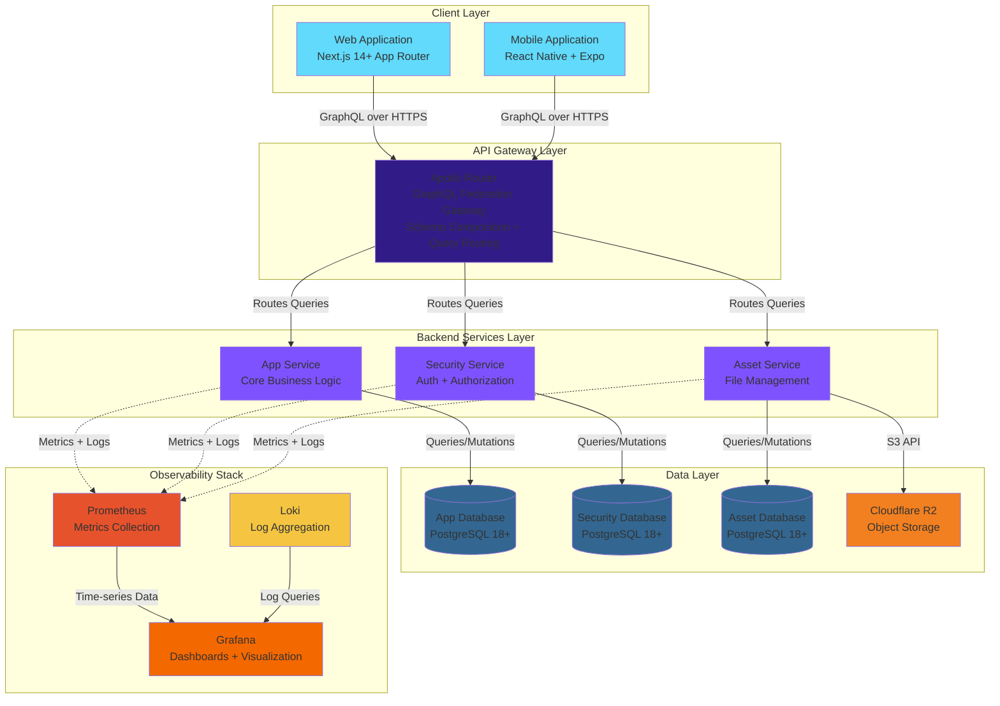
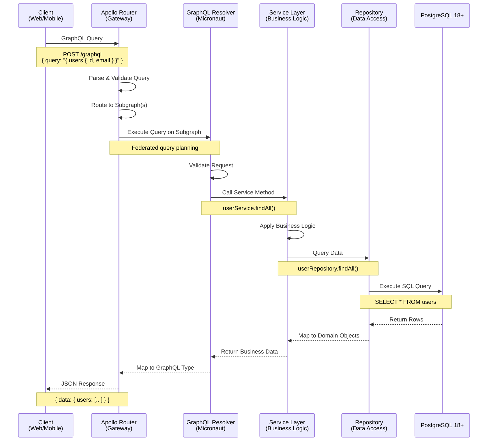
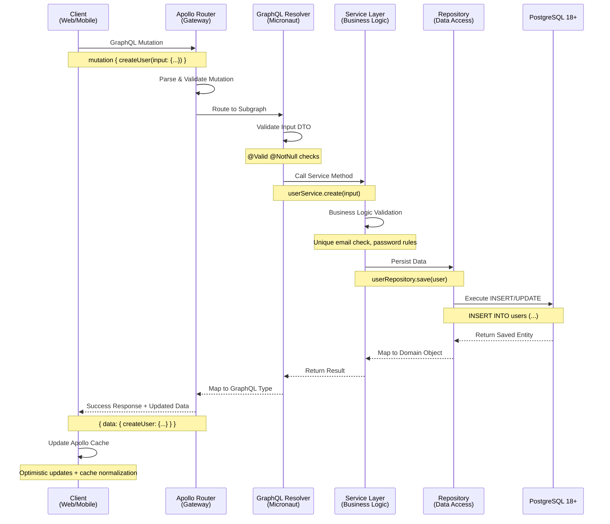
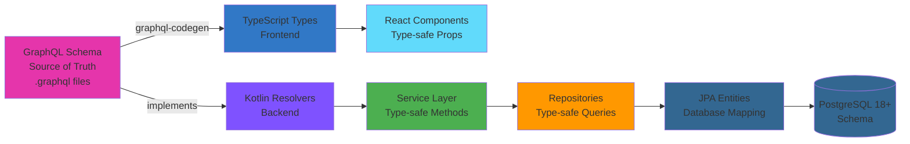
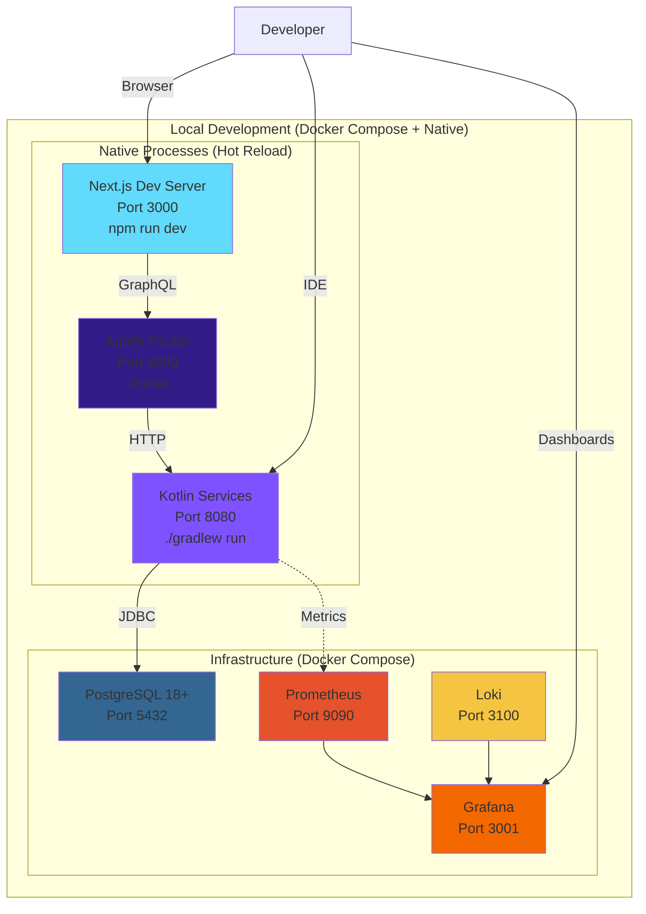
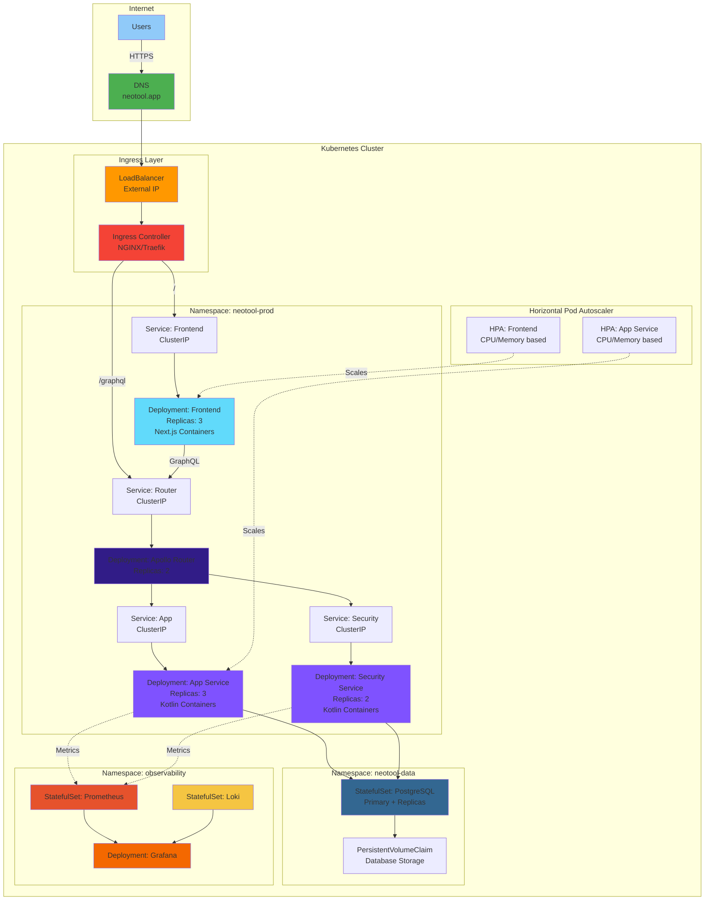
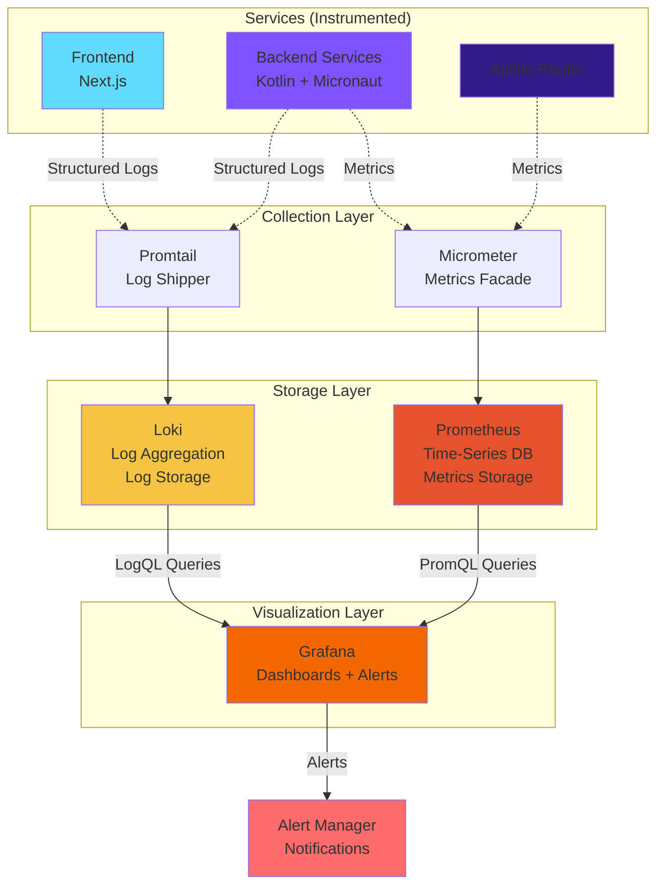
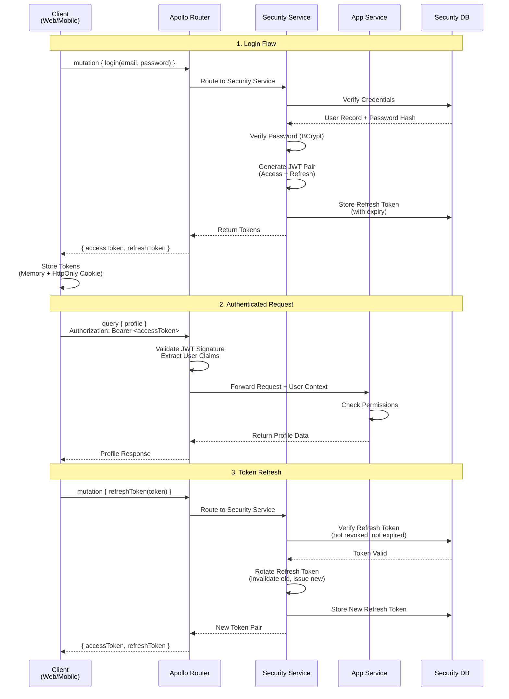
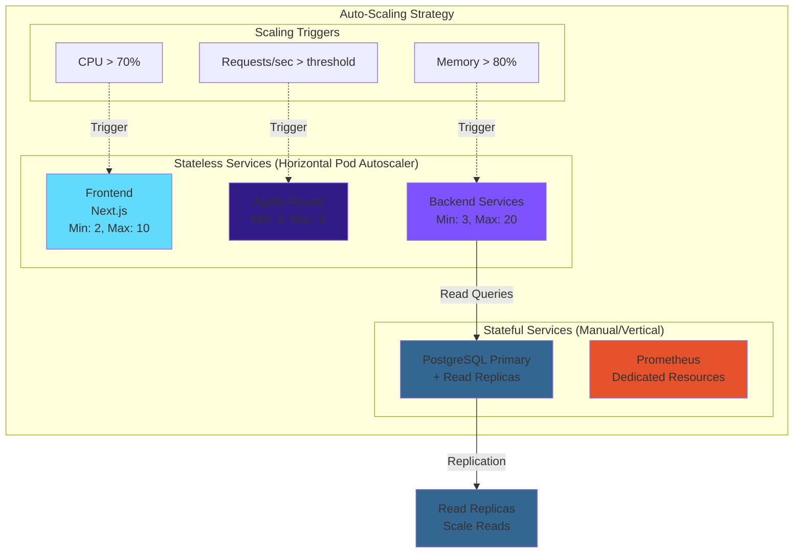
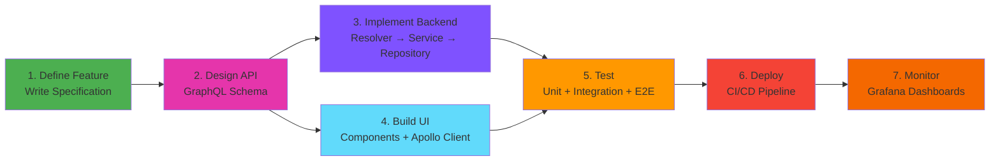

# System Architecture

> **Purpose**: Complete high-level architectural overview of the NeoTool platform, covering system design, technology stack, data flows, and deployment architecture.

## What is NeoTool?

NeoTool is a **production-ready, type-safe, federated GraphQL platform** built on a **monorepo architecture** with **containerized microservices**. It serves as a comprehensive boilerplate for building scalable, observable, cloud-native applications with specification-driven development at its core.

### Key Characteristics

- **Type-Safe End-to-End**: GraphQL schema → TypeScript + Kotlin types → PostgreSQL 18+
- **Federated Architecture**: Independent microservices with composed GraphQL schema
- **Containerized & Cloud-Native**: Docker + Kubernetes + Terraform
- **Observable from Day One**: Prometheus + Grafana + Loki built-in
- **Vendor Neutral**: Portable across clouds, no lock-in

**See**: [Core Principles](../01-overview/core-principles.md) for design philosophy.

---

## System Overview

### High-Level Architecture



### Architecture Layers

| Layer | Technologies | Purpose | Scalability |
|-------|-------------|---------|-------------|
| **Clients** | Next.js, React Native | User interfaces (web, mobile) | CDN + edge caching |
| **API Gateway** | Apollo Router | Schema composition, query routing | Horizontal (stateless) |
| **Services** | Kotlin + Micronaut | Business logic, GraphQL resolvers | Horizontal (stateless) |
| **Data** | PostgreSQL 18+, Cloudflare R2 | Persistent storage | Read replicas, partitioning |
| **Observability** | Prometheus, Grafana, Loki | Monitoring, logging, alerting | Dedicated cluster |

---

## Technology Stack

### Why These Technologies?

NeoTool's technology choices are based on **industry adoption and ecosystem maturity**:

1. **Proven at Scale**: Used by major tech companies (Google, Netflix, Uber, LinkedIn)
2. **Rich Ecosystem**: Extensive libraries, tools, and community support
3. **Developer Pool**: Large talent pool with production experience
4. **Best Practices**: Well-documented patterns and anti-patterns
5. **Vendor Neutrality**: Portable across clouds, no lock-in

**See**: [All ADRs](../92-adr/) for detailed technology decision rationale.

### Backend Stack

| Component | Technology | Version | Purpose | Industry Adoption |
|-----------|-----------|---------|---------|-------------------|
| **Language** | Kotlin | Latest | Type-safe, concise JVM language | Google (Android), JetBrains, Amazon |
| **Runtime** | Java (JDK) | 21+ | JVM with Virtual Threads | Oracle, IBM, major enterprises |
| **Framework** | Micronaut | 4.x | Lightweight, fast startup, AOT-ready | Object Computing, Oracle |
| **Build** | Gradle | 8.x | Dependency management + build automation | LinkedIn, Netflix, Android |
| **API** | GraphQL (Apollo Federation) | Latest | Type-safe, federated API layer | Facebook, GitHub, Netflix, Airbnb |
| **ORM** | Micronaut Data (JPA) | Latest | Type-safe database access | Spring ecosystem, Red Hat |
| **Database** | PostgreSQL | 18+ | ACID-compliant, feature-rich RDBMS | Apple, Instagram, Reddit, Spotify |
| **DB Driver** | PostgreSQL JDBC | Latest | Database connectivity | PostgreSQL Foundation |
| **Migrations** | Flyway | Latest | Schema versioning and migrations | Redgate, enterprise standard |
| **Connection Pool** | HikariCP | Latest | High-performance connection pooling | Industry standard for JVM |
| **Testing** | JUnit 5 + Testcontainers | Latest | Unit + integration tests with real dependencies | JVM ecosystem standard |
| **Mocking** | MockK | Latest | Kotlin-friendly mocking library | Kotlin community standard |
| **Metrics** | Micrometer | Latest | Vendor-neutral metrics facade | Spring, Micronaut ecosystems |

**Rationale**:
- **Kotlin**: Modern JVM language with null-safety, coroutines, and concise syntax
- **Micronaut**: Fast startup (<1s), low memory footprint, compile-time DI
- **PostgreSQL 18+**: Latest features (performance improvements, JSON enhancements, security updates)
- **GraphQL**: Type-safe API contract, efficient data fetching, schema federation
- **Flyway**: Database migrations as code, version control for schema

**See**:
- [ADR-0003: Kotlin/Micronaut Backend](../92-adr/0003-kotlin-micronaut-backend.md)
- [Service Architecture](./service-architecture.md)

### Frontend Stack

| Component | Technology | Version | Purpose | Industry Adoption |
|-----------|-----------|---------|---------|-------------------|
| **Platform** | Node.js | 20+ | JavaScript runtime | Netflix, PayPal, Uber, LinkedIn |
| **Framework** | Next.js | 14+ | React meta-framework with App Router | Vercel, TikTok, Hulu, Twitch |
| **Library** | React | 18+ | UI component library | Facebook, Instagram, Netflix, Airbnb |
| **Language** | TypeScript | Latest | Type-safe JavaScript | Microsoft, Google, Slack, Airbnb |
| **API Client** | Apollo Client | Latest | GraphQL client + normalized cache | Airbnb, Expedia, The New York Times |
| **State** | React Context + Hooks | Built-in | Global state management | React ecosystem standard |
| **Styling** | Material-UI (MUI) + Emotion | Latest | React component library + CSS-in-JS | NASA, Amazon, Unity, JPMorgan |
| **Forms** | React Hook Form | Latest | Performant form state management | Community standard |
| **Code Gen** | GraphQL Code Generator | Latest | TypeScript types from GraphQL schema | Industry standard for GraphQL |
| **Testing** | Vitest + React Testing Library | Latest | Fast unit tests with React support | Modern testing standard |
| **E2E Testing** | Playwright | Latest | Browser automation and testing | Microsoft, VS Code team |
| **i18n** | next-intl | Latest | Internationalization for Next.js | Next.js ecosystem standard |

**Rationale**:
- **Next.js 14+**: App Router with Server Components, excellent performance, file-based routing
- **React 18+**: Server + Client Components, concurrent rendering, massive ecosystem
- **TypeScript**: Type safety from API to UI, auto-generated from GraphQL schema
- **Apollo Client**: Intelligent caching, optimistic updates, devtools
- **Material-UI**: Production-ready components, accessibility, theming

**See**:
- [ADR-0004: TypeScript/Next.js Frontend](../92-adr/0004-typescript-nextjs-frontend.md)
- [Frontend Architecture](./frontend-architecture.md)

### Infrastructure Stack

| Component | Technology | Purpose | Industry Adoption |
|-----------|-----------|---------|-------------------|
| **Containers** | Docker | Application packaging | Industry standard (Google, AWS, Microsoft) |
| **Local Dev** | Docker Compose | Multi-container orchestration | Docker ecosystem standard |
| **Orchestration** | Kubernetes | Production container management | Google, Microsoft, Red Hat, CNCF |
| **IaC** | Terraform | Infrastructure as Code | HashiCorp, AWS, GCP, Azure standard |
| **CI/CD** | GitHub Actions | Build, test, deploy automation | GitHub, Microsoft ecosystem |
| **Metrics** | Prometheus | Time-series metrics collection | CNCF, SoundCloud, DigitalOcean |
| **Dashboards** | Grafana | Visualization and alerting | CNCF, Bloomberg, eBay |
| **Logging** | Loki | Log aggregation and querying | Grafana Labs, CNCF |
| **Log Shipping** | Promtail | Log collection and forwarding | Grafana Labs standard |

**Rationale**:
- **Docker**: Standard containerization, consistent environments (dev = prod)
- **Kubernetes**: Industry-standard orchestration, auto-scaling, self-healing
- **Terraform**: Multi-cloud IaC, declarative infrastructure, state management
- **Prometheus + Grafana + Loki (PLG Stack)**: Open-source, powerful, self-hosted observability

**See**:
- [ADR-0002: Containerized Architecture](../92-adr/0002-containerized-architecture.md)
- [Infrastructure Architecture](./infrastructure-architecture.md)

---

## Data Flow Patterns

### Read Flow (GraphQL Query)



**Key Points**:
- **Type Safety**: GraphQL schema validates query at gateway
- **Clean Architecture**: Resolver → Service → Repository → Entity
- **Separation**: Business logic in service layer (framework-agnostic)
- **Mapping**: Repository maps entities to domain objects

**See**: [API Architecture](./api-architecture.md) for GraphQL details.

### Write Flow (GraphQL Mutation)



**Key Points**:
- **Validation**: Input validated at resolver layer (DTO validation)
- **Business Logic**: Service layer enforces business rules
- **Transactions**: Repository manages database transactions
- **Cache Updates**: Apollo Client updates normalized cache

**See**: [Service Pattern](../05-backend/patterns/service-pattern.md)

### Type Safety Flow



**Result**: Compile-time type errors from database to UI.

**Example**:
```graphql
# 1. GraphQL Schema (source of truth)
type User {
  id: ID!
  email: String!
  roles: [Role!]!
}
```

↓ Auto-generated ↓

```typescript
// 2. TypeScript types (frontend)
interface User {
  id: string;
  email: string;
  roles: Role[];
}
```

↓ Implemented ↓

```kotlin
// 3. Kotlin resolver (backend)
@GraphQLQuery
fun user(@GraphQLArgument id: UUID): User {
  return userService.findById(id)
}
```

↓ Maps to ↓

```kotlin
// 4. JPA Entity (database)
@Entity
@Table(name = "users")
data class UserEntity(
  @Id val id: UUID,
  @Column(nullable = false, unique = true) val email: String,
  @ElementCollection val roles: List<Role>
)
```

**See**: [GraphQL Standards](../06-contracts/graphql-standards.md)

---

## Deployment Architecture

### Local Development Environment



**Setup**:
```bash
# 1. Start infrastructure (PostgreSQL, Grafana, Prometheus, Loki)
cd infra/docker && docker-compose -f docker-compose.local.yml up -d

# 2. Start backend (hot reload enabled)
cd service/kotlin && ./gradlew run

# 3. Start frontend (hot reload enabled)
cd web && npm run dev

# 4. Start Apollo Router
cd service/gateway && ./router --config router.yaml
```

**URLs**:
- Frontend: http://localhost:3000
- Backend API: http://localhost:8080
- GraphQL Playground: http://localhost:4000/graphql
- Grafana: http://localhost:3001 (admin/admin)
- Prometheus: http://localhost:9090

**See**: [Getting Started](../01-overview/getting-started.md) for setup instructions.

### Production Deployment (Kubernetes)



**Key Components**:

| Component | Type | Replicas | Purpose | Auto-Scaling |
|-----------|------|----------|---------|--------------|
| **Frontend** | Deployment | 3 | Next.js SSR + static serving | HPA (CPU/Memory) |
| **Apollo Router** | Deployment | 2 | GraphQL gateway | Manual (low resource) |
| **App Service** | Deployment | 3 | Business logic | HPA (CPU/Memory) |
| **Security Service** | Deployment | 2 | Auth/authz | Manual (critical path) |
| **PostgreSQL** | StatefulSet | 1 primary + 2 read replicas | Data persistence | Manual (stateful) |
| **Prometheus** | StatefulSet | 1 | Metrics storage | Manual (dedicated) |
| **Grafana** | Deployment | 1 | Dashboards | Manual (low traffic) |
| **Loki** | StatefulSet | 1 | Log storage | Manual (dedicated) |

**Deployment Process**:
1. **Build**: GitHub Actions builds Docker images
2. **Push**: Images pushed to container registry
3. **Apply**: Terraform applies Kubernetes manifests
4. **Deploy**: Kubernetes performs rolling updates
5. **Verify**: Health checks confirm deployment success

**See**:
- [Infrastructure Architecture](./infrastructure-architecture.md)
- [Deployment Workflow](../08-workflows/deployment-workflow.md)

---

## Observability Stack

### Metrics, Logging, and Monitoring



### Metrics Collected

| Metric Category | Examples | Tool | Dashboard |
|----------------|----------|------|-----------|
| **HTTP** | Request rate, latency, status codes | Micrometer | HTTP Overview |
| **GraphQL** | Query rate, resolver latency, errors | Micrometer | GraphQL Performance |
| **Database** | Connection pool, query time, slow queries | HikariCP + Micrometer | Database Health |
| **JVM** | Heap usage, GC time, thread count | Micrometer | JVM Metrics |
| **Business** | User signups, feature usage | Custom counters | Business KPIs |
| **Infrastructure** | CPU, memory, disk, network | Prometheus Node Exporter | Infrastructure |

### Logging Strategy

**Structured Logging** (JSON format):
```json
{
  "timestamp": "2026-01-02T12:34:56.789Z",
  "level": "INFO",
  "service": "app-service",
  "traceId": "a1b2c3d4-e5f6-7890-abcd-ef1234567890",
  "message": "User created successfully",
  "context": {
    "userId": "550e8400-e29b-41d4-a716-446655440000",
    "email": "user@example.com"
  }
}
```

**Log Levels**:
- **ERROR**: Application errors, exceptions
- **WARN**: Degraded functionality, potential issues
- **INFO**: Important business events
- **DEBUG**: Detailed diagnostic information (dev/staging only)

**See**: [Observability Overview](../10-observability/observability-overview.md)

---

## Security Architecture

### Authentication & Authorization



### JWT Token Architecture

**Access Token** (Short-lived):
- **Lifetime**: 15 minutes (configurable)
- **Type**: Stateless JWT
- **Algorithm**: HMAC-SHA256 (HS256)
- **Claims**: userId, email, roles, exp, iat
- **Storage**: Client-side (memory/sessionStorage)
- **Purpose**: API authentication

**Refresh Token** (Long-lived):
- **Lifetime**: 7 days (configurable)
- **Type**: Stateful (stored in database)
- **Storage**: HttpOnly cookie (secure, sameSite)
- **Purpose**: Issue new access tokens
- **Rotation**: One-time use, rotated on refresh
- **Revocation**: Can be revoked (logout, security breach)

**See**:
- [Authentication Standards](../09-security/authentication.md)
- [ADR-0008: Interservice Security](../92-adr/0008-interservice-security.md)

### Inter-Service Security

**Service-to-Service Authentication**:
- Internal network (Kubernetes ClusterIP services)
- JWT propagation from client requests
- Service authentication for background jobs (planned)
- mTLS for sensitive service communication (planned)

**See**: [Service Architecture](./service-architecture.md) for details.

---

## Scalability Strategy

### Horizontal Scaling



**Scaling Characteristics**:

| Component | Type | Scaling Strategy | Limits |
|-----------|------|------------------|--------|
| **Frontend** | Stateless | HPA (CPU/Memory) | Min: 2, Max: 10 |
| **Apollo Router** | Stateless | HPA (RPS) | Min: 2, Max: 5 |
| **Backend Services** | Stateless | HPA (CPU/Memory) | Min: 3, Max: 20 per service |
| **PostgreSQL** | Stateful | Read replicas | 1 primary + 2-5 read replicas |
| **Cache** | Stateless | Redis cluster (planned) | Horizontal |

**Performance Optimizations**:
- **GraphQL DataLoader**: Batch + cache database queries (N+1 problem)
- **Apollo Client Cache**: Normalized cache reduces redundant requests
- **Database Indexes**: B-tree, GIN, GiST for fast lookups
- **Connection Pooling**: HikariCP manages database connections efficiently
- **CDN**: Static assets served from edge locations
- **Server Components**: Next.js SSR for initial page load performance

**See**: [Data Architecture](./data-architecture.md) for database scaling details.

---

## Project Structure (Monorepo)

```
neotool/
├── service/                    # Backend services
│   ├── kotlin/                 # Kotlin microservices
│   │   ├── app/                # App service (core business logic)
│   │   │   ├── src/main/kotlin/
│   │   │   │   ├── graphql/    # GraphQL resolvers
│   │   │   │   ├── service/    # Business logic layer
│   │   │   │   ├── repository/ # Data access layer
│   │   │   │   ├── entity/     # JPA entities
│   │   │   │   └── Application.kt
│   │   │   ├── src/main/resources/
│   │   │   │   ├── application.yml
│   │   │   │   └── db/migration/ # Flyway migrations
│   │   │   └── build.gradle.kts
│   │   ├── security/           # Security service (auth/authz)
│   │   ├── common/             # Shared code (DTOs, utils)
│   │   └── build.gradle.kts    # Root build file
│   └── gateway/                # Apollo Router configuration
│       └── router.yaml
├── web/                        # Frontend (Next.js)
│   ├── src/
│   │   ├── app/                # Next.js App Router pages
│   │   │   ├── (auth)/         # Auth pages (login, signup)
│   │   │   ├── (dashboard)/    # Dashboard pages
│   │   │   ├── layout.tsx      # Root layout
│   │   │   └── page.tsx        # Home page
│   │   ├── shared/             # Shared frontend code
│   │   │   ├── components/     # React components
│   │   │   │   ├── ui/         # UI components (primitives, patterns)
│   │   │   │   ├── auth/       # Auth components
│   │   │   │   ├── management/ # CRUD tables/forms
│   │   │   │   └── authorization/ # Permission checks
│   │   │   ├── hooks/          # Custom React hooks
│   │   │   ├── providers/      # Context providers
│   │   │   ├── utils/          # Utility functions
│   │   │   └── config/         # Configuration
│   │   └── lib/                # Third-party integrations
│   ├── public/                 # Static assets
│   ├── package.json
│   └── tsconfig.json
├── contracts/                  # API contracts
│   └── graphql/                # GraphQL schemas
│       ├── subgraphs/          # Service-specific schemas
│       │   ├── app.graphql
│       │   └── security.graphql
│       └── supergraph/         # Composed schema
│           └── supergraph.graphql
├── infra/                      # Infrastructure as Code
│   ├── docker/                 # Docker configurations
│   │   ├── docker-compose.local.yml
│   │   └── docker-compose.prod.yml
│   ├── k8s/                    # Kubernetes manifests
│   │   ├── base/               # Base configurations
│   │   └── overlays/           # Environment-specific
│   │       ├── dev/
│   │       ├── staging/
│   │       └── prod/
│   ├── terraform/              # Terraform IaC
│   │   ├── modules/            # Reusable modules
│   │   └── environments/       # Environment configs
│   └── observability/          # Grafana dashboards, alerts
│       ├── dashboards/
│       └── alerts/
├── docs/                       # Specification (this documentation)
│   ├── 01-overview/
│   ├── 02-architecture/        # ← You are here
│   ├── 05-backend/
│   ├── 06-contracts/
│   ├── 07-frontend/
│   ├── 08-workflows/
│   ├── 92-adr/
│   └── README.md
├── scripts/                    # Build and utility scripts
│   ├── build-all.sh
│   ├── test-all.sh
│   └── deploy.sh
└── README.md                   # Project README
```

**See**: [File Structure Reference](../93-reference/file-structure.md) for complete details.

---

## Key Architectural Patterns

### 1. Microservices Architecture

**Pattern**: Independent, deployable services with clear boundaries

**Benefits**:
- Independent deployment and scaling
- Technology diversity (if needed)
- Team autonomy
- Fault isolation

**Implementation**:
- Service per bounded context (App, Security, Asset)
- Database per service pattern
- GraphQL Federation for unified API
- Kubernetes for orchestration

**See**: [Service Architecture](./service-architecture.md)

### 2. GraphQL Federation

**Pattern**: Composed GraphQL schema from multiple subgraphs

**Benefits**:
- Unified API for clients
- Independent schema development
- Type composition across services
- Client-driven queries

**Implementation**:
- Apollo Router as gateway
- Subgraph schemas per service
- `@key` directive for entity references
- Supergraph composition

**See**: [API Architecture](./api-architecture.md)

### 3. Clean Architecture (Layered)

**Pattern**: Dependency rule - dependencies point inward

**Layers**:
```
GraphQL Resolver (API layer)
    ↓ calls
Service (business logic)
    ↓ calls
Repository (data access)
    ↓ uses
Entity (database)
```

**Benefits**:
- Testable business logic
- Framework independence
- Clear separation of concerns
- Easy to refactor

**See**: [Backend Patterns](../05-backend/patterns/)

### 4. Domain-Driven Design (DDD)

**Pattern**: Code reflects business domain

**Concepts**:
- **Entities**: Rich domain models (User, Product, Order)
- **Value Objects**: Immutable concepts (Email, Money)
- **Repositories**: Data access abstraction
- **Services**: Business logic orchestration
- **Bounded Contexts**: Service boundaries

**See**: [Domain Model](../04-domain/domain-model.md)

### 5. Database per Service

**Pattern**: Each service owns its database

**Benefits**:
- Service independence
- Technology diversity
- Data isolation
- Clear ownership

**Considerations**:
- Cross-service queries (use GraphQL Federation)
- Data consistency (eventual consistency)
- Transactions (saga pattern for distributed transactions)

**See**: [Data Architecture](./data-architecture.md)

---

## Development Workflow

### Feature Development Cycle



**Detailed Process**:

1. **Define Feature**: Create specification in `docs/03-features/`
2. **Design API**: Write GraphQL schema in `contracts/graphql/subgraphs/`
3. **Implement Backend**:
   - Create entity (database model)
   - Create repository (data access)
   - Create service (business logic)
   - Create resolver (GraphQL API)
   - Write unit + integration tests
4. **Build UI**:
   - Generate TypeScript types (`npm run codegen`)
   - Create React components
   - Integrate Apollo Client hooks
   - Write unit + integration tests
5. **Test**: Run test suites (unit, integration, E2E)
6. **Deploy**: CI/CD pipeline builds, tests, and deploys
7. **Monitor**: Track metrics and logs in Grafana

**See**: [Feature Development Workflow](../08-workflows/feature-development.md)

---

## Related Documentation

### Architecture Deep Dives
- [Architecture Hub](./README.md) - Navigation to all architecture docs
- [Service Architecture](./service-architecture.md) - Microservice patterns
- [Data Architecture](./data-architecture.md) - PostgreSQL 18+ setup
- [API Architecture](./api-architecture.md) - GraphQL Federation
- [Frontend Architecture](./frontend-architecture.md) - Next.js 14+ App Router
- [Infrastructure Architecture](./infrastructure-architecture.md) - Docker, Kubernetes, Terraform

### Decision Records
- [ADR-0001: Monorepo Architecture](../92-adr/0001-monorepo-architecture.md)
- [ADR-0002: Containerized Architecture](../92-adr/0002-containerized-architecture.md)
- [ADR-0003: Kotlin/Micronaut Backend](../92-adr/0003-kotlin-micronaut-backend.md)
- [ADR-0004: TypeScript/Next.js Frontend](../92-adr/0004-typescript-nextjs-frontend.md)
- [ADR-0005: PostgreSQL Database](../92-adr/0005-postgresql-database.md)
- [All ADRs](../92-adr/)

### Implementation Patterns
- [Backend Patterns](../05-backend/patterns/)
- [Frontend Patterns](../07-frontend/patterns/)
- [GraphQL Standards](../06-contracts/graphql-standards.md)

### Operations
- [Deployment Workflow](../08-workflows/deployment-workflow.md)
- [Observability Overview](../10-observability/observability-overview.md)
- [Commands Reference](../93-reference/commands.md)

---

## Quick Reference

### Technology Summary

| Layer | Technology | Version | Purpose |
|-------|-----------|---------|---------|
| **Frontend** | Next.js + React + TypeScript | 14+ / 18+ / Latest | User interfaces |
| **API Gateway** | Apollo Router | Latest | GraphQL Federation |
| **Backend** | Kotlin + Micronaut | Latest / 4.x | Business logic, APIs |
| **Database** | PostgreSQL | 18+ | Data persistence |
| **IaC** | Terraform | Latest | Infrastructure as Code |
| **Containers** | Docker + Kubernetes | Latest | Orchestration |
| **Observability** | Prometheus + Grafana + Loki | Latest | Monitoring, logging |

### Key Architectural Decisions

- **Monorepo**: Single repository for all code
- **Microservices**: Independent services with clear boundaries
- **GraphQL Federation**: Unified API with federated schema
- **PostgreSQL 18+**: ACID-compliant relational database
- **Kubernetes**: Container orchestration
- **Terraform**: Infrastructure as Code (not ArgoCD)
- **Type Safety**: End-to-end type checking
- **Vendor Neutrality**: Portable across clouds

### URLs (Local Development)
- Frontend: http://localhost:3000
- Backend: http://localhost:8080
- GraphQL Playground: http://localhost:4000/graphql
- Grafana: http://localhost:3001
- Prometheus: http://localhost:9090

---

**Version**: 3.0.0 (2026-01-02)
**Stack**: Kotlin + Micronaut + PostgreSQL 18+ + GraphQL | Next.js 14+ + React + TypeScript
**Philosophy**: Type-safe, federated, observable, cloud-agnostic, vendor-neutral

*Build production-ready systems with world-class architecture.*
