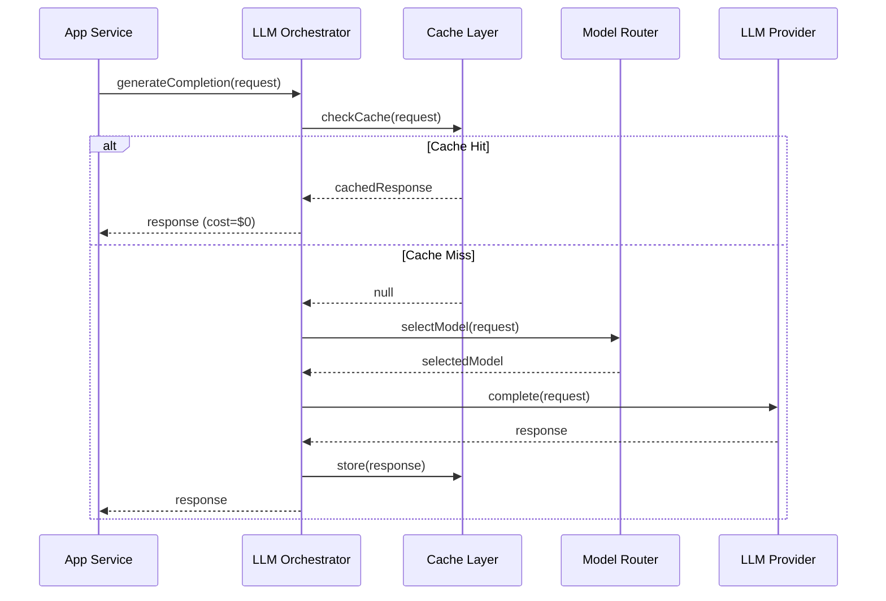
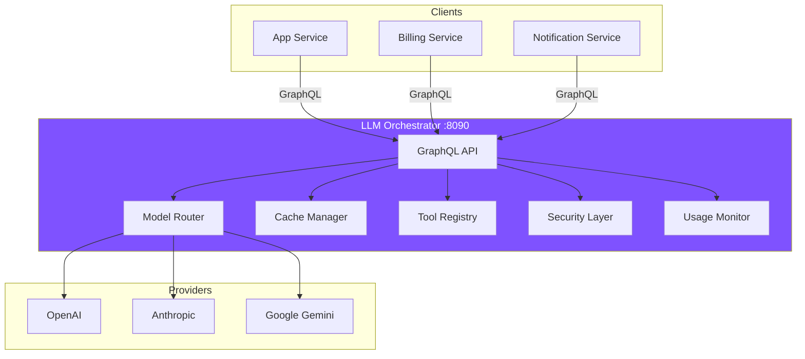

# LLM Orchestrator Service Documentation

> **Purpose**: Central hub for all LLM Orchestrator service documentation, architecture decisions, and implementation guidance.

## Overview

The **LLM Orchestrator Service** is a centralized intelligent routing layer for all Large Language Model (LLM) interactions in NeoTool. It provides a unified, provider-agnostic interface for AI capabilities across the platform.

### What It Does

- **Prompt Management**: Version-controlled prompt templates with A/B testing
- **Intelligent Routing**: Automatic model selection based on cost, performance, and features
- **Tool Calling**: Centralized registry for function calling and execution
- **Context Management**: Conversation history, memory, and token optimization
- **Caching**: Multi-level semantic caching to reduce costs
- **Cost Control**: Usage tracking, budgets, and rate limiting
- **Resilience**: Retries, fallbacks, circuit breakers
- **Security**: PII detection, content filtering, audit logging
- **Observability**: Comprehensive metrics on usage, costs, and performance

### Why It Exists

Without the orchestrator, each service would:
- ❌ Implement its own LLM client code (duplication)
- ❌ Be locked into specific providers (OpenAI, Anthropic, etc.)
- ❌ Have no visibility into costs per service/user/feature
- ❌ Lack fallback mechanisms when providers fail
- ❌ Implement its own caching, retries, rate limiting
- ❌ Have inconsistent security (PII handling)

With the orchestrator:
- ✅ Single API for all LLM interactions
- ✅ Provider-agnostic (switch providers via config)
- ✅ Centralized cost tracking and optimization
- ✅ Automatic failover and circuit breaking
- ✅ Shared caching and prompt optimization
- ✅ Consistent security and compliance

## Documentation

### Primary Documents

1. **[LLM Orchestrator Blueprint](./llm-orchestrator-blueprint.md)** ⭐
   - Complete service specification
   - Domain model and architecture
   - Routing strategy and caching
   - Tool calling framework
   - Security and observability
   - Implementation roadmap

2. **[ADR-0011: LLM Orchestrator Service](../../92-adr/0011-llm-orchestrator-service.md)** ⭐
   - Architecture decision rationale
   - Alternatives considered
   - Consequences and trade-offs
   - Migration strategy
   - Rollout plan

3. **[Implementation Backlog](./IMPLEMENTATION_BACKLOG.md)** 🚀
   - Open-source focused implementation plan
   - 10 phases, 90+ tasks
   - Uses Ollama (free, local LLM inference)
   - PostgreSQL caching (no Redis needed)
   - $0/month cost estimate
   - 16-week timeline (MVP in 7 weeks)

### Related Architecture Docs

- [Service Architecture](../../02-architecture/service-architecture.md) - Microservices patterns
- [API Architecture](../../02-architecture/api-architecture.md) - GraphQL Federation
- [Data Architecture](../../02-architecture/data-architecture.md) - Database patterns
- [ADR-0003: Kotlin/Micronaut Backend](../../92-adr/0003-kotlin-micronaut-backend.md) - Technology stack
- [ADR-0008: Interservice Security](../../92-adr/0008-interservice-security.md) - Service-to-service auth

## Quick Start Guide

### For Service Developers

**Use the orchestrator to add LLM capabilities to your service:**

```kotlin
// 1. Add GraphQL client dependency
@GraphQLClient("llm-orchestrator")
interface LLMOrchestratorClient {
    @GraphQLQuery
    suspend fun generateCompletion(input: CompletionInput): CompletionResponse
}

// 2. Inject and use
@Singleton
class MyService(private val llmClient: LLMOrchestratorClient) {

    suspend fun summarizeArticle(article: Article): String {
        val response = llmClient.generateCompletion(
            CompletionInput(
                promptId = "summarize-article",
                promptVariables = mapOf("article" to article.text),
                modelPreference = "gpt-4-turbo", // optional
                temperature = 0.3
            )
        )
        return response.content
    }
}
```

### For Prompt Engineers

**Create and version prompts:**

```graphql
mutation CreatePrompt {
  createPrompt(input: {
    name: "summarize-article"
    category: "content"
    template: """
      Summarize the following article in 3-5 bullet points.
      Focus on key insights and actionable takeaways.

      Article:
      {{article}}

      Summary:
    """
    variables: [
      { name: "article", type: "string", required: true }
    ]
  }) {
    id
    name
    activeVersion {
      version
    }
  }
}
```

### For Ops/DevOps

**Monitor usage and costs:**

```graphql
query ServiceUsage {
  serviceUsage(serviceId: "app-service", period: MONTHLY) {
    totalRequests
    totalTokens
    totalCost
    byModel {
      model
      requests
      cost
    }
  }
}
```

## Key Concepts

### Intelligent Routing

The orchestrator automatically selects the best model based on:

1. **Requirements**: Context window, required features (tools, vision, streaming)
2. **Cost**: Estimated cost per request
3. **Performance**: Historical latency (P50, P95, P99)
4. **Health**: Circuit breaker state, rate limit availability
5. **Custom Rules**: Override automatic selection for specific scenarios

**Example**: Request needs 8K tokens, supports tool calling, and should minimize cost:
- ✅ Select: `gpt-4-turbo` (8K context, tools, $0.01/1K tokens)
- ❌ Skip: `claude-3-opus` (8K context, tools, but $0.015/1K tokens)
- ❌ Skip: `gpt-3.5-turbo` (4K context - too small)

### Multi-Level Caching

1. **L1: Exact Match** (TTL: 5 min)
   - Cache key: `hash(prompt + messages + params)`
   - Use case: Identical repeated requests

2. **L2: Semantic Cache** (TTL: 1 hour)
   - Cache key: `semantic_hash(messages)`
   - Similarity threshold: 0.95
   - Use case: Similar questions with different wording

3. **L3: Prompt Cache** (TTL: 24 hours)
   - Cache common prompt responses
   - Parameterized templates

**Savings**: Cache hit = $0.00 cost (vs $0.01-0.15 per request)

### Fallback Chain

If primary model fails, automatically try fallbacks:

```
1. Primary:    GPT-4 Turbo     (best quality)
2. Fallback 1: Claude 3 Sonnet  (different provider)
3. Fallback 2: GPT-3.5 Turbo    (cheaper, faster)
4. Fallback 3: Error response   (graceful degradation)
```

### Tool Calling

Register tools once, use everywhere:

```kotlin
// Register tool
toolRegistry.register("web_search") { input ->
    val query = input["query"].asString()
    val results = searchService.search(query)
    JsonObject.of("results", results)
}

// LLM can now call the tool
val response = llmClient.generateCompletion(
    CompletionInput(
        messages = listOf(Message("user", "Search for Kotlin tutorials")),
        tools = listOf("web_search")
    )
)
// Orchestrator executes tool if LLM requests it
```

## Architecture Diagrams

### High-Level Flow



### Service Architecture



## Performance Characteristics

### Latency

- **Cache Hit**: ~5-10ms (L1), ~20-50ms (L2/L3)
- **Cache Miss**: Provider latency + routing overhead (~10-50ms)
- **Streaming**: First token in ~200-500ms

### Throughput

- **Target**: 1,000 requests/second per instance
- **Scaling**: Horizontal (add more instances)
- **Bottlenecks**: Provider rate limits, not orchestrator

### Cost Optimization

- **Cache hit rate**: 70-80% (typical)
- **Cost savings**: 70-80% reduction from caching alone
- **Routing savings**: Additional 10-20% from cheaper model selection

## Monitoring & Alerts

### Key Metrics

```promql
# Request rate
rate(llm_requests_total{service="app-service"}[5m])

# Error rate
rate(llm_requests_total{status="error"}[5m]) / rate(llm_requests_total[5m])

# Cache hit rate
rate(llm_cache_hits_total[5m]) / (rate(llm_cache_hits_total[5m]) + rate(llm_cache_miss_total[5m]))

# Cost per service
sum by (service) (llm_cost_total)

# Provider latency
histogram_quantile(0.95, llm_provider_latency_ms{provider="openai"})
```

### Alerts

- **High Error Rate**: >5% in 5min → Page on-call
- **Circuit Breaker Open**: Provider down → Alert team
- **High Latency**: P95 >10s → Investigate
- **Budget Threshold**: >80% used → Notify owner
- **Cache Miss Rate**: <50% → Investigate caching

## Security & Compliance

### PII Protection

```kotlin
// Automatic PII detection and redaction
val input = "My email is john@example.com and SSN is 123-45-6789"

// Before sending to provider
val detected = piiDetector.detect(input)
// Found: EMAIL, SSN

val redacted = piiDetector.redact(input)
// "My email is [EMAIL] and SSN is [SSN]"

// Original stored encrypted for audit
auditLog.log(
    original = encrypt(input),
    redacted = redacted,
    detectedPII = detected
)
```

### Content Filtering

- **Input validation**: Block harmful/inappropriate prompts
- **Output validation**: Filter harmful responses
- **Injection detection**: Detect prompt injection attempts

### Audit Trail

All LLM interactions logged:
- Who (service, user)
- What (prompt, input/output)
- When (timestamp)
- How much (tokens, cost)
- Which model
- Any security violations

## Common Use Cases

### 1. Content Generation

```kotlin
// Generate marketing copy
val copy = llmClient.generateCompletion(
    CompletionInput(
        promptId = "generate-marketing-copy",
        promptVariables = mapOf(
            "product" to product.name,
            "features" to product.features,
            "tone" to "professional"
        )
    )
)
```

### 2. Summarization

```kotlin
// Summarize transaction history
val summary = llmClient.generateCompletion(
    CompletionInput(
        promptId = "summarize-transactions",
        promptVariables = mapOf(
            "transactions" to transactions.toJson(),
            "period" to "last_month"
        )
    )
)
```

### 3. Classification

```kotlin
// Classify support ticket
val classification = llmClient.generateCompletion(
    CompletionInput(
        promptId = "classify-support-ticket",
        promptVariables = mapOf("ticket" to ticket.description),
        tools = listOf("get_ticket_history") // Use historical data
    )
)
```

### 4. Extraction

```kotlin
// Extract structured data from text
val extracted = llmClient.generateCompletion(
    CompletionInput(
        promptId = "extract-invoice-data",
        promptVariables = mapOf("invoice" to invoiceText),
        maxTokens = 500
    )
)
```

### 5. Conversational AI

```kotlin
// Multi-turn conversation
val conversation = llmClient.createConversation(metadata = mapOf("user" to userId))

llmClient.addMessage(conversation.id, Message("user", "What's my account balance?"))
llmClient.addMessage(conversation.id, Message("user", "Show me top 5 expenses this month"))

val response = llmClient.generateCompletion(
    CompletionInput(
        conversationId = conversation.id,
        tools = listOf("get_balance", "get_transactions")
    )
)
```

## Best Practices

### Prompt Engineering

1. **Use versioned prompts** - Don't hardcode prompts in code
2. **Test prompt variations** - A/B test to find best performing
3. **Include examples** - Few-shot learning improves quality
4. **Be specific** - Clear instructions = better results
5. **Set constraints** - Specify length, format, tone

### Cost Optimization

1. **Cache aggressively** - Most requests can be cached
2. **Choose right model** - Don't use GPT-4 for simple tasks
3. **Set token limits** - Prevent runaway generation
4. **Use streaming** - Stop generation early if answer found
5. **Monitor usage** - Track costs per feature/user

### Security

1. **Never log raw input** - Always redact PII first
2. **Validate output** - Don't blindly trust LLM responses
3. **Use timeouts** - Prevent hanging requests
4. **Rate limit users** - Prevent abuse
5. **Audit everything** - Compliance requirements

## Troubleshooting

### High Latency

**Symptoms**: P95 latency >10s

**Possible Causes**:
- Provider slowness (check provider health)
- Large context windows (reduce if possible)
- Cache misses (improve cache hit rate)
- Tool executions timing out

**Solutions**:
- Switch to faster model (GPT-3.5 vs GPT-4)
- Reduce max_tokens
- Pre-warm cache for common queries
- Optimize tool execution time

### High Error Rate

**Symptoms**: >5% errors

**Possible Causes**:
- Provider rate limiting
- Invalid API keys
- Malformed requests
- Provider outage

**Solutions**:
- Check circuit breaker states
- Verify provider credentials
- Review error logs for patterns
- Switch to backup provider

### High Costs

**Symptoms**: Costs higher than expected

**Possible Causes**:
- Low cache hit rate
- Using expensive models unnecessarily
- Large context windows
- High user activity

**Solutions**:
- Investigate cache misses
- Review routing rules (use cheaper models)
- Implement stricter rate limits
- Set per-service budgets

## Roadmap

### v1.0 (Foundation) - Q1 2026
- ✅ Basic completion API
- ✅ OpenAI provider integration
- ✅ Prompt management
- ✅ Exact-match caching
- ✅ Cost tracking

### v1.1 (Resilience) - Q2 2026
- ⏳ Multi-provider support (Anthropic, Google)
- ⏳ Intelligent routing
- ⏳ Circuit breakers
- ⏳ Fallback chains

### v1.2 (Advanced) - Q2 2026
- 🔮 Tool calling framework
- 🔮 Semantic caching
- 🔮 Streaming support
- 🔮 PII detection

### v2.0 (Scale) - Q3 2026
- 🔮 Conversation management
- 🔮 A/B testing framework
- 🔮 Advanced analytics
- 🔮 Self-service admin UI

Legend: ✅ Complete | ⏳ In Progress | 🔮 Planned

## Getting Help

### Documentation

- **Blueprint**: [llm-orchestrator-blueprint.md](./llm-orchestrator-blueprint.md)
- **ADR**: [0011-llm-orchestrator-service.md](../../92-adr/0011-llm-orchestrator-service.md)
- **GraphQL Schema**: `services/kotlin/assistant/schema.graphql`

### Team Contacts

- **Owner**: AI Platform Team
- **Slack**: `#llm-orchestrator`
- **On-call**: PagerDuty rotation

### Contributing

See [CONTRIBUTING.md](../../../../CONTRIBUTING.md) for:
- How to add new providers
- How to register custom tools
- How to create new prompts
- Development setup

---

**Version**: 1.0.0 (2026-02-05)
**Status**: Draft - Implementation in progress
**Last Updated**: 2026-02-05

*Build intelligent features with confidence.*
