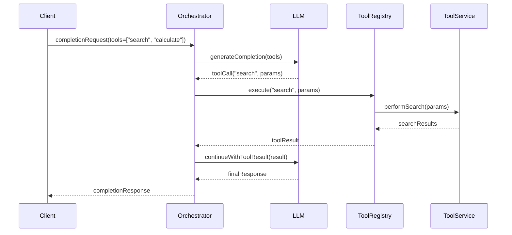

# LLM Orchestrator Service Blueprint

## Module Name Recommendation

**Recommended module name:** `llm-orchestrator` (or `ai-orchestrator`)

Why this is the best fit:
- Centralized service for all LLM interactions across the platform
- Provider-agnostic design supports multiple LLM providers (OpenAI, Anthropic, Google, etc.)
- Handles cross-cutting concerns: routing, caching, observability, cost management
- Aligns with microservices architecture as a supporting domain service

## Overview

The `llm-orchestrator` service is a **centralized intelligent routing layer** for all LLM interactions in NeoTool. It abstracts LLM provider complexity, manages prompts as versioned assets, handles tool/function calling, optimizes costs through intelligent routing and caching, and provides comprehensive observability.

**Core responsibilities:**
- **Prompt Management**: Versioned prompt templates with variables and A/B testing
- **Provider Routing**: Intelligent model selection based on cost, performance, and features
- **Tool Calling**: Centralized registry and execution of function calling
- **Context Management**: Conversation history, memory, and RAG integration
- **Resilience**: Retries, fallbacks, circuit breakers, rate limiting
- **Caching**: Semantic caching for repeated queries
- **Observability**: Token tracking, cost attribution, latency metrics
- **Security**: PII detection, input/output validation, content filtering

## Goals

- Provide a **single, consistent interface** for all services that need LLM capabilities
- **Abstract provider complexity**: Switch providers without changing client code
- **Optimize costs**: Intelligent routing to cheapest model that meets requirements
- **Ensure reliability**: Automatic retries, fallback chains, circuit breakers
- **Track everything**: Token usage, costs, latency, quality metrics per service/user/feature
- **Enable experimentation**: A/B test prompts, models, and parameters
- **Maintain security**: PII redaction, content filtering, audit logging
- **Support streaming**: Real-time token-by-token responses for better UX

## Non-Goals (v1)

- Fine-tuning or training custom models
- Embedding generation and vector search (separate service)
- Complex multi-agent workflows (future enhancement)
- Image/video generation (focus on text completion first)
- Model hosting (use external providers only)

## Bounded Context and Ownership

`llm-orchestrator` owns:
- Prompt catalog (`Prompt`, `PromptVersion`, `PromptVariable`)
- Provider configurations and credentials
- Tool/function registry and execution
- Completion requests and responses (audit trail)
- Cost tracking and budgeting
- Cache management (semantic + exact match)
- Rate limit enforcement per client/user

`llm-orchestrator` does **not** own:
- Application business logic (client services)
- User authentication (security service)
- Embeddings and vector storage (future embedding service)
- Training data or fine-tuning (if added, separate service)

## Core Domain Model (v1)

### Main Entities

#### Prompt Management

- **`Prompt`**
  - `id`, `name`, `category`, `description`, `tags`
  - `createdBy`, `createdAt`, `updatedAt`

- **`PromptVersion`**
  - `id`, `promptId`, `version`, `status` (`draft`, `active`, `deprecated`)
  - `template`, `variables`, `metadata`
  - `modelRequirements` (min context, required features)
  - `performanceMetrics` (avg latency, success rate)

- **`PromptVariable`**
  - `name`, `type`, `required`, `defaultValue`, `validation`

#### Provider Management

- **`LLMProvider`**
  - `id`, `name`, `type` (`OPENAI`, `ANTHROPIC`, `GOOGLE`, `AZURE`, etc.)
  - `baseUrl`, `apiKeyRef`, `status`, `priority`

- **`LLMModel`**
  - `id`, `providerId`, `modelName`, `displayName`
  - `capabilities` (streaming, tools, vision, etc.)
  - `contextWindow`, `maxOutputTokens`
  - `costPerInputToken`, `costPerOutputToken`
  - `latencyP50`, `latencyP95`, `latencyP99`
  - `status` (`active`, `deprecated`, `disabled`)

- **`ModelRoutingRule`**
  - `id`, `priority`, `conditions`, `targetModelId`
  - `enabled`, `description`

#### Completion Management

- **`CompletionRequest`**
  - `id`, `requestedBy` (service/user), `promptId`, `promptVersionId`
  - `messages`, `variables`, `modelPreference`
  - `options` (temperature, maxTokens, stream, tools)
  - `metadata`, `createdAt`

- **`CompletionResponse`**
  - `id`, `requestId`, `providerId`, `modelId`
  - `response`, `finishReason`, `usage` (tokens)
  - `latencyMs`, `cost`, `cached`
  - `completedAt`

- **`CompletionError`**
  - `id`, `requestId`, `errorType`, `errorMessage`, `retryCount`
  - `occurredAt`

#### Tool Calling

- **`Tool`**
  - `id`, `name`, `description`, `category`
  - `inputSchema` (JSON Schema), `outputSchema`
  - `executorService`, `executorEndpoint`
  - `timeout`, `retryPolicy`

- **`ToolExecution`**
  - `id`, `completionRequestId`, `toolId`
  - `input`, `output`, `status`, `error`
  - `latencyMs`, `executedAt`

#### Caching

- **`CacheEntry`**
  - `id`, `cacheKey` (semantic hash), `promptHash`, `messagesHash`
  - `cachedResponse`, `modelId`, `hitCount`
  - `expiresAt`, `createdAt`, `lastAccessedAt`

#### Cost & Usage

- **`UsageLog`**
  - `id`, `requestId`, `service`, `userId`, `feature`
  - `promptTokens`, `completionTokens`, `totalTokens`
  - `cost`, `modelId`, `timestamp`

- **`UsageBudget`**
  - `id`, `scope` (`global`, `service`, `user`), `scopeId`
  - `period` (`daily`, `weekly`, `monthly`), `limitAmount`
  - `currentUsage`, `alertThreshold`

### Critical Relationships

- One `Prompt` has many `PromptVersion` records
- One active `Prompt` has exactly one active `PromptVersion`
- One `CompletionRequest` has one `CompletionResponse` (1:1)
- One `CompletionRequest` may have many `ToolExecution` records
- One `LLMProvider` has many `LLMModel` records
- One `CacheEntry` can serve many `CompletionRequest` records

## Intelligent Routing Strategy

### Routing Decision Factors

The orchestrator selects models based on:

1. **Requirements Matching**
   - Context window needed vs available
   - Required features (tools, streaming, vision)
   - Model capability constraints

2. **Cost Optimization**
   - Cost per token (input + output)
   - Estimated total cost for request
   - Budget remaining for scope

3. **Performance**
   - Historical latency (P50, P95, P99)
   - Current provider health (circuit breaker state)
   - Rate limit availability

4. **Quality**
   - Historical success rate
   - Task-specific performance metrics
   - User feedback scores

### Routing Algorithm (simplified)

```kotlin
fun selectModel(request: CompletionRequest): LLMModel {
    // 1. Filter by hard requirements
    val candidates = models.filter { model ->
        model.contextWindow >= request.estimatedTokens &&
        model.capabilities.containsAll(request.requiredFeatures) &&
        model.status == ACTIVE
    }

    // 2. Apply routing rules
    val ruleMatched = routingRules
        .filter { it.enabled }
        .sortedByDescending { it.priority }
        .firstOrNull { it.matches(request) }
        ?.targetModelId

    if (ruleMatched != null) return getModel(ruleMatched)

    // 3. Score by cost + performance
    val scored = candidates.map { model ->
        val costScore = 1.0 / (model.estimatedCost(request) + 0.01)
        val perfScore = 1.0 / (model.latencyP95 + 1.0)
        val healthScore = circuitBreaker.healthScore(model.provider)

        model to (costScore * 0.5 + perfScore * 0.3 + healthScore * 0.2)
    }

    // 4. Return highest scoring available model
    return scored.maxByOrNull { it.second }?.first
        ?: throw NoAvailableModelException()
}
```

### Fallback Chain Example

```
Primary:    GPT-4 Turbo
Fallback 1: Claude 3 Sonnet
Fallback 2: GPT-3.5 Turbo
Fallback 3: Error response
```

## Tool Calling Architecture

### Tool Registry Pattern

```kotlin
interface ToolExecutor {
    suspend fun execute(input: JsonObject): Result<JsonObject>
}

@Singleton
class ToolRegistry {
    private val executors = mutableMapOf<String, ToolExecutor>()

    fun register(toolName: String, executor: ToolExecutor)

    fun execute(toolName: String, input: JsonObject): Result<JsonObject> {
        return executors[toolName]?.execute(input)
            ?: Result.failure(ToolNotFoundException(toolName))
    }
}
```

### Tool Calling Flow



### Built-in Tools (v1)

- `web_search`: Search web (via search service)
- `database_query`: Query structured data (with safety checks)
- `calculate`: Math calculations
- `get_current_time`: Time/date utilities
- `send_notification`: Trigger notifications

## Context Management

### Conversation Memory

```kotlin
data class Conversation {
    val id: UUID
    val userId: UUID
    val messages: List<Message>
    val metadata: Map<String, Any>
    val createdAt: Instant
    val expiresAt: Instant
}

data class Message {
    val role: MessageRole // USER, ASSISTANT, SYSTEM, TOOL
    val content: String
    val toolCalls: List<ToolCall>? = null
    val timestamp: Instant
}

interface ConversationStore {
    suspend fun saveMessage(conversationId: UUID, message: Message)
    suspend fun getConversation(conversationId: UUID): Conversation
    suspend fun truncateToFit(messages: List<Message>, maxTokens: Int): List<Message>
}
```

### Token Management Strategy

1. **Estimate tokens** before sending to LLM
2. **Truncate intelligently** if over context window:
   - Always keep system prompt
   - Keep recent N messages
   - Summarize middle messages
   - Preserve tool call sequences
3. **Track cumulative usage** per conversation

## Caching Strategy

### Multi-Level Caching

#### Level 1: Exact Match Cache
- Cache key: `hash(prompt + messages + parameters)`
- TTL: 5 minutes
- Use case: Identical repeated requests

#### Level 2: Semantic Cache
- Cache key: `semantic_hash(messages)`
- Similarity threshold: 0.95
- TTL: 1 hour
- Use case: Similar questions with different wording

#### Level 3: Prompt-Level Cache
- Cache common prompt responses
- Parameterized templates
- TTL: 24 hours

### Cache Invalidation

- Time-based expiration (TTL)
- Manual invalidation for sensitive data
- Version-based invalidation when prompt updated

## Rate Limiting

### Multi-Tier Rate Limits

```kotlin
data class RateLimit(
    val scope: RateLimitScope, // GLOBAL, PROVIDER, SERVICE, USER
    val scopeId: String,
    val windowSize: Duration,
    val maxRequests: Int,
    val maxTokens: Long
)

interface RateLimiter {
    suspend fun checkLimit(scope: RateLimitScope, scopeId: String): RateLimitResult
    suspend fun recordUsage(scope: RateLimitScope, scopeId: String, tokens: Long)
}
```

### Rate Limit Hierarchy

1. **Provider Level**: Respect provider rate limits (OpenAI, Anthropic, etc.)
2. **Service Level**: Limit per client service (prevent runaway costs)
3. **User Level**: Limit per end-user (fair usage)
4. **Feature Level**: Limit per feature (budget allocation)

## Resilience Patterns

### Retry Strategy

```kotlin
data class RetryPolicy(
    val maxAttempts: Int = 3,
    val initialDelay: Duration = 1.seconds,
    val maxDelay: Duration = 30.seconds,
    val multiplier: Double = 2.0,
    val retryableErrors: Set<ErrorType> = setOf(
        ErrorType.RATE_LIMIT,
        ErrorType.TIMEOUT,
        ErrorType.SERVER_ERROR
    )
)
```

### Circuit Breaker

```kotlin
data class CircuitBreakerConfig(
    val failureThreshold: Int = 5,
    val successThreshold: Int = 2,
    val timeout: Duration = 60.seconds,
    val halfOpenRequests: Int = 1
)

enum class CircuitState {
    CLOSED,      // Normal operation
    OPEN,        // Failing, reject requests
    HALF_OPEN    // Testing if recovered
}
```

### Fallback Chain

For each request, define fallback sequence:
1. Try primary model
2. If fails, try fallback model
3. If all fail, return cached response (if available)
4. If no cache, return graceful error

## Security & Compliance

### PII Detection & Redaction

```kotlin
interface PIIDetector {
    fun detectPII(text: String): List<PIIMatch>
    fun redact(text: String): String
}

data class PIIMatch(
    val type: PIIType, // EMAIL, PHONE, SSN, CREDIT_CARD, etc.
    val value: String,
    val startIndex: Int,
    val endIndex: Int
)
```

**Processing flow:**
1. Detect PII in input
2. Log detection (audit)
3. Redact before sending to external LLM
4. Store original (encrypted) for compliance
5. Never log unredacted data

### Content Filtering

```kotlin
interface ContentFilter {
    fun validateInput(text: String): ValidationResult
    fun validateOutput(text: String): ValidationResult
}

data class ValidationResult(
    val allowed: Boolean,
    val violations: List<ContentViolation>,
    val sanitizedContent: String? = null
)

enum class ContentViolationType {
    HARMFUL, EXPLICIT, SPAM, INJECTION_ATTEMPT
}
```

### Audit Logging

Log all LLM interactions:
- Request initiator (service, user)
- Prompt used (version)
- Input/output (redacted)
- Model used, tokens, cost
- Any security violations
- Retention: 90 days (configurable)

## Suggested GraphQL Surface (v1)

### Queries

```graphql
type Query {
  # Prompt management
  prompts(category: String, tags: [String!]): [Prompt!]!
  prompt(id: ID!): Prompt
  promptVersions(promptId: ID!): [PromptVersion!]!

  # Usage tracking
  myUsage(period: UsagePeriod!): UsageStats!
  serviceUsage(serviceId: String!, period: UsagePeriod!): UsageStats!

  # Tool registry
  availableTools: [Tool!]!

  # Model catalog
  availableModels(capabilities: [ModelCapability!]): [LLMModel!]!
}

type Prompt {
  id: ID!
  name: String!
  category: String!
  description: String
  activeVersion: PromptVersion
  versions: [PromptVersion!]!
  createdAt: DateTime!
}

type PromptVersion {
  id: ID!
  version: Int!
  template: String!
  variables: [PromptVariable!]!
  status: PromptVersionStatus!
  performanceMetrics: PerformanceMetrics
}

type UsageStats {
  totalRequests: Int!
  totalTokens: Long!
  totalCost: Decimal!
  byModel: [ModelUsage!]!
  byFeature: [FeatureUsage!]!
}

type LLMModel {
  id: ID!
  name: String!
  provider: String!
  capabilities: [ModelCapability!]!
  contextWindow: Int!
  costPerInputToken: Decimal!
  costPerOutputToken: Decimal!
  averageLatency: Int!
}
```

### Mutations

```graphql
type Mutation {
  # Main completion endpoint
  generateCompletion(input: CompletionInput!): CompletionResponse!

  # Streaming variant (subscription)
  # streamCompletion(input: CompletionInput!): CompletionChunk!

  # Conversation management
  createConversation(metadata: JSON): Conversation!
  addMessage(conversationId: ID!, message: MessageInput!): Conversation!

  # Prompt management (admin)
  createPrompt(input: CreatePromptInput!): Prompt!
  publishPromptVersion(promptId: ID!, versionId: ID!): PromptVersion!

  # Tool registration (admin)
  registerTool(input: RegisterToolInput!): Tool!

  # Budget management (admin)
  setUsageBudget(input: SetBudgetInput!): UsageBudget!
}

input CompletionInput {
  promptId: ID
  promptVariables: JSON
  messages: [MessageInput!]
  conversationId: ID

  # Model selection
  modelPreference: String
  requiredCapabilities: [ModelCapability!]

  # Parameters
  temperature: Float
  maxTokens: Int
  stream: Boolean

  # Tools
  tools: [String!]

  # Context
  metadata: JSON
}

type CompletionResponse {
  id: ID!
  content: String!
  finishReason: String!
  usage: TokenUsage!
  model: String!
  latencyMs: Int!
  cost: Decimal!
  cached: Boolean!
  toolCalls: [ToolCall!]
}
```

### Subscriptions

```graphql
type Subscription {
  # Streaming completions
  completionStream(input: CompletionInput!): CompletionChunk!

  # Usage alerts
  usageAlerts(serviceId: String): UsageAlert!
}

type CompletionChunk {
  delta: String!
  finishReason: String
  usage: TokenUsage
}
```

## Data and Constraints (database)

### Recommended Constraints

- Unique `(promptId, version)` for prompt versions
- Unique `(provider, modelName)` for models
- One active prompt version per prompt: `UNIQUE WHERE status = 'active'`
- Foreign keys: `completionResponse.requestId` → `completionRequest.id`
- Check constraint: `cost >= 0`, `tokens >= 0`
- Audit timestamps on all tables

### Recommended Indexing

```sql
-- Completion tracking
CREATE INDEX idx_completion_requests_service_created
  ON completion_requests(requested_by_service, created_at DESC);

CREATE INDEX idx_completion_responses_model_completed
  ON completion_responses(model_id, completed_at DESC);

-- Usage analytics
CREATE INDEX idx_usage_log_service_timestamp
  ON usage_log(service, timestamp DESC);

CREATE INDEX idx_usage_log_user_timestamp
  ON usage_log(user_id, timestamp DESC);

-- Caching
CREATE INDEX idx_cache_entry_key_expires
  ON cache_entry(cache_key, expires_at);

CREATE INDEX idx_cache_entry_expires
  ON cache_entry(expires_at) WHERE expires_at > NOW();

-- Tool execution
CREATE INDEX idx_tool_execution_request
  ON tool_execution(completion_request_id);
```

## Observability

### Metrics

#### Request Metrics
- `llm_requests_total{service, model, status}`
- `llm_request_duration_ms{service, model, p50, p95, p99}`
- `llm_cache_hits_total{cache_level}`
- `llm_cache_miss_total{cache_level}`

#### Token Metrics
- `llm_tokens_total{service, model, token_type}`
- `llm_cost_total{service, model}`

#### Provider Metrics
- `llm_provider_errors_total{provider, error_type}`
- `llm_provider_latency_ms{provider, p50, p95, p99}`
- `llm_circuit_breaker_state{provider}`

#### Tool Metrics
- `llm_tool_executions_total{tool, status}`
- `llm_tool_latency_ms{tool, p50, p95, p99}`

### Alerts

- **High error rate**: >5% errors in 5min window
- **Circuit breaker open**: Provider unavailable
- **High latency**: P95 > 10s
- **Budget threshold**: >80% of budget consumed
- **Rate limit approaching**: >90% of rate limit used
- **Cache miss rate**: <70% hit rate (investigate)
- **PII detection spike**: Unusual PII detections (security)

### Logging

```kotlin
// Structured logging
log.info(
    "completion_request",
    "service" to service,
    "promptId" to promptId,
    "model" to model,
    "estimatedTokens" to estimatedTokens
)

log.info(
    "completion_response",
    "requestId" to requestId,
    "model" to model,
    "tokens" to tokens,
    "latencyMs" to latencyMs,
    "cost" to cost,
    "cached" to cached
)
```

## Provider Abstraction Layer

### Provider Interface

```kotlin
interface LLMProviderClient {
    suspend fun complete(request: ProviderCompletionRequest): ProviderCompletionResponse
    suspend fun streamComplete(request: ProviderCompletionRequest): Flow<ProviderCompletionChunk>
    fun estimateTokens(text: String): Int
    fun validateApiKey(): Boolean
}

data class ProviderCompletionRequest(
    val model: String,
    val messages: List<ProviderMessage>,
    val temperature: Double? = null,
    val maxTokens: Int? = null,
    val tools: List<ProviderTool>? = null,
    val stream: Boolean = false
)

data class ProviderCompletionResponse(
    val id: String,
    val content: String,
    val finishReason: String,
    val usage: ProviderTokenUsage,
    val toolCalls: List<ProviderToolCall>? = null
)
```

### Provider Implementations (v1)

- `OpenAIProviderClient` - OpenAI (GPT-4, GPT-3.5)
- `AnthropicProviderClient` - Anthropic (Claude 3.x)
- `GoogleProviderClient` - Google (Gemini)
- `AzureOpenAIProviderClient` - Azure OpenAI
- `MockProviderClient` - Testing

### Message Format Normalization

Each provider has different message formats. The orchestrator normalizes:

```kotlin
// Internal format
data class Message(
    val role: MessageRole,
    val content: String,
    val name: String? = null,
    val toolCalls: List<ToolCall>? = null,
    val toolCallId: String? = null
)

// Provider-specific mapping
fun Message.toOpenAI(): OpenAIChatMessage
fun Message.toAnthropic(): AnthropicMessage
fun OpenAIChatMessage.toInternal(): Message
fun AnthropicMessage.toInternal(): Message
```

## Rollout Plan

### Phase 0 - Foundation
- ✅ Design domain model and database schema
- ✅ Create provider abstraction interfaces
- ✅ Implement mock provider for testing
- ✅ Set up observability (metrics, logging)

### Phase 1 - Basic Completion
- Implement OpenAI provider client
- Build basic completion endpoint (no streaming)
- Add exact-match caching
- Implement token counting and cost tracking
- Set up basic rate limiting

### Phase 2 - Prompt Management
- Implement prompt catalog (CRUD)
- Add prompt versioning
- Build prompt template rendering
- Add prompt performance tracking

### Phase 3 - Resilience & Routing
- Implement retry logic with exponential backoff
- Add circuit breaker for providers
- Build intelligent model routing
- Implement fallback chains
- Add semantic caching

### Phase 4 - Tool Calling
- Implement tool registry
- Add tool calling support (OpenAI format)
- Build tool execution framework
- Add built-in tools (search, calculate, etc.)

### Phase 5 - Multi-Provider
- Add Anthropic provider client
- Add Google provider client
- Implement provider health monitoring
- Build provider failover logic

### Phase 6 - Advanced Features
- Add streaming support (SSE/WebSocket)
- Implement conversation management
- Add context window management
- Build PII detection and redaction
- Implement content filtering

### Phase 7 - Production Hardening
- Add comprehensive error handling
- Implement audit logging
- Set up alerting and dashboards
- Build admin tools (prompt management UI)
- Create runbooks for operations

### Phase 8 - Optimization
- Optimize caching strategies
- Fine-tune routing algorithms
- Implement usage-based budgeting
- Add A/B testing framework for prompts
- Build cost optimization recommendations

## Open Decisions

### To Be Decided

1. **Prompt Storage**: Database vs file-based (Git) vs hybrid?
2. **Streaming Transport**: SSE vs WebSocket vs gRPC streams?
3. **Cache Backend**: Redis vs PostgreSQL vs Memcached?
4. **Embedding Service**: Same orchestrator or separate service?
5. **Multi-tenancy**: Shared vs isolated provider credentials?
6. **Token Estimation**: Use tiktoken, provider APIs, or custom?
7. **Tool Execution**: Sync vs async? Timeout strategy?
8. **Cost Attribution**: Service-level only or drill down to user/feature?
9. **Conversation TTL**: Default retention period for context?
10. **Prompt A/B Testing**: Built-in or external experimentation platform?

### Trade-offs to Consider

| Decision | Option A | Option B | Recommendation |
|----------|----------|----------|----------------|
| **Prompt Storage** | Database (PostgreSQL) | Git repository | **Database** - Easier versioning, querying, and runtime access |
| **Caching** | Redis (separate) | PostgreSQL (same DB) | **PostgreSQL** - Simpler ops, fewer dependencies. Redis if >1M requests/day |
| **Streaming** | SSE (HTTP) | WebSocket | **SSE** - Simpler, auto-reconnect, firewall-friendly |
| **Provider Credentials** | Per-service keys | Shared keys | **Shared keys** initially, per-service for advanced use cases |
| **Tool Execution** | Synchronous (blocking) | Asynchronous (queue) | **Sync** initially, async for long-running tools (>5s) |

## Suggested Next Artifacts

- `docs/03-features/ai/llm-orchestrator/DECISIONS.md` - Trade-offs and technical decisions
- `docs/03-features/ai/llm-orchestrator/api-examples.md` - GraphQL usage examples
- `docs/03-features/ai/llm-orchestrator/runbook.md` - Operations and incident handling
- `docs/03-features/ai/llm-orchestrator/provider-integration-guide.md` - How to add new providers
- `docs/92-adr/0011-llm-orchestrator-service.md` - Architecture Decision Record
- `services/kotlin/assistant/schema.graphql` - GraphQL schema
- `services/kotlin/assistant/src/main/resources/db/migration/V001__initial_schema.sql` - Database schema

## References

- [OpenAI API Documentation](https://platform.openai.com/docs/api-reference)
- [Anthropic Claude API](https://docs.anthropic.com/claude/reference)
- [Google Gemini API](https://ai.google.dev/docs)
- [LangChain Architecture Patterns](https://python.langchain.com/docs/get_started/introduction)
- [Semantic Kernel](https://learn.microsoft.com/en-us/semantic-kernel/overview/)
- [AWS Bedrock](https://docs.aws.amazon.com/bedrock/)
- [Azure OpenAI Service](https://learn.microsoft.com/en-us/azure/ai-services/openai/)
