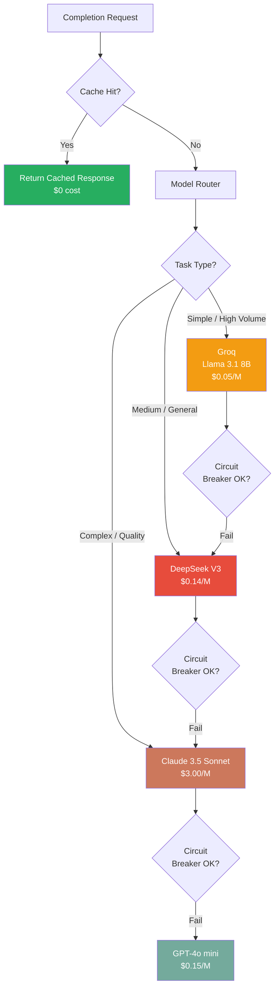

# LLM Provider Market Analysis (2026)

> **Purpose**: Decide between self-hosting (Ollama/vLLM) vs using cloud LLM APIs.
> Help decide which provider(s) to use as primary and fallback in the `assistant` service.

## TL;DR Recommendation

**Don't self-host. Use managed APIs.**

Cloud LLM pricing dropped ~50x per year since 2023. What cost $30/M tokens in 2023 now costs under $1/M. The economics of self-hosting no longer hold for most teams unless privacy is non-negotiable or volume is extremely high.

**Recommended stack for NeoTool:**

| Role | Provider | Model | Cost |
|------|----------|-------|------|
| **Primary** | DeepSeek or Groq | DeepSeek-V3 / Llama 3.1 70B | $0.14–0.59/M input |
| **Complex tasks** | Anthropic | Claude 3.5 Sonnet | $3.00/M input |
| **Dev / testing** | Groq | Llama 3.1 8B | $0.05/M input (near-free) |
| **Self-hosted (optional)** | Ollama | Llama 3.2 / Mistral | $0 API, hardware cost |

---

## Pricing Comparison (Feb 2026)

### Cloud Providers

| Provider | Model | Input $/M | Output $/M | Context | Tool Calling | Speed |
|----------|-------|-----------|------------|---------|-------------|-------|
| **DeepSeek** | V3 | $0.14 | $0.28 | 64K | ✅ | Fast |
| **DeepSeek** | R1 (reasoning) | $0.55 | $2.19 | 64K | ✅ | Medium |
| **Gemini** | 1.5 Flash | $0.075 | $0.30 | 1M | ✅ | Very Fast |
| **Gemini** | 2.0 Flash | $0.10 | $0.40 | 1M | ✅ | Very Fast |
| **Mistral** | Nemo | $0.02 | $0.04 | 131K | ✅ | Fast |
| **Mistral** | Medium 3 | $0.40 | $2.00 | 131K | ✅ | Fast |
| **Groq** | Llama 3.1 8B | $0.05 | $0.08 | 128K | ✅ | Fastest (~1000 t/s) |
| **Groq** | Llama 3.1 70B | $0.59 | $0.79 | 128K | ✅ | Very Fast (~500 t/s) |
| **Together AI** | Llama 3.1 70B | ~$0.50 | ~$0.50 | 128K | ✅ | Fast |
| **OpenAI** | GPT-4o mini | $0.15 | $0.60 | 128K | ✅ | Fast |
| **OpenAI** | GPT-4o | $2.50 | $10.00 | 128K | ✅ | Fast |
| **Anthropic** | Claude 3.5 Haiku | $1.00 | $5.00 | 200K | ✅ | Fast |
| **Anthropic** | Claude 3.5 Sonnet | $3.00 | $15.00 | 200K | ✅ | Medium |
| **Anthropic** | Claude Opus 4.6 | $5.00 | $25.00 | 1M | ✅ | Medium |
| **Cohere** | Command R+ | $2.50 | $10.00 | 128K | ✅ | Fast |

#### Savings Multipliers (apply on top of base pricing)

| Optimization | Discount | Where Available |
|-------------|----------|----------------|
| **Prompt caching** | 50–90% on repeated context | Anthropic, OpenAI |
| **Batch API** | 50% on all tokens | Anthropic, OpenAI, Google, Groq |
| **Off-peak hours** | Up to 75% | DeepSeek (16:30–00:30 GMT) |
| **Cache hit (DeepSeek V3)** | ~74% off ($0.07 vs $0.27) | DeepSeek |

---

### Self-Hosted Options

| Option | Model | API Cost | Hardware Cost | Setup | Throughput |
|--------|-------|----------|---------------|-------|------------|
| **Ollama** | Llama 3.2 3B | $0 | Low (8GB VRAM) | Easy | ~50–200 t/s (GPU) |
| **Ollama** | Mistral 7B | $0 | Low (8GB VRAM) | Easy | ~30–100 t/s (GPU) |
| **Ollama** | Llama 3.1 70B | $0 | High (48GB VRAM) | Easy | ~10–30 t/s (GPU) |
| **vLLM** | Any HuggingFace | $0 | Medium-High | Complex | 14–24x higher than HF |

#### Real Hardware Costs (Monthly)

| Hardware | RAM/VRAM | Suitable Models | Monthly Cost (cloud) |
|----------|----------|-----------------|---------------------|
| CPU only (8 cores) | 32 GB RAM | Llama 3.2 3B | ~$50–80 (VPS) |
| NVIDIA RTX 3080 | 10 GB VRAM | Llama 3.2 3B | ~$100–150 (GPU VPS) |
| NVIDIA RTX 4090 | 24 GB VRAM | Llama 3.1 8B, Mistral 7B | ~$300–500 (GPU VPS) |
| NVIDIA A100 40GB | 40 GB VRAM | Llama 3.1 70B (quantized) | ~$2,000–3,000/month |
| 2× A100 80GB | 160 GB VRAM | Llama 3.1 405B | ~$6,000–8,000/month |

> **Note**: If using your own hardware (not cloud), hardware cost amortizes over 3–5 years but you also pay for power, maintenance, and your team's time.

---

## Cost Scenario Analysis

Assumptions: 70% cache hit rate (with our caching layer), 70% input / 30% output token split.

### Scenario A: Light Usage (10K requests/month, avg 1K tokens each)

| Option | Monthly Cost | Notes |
|--------|-------------|-------|
| Ollama (self-hosted) | ~$50–150 | VPS cost |
| DeepSeek V3 | ~$0.42 | Near-zero |
| Gemini 1.5 Flash | ~$0.225 | Cheapest cloud |
| Groq Llama 8B | ~$0.15 | Cheapest + fastest |
| Claude 3.5 Haiku | ~$3.00 | Good balance |
| GPT-4o | ~$7.50 | Most expensive listed |

**Winner: Cloud (Groq/DeepSeek/Gemini) — self-hosting doesn't make sense at this scale**

---

### Scenario B: Medium Usage (1M requests/month, avg 1K tokens each)

| Option | Monthly Cost | Notes |
|--------|-------------|-------|
| Ollama (self-hosted RTX 4090) | ~$300–500 | Hardware/VPS + overhead |
| DeepSeek V3 | ~$42 | Extremely cheap |
| Gemini 1.5 Flash | ~$22.50 | Even cheaper |
| Groq Llama 8B | ~$15 | Near-zero |
| Claude 3.5 Haiku | ~$300 | Comparable to self-host |
| GPT-4o | ~$750 | Much more expensive |

**Winner: Cloud (Groq/DeepSeek/Gemini) — still cheaper than self-hosting with better reliability**

---

### Scenario C: High Volume (10M requests/month, avg 1K tokens each)

| Option | Monthly Cost | Notes |
|--------|-------------|-------|
| Ollama (2× A100 80GB) | ~$6,000–8,000 | Major investment |
| DeepSeek V3 | ~$420 | Still very cheap |
| Gemini 1.5 Flash | ~$225 | Even cheaper |
| Groq Llama 8B | ~$150 | Best value at scale |
| Claude 3.5 Haiku | ~$3,000 | 5–8x self-host cost |
| GPT-4o | ~$7,500 | Expensive at scale |

**Winner: Cloud (Groq/DeepSeek/Gemini) — even at high volume, Groq/DeepSeek win**
**Self-hosting only worth it if: strict data privacy OR using Claude/GPT-4o at high volume**

---

## When Self-Hosting Makes Sense

Consider self-hosting (Ollama/vLLM) **only** if:

1. **Data Privacy is Non-Negotiable**
   - Regulated industry (healthcare, finance, legal) with strict data residency
   - Cannot send customer data to external APIs
   - GDPR/HIPAA/SOC2 compliance requires local processing

2. **Very Specific Model Needs**
   - Need a fine-tuned custom model
   - Models not available via API (research models)
   - Specific hardware (edge devices, air-gapped environments)

3. **Development / Testing Only**
   - Free local testing with no API cost
   - Offline development
   - Fast iteration without rate limits

**NeoTool's situation**: Unless you have strict data privacy requirements (likely not for a general platform), self-hosting Ollama for production is **not recommended** based on current market pricing.

---

## Provider Deep Dives

### 1. DeepSeek — Best Overall Value

**Why consider it:**
- Cheapest advanced model available ($0.14/M input)
- Quality competitive with GPT-4o on benchmarks
- Reasoning model (R1) at $0.55/M vs Claude Opus at $5.00/M
- Cache hits reduce cost by 74% ($0.07/M)
- Off-peak discount: 75% (R1), 50% (V3)

**Risks:**
- Chinese company — potential geopolitical/data concerns
- Less established reliability track record vs OpenAI/Anthropic
- Rate limits less documented

**Verdict**: Excellent primary provider if geopolitical risk is acceptable. Use for bulk/non-sensitive tasks.

---

### 2. Groq — Best for Speed

**Why consider it:**
- ~1,000 tokens/sec for Llama 3.1 8B (fastest in market)
- Llama 3.1 8B at $0.05/M input (basically free)
- Llama 3.1 70B at $0.59/M input (70B quality at tiny price)
- Open-source models (Llama, Mistral) — less lock-in

**Risks:**
- Runs other companies' models (Meta's Llama) — quality ceiling
- Not as capable as Claude/GPT-4o on complex tasks
- Less control over model versions

**Verdict**: Excellent for latency-sensitive, high-volume, simple tasks. Use as primary low-cost provider.

---

### 3. Anthropic (Claude) — Best Quality + Features

**Why consider it:**
- Best reasoning and instruction following
- 200K–1M context window
- Prompt caching saves up to 90% on repeated context
- Best tool calling implementation
- Most trustworthy for production workloads

**Risks:**
- More expensive ($1–5/M input)
- Rate limits at lower tiers

**Verdict**: Use for complex tasks, customer-facing features, and when quality matters most. Route only what needs it.

---

### 4. Gemini Flash — Best Cost for Google Users

**Why consider it:**
- $0.075–0.15/M input (cheapest cloud overall)
- 1M token context window standard
- Good speed and quality
- Native Google ecosystem integration

**Risks:**
- Google service reliability history
- Data goes to Google

**Verdict**: Strong alternative or complement to Groq/DeepSeek for cost-sensitive workloads.

---

### 5. Mistral — EU Data Residency Option

**Why consider it:**
- European company (French) — GDPR-friendly
- Nemo model at $0.02/M input (cheapest available)
- Medium model at $0.40/M for better quality
- EU data residency available

**Risks:**
- Less capable than OpenAI/Anthropic on complex tasks
- Smaller ecosystem

**Verdict**: Good option if EU data residency required. Otherwise, Groq/DeepSeek offer better value.

---

## Recommended Architecture (Cloud-First)

### Routing Logic

| Condition | Route To | Reason |
|-----------|---------|--------|
| Low complexity, high volume | Groq Llama 8B | Cheapest + fastest |
| General purpose | DeepSeek V3 | Best cost/quality ratio |
| Complex reasoning | DeepSeek R1 | Reasoning at low cost |
| High quality required | Claude 3.5 Sonnet | Best quality |
| Long context (>128K) | Claude Opus 4.6 | 1M context |
| EU data residency | Mistral | European provider |
| Groq fails | DeepSeek V3 | Primary fallback |
| DeepSeek fails | Claude / GPT-4o mini | Secondary fallback |

---

## Migration Path (Pragmatic)

### Phase 1: Start Simple (Week 1)
- **Primary**: Groq (Llama 3.1 70B) — fast, cheap, open source
- **Fallback**: OpenAI GPT-4o mini — widely supported, reliable
- **Dev/Test**: Groq (Llama 8B) — near-free

### Phase 2: Optimize Cost (Month 2)
- Add **DeepSeek V3** as primary for cost-sensitive tasks
- Add **Claude 3.5 Haiku** for quality-sensitive tasks
- Implement routing rules based on task type

### Phase 3: Add Ollama (Optional, Month 3+)
- **Only if**: Privacy requirements emerge or volume justifies it
- Use as **development default** (zero cost, fast iteration)
- Keep cloud APIs as production default

---

## Open Questions for NeoTool

1. **Data Privacy**: Do you have strict requirements about sending user data to external APIs?
2. **Volume Expectations**: How many requests/month in Year 1?
3. **Quality vs Cost**: What's the acceptable cost per conversation?
4. **EU Compliance**: Any data residency requirements?
5. **Feature Priority**: Is speed (Groq) or quality (Claude) more important for your primary use cases?

---

## References

- [Price Per Token (live)](https://pricepertoken.com/)
- [Helicone LLM Cost Comparison](https://www.helicone.ai/llm-cost) — 300+ models
- [Artificial Analysis](https://artificialanalysis.ai/models) — Performance benchmarks
- [DeepSeek Pricing](https://api-docs.deepseek.com/quick_start/pricing)
- [Groq Pricing](https://groq.com/pricing)
- [Anthropic Pricing](https://platform.claude.com/docs/en/about-claude/pricing)
- [OpenAI Pricing](https://openai.com/api/pricing/)
- [Gemini Pricing](https://ai.google.dev/gemini-api/docs/pricing)
- [Mistral Pricing](https://mistral.ai/technology/#pricing)
- [LLM Inference Price Trends](https://epoch.ai/data-insights/llm-inference-price-trends)
