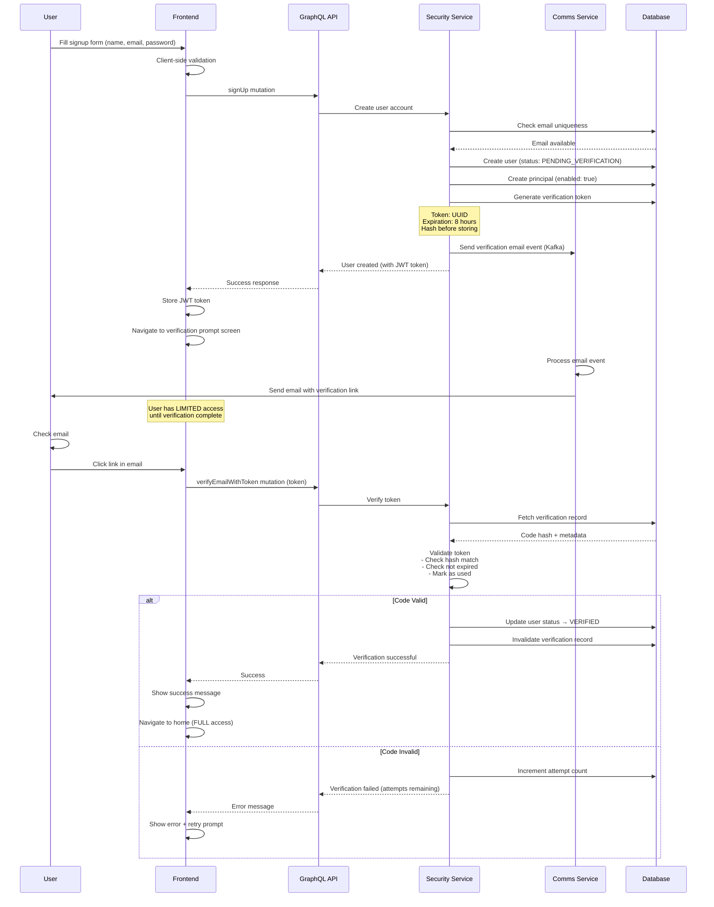
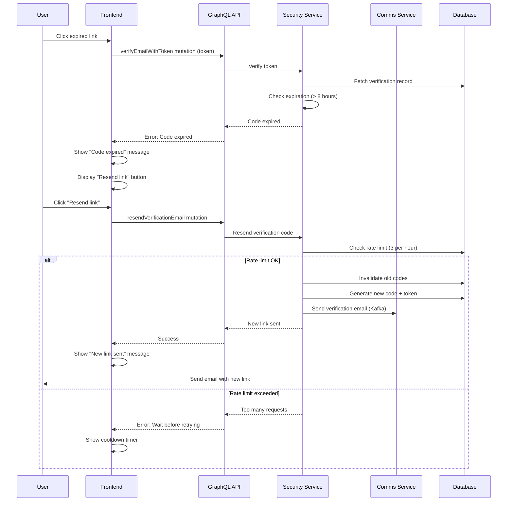
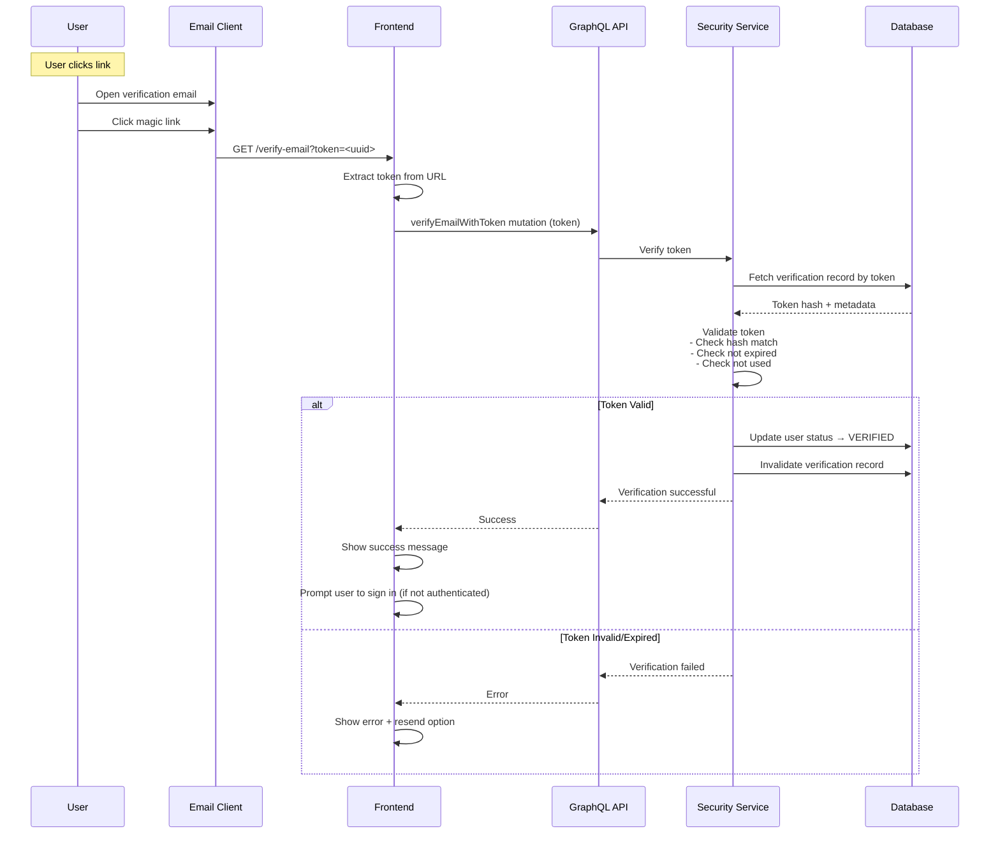
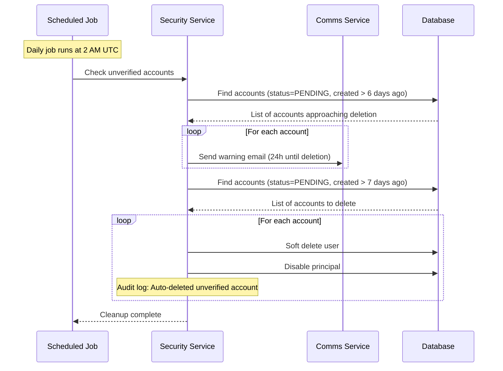

# Email Verification Signup Flow - Design & Implementation Plan

> **Purpose**: Design a secure, user-friendly email verification flow for user signup following OWASP guidelines and industry best practices from Netflix, Spotify, and other leading platforms.

## Overview

This document outlines the complete design for implementing email verification in the signup flow. The current signup allows users to immediately access the application without verifying their email address, which poses security risks including:

- **Account takeover risk**: Attackers can register with someone else's email
- **Spam account creation**: Bots can create unlimited fake accounts
- **Email typos**: Users may mistype their email and lose account access
- **Compliance issues**: Cannot send legal notices to unverified emails

### Design Philosophy

- **Security First**: Follow OWASP Authentication Cheat Sheet recommendations
- **User Experience**: Balance security with frictionless onboarding
- **Progressive Disclosure**: Allow immediate limited access, require verification for full features
- **Fail Secure**: Default to restricted access if verification status unclear
- **Audit Trail**: Log all verification attempts and state changes

---

## Design Decisions

### 1. Verification Timing Strategy

**Decision**: **Hybrid Approach** - Immediate signup with progressive feature unlocking

**Rationale**:
- **Industry Practice**: Netflix and Spotify allow immediate signup, then prompt verification for full access
- **User Psychology**: "Foot-in-the-door" strategy increases completion rates
- **Business Impact**: Reduces signup abandonment while maintaining security

**Implementation**:
```
Signup → Account Created (Unverified) → Limited Access → Email Sent →
User Clicks Link → Account Verified → Full Access
```

**Access Levels**:
- **Unverified**: View-only access, basic profile, limited API calls
- **Verified**: Full CRUD operations, all features unlocked

### 2. Verification Method

**Decision**: **Magic link only** – user clicks a link in the email to verify

**Rationale**:
- **Simplicity**: One flow (link) instead of code + link; fewer moving parts and less support surface
- **UX**: Single click to verify; no typing or copy-paste
- **Security**: Token is UUID, hashed in DB, single-use, time-limited (OWASP-aligned)
- **Implementation**: One mutation (`verifyEmailWithToken`), one landing page (`/verify-email-link`)

### 3. Verification Token Security

**OWASP Requirements** (Authentication Cheat Sheet):
- ✅ Generated using cryptographically secure randomness (UUID)
- ✅ Single-use only (invalidated after successful verification)
- ✅ Time-limited expiration (8 hours per OWASP)
- ✅ Rate-limited generation (prevent abuse)
- ✅ Not guessable (UUID + rate limiting)

**Implementation**:
- **Token**: UUID for magic link
- **Storage**: SHA-256 hash in database
- **Expiration**: 8 hours from generation
- **Rate Limiting**: Max 3 link requests per hour per email

### 4. Email Delivery

**Integration**: Use existing Comms module (already supports email via Kafka)

**Template Requirements**:
- Welcome message with verification link (button + URL)
- Clear expiration time (8 hours)
- Support contact if issues
- Branding consistent with application
- i18n support (pt-BR, en-US)

### 5. Resend Logic

**Rules**:
- Invalidate previous link when new one requested
- Rate limit: Max 3 requests per hour
- Same expiration window (8 hours from latest request)
- Log all resend attempts for security monitoring

### 6. Account State Management

**States**:
```
PENDING_VERIFICATION → VERIFIED → (never goes back to PENDING)
                    ↓
                EXPIRED (if 7 days pass)
```

**Business Rules**:
- Unverified accounts auto-deleted after 7 days (configurable)
- Grace period: 24-hour warning email before deletion
- Verified accounts never auto-deleted
- Admin can manually verify users (with audit log)

---

## Detailed Flow Design

### Flow 1: Successful Signup with Verification



### Flow 2: Code Expiration & Resend



### Flow 3: Magic Link (Alternative Method)



### Flow 4: Unverified Account Cleanup



---

## Database Schema Changes

### New Table: `email_verifications`

```sql
CREATE TABLE email_verifications (
    id UUID PRIMARY KEY DEFAULT uuid_generate_v7(),
    user_id UUID NOT NULL REFERENCES users(id) ON DELETE CASCADE,

    -- Verification credentials (both stored as hashed values)
    -- code_hash removed; magic-link only (token_hash only)
    token_hash VARCHAR(255) NOT NULL,       -- Hashed UUID token (for magic link)

    -- Security tracking
    attempts INT DEFAULT 0,                 -- Failed verification attempts
    max_attempts INT DEFAULT 5,             -- Max attempts before regeneration

    -- Lifecycle
    expires_at TIMESTAMP NOT NULL,          -- 8 hours from creation
    verified_at TIMESTAMP,                  -- Null until verified
    invalidated_at TIMESTAMP,               -- Set when link regenerated

    -- Rate limiting
    created_at TIMESTAMP NOT NULL DEFAULT NOW(),
    resend_count INT DEFAULT 0,             -- Tracks resends for rate limiting

    -- Audit
    created_by_ip VARCHAR(45),             -- IP that triggered link generation
    verified_from_ip VARCHAR(45),           -- IP that completed verification

    CONSTRAINT unique_active_verification UNIQUE (user_id, invalidated_at)
    WHERE invalidated_at IS NULL
);

-- Index for cleanup job
CREATE INDEX idx_email_verifications_expires_at
ON email_verifications(expires_at)
WHERE verified_at IS NULL AND invalidated_at IS NULL;

-- Index for user lookup
CREATE INDEX idx_email_verifications_user_id
ON email_verifications(user_id);
```

### Modified Table: `users`

```sql
ALTER TABLE users ADD COLUMN IF NOT EXISTS email_verified BOOLEAN DEFAULT FALSE;
ALTER TABLE users ADD COLUMN IF NOT EXISTS email_verified_at TIMESTAMP;

-- Index for finding unverified users
CREATE INDEX idx_users_email_verified
ON users(email_verified, created_at)
WHERE email_verified = FALSE;
```

### Modified Table: `principals`

```sql
-- No schema changes needed, but business logic changes:
-- - New users: enabled = TRUE (allow limited access)
-- - Verified users: enabled = TRUE (full access)
-- - Deleted unverified: enabled = FALSE
```

---

## GraphQL Schema Changes

### Mutations

```graphql
"""
Sign up a new user account. Account is created but requires email verification
for full access. User receives limited permissions until verification complete.
"""
signUp(input: SignUpInput!): SignUpPayload!

"""
Verify email address using magic link token (from email).
"""
verifyEmailWithToken(token: String!): VerifyEmailPayload!

"""
Resend verification email with new link. Rate-limited to 3 per hour.
"""
resendVerificationEmail: ResendVerificationEmailPayload!

"""
Admin-only: Manually verify a user's email (with audit log).
"""
adminVerifyUserEmail(userId: ID!): AdminVerifyEmailPayload!

input SignUpInput {
  name: String!
  email: String!
  password: String!
  locale: String = "en-US"  # For i18n verification email
}

type SignUpPayload {
  user: User
  accessToken: String!
  refreshToken: String!
  requiresVerification: Boolean!  # Always true for new signups
}

type VerifyEmailPayload {
  success: Boolean!
  user: User
  message: String
  attemptsRemaining: Int  # Null if successful
}

type ResendVerificationEmailPayload {
  success: Boolean!
  message: String
  canResendAt: DateTime  # Null if successful, timestamp if rate-limited
}

type AdminVerifyEmailPayload {
  success: Boolean!
  user: User
}
```

### Queries

```graphql
"""
Get current user's verification status.
"""
myVerificationStatus: VerificationStatus!

type VerificationStatus {
  emailVerified: Boolean!
  emailVerifiedAt: DateTime
  verificationCodeSentAt: DateTime
  verificationCodeExpiresAt: DateTime
  canResendCode: Boolean!
  nextResendAvailableAt: DateTime  # Null if can resend now
}
```

### Type Changes

```graphql
type User {
  # ... existing fields
  emailVerified: Boolean!
  emailVerifiedAt: DateTime
}
```

---

## API Endpoints (REST Fallback)

For magic link support (external email clients):

```
GET  /api/auth/verify-email?token=<uuid>
  → Redirects to frontend: /verify-email?token=<uuid>&status=success|error
  → Frontend calls verifyEmailWithToken mutation
```

---

## Frontend Changes

### New Screens/Components

#### 1. Verification Prompt Screen

**Route**: `/verify-email`

**When Shown**:
- Immediately after signup
- When unverified user tries restricted action
- When user logs in with unverified account

**UI Elements**:
```tsx
<VerificationPrompt>
  <Heading>Verify your email address</Heading>
  <Description>
    We sent a 6-digit code to {userEmail}
    Enter it below to unlock full access.
  </Description>

  <CodeInput length={6} onChange={handleCodeInput} />

  <SubmitButton onClick={verifyEmail}>Verify Email</SubmitButton>

  <ResendLink onClick={resendCode}>
    Didn't receive the code? Resend
  </ResendLink>

  <ChangeEmailLink>Wrong email address?</ChangeEmailLink>

  <SkipButton onClick={navigateToHome}>
    Skip for now (Limited access)
  </SkipButton>
</VerificationPrompt>
```

#### 2. Verification Banner

**Where Shown**: Top of every page for unverified users

```tsx
<VerificationBanner>
  <Icon type="warning" />
  <Message>
    Verify your email to unlock all features.
  </Message>
  <VerifyButton onClick={navigateToVerification}>
    Verify Now
  </VerifyButton>
  <DismissButton />  {/* Dismissible for 24 hours */}
</VerificationBanner>
```

#### 3. Permission Gates (Enhanced)

```tsx
// Existing PermissionGate enhanced to check verification
<PermissionGate
  require="products:create"
  requireVerifiedEmail={true}
>
  <CreateProductButton />
</PermissionGate>

// If user has permission but not verified:
<UnverifiedEmailPrompt>
  You need to verify your email to access this feature.
  <VerifyNowButton />
</UnverifiedEmailPrompt>
```

#### 4. Magic Link Landing Page

**Route**: `/verify-email-link?token=<uuid>`

**Behavior**:
- Extract token from URL
- Call `verifyEmailWithToken` mutation
- Show success/error message
- Auto-redirect to home after 3 seconds

### Updated Components

#### SignUpForm.tsx

```tsx
// After successful signup:
const handleSignUpSuccess = (data: SignUpPayload) => {
  // Store tokens
  storeAuthTokens(data.accessToken, data.refreshToken);

  // Update auth context
  setCurrentUser(data.user);

  // Redirect to verification prompt
  if (data.requiresVerification) {
    router.push('/verify-email');
  } else {
    router.push('/home');
  }
};
```

### i18n Translations

```json
// en.json
{
  "auth.verifyEmail.title": "Verify your email address",
  "auth.verifyEmail.description": "We sent a 6-digit code to {email}",
  "auth.verifyEmail.enterCode": "Enter verification code",
  "auth.verifyEmail.submit": "Verify Email",
  "auth.verifyEmail.resend": "Didn't receive the code? Resend",
  "auth.verifyEmail.codeExpired": "This code has expired. Please request a new one.",
  "auth.verifyEmail.invalidCode": "Invalid code. {attemptsRemaining} attempts remaining.",
  "auth.verifyEmail.tooManyAttempts": "Too many failed attempts. Please request a new code.",
  "auth.verifyEmail.success": "Email verified successfully!",
  "auth.verifyEmail.skip": "Skip for now (Limited access)",
  "auth.verifyEmail.banner": "Verify your email to unlock all features.",
  "auth.verifyEmail.resendSuccess": "New verification code sent!",
  "auth.verifyEmail.resendRateLimit": "Please wait {minutes} minutes before requesting another code."
}

// pt.json
{
  "auth.verifyEmail.title": "Verifique seu endereço de e-mail",
  "auth.verifyEmail.description": "Enviamos um código de 6 dígitos para {email}",
  "auth.verifyEmail.enterCode": "Digite o código de verificação",
  "auth.verifyEmail.submit": "Verificar E-mail",
  "auth.verifyEmail.resend": "Não recebeu o código? Reenviar",
  "auth.verifyEmail.codeExpired": "Este código expirou. Solicite um novo.",
  "auth.verifyEmail.invalidCode": "Código inválido. {attemptsRemaining} tentativas restantes.",
  "auth.verifyEmail.tooManyAttempts": "Muitas tentativas falhadas. Solicite um novo código.",
  "auth.verifyEmail.success": "E-mail verificado com sucesso!",
  "auth.verifyEmail.skip": "Pular por enquanto (Acesso limitado)",
  "auth.verifyEmail.banner": "Verifique seu e-mail para desbloquear todos os recursos.",
  "auth.verifyEmail.resendSuccess": "Novo código de verificação enviado!",
  "auth.verifyEmail.resendRateLimit": "Aguarde {minutes} minutos antes de solicitar outro código."
}
```

---

## Backend Implementation

### Service Layer

#### EmailVerificationService.kt

```kotlin
@Singleton
class EmailVerificationService(
    private val emailVerificationRepository: EmailVerificationRepository,
    private val userRepository: UserRepository,
    private val passwordEncoder: PasswordEncoder,
    private val emailService: EmailService,
    private val auditService: AuditService,
    @Value("\${app.verification.code-expiration-hours:8}")
    private val codeExpirationHours: Long,
    @Value("\${app.verification.max-attempts:5}")
    private val maxAttempts: Int,
    @Value("\${app.verification.resend-rate-limit-per-hour:3}")
    private val resendRateLimit: Int
) {

    /**
     * Generate and send verification code/token after user signup
     */
    fun initiateVerification(userId: UUID, userEmail: String, locale: String): EmailVerification {
        // Generate 6-digit code
        val code = generateSecureCode()

        // Generate UUID v7 token for magic link
        val token = UuidV7.generate()

        // Hash both before storing
        val codeHash = passwordEncoder.encode(code)
        val tokenHash = passwordEncoder.encode(token.toString())

        // Create verification record
        val verification = EmailVerification(
            id = UuidV7.generate(),
            userId = userId,
            codeHash = codeHash,
            tokenHash = tokenHash,
            expiresAt = Instant.now().plus(codeExpirationHours, ChronoUnit.HOURS),
            maxAttempts = maxAttempts
        )

        emailVerificationRepository.save(verification)

        // Send email via Comms module
        emailService.sendVerificationEmail(
            to = userEmail,
            code = code,
            token = token,
            expiresAt = verification.expiresAt,
            locale = locale
        )

        auditService.log(
            event = "EMAIL_VERIFICATION_INITIATED",
            userId = userId,
            metadata = mapOf("email" to userEmail)
        )

        return verification
    }

    /**
     * Verify email using 6-digit code
     */
    fun verifyWithCode(userId: UUID, code: String, ipAddress: String): VerificationResult {
        val verification = emailVerificationRepository.findActiveByUserId(userId)
            ?: return VerificationResult.NotFound

        // Check if expired
        if (verification.isExpired()) {
            return VerificationResult.Expired
        }

        // Check if too many attempts
        if (verification.attempts >= verification.maxAttempts) {
            return VerificationResult.TooManyAttempts
        }

        // Verify code hash
        val codeMatches = passwordEncoder.matches(code, verification.codeHash)

        if (!codeMatches) {
            // Increment attempt count
            verification.attempts++
            emailVerificationRepository.update(verification)

            auditService.log(
                event = "EMAIL_VERIFICATION_FAILED",
                userId = userId,
                metadata = mapOf("attempts" to verification.attempts, "ip" to ipAddress)
            )

            return VerificationResult.InvalidCode(
                attemptsRemaining = verification.maxAttempts - verification.attempts
            )
        }

        // Success - mark user as verified
        return completeVerification(userId, verification, ipAddress)
    }

    /**
     * Verify email using magic link token
     */
    fun verifyWithToken(token: UUID, ipAddress: String): VerificationResult {
        val verification = emailVerificationRepository.findByToken(token)
            ?: return VerificationResult.NotFound

        if (verification.isExpired()) {
            return VerificationResult.Expired
        }

        if (verification.isVerified()) {
            return VerificationResult.AlreadyVerified
        }

        // Verify token hash
        val tokenMatches = passwordEncoder.matches(token.toString(), verification.tokenHash)

        if (!tokenMatches) {
            return VerificationResult.InvalidToken
        }

        // Success
        return completeVerification(verification.userId, verification, ipAddress)
    }

    /**
     * Resend verification email (rate-limited)
     */
    fun resendVerification(userId: UUID, userEmail: String, locale: String): ResendResult {
        // Check rate limit (max 3 per hour)
        val recentVerifications = emailVerificationRepository
            .findRecentByUserId(userId, Duration.ofHours(1))

        if (recentVerifications.size >= resendRateLimit) {
            val oldestRecent = recentVerifications.minByOrNull { it.createdAt }!!
            val canResendAt = oldestRecent.createdAt.plus(Duration.ofHours(1))

            return ResendResult.RateLimited(canResendAt)
        }

        // Invalidate old verification codes
        emailVerificationRepository.invalidateAllForUser(userId)

        // Create new verification
        val verification = initiateVerification(userId, userEmail, locale)

        auditService.log(
            event = "EMAIL_VERIFICATION_RESENT",
            userId = userId,
            metadata = mapOf("email" to userEmail)
        )

        return ResendResult.Success
    }

    /**
     * Complete verification process
     */
    @Transactional
    private fun completeVerification(
        userId: UUID,
        verification: EmailVerification,
        ipAddress: String
    ): VerificationResult {
        // Update user
        val user = userRepository.findById(userId)!!
        user.emailVerified = true
        user.emailVerifiedAt = Instant.now()
        userRepository.update(user)

        // Mark verification as complete
        verification.verifiedAt = Instant.now()
        verification.verifiedFromIp = ipAddress
        emailVerificationRepository.update(verification)

        auditService.log(
            event = "EMAIL_VERIFIED_SUCCESS",
            userId = userId,
            metadata = mapOf("ip" to ipAddress)
        )

        return VerificationResult.Success(user)
    }

    /**
     * Generate cryptographically secure 6-digit code
     */
    private fun generateSecureCode(): String {
        val secureRandom = SecureRandom()
        val code = secureRandom.nextInt(1000000)  // 0 to 999999
        return code.toString().padStart(6, '0')
    }
}

sealed class VerificationResult {
    data class Success(val user: UserEntity) : VerificationResult()
    data class InvalidCode(val attemptsRemaining: Int) : VerificationResult()
    object InvalidToken : VerificationResult()
    object NotFound : VerificationResult()
    object Expired : VerificationResult()
    object TooManyAttempts : VerificationResult()
    object AlreadyVerified : VerificationResult()
}

sealed class ResendResult {
    object Success : ResendResult()
    data class RateLimited(val canResendAt: Instant) : ResendResult()
}
```

### GraphQL Resolvers

#### EmailVerificationResolver.kt

```kotlin
@Controller
class EmailVerificationResolver(
    private val emailVerificationService: EmailVerificationService,
    private val authorizationChecker: AuthorizationChecker,
    private val requestContext: RequestContext
) : AuthenticatedGraphQLWiringFactory() {

    @GraphQLMutation
    fun verifyEmail(
        @GraphQLContext principal: RequestPrincipal,
        code: String
    ): VerifyEmailPayload {
        val userId = UUID.fromString(principal.userId)
        val ipAddress = requestContext.getClientIp()

        return when (val result = emailVerificationService.verifyWithCode(userId, code, ipAddress)) {
            is VerificationResult.Success -> VerifyEmailPayload(
                success = true,
                user = result.user.toDomain(),
                message = "Email verified successfully!"
            )
            is VerificationResult.InvalidCode -> VerifyEmailPayload(
                success = false,
                message = "Invalid code. ${result.attemptsRemaining} attempts remaining.",
                attemptsRemaining = result.attemptsRemaining
            )
            VerificationResult.Expired -> VerifyEmailPayload(
                success = false,
                message = "This code has expired. Please request a new one."
            )
            VerificationResult.TooManyAttempts -> VerifyEmailPayload(
                success = false,
                message = "Too many failed attempts. Please request a new code."
            )
            VerificationResult.AlreadyVerified -> VerifyEmailPayload(
                success = true,
                message = "Email already verified."
            )
            else -> VerifyEmailPayload(
                success = false,
                message = "Verification failed. Please try again."
            )
        }
    }

    @GraphQLMutation
    fun verifyEmailWithToken(
        token: String,
        @GraphQLContext principal: RequestPrincipal?  // Optional - may not be logged in
    ): VerifyEmailPayload {
        val tokenUuid = try {
            UUID.fromString(token)
        } catch (e: IllegalArgumentException) {
            return VerifyEmailPayload(
                success = false,
                message = "Invalid verification link."
            )
        }

        val ipAddress = requestContext.getClientIp()

        return when (val result = emailVerificationService.verifyWithToken(tokenUuid, ipAddress)) {
            is VerificationResult.Success -> VerifyEmailPayload(
                success = true,
                user = result.user.toDomain(),
                message = "Email verified successfully!"
            )
            VerificationResult.InvalidToken -> VerifyEmailPayload(
                success = false,
                message = "Invalid or expired verification link."
            )
            VerificationResult.Expired -> VerifyEmailPayload(
                success = false,
                message = "This verification link has expired. Please request a new one."
            )
            VerificationResult.AlreadyVerified -> VerifyEmailPayload(
                success = true,
                message = "Email already verified."
            )
            else -> VerifyEmailPayload(
                success = false,
                message = "Verification failed. Please try again."
            )
        }
    }

    @GraphQLMutation
    fun resendVerificationEmail(
        @GraphQLContext principal: RequestPrincipal
    ): ResendVerificationEmailPayload {
        val userId = UUID.fromString(principal.userId)
        // TODO: Get user email and locale from user repository
        val user = userRepository.findById(userId)!!

        return when (val result = emailVerificationService.resendVerification(
            userId, user.email, user.locale ?: "en-US"
        )) {
            ResendResult.Success -> ResendVerificationEmailPayload(
                success = true,
                message = "New verification code sent!"
            )
            is ResendResult.RateLimited -> ResendVerificationEmailPayload(
                success = false,
                message = "Too many requests. Please wait before requesting another code.",
                canResendAt = result.canResendAt
            )
        }
    }

    @GraphQLQuery
    fun myVerificationStatus(
        @GraphQLContext principal: RequestPrincipal
    ): VerificationStatus {
        val userId = UUID.fromString(principal.userId)
        val user = userRepository.findById(userId)!!

        val activeVerification = emailVerificationRepository.findActiveByUserId(userId)

        val canResend = if (activeVerification != null) {
            val recentCount = emailVerificationRepository
                .findRecentByUserId(userId, Duration.ofHours(1))
                .size
            recentCount < resendRateLimit
        } else {
            true
        }

        return VerificationStatus(
            emailVerified = user.emailVerified,
            emailVerifiedAt = user.emailVerifiedAt,
            verificationCodeSentAt = activeVerification?.createdAt,
            verificationCodeExpiresAt = activeVerification?.expiresAt,
            canResendCode = canResend,
            nextResendAvailableAt = calculateNextResendTime(userId)
        )
    }
}
```

### Email Template

#### Verification Email Template

**File**: `service/kotlin/comms/src/main/resources/templates/email/verify-email.ftl`

```html
<!DOCTYPE html>
<html>
<head>
    <meta charset="UTF-8">
    <title>Verify Your Email - NeoTool</title>
</head>
<body style="font-family: Arial, sans-serif; max-width: 600px; margin: 0 auto; padding: 20px;">
    <div style="text-align: center; margin-bottom: 30px;">
        
    </div>

    <h1 style="color: #333; font-size: 24px;">Verify Your Email Address</h1>

    <p>Hi ${userName},</p>

    <p>Thanks for signing up for NeoTool! To complete your registration and unlock all features, please verify your email address.</p>

    <div style="background: #f5f5f5; border-radius: 8px; padding: 24px; text-align: center; margin: 24px 0;">
        <p style="margin: 0 0 8px 0; color: #666; font-size: 14px;">Your verification code:</p>
        <div style="font-size: 32px; font-weight: bold; letter-spacing: 8px; color: #7f52ff;">
            ${verificationCode}
        </div>
        <p style="margin: 16px 0 0 0; color: #999; font-size: 12px;">
            This code expires in ${expirationHours} hours
        </p>
    </div>

    <p style="font-size: 14px; color: #666;">
        <strong>Alternatively</strong>, you can click this button to verify:
    </p>

    <div style="text-align: center; margin: 24px 0;">
        <a href="${verificationLink}"
           style="display: inline-block; background: #7f52ff; color: white; padding: 12px 32px; text-decoration: none; border-radius: 6px; font-weight: bold;">
            Verify Email Address
        </a>
    </div>

    <hr style="border: none; border-top: 1px solid #eee; margin: 32px 0;" />

    <p style="font-size: 12px; color: #999;">
        If you didn't create an account with NeoTool, you can safely ignore this email.
    </p>

    <p style="font-size: 12px; color: #999;">
        Need help? Contact us at <a href="mailto:support@neotool.io">support@neotool.io</a>
    </p>
</body>
</html>
```

### Scheduled Cleanup Job

#### UnverifiedAccountCleanupJob.kt

```kotlin
@Singleton
class UnverifiedAccountCleanupJob(
    private val userRepository: UserRepository,
    private val emailService: EmailService,
    @Value("\${app.verification.unverified-account-ttl-days:7}")
    private val unverifiedAccountTtlDays: Long
) {

    @Scheduled(cron = "0 0 2 * * *")  // Daily at 2 AM UTC
    fun cleanupUnverifiedAccounts() {
        val warningThreshold = Instant.now().minus(unverifiedAccountTtlDays - 1, ChronoUnit.DAYS)
        val deletionThreshold = Instant.now().minus(unverifiedAccountTtlDays, ChronoUnit.DAYS)

        // Send warnings (24 hours before deletion)
        val accountsToWarn = userRepository.findUnverifiedCreatedBefore(warningThreshold)
        accountsToWarn.forEach { user ->
            emailService.sendAccountDeletionWarning(user.email, user.name)
        }

        // Delete expired accounts
        val accountsToDelete = userRepository.findUnverifiedCreatedBefore(deletionThreshold)
        accountsToDelete.forEach { user ->
            userRepository.softDelete(user.id)
            auditService.log(
                event = "UNVERIFIED_ACCOUNT_AUTO_DELETED",
                userId = user.id,
                metadata = mapOf("email" to user.email, "reason" to "Email not verified within $unverifiedAccountTtlDays days")
            )
        }

        logger.info("Cleanup complete: ${accountsToWarn.size} warnings sent, ${accountsToDelete.size} accounts deleted")
    }
}
```

---

## Authorization Changes

### Permission-Based Access Control

**New Permission Checks**:

```kotlin
// Example: Restrict create operations to verified users
@RequiresAuthorization(permission = "products:create")
@RequiresVerifiedEmail  // New annotation
fun createProduct(input: CreateProductInput): Product {
    // Implementation
}
```

**Implementation**:

```kotlin
@Target(AnnotationTarget.FUNCTION)
@Retention(AnnotationRetention.RUNTIME)
annotation class RequiresVerifiedEmail

@Singleton
class VerifiedEmailInterceptor(
    private val userRepository: UserRepository
) : MethodInterceptor {

    override fun intercept(context: MethodInvocationContext<*, *>): Any? {
        val requiresVerification = context.targetMethod
            .getAnnotation(RequiresVerifiedEmail::class.java)

        if (requiresVerification != null) {
            val principal = context.getParameterValueMap()["principal"] as? RequestPrincipal
                ?: throw AuthenticationRequiredException()

            val user = userRepository.findById(UUID.fromString(principal.userId))!!

            if (!user.emailVerified) {
                throw EmailVerificationRequiredException(
                    "You must verify your email address to access this feature."
                )
            }
        }

        return context.proceed()
    }
}

class EmailVerificationRequiredException(message: String) : RuntimeException(message)
```

---

## Security Considerations

### OWASP Compliance Checklist

- [x] **Secure Token Generation**: Using `SecureRandom` for codes, UUID v7 for tokens
- [x] **Single-Use Tokens**: Codes/tokens invalidated after successful verification
- [x] **Time-Limited Expiration**: 8-hour expiration per OWASP guidelines
- [x] **Rate Limiting**: 3 resends per hour, 5 verification attempts per code
- [x] **Not Guessable**: 6-digit code (1M combinations) + rate limiting = secure
- [x] **Hashed Storage**: Codes and tokens hashed (bcrypt/argon2) before database storage
- [x] **Audit Logging**: All verification attempts logged with IP addresses
- [x] **Account Lockout**: After 5 failed attempts, new code required
- [x] **HTTPS Only**: All verification links and API calls over TLS
- [x] **No Sensitive Data in URLs**: Token in URL is UUID (non-reversible)

### Attack Surface Analysis

#### Threat: Brute Force Code Guessing

**Mitigation**:
- 6-digit code = 1,000,000 combinations
- Max 5 attempts per code
- Max 3 codes per hour
- = 15 attempts per hour max
- = 66,666 hours (7.6 years) to brute force statistically

#### Threat: Email Enumeration

**Mitigation**:
- Same response for "email not found" vs "invalid code"
- Rate limit on code requests prevents enumeration attacks
- No indication whether email exists in system

#### Threat: Account Takeover via Email Hijack

**Mitigation**:
- If attacker controls email, they can complete verification
- **Risk acceptance**: This is fundamental to email-based auth
- **Mitigation**: Offer MFA as additional security layer (future work)

#### Threat: Denial of Service (Email Bombing)

**Mitigation**:
- Rate limit: 3 emails per hour per user
- Prevents using signup as email spam tool
- Monitor for abuse patterns

#### Threat: Session Hijacking Post-Verification

**Mitigation**:
- JWT tokens remain valid after verification
- Verification only changes user state in DB
- Use existing JWT security best practices (short expiry, HTTPS only)

---

## Testing Strategy

### Unit Tests

```kotlin
class EmailVerificationServiceTest {
    @Test
    fun `generate code creates 6-digit numeric code`()

    @Test
    fun `code verification succeeds with valid code`()

    @Test
    fun `code verification fails with invalid code`()

    @Test
    fun `code verification fails after expiration`()

    @Test
    fun `code verification fails after max attempts`()

    @Test
    fun `token verification succeeds with valid token`()

    @Test
    fun `resend invalidates previous codes`()

    @Test
    fun `resend respects rate limit`()

    @Test
    fun `cleanup job deletes old unverified accounts`()

    @Test
    fun `cleanup job sends warning emails`()
}
```

### Integration Tests

```kotlin
class EmailVerificationIntegrationTest {
    @Test
    fun `complete verification flow with code`()

    @Test
    fun `complete verification flow with token`()

    @Test
    fun `resend flow with rate limiting`()

    @Test
    fun `verification updates user and principal`()

    @Test
    fun `verified user gets full permissions`()

    @Test
    fun `unverified user has restricted permissions`()
}
```

### E2E Tests (Playwright)

```typescript
describe('Email Verification Flow', () => {
  it('should prompt verification after signup', async () => {
    // Fill signup form
    // Submit
    // Expect redirect to /verify-email
    // Expect verification prompt visible
  });

  it('should verify email with code', async () => {
    // Mock: Get verification code from test API
    // Enter code
    // Submit
    // Expect success message
    // Expect full access unlocked
  });

  it('should show error for invalid code', async () => {
    // Enter invalid code
    // Submit
    // Expect error message with attempts remaining
  });

  it('should allow resending code', async () => {
    // Click "Resend code"
    // Expect success message
    // Mock: Verify new code sent
  });

  it('should enforce rate limit on resend', async () => {
    // Resend 3 times
    // Attempt 4th resend
    // Expect rate limit error
  });

  it('should verify via magic link', async () => {
    // Navigate to /verify-email-link?token=<uuid>
    // Expect auto-verification
    // Expect redirect to home
  });

  it('should show verification banner for unverified users', async () => {
    // Login as unverified user
    // Expect banner visible on all pages
    // Click "Verify Now"
    // Expect redirect to /verify-email
  });

  it('should restrict features for unverified users', async () => {
    // Login as unverified user
    // Attempt restricted action (e.g., create product)
    // Expect "verify email" prompt
  });
});
```

### Manual Testing Checklist

- [ ] Signup creates account in PENDING_VERIFICATION state
- [ ] Verification email received with code and link
- [ ] Code verification succeeds with valid 6-digit code
- [ ] Code verification fails with invalid code
- [ ] Attempts counter decrements correctly
- [ ] Code expires after 8 hours
- [ ] Expired code shows appropriate error
- [ ] Resend generates new code and invalidates old one
- [ ] Resend respects rate limit (3 per hour)
- [ ] Magic link verification succeeds
- [ ] Expired magic link shows appropriate error
- [ ] User state changes to VERIFIED after success
- [ ] Verified users have full access
- [ ] Unverified users see verification banner
- [ ] Unverified users blocked from restricted actions
- [ ] Warning email sent 24 hours before deletion
- [ ] Unverified accounts deleted after 7 days
- [ ] All verification attempts logged in audit trail
- [ ] Email templates render correctly
- [ ] i18n translations work (en-US, pt-BR)

---

## Rollout Plan

### Phase 1: Backend Foundation (Week 1)

**Tasks**:
1. Database schema changes (migration script)
2. EmailVerificationService implementation
3. Repository layer (EmailVerificationRepository)
4. Unit tests for service layer
5. GraphQL schema updates
6. GraphQL resolver implementation
7. Integration tests

**Deliverable**: Backend API ready for testing

### Phase 2: Email Integration (Week 1)

**Tasks**:
1. Email template creation (verify-email.ftl)
2. Warning email template (account-deletion-warning.ftl)
3. i18n translations (en-US, pt-BR)
4. Integration with Comms module
5. Test email delivery end-to-end

**Deliverable**: Emails being sent correctly

### Phase 3: Frontend Implementation (Week 2)

**Tasks**:
1. Verification prompt screen (/verify-email)
2. Magic link landing page (/verify-email-link)
3. Verification banner component
4. Enhanced PermissionGate component
5. SignUpForm updates
6. i18n translations
7. E2E tests

**Deliverable**: Complete user flow working

### Phase 4: Authorization Integration (Week 2)

**Tasks**:
1. @RequiresVerifiedEmail annotation
2. VerifiedEmailInterceptor
3. Permission checks across codebase
4. Define which features require verification
5. Update existing resolvers/controllers

**Deliverable**: Feature access restrictions enforced

### Phase 5: Cleanup & Monitoring (Week 3)

**Tasks**:
1. Scheduled cleanup job implementation
2. Warning email job
3. Audit logging integration
4. Monitoring dashboards (Grafana)
5. Alerts for suspicious patterns
6. Documentation updates

**Deliverable**: Production-ready system

### Phase 6: Production Rollout (Week 3)

**Tasks**:
1. Feature flag setup (gradual rollout)
2. Monitoring alert configuration
3. Database migration (production)
4. Deploy to staging → validation → production
5. Monitor metrics and user feedback

**Deliverable**: Live in production

---

## Monitoring & Metrics

### Key Metrics to Track

```yaml
# Verification funnel
- metric: email_verification_initiated_total
  description: Total verification emails sent
  labels: [locale]

- metric: email_verification_completed_total
  description: Total successful verifications
  labels: [method]  # code|token

- metric: email_verification_failed_total
  description: Total failed verification attempts
  labels: [reason]  # invalid_code|expired|too_many_attempts

- metric: email_verification_resent_total
  description: Total verification resends
  labels: [rate_limited]  # true|false

# Conversion rates
- metric: verification_completion_rate
  description: Percentage of users who complete verification
  formula: completed / initiated

- metric: verification_time_to_complete
  description: Time from signup to verification (histogram)

# Cleanup
- metric: unverified_accounts_deleted_total
  description: Accounts deleted due to non-verification

- metric: deletion_warning_emails_sent_total
  description: Warning emails sent before deletion

# Security
- metric: brute_force_attempts_blocked_total
  description: Verification attempts blocked by rate limiting

- metric: suspicious_verification_patterns_total
  description: Patterns flagged for review
```

### Alerts

```yaml
- alert: LowVerificationRate
  condition: verification_completion_rate < 0.5
  duration: 1h
  severity: warning
  message: "Email verification completion rate below 50%"

- alert: HighVerificationFailureRate
  condition: rate(email_verification_failed_total[5m]) > 100
  severity: warning
  message: "High verification failure rate detected"

- alert: EmailDeliveryFailure
  condition: email_delivery_failed_total > 10
  duration: 15m
  severity: critical
  message: "Email delivery failures detected"

- alert: SuspiciousVerificationActivity
  condition: suspicious_verification_patterns_total > 5
  duration: 10m
  severity: high
  message: "Potential attack on verification system"
```

### Dashboards (Grafana)

**Email Verification Dashboard**:
- Verification funnel (initiated → completed)
- Completion rate over time
- Average time to verify
- Failure reasons breakdown
- Resend rate
- Cleanup activity
- Security alerts

---

## Migration Plan

### Existing Users

**Question**: What happens to users who signed up before this feature?

**Options**:

#### Option A: Grandfather Existing Users (Recommended)

- All existing users automatically marked as `email_verified = true`
- No disruption to existing accounts
- Only new signups require verification

**Migration Script**:
```sql
-- Mark all existing users as verified
UPDATE users
SET email_verified = true,
    email_verified_at = NOW()
WHERE created_at < '2026-02-15 00:00:00'  -- Feature launch date
  AND email_verified IS NULL;
```

#### Option B: Require Verification for All

- Send verification email to all existing users
- 30-day grace period before restrictions apply
- Higher user friction, better security

**Not Recommended**: Too disruptive for existing users

### Configuration Flags

```yaml
# application.yml
app:
  verification:
    enabled: true  # Feature flag
    code-expiration-hours: 8
    max-attempts: 5
    resend-rate-limit-per-hour: 3
    unverified-account-ttl-days: 7
    grandfather-existing-users: true  # Auto-verify pre-launch users
    grandfather-cutoff-date: "2026-02-15T00:00:00Z"
```

---

## Future Enhancements

### Post-Launch Improvements

1. **Email Change Flow**
   - When user changes email, require re-verification
   - Send notification to old email
   - Temporary "pending email change" state

2. **Magic Link Expiration Page**
   - Friendly error page for expired magic links
   - One-click resend button

3. **Verification Reminder Emails**
   - Send reminder 24 hours after signup if not verified
   - Send reminder 3 days after signup

4. **Admin Tools**
   - Admin dashboard for verification metrics
   - Manual verification capability (for support)
   - Bulk verification for organizations

5. **Social Proof**
   - Show verification badge on verified user profiles
   - "Verified user" indicator in UI

6. **Analytics**
   - A/B test code vs magic link preference
   - Optimize email copy for conversion
   - Identify drop-off points in funnel

---

## Risks & Mitigation

### Risk 1: Email Delivery Failures

**Impact**: Users can't verify, blocked from accessing features

**Likelihood**: Medium

**Mitigation**:
- Use reliable email service (e.g., SendGrid, Postmark)
- Monitor delivery rates
- Provide manual verification option (admin override)
- Clear error messages with support contact

### Risk 2: User Friction

**Impact**: Signup abandonment increases

**Likelihood**: Medium

**Mitigation**:
- Allow immediate limited access (foot-in-the-door)
- Make verification process smooth (6-digit code easier than link)
- Persistent but non-intrusive banner
- Clear value proposition ("unlock all features")

### Risk 3: Code Expiration Confusion

**Impact**: Users confused when 8-hour code expires

**Likelihood**: Low

**Mitigation**:
- Clear expiration messaging in email
- Countdown timer in UI
- One-click resend on expiration
- Support documentation

### Risk 4: Rate Limiting Too Strict

**Impact**: Legitimate users blocked from resending

**Likelihood**: Low

**Mitigation**:
- Monitor resend patterns
- Adjust limits based on data (start conservative)
- Clear messaging about cooldown period
- Admin manual override for support cases

### Risk 5: Migration Issues

**Impact**: Existing users lose access or get confused

**Likelihood**: Low

**Mitigation**:
- Grandfather existing users (auto-verify)
- Feature flag for rollback capability
- Comprehensive testing on staging
- Gradual rollout with monitoring

---

## Documentation Updates Required

### Update Existing Docs

- [ ] [03-features/security/README.md] - Add email verification section
- [ ] [03-features/security/authentication/README.md] - Update authentication flows
- [ ] [signup.feature] - Update Gherkin scenarios
- [ ] [07-frontend/patterns/authentication-pattern.md] - Add verification flow
- [ ] [API documentation] - Update GraphQL schema docs

### Create New Docs

- [ ] Email verification user guide
- [ ] Email verification troubleshooting guide
- [ ] Admin manual verification guide

---

## Success Criteria

### Functional

- [x] Users can sign up and receive verification email
- [x] Users can verify via 6-digit code
- [x] Users can verify via magic link
- [x] Unverified users have restricted access
- [x] Verified users have full access
- [x] Code expiration works correctly
- [x] Resend with rate limiting works
- [x] Cleanup job deletes old unverified accounts

### Non-Functional

- [ ] 95%+ email delivery rate
- [ ] 60%+ verification completion rate
- [ ] < 100ms verification API response time
- [ ] Zero security vulnerabilities
- [ ] 90%+ test coverage
- [ ] Zero production incidents

### User Experience

- [ ] < 5% support tickets related to verification
- [ ] < 10% signup abandonment increase
- [ ] Positive user feedback on flow

---

## Sources & References

### Industry Best Practices

- [Top Email Verification Best Practices for 2026](https://verified.email/blog/email-verification/email-verification-best-practices)
- [Better Email Verification Workflows](https://aryaniyaps.medium.com/better-email-verification-workflows-13500ce042c7)
- [Email Verification During User Signup: UX Best Practices](https://billionverify.com/en/blog/email-verification-during-signup)
- [How We Roll – Email Verification (Clerk)](https://clerk.com/blog/how-we-roll-email-verification)

### Security Standards

- [OWASP Authentication Cheat Sheet](https://cheatsheetseries.owasp.org/cheatsheets/Authentication_Cheat_Sheet.html)
- [OWASP: Changing A User's Registered Email Address](https://owasp.org/www-community/pages/controls/Changing_Registered_Email_Address_For_An_Account)
- [Email Verification and OWASP: Ensuring Secure Identity Management](https://emaillistvalidation.com/blog/email-verification-and-owasp-ensuring-secure-identity-management/)
- [OWASP Web Security Testing Guide - Test User Registration Process](https://owasp.org/www-project-web-security-testing-guide/v41/4-Web_Application_Security_Testing/03-Identity_Management_Testing/02-Test_User_Registration_Process)

### Implementation Guides

- [Implementing the right email verification flow (SuperTokens)](https://supertokens.com/blog/implementing-the-right-email-verification-flow)
- [How to Build an Email Verification Workflow That Actually Works](https://clearout.io/blog/email-verification-workflow-guide/)
- [LoginRadius: Email Verification Workflow](https://www.loginradius.com/docs/authentication/concepts/email-verification-workflow/)

---

**Version**: 1.0.0 (2026-02-02)
**Status**: Draft - Awaiting Review
**Next Step**: Break down into detailed implementation tasks
