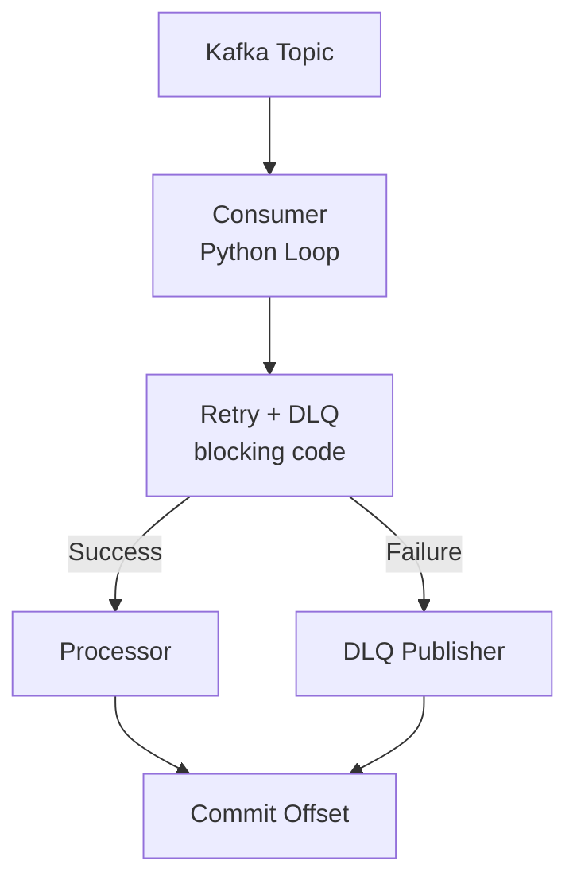

# Kafka Consumer Pattern

> **Purpose**: Implementation guide for Kafka consumers in Python for batch processing workflows. Shows **how to implement** consumers that comply with the [Kafka Consumer Standard](../../05-standards/workflow-standards/kafka-consumer-standard.md).

## Overview

This pattern defines the structure and best practices for implementing Kafka consumers that process messages from batch ETL jobs. It includes retry logic, DLQ handling, metrics, and observability.

**Relationship with Standards**:
- This pattern shows **how to implement** Kafka consumers
- The [Kafka Consumer Standard](../../05-standards/workflow-standards/kafka-consumer-standard.md) defines **what rules must be followed** (mandatory requirements, parameters, error classification rules, consumer group management, etc.)
- Use this pattern for implementation guidance and code examples
- Refer to the standard for mandatory rules and compliance requirements

**Implementation Language:**
- Python (workflow/batch processing)

For complete code templates, see [Kafka Consumer Template](../../08-templates/code/kafka-consumer-template.py).

## Architecture



**Key Design Principles:**
- Sequential processing per partition (enforced by `max_poll_records=1` for rate limiting)
- Retry logic implemented directly in consumer loop using `time.sleep()`
- Manual commit after successful processing or DLQ publish
- DLQ publishing with comprehensive error metadata
- Graceful shutdown with signal handlers

## Implementation Structure

### Package Organization

**New Package-Based Structure** (Required):

```
workflow/<domain>/<feature>/
├── pyproject.toml               # Package configuration with dependencies
├── Dockerfile                   # Docker deployment configuration
├── .dockerignore                # Docker build exclusions
├── pytest.ini                   # Test configuration (no pythonpath)
├── src/                         # Source code directory
│   └── <package_name>/          # Package namespace
│       ├── __init__.py          # Package initialization
│       ├── flows/
│       │   └── consumer.py      # Main consumer loop
│       └── tasks/
│           ├── message.py       # Message data classes
│           ├── processor.py     # Business logic processor
│           ├── dlq_publisher.py # DLQ message publisher (optional - can use neotool_common)
│           ├── db_connection.py # Database connection pooling
│           └── config.py        # Configuration management
└── tests/
    └── test_*.py                # Unit and integration tests
```

**Key Changes from Old Structure**:
- ✅ Source code under `src/<package_name>/` (src layout)
- ✅ Package depends on `neotool-common` in `pyproject.toml`
- ✅ No more `error_classification.py` or `retry_utils.py` - use `neotool_common`
- ✅ Entry points defined in `pyproject.toml` [project.scripts]
- ✅ No PYTHONPATH manipulation needed

### Key Components

1. **Consumer** (`flows/consumer.py`):
   - Main consumer loop using `kafka-python` library
   - Manual commit after successful processing or DLQ publish
   - Retry logic with exponential backoff using `time.sleep()`
   - Sequential processing per partition (enforced by `max_poll_records=1`)
   - Graceful shutdown with signal handlers
   - Error handling and logging

2. **Message Models** (`tasks/message.py`):
   - Dataclasses matching Kafka schema
   - JSON serialization/deserialization
   - Validation helpers

3. **Processor** (`tasks/processor.py`):
   - Business logic implementation
   - Validation
   - Error handling
   - Returns success/error dictionary

4. **DLQ Publisher** (`tasks/dlq_publisher.py`):
   - Publishes failed messages to DLQ topic
   - Includes original message + error metadata
   - Error handling for DLQ publishing itself

5. **Error Classification** (`tasks/error_classification.py`):
   - Classifies errors as retryable vs non-retryable
   - Implements [Kafka Consumer Standard](../../05-standards/workflow-standards/kafka-consumer-standard.md)

6. **Retry Utilities** (`tasks/retry_utils.py`):
   - Exponential backoff calculation with jitter
   - Respects rate limits

7. **Database Connection Pooling** (`tasks/db_connection.py`):
   - PostgreSQL connection pooling
   - Graceful connection lifecycle management

## Code Pattern

For complete implementation templates, see [Kafka Consumer Template](../../08-templates/code/kafka-consumer-template.py).

### Consumer Implementation

The consumer implements retry logic directly in the consumer loop:

### Shared Python Runner (neotool-common)

**All Python batch consumers MUST use the shared `KafkaConsumerRunner`** from the `neotool-common` package.

**Package**: `neotool-common` (installable package at `workflow/python/common/`)

**Import**:
```python
from neotool_common.consumer_base import KafkaConsumerRunner
from neotool_common.error_classification import is_retryable_error
from neotool_common.retry_utils import calculate_backoff
```

**Features**:
- Centralizes retry loop, DLQ publishing, commit handling, signal-driven shutdown
- Accepts pluggable hooks for message parsing, domain processors, DLQ metadata
- Automatically logs retry classification decisions using `neotool_common.error_classification`
- Calculates exponential backoff via `neotool_common.retry_utils`
- Graceful shutdown via signal handlers and optional health server lifecycle hooks

**Example Usage**:

```python
from neotool_common.consumer_base import KafkaConsumerRunner
from institution_enhancement.tasks.config import Config
from institution_enhancement.tasks.message import InstitutionUpsertedMessage
from institution_enhancement.tasks.processor import process_message
# ... other imports

runner = KafkaConsumerRunner(
    consumer_factory=create_consumer,
    producer_factory=create_kafka_producer,
    retry_config=_config.retry,
    message_factory=InstitutionUpsertedMessage.from_dict,
    process_message=process_message,
    dlq_publisher=_publish_to_dlq,
    rate_limit_min_delay_ms=lambda: _config.cnpja.rate_limit_seconds * 1000,
    health_server_start=lambda: start_health_server(_config.health_check),
    health_server_stop=stop_health_server,
    running_flag_setter=set_consumer_running,
    cleanup_callback=close_pool,
    message_context=lambda message: f"bacen_cod_inst={message.bacen_cod_inst}",
    logger=logger,
)
runner.run()
```

**Benefits**:
- Consumers keep only domain-specific wiring (message models, processor functions, rate limits, metrics)
- Retry/DLQ lifecycle managed by shared, tested code
- Consistent behavior across all Python consumers
- Easy to upgrade all consumers by updating `neotool-common`
**Key Implementation Points:**
- Uses `kafka-python` library for consumer implementation
- Manual offset commits after successful processing or DLQ publish
- Retry logic implemented directly in consumer loop
- Sequential processing per partition (enforced by `max_poll_records=1` for rate limiting)
- Graceful shutdown with signal handlers
- Database connection pooling for efficient resource management
- Error classification separates retryable from non-retryable errors
- DLQ publishing with comprehensive error metadata

See [Kafka Consumer Template](../../08-templates/code/kafka-consumer-template.py) for complete implementation including:
- Consumer loop with retry logic
- Message processing
- Error classification
- Retry utilities
- Database connection pooling
- Configuration management

## Configuration

Python consumers use environment variables for configuration. See [Kafka Consumer Template](../../08-templates/code/kafka-consumer-template.py) for complete configuration implementation.

**Configuration Best Practices:**
- Use environment variables for all configuration (12-factor app pattern)
- Provide sensible defaults for local development
- Use dataclasses for type-safe configuration
- Validate configuration on startup
- Support configuration via `.env` files for local development

**Required Environment Variables:**
- `POSTGRES_HOST`, `POSTGRES_PORT`, `POSTGRES_DB`, `POSTGRES_USER`, `POSTGRES_PASSWORD`
- `POSTGRES_POOL_MIN`, `POSTGRES_POOL_MAX` (optional, defaults: 2, 10)
- `KAFKA_BROKERS`, `KAFKA_INPUT_TOPIC`, `KAFKA_CONSUMER_GROUP`
- `RETRY_MAX_RETRIES`, `RETRY_INITIAL_DELAY_MS`, `RETRY_MAX_DELAY_MS`, `RETRY_BACKOFF_MULTIPLIER`, `RETRY_JITTER` (optional, see retry standard for defaults)

**Configuration Example**:

```python
# config.py or environment variables
@dataclass
class RetryConfig:
    max_retries: int = int(os.getenv("MAX_RETRIES", "3"))
    initial_retry_delay_ms: int = int(os.getenv("INITIAL_RETRY_DELAY_MS", "1000"))
    max_retry_delay_ms: int = int(os.getenv("MAX_RETRY_DELAY_MS", "30000"))
    retry_backoff_multiplier: float = float(os.getenv("RETRY_BACKOFF_MULTIPLIER", "2.0"))
    retry_jitter: bool = os.getenv("RETRY_JITTER", "true").lower() == "true"
```

**Kotlin Configuration Example**:

```yaml
# application.yml
batch:
  consumer:
    max-retries: 3
    initial-retry-delay-ms: 1000
    max-retry-delay-ms: 30000
    retry-backoff-multiplier: 2.0
    retry-jitter: true
```

See [Kafka Consumer Standard](../../05-standards/workflow-standards/kafka-consumer-standard.md) for required parameters and defaults.

## Docker Deployment

Python Kafka consumers should be containerized using Docker for consistent deployments. The following Dockerfile pattern should be used for all Python consumers.

### Dockerfile Structure

**Base Image**: Use `python:3.14-alpine` for a minimal, secure image.

**Key Requirements**:
1. Install system dependencies using `apk` (Alpine package manager)
2. Create non-root user for security
3. Copy workflow common module (required for `consumer_base.py`)
4. Copy consumer-specific code
5. Configure health check endpoint
6. Use proper layer caching for dependencies

**Example Dockerfile** (New Package-Based Approach):

```dockerfile
FROM python:3.14-alpine

WORKDIR /app

# Create non-root user
RUN addgroup -g 1000 consumer && \
    adduser -D -u 1000 -G consumer consumer

# Install system dependencies
RUN apk add --no-cache gcc musl-dev libpq-dev

# Install neotool-common from local path
COPY --chown=consumer:consumer ../../common /tmp/neotool-common/
RUN pip install --no-cache-dir /tmp/neotool-common && \
    rm -rf /tmp/neotool-common

# Copy application code
COPY --chown=consumer:consumer . /app/

# Install the application
RUN pip install --no-cache-dir /app

# Switch to non-root user
USER consumer

# Expose health check port
EXPOSE 8080

# Health check
HEALTHCHECK --interval=30s --timeout=10s --start-period=40s --retries=3 \
    CMD python -c "import urllib.request; urllib.request.urlopen('http://localhost:8080/health')"

# Run the consumer using entry point from pyproject.toml
ENTRYPOINT ["<package-name>-consumer"]
```

**Key Changes**:
- ✅ Installs `neotool-common` package first
- ✅ Installs consumer as a package (reads `pyproject.toml`)
- ✅ Uses entry point defined in `pyproject.toml` instead of direct Python invocation
- ✅ No PYTHONPATH manipulation needed
- ✅ Simpler and more maintainable

### Build Context

**Important**: The Docker build context must be the `workflow/` directory (or project root) to properly copy both the consumer code and the `common/` module.

**Build Command**:
```bash
# From workflow/ directory
docker build -f <domain>/<feature>/Dockerfile -t <consumer-name> .

# Or from project root
docker build -f workflow/<domain>/<feature>/Dockerfile -t <consumer-name> workflow/
```

### Docker Compose Integration

Consumers should be defined in `docker-compose.yml` or `docker-compose.local.yml`:

```yaml
services:
  <consumer-name>:
    build:
      context: ./workflow
      dockerfile: <domain>/<feature>/Dockerfile
    environment:
      POSTGRES_HOST: postgres
      POSTGRES_PORT: 5432
      POSTGRES_DB: neotool_db
      POSTGRES_USER: neotool
      POSTGRES_PASSWORD: ${POSTGRES_PASSWORD}
      KAFKA_BROKERS: kafka:9092
      KAFKA_INPUT_TOPIC: <domain>.<entity>.v1
      KAFKA_CONSUMER_GROUP: <domain>-<feature>-consumer-group
      HEALTH_CHECK_PORT: 8080
      HEALTH_CHECK_ENABLED: "true"
    depends_on:
      - postgres
      - kafka
    healthcheck:
      test: ["CMD", "python", "-c", "import urllib.request; urllib.request.urlopen('http://localhost:8080/health')"]
      interval: 30s
      timeout: 10s
      retries: 3
      start_period: 40s
```

### Alpine Linux Considerations

**Package Manager**: Alpine uses `apk`, not `apt-get`. Always use:
```dockerfile
RUN apk add --no-cache <package-name>
```

**User Creation**: Alpine uses `addgroup` and `adduser`, not `useradd`:
```dockerfile
RUN addgroup --system --gid 1000 consumer && \
    adduser --system --uid 1000 --ingroup consumer consumer
```

**PostgreSQL Libraries**: Use `postgresql-libs` (not `libpq5`) for `psycopg2-binary`:
```dockerfile
RUN apk add --no-cache postgresql-libs
```

### Health Check Configuration

All consumers should expose a health check endpoint on port 8080 (configurable via `HEALTH_CHECK_PORT`). The Dockerfile includes a `HEALTHCHECK` instruction that validates the consumer is running.

**Health Check Requirements**:
- Endpoint: `http://localhost:8080/health`
- Should return HTTP 200 when consumer is healthy
- Should be implemented using the shared health check module (see `flows/health.py` examples)

### Security Best Practices

1. **Non-Root User**: Always run as non-root user (UID 1000)
2. **Minimal Base Image**: Use Alpine Linux for smaller attack surface
3. **No Cache in Production**: Use `--no-cache-dir` for pip installs
4. **Layer Caching**: Copy requirements.txt before application code for better caching
5. **Minimal Dependencies**: Only install required system packages

### Build Optimization

1. **Multi-Stage Builds**: Use multi-stage builds if compilation is needed
2. **Layer Ordering**: Copy dependencies first, then application code
3. **Common Module**: Copy `common/` module separately for better caching across consumers
4. **Requirements Caching**: Copy `requirements.txt` separately to cache dependency installation

## Retry Strategy

**All consumers MUST implement retry logic according to the [Kafka Consumer Standard](../../05-standards/workflow-standards/kafka-consumer-standard.md).**

The standard defines the **mandatory rules and requirements**:
- Error classification rules (retryable vs non-retryable)
- Exponential backoff formula and parameters
- Retry configuration parameters and defaults
- DLQ routing rules
- Consumer group management
- Metrics and observability requirements

This pattern shows **how to implement** those requirements. See the standard for complete rule definitions.

### Implementation Example

**Complete retry implementation with error classification and backoff**:

```python
def process_with_retry(message: InstitutionUpsertedMessage) -> Dict[str, Any]:
    """Process message with retry logic and exponential backoff."""
    retry_count = 0
    max_retries = config.max_retries
    
    while retry_count <= max_retries:
        try:
            result = process_message(message)
            if result["success"]:
                metrics.increment_processed("success")
                return result
            
            # Check if error is retryable
            error = result.get("error")
            if not is_retryable_error(error):
                metrics.increment_error(error_type=type(error).__name__, classification="non-retryable")
                publish_to_dlq(message, error, retry_count=retry_count)
                return result
            
            # Retryable error - check if we should retry
            if retry_count >= max_retries:
                metrics.increment_error(error_type=type(error).__name__, classification="retryable")
                publish_to_dlq(message, error, retry_count=retry_count)
                return result
            
            # Calculate and apply backoff
            delay_ms = calculate_backoff(retry_count, config)
            logger.warning(
                f"Retryable error (attempt {retry_count + 1}/{max_retries + 1}), "
                f"retrying in {delay_ms}ms: {error}"
            )
            metrics.increment_retry(retry_attempt=retry_count + 1)
            time.sleep(delay_ms / 1000.0)
            retry_count += 1
            
        except RetryableException as e:
            if retry_count >= max_retries:
                metrics.increment_error(error_type=type(e).__name__, classification="retryable")
                publish_to_dlq(message, e, retry_count=retry_count)
                raise
            
            delay_ms = calculate_backoff(retry_count, config)
            logger.warning(f"Retryable exception, retrying in {delay_ms}ms: {e}")
            metrics.increment_retry(retry_attempt=retry_count + 1)
            time.sleep(delay_ms / 1000.0)
            retry_count += 1
            
        except NonRetryableException as e:
            metrics.increment_error(error_type=type(e).__name__, classification="non-retryable")
            publish_to_dlq(message, e, retry_count=0)
            raise
    
    # Should not reach here, but handle gracefully
    raise Exception("Max retries exceeded")
```

### Error Classification Implementation

**Error classification function implementing standard rules**:

```python
def is_retryable_error(error: Exception) -> bool:
    """Classify error as retryable or non-retryable per standard."""
    # Network/connection errors - retryable
    if isinstance(error, (ConnectionError, TimeoutError, requests.exceptions.Timeout)):
        return True
    
    # HTTP errors - classify by status code
    if isinstance(error, requests.exceptions.HTTPError):
        if error.response.status_code in [429, 502, 503, 504]:
            return True  # Rate limit, bad gateway, service unavailable, gateway timeout
        if error.response.status_code in [400, 401, 403, 404]:
            return False  # Bad request, unauthorized, forbidden, not found
    
    # Database transient errors - retryable
    if isinstance(error, psycopg2.OperationalError):
        return True  # Connection errors are retryable
    if isinstance(error, psycopg2.IntegrityError):
        return False  # Constraint violations are not retryable
    
    # Validation errors - not retryable
    if isinstance(error, ValueError):
        return False
    
    # Default: assume retryable for unknown errors (conservative approach)
    return True
```

### Backoff Calculation Implementation

**Exponential backoff with jitter**:

```python
import random

def calculate_backoff(retry_count: int, config: RetryConfig) -> int:
    """Calculate exponential backoff delay with jitter per standard formula."""
    base_delay = min(
        config.initial_retry_delay_ms * (config.retry_backoff_multiplier ** retry_count),
        config.max_retry_delay_ms
    )
    
    if config.retry_jitter:
        jitter = random.uniform(0, base_delay * 0.1)  # 10% jitter
        return int(base_delay + jitter)
    
    return int(base_delay)
```

### Implementation Details

- Retry logic implemented directly in consumer loop (no virtual threads in Python)
- Uses `time.sleep()` for retry delays
- Sequential processing per partition (enforced by `max_poll_records=1` for rate limiting)
- Error classification via `is_retryable_error()` function
- Backoff calculation via `calculate_backoff()` function
- See [Kafka Consumer Standard](../../05-standards/workflow-standards/kafka-consumer-standard.md) for complete rule definitions


## DLQ Strategy

**DLQ routing and message structure MUST follow the [Kafka Consumer Standard](../../05-standards/workflow-standards/kafka-consumer-standard.md).**

### DLQ Topic Naming

- Pattern: `<domain>.<entity>.dlq`
- Example: `swapi.people.dlq`

### DLQ Message Structure

The standard defines the required DLQ message structure. Example implementation:

**Python:**
```python
{
    "original_message": { /* original Kafka message */ },
    "error_type": "ValueError",
    "error_message": "Invalid bacen_cod_inst format",
    "failed_at": "2024-01-01T00:00:00Z",
    "retry_count": 3,
    "error_classification": "non-retryable",
    "stack_trace": "..."  # Optional, for debugging
}
```

See [Kafka Consumer Standard](../../05-standards/workflow-standards/kafka-consumer-standard.md) for complete requirements.

## Graceful Shutdown

The consumer implements graceful shutdown with draining to ensure in-flight work completes before closing.

### Shutdown Process

1. **Set Shutdown Flag**: Prevents new messages from being accepted
2. **Pause All Partitions**: Stops receiving new messages from Kafka
3. **Drain In-Flight Work**: Waits for all currently processing messages to complete
4. **Close**: Application context closes after draining completes

### Draining Mechanism

**Problem**: Previously, shutdown just set a flag and paused partitions, but didn't wait for in-flight messages to complete. If the app stopped while a record was mid-retry, the consumer could exit without committing, causing duplicates or unprocessed records. Additionally, if a retry is in the middle of a long backoff, shutdown will wait until the sleep completes or the timeout expires.

**Solution**: 
- Track in-flight work per partition, pause all assigned partitions (not just active ones), then wait for all in-flight messages to complete (with configurable timeout)
- `processWithRetry` now checks the shutdown flag during retry loops, allowing in-flight work to abort quickly when shutdown starts
- This ensures graceful draining before close, with early abort capability

**Configuration:**
- `batch.consumer.shutdown-timeout-seconds`: Maximum time to wait for in-flight work (default: 30 seconds)
- If timeout is reached, shutdown proceeds anyway (messages may be reprocessed by Kafka)
- Progress is logged periodically during draining
- Note: In-flight threads may still be running after timeout and may attempt to commit against a closing consumer

**Implementation:**
- In-flight work is tracked using `ConcurrentHashMap<Int, AtomicInteger>` per partition
- Counter incremented at start of `receive()`, decremented in `finally` block
- Shutdown waits until all counters reach zero or timeout expires
- `processWithRetry` checks `isShuttingDown` flag before and after retry delays to allow early abort

## max.poll.interval.ms Limitations

The consumer attempts to mitigate `max.poll.interval.ms` violations, but has important limitations.

### Problem

Long retry loops with `time.sleep()` can exceed `max.poll.interval.ms`, causing Kafka to think the consumer is dead and trigger rebalances. The consumer thread is blocked during retry delays, preventing heartbeats.

### Important Limitations

**Pause/Resume Does NOT Solve Heartbeat Problem:**
- Pausing a partition only stops fetching new records; it does NOT keep the consumer in the group
- The listener thread still sits inside `receive()` until `processWithRetry` returns
- Kafka doesn't send heartbeats while `poll()` is blocked, regardless of partition pause state
- Long sleeps in `Thread.sleep()` can still exceed `max.poll.interval.ms`

**Current Approach:**
- Partition is only paused when actually retrying (not on first attempt/happy path)
- Pause is for backpressure (preventing new fetches during retries), not heartbeat protection
- Shutdown flag is checked during retry loops to allow early abort during graceful shutdown
- Accepts that very long retry cycles may cause rebalances (tune `maxRetries`/delays accordingly)

**To Truly Avoid Rebalances:**
- Hand work off to another thread/coroutine (but this breaks sequential per-partition processing)
- Call `consumer.wakeup()/poll()` periodically (complex, requires coordination)
- Tune retry configuration to keep total retry time well below `max.poll.interval.ms`

**Configuration Recommendations:**
- Ensure `max.poll.interval.ms` is set appropriately for your retry strategy
- Consider: `max.poll.interval.ms >= (maxRetries * maxRetryDelayMs) + processingTime + buffer`
- Default Kafka `max.poll.interval.ms` is 5 minutes (300000ms)
- With default retry config (3 retries, max 10s delay), total retry time can be ~20-30s, well within default
- For longer retry cycles, increase `max.poll.interval.ms` or reduce retry delays

## Backpressure and Poison Messages

The consumer processes messages sequentially per partition, which means poison messages can block partition processing.

### Behavior

**Poison Message Impact:**
- A single poison message (one that always fails) will block processing for its partition
- Processing is blocked until all retries are exhausted and the message is sent to DLQ
- Sequential processing ensures ordering but can cause starvation if one message blocks
- Newer messages in the same partition can't progress until the poison message completes its retry cycle

**Why This Design:**
- Sequential per-partition processing ensures at-least-once delivery semantics
- Maintains message ordering within partitions
- Simple, predictable behavior

### Mitigation Strategies

1. **Tune Retry Configuration:**
   - Reduce `maxRetries` to fail faster for poison messages
   - Reduce `maxRetryDelayMs` to shorten retry cycles
   - Consider: `maxRetries: 1` for faster DLQ routing

2. **DLQ Routing:**
   - Quickly move poison messages to DLQ to unblock partition
   - Monitor DLQ for patterns indicating systemic issues

3. **Monitoring and Alerting:**
   - Monitor partition lag metrics
   - Alert on stuck partitions (no progress for extended period)
   - Track retry counts and DLQ rates

4. **High-Volume Scenarios:**
   - For high-volume scenarios, consider per-partition queues with limited concurrency
   - This allows skipping or DLQ routing of poison messages sooner
   - Document the behavior and provide metrics to alert on stuck partitions

5. **Configuration Tuning:**
   - Consider limiting total retry duration
   - Add configuration to cap maximum time spent on a single message
   - Balance between resilience and throughput

### Metrics to Monitor

- Partition lag (messages waiting to be processed)
- Processing duration per message
- Retry counts (high retry counts may indicate poison messages)
- DLQ rates (sudden spikes may indicate systemic issues)
- In-flight work counts (during normal operation and shutdown)

## Metrics

### Required Metrics

- `{domain}.{entity}.processed` - Counter
- `{domain}.{entity}.processing.duration` - Timer
- `{domain}.{entity}.dlq.count` - Counter
- `{domain}.{entity}.retry.count` - Counter
- `{domain}.{entity}.error.count` - Counter

### Metrics Implementation

Metrics should be implemented using your preferred Python metrics library (e.g., Prometheus client, StatsD). See [Kafka Consumer Template](../../08-templates/code/kafka-consumer-template.py) for implementation patterns.

## Testing

### Unit Tests

- Test successful processing
- Test retry scenarios
- Test DLQ publishing
- Test validation errors
- Mock Kafka consumer

### Integration Tests

- Use Testcontainers Kafka
- End-to-end message processing
- DLQ flow testing
- Consumer group testing

## Best Practices

### General Best Practices

1. **Manual Commit**: Always use manual commit for control
2. **Idempotency**: Ensure processing is idempotent
3. **Error Handling**: Comprehensive error handling at all levels
4. **Observability**: Logging and metrics for all operations
5. **Validation**: Validate messages before processing
6. **DLQ**: Always have DLQ for poison messages
7. **Retries**: Retry transient errors, not validation errors
8. **Metrics**: Expose all key metrics for monitoring

### Python-Specific Best Practices

1. **Connection Pooling**: Always use connection pooling for database connections
   - Use `psycopg2.pool.ThreadedConnectionPool` for PostgreSQL
   - Configure pool size based on expected concurrency
   - Always return connections to pool in `finally` blocks
   - Close pool gracefully on shutdown

2. **Rate Limiting**: Enforce rate limits for external API calls
   - Use global state to track last API call time
   - Sleep between calls to respect API rate limits
   - Consider rate limit minimum delay in retry backoff calculation

3. **Error Classification**: Implement explicit error classification
   - Separate retryable from non-retryable errors
   - Use exception types and HTTP status codes for classification
   - Default to retryable for unknown errors (conservative approach)

4. **Graceful Shutdown**: Implement proper signal handling
   - Register SIGTERM and SIGINT handlers
   - Set shutdown flag to stop accepting new messages
   - Close consumers, producers, and connection pools in `finally` block

5. **Configuration Management**: Use environment variables for configuration
   - Provide sensible defaults for local development
   - Use dataclasses for type-safe configuration
   - Validate configuration on startup

6. **Sequential Processing**: Use `max_poll_records=1` when rate limiting is required
   - Ensures sequential processing per partition
   - Prevents overwhelming external APIs
   - Simplifies rate limit enforcement

7. **Structured Logging**: Use structured logging with context
   - Include message identifiers in log messages
   - Log processing time for performance monitoring
   - Include error context in exception logs

8. **Database Transaction Management**: Use transactions for data consistency
   - Commit only after successful processing
   - Rollback on errors
   - Check connection state before rollback (handles mocks in tests)

9. **DLQ Publishing**: Always include comprehensive error metadata
   - Original message
   - Error type and message
   - Retry count
   - Error classification (retryable/non-retryable)
   - Timestamp of failure

10. **Health Checks**: Implement health check endpoints
    - Track consumer running state
    - Expose via HTTP endpoint for Kubernetes liveness/readiness probes
    - Use separate thread for health check server

## Known Limitations

### max.poll.interval.ms Risk

**Issue**: Long retry loops can exceed `max.poll.interval.ms`, causing Kafka to think the consumer is dead and trigger rebalances. The consumer thread is blocked during retry delays, preventing heartbeats.

**Current Mitigation**: 
- Partition pausing during retries (for backpressure, not heartbeat protection)
- Shutdown flag checks during retry loops
- Configuration recommendations to tune retry timing

**Limitation**: Pausing partitions does NOT solve the heartbeat problem - the listener thread is still blocked. To truly avoid rebalances, you must either:
- Tune retry configuration to keep total retry time well below `max.poll.interval.ms`
- Accept that very long retry cycles may cause rebalances
- Use alternative architectures (e.g., hand work off to separate thread, but this breaks sequential processing)

**Recommendation**: Ensure `max.poll.interval.ms >= (maxRetries * maxRetryDelayMs) + processingTime + buffer`. Default is 5 minutes (300000ms), which is usually sufficient for default retry config.

### Poison Message Blocking

**Issue**: Single poison messages block entire partition processing until all retries are exhausted.

**Impact**: 
- Newer messages in the same partition cannot progress
- Partition lag increases
- Throughput degrades for affected partitions

**Mitigation**:
- Tune retry configuration (reduce `maxRetries` and `maxRetryDelayMs`)
- Monitor partition lag and alert on stuck partitions
- Route poison messages to DLQ quickly
- Consider per-partition queues with limited concurrency for high-volume scenarios

### Commit Queue Race Condition

**Issue**: `processPendingCommits()` is called at the start of `receive()`. If no new messages arrive, commits may be delayed.

**Impact**: 
- Commits may not happen immediately after processing completes
- In rare cases, commits could be delayed until next message arrives

**Mitigation**: 
- Commits are queued and processed on next message arrival
- For low-throughput scenarios, consider periodic commit flushing
- Current implementation is acceptable for most use cases

### Shutdown Timeout Behavior

**Issue**: If shutdown timeout expires, in-flight threads may still be running and may attempt commits against a closing consumer.

**Impact**:
- Commits may fail silently
- Messages may be reprocessed by Kafka
- No guarantee of exactly-once semantics during shutdown

**Mitigation**:
- Set appropriate `shutdown-timeout-seconds` based on processing time
- Monitor shutdown duration metrics
- Accept that some messages may be reprocessed during shutdown

### DLQ Fallback Not Implemented

**Issue**: `handleDlqFallback()` is a TODO - no actual fallback storage when DLQ publishing fails.

**Impact**:
- If DLQ publishing fails after retries, message is lost
- No alternative storage mechanism

**Recommendation**: Implement fallback storage (local file, database, or S3) for critical messages.

### No Circuit Breaker

**Issue**: No protection against cascading failures when downstream systems are unavailable.

**Impact**:
- Retries continue even when downstream is completely down
- Wastes resources and increases latency

**Recommendation**: Implement circuit breaker pattern to fail fast when downstream is unavailable.

## Common Pitfalls

1. **Auto-commit Enabled**: Disable auto-commit for manual control
2. **No DLQ**: Always implement DLQ for failed messages
3. **Infinite Retries**: Set max retries to prevent infinite loops
4. **No Metrics**: Always expose metrics for observability
5. **Poor Error Handling**: Handle all exception types appropriately
6. **Memory Leaks from Partition Tracking**: Not cleaning up `activeConsumers` entries causes unbounded map growth and memory leaks. Always clean up in `finally` blocks.
7. **Shutdown Without Draining**: Shutting down without waiting for in-flight work can cause message loss or duplicates. Always implement graceful shutdown with draining.
8. **Exceeding max.poll.interval.ms**: Long retry loops can exceed poll interval, causing rebalances. Pausing partitions does NOT solve this - the listener thread is still blocked. Tune retry config to keep total retry time well below `max.poll.interval.ms`, or accept that very long retries may cause rebalances.
9. **Poison Messages Blocking Partitions**: Single poison messages can block partition processing. Tune retry config, monitor lag, and route to DLQ quickly.
10. **Pausing Partitions Unnecessarily**: Pausing every partition before any attempt and only resuming after completion prevents pipelining and adds unnecessary protocol calls. Only pause when actually retrying, not on the happy path.
11. **Shutdown When Idle**: If shutdown starts while consumer is idle, `activeConsumers` is empty, so no partitions get paused even though they remain assigned. Track assigned partitions separately from active processing.
12. **Commit Retry Logic**: Only retries commit once - may need more resilience for unreliable networks
13. **No Idempotency Mechanism**: While `record_id` exists, no explicit idempotency check in processor - relies on business logic
14. **Limited Backpressure**: Only pauses partitions during retries, not based on queue depth or downstream health

## Missing Features & Implementation Recommendations

### High Priority

1. **DLQ Fallback Implementation**: Implement `handleDlqFallback()` to store messages when DLQ publishing fails
   - Options: Local file, database table, or S3 bucket
   - Should include same metadata as DLQ messages
   - Should be queryable for manual replay

2. **Health Check Endpoint**: Expose consumer health status
   - Track consumer group membership
   - Monitor partition assignments
   - Check for stuck partitions
   - Verify DLQ connectivity

3. **Partition Lag Metrics**: Track consumer lag per partition
   - Use Kafka consumer metrics API
   - Alert on high lag thresholds
   - Monitor lag trends over time

4. **Improved Commit Reliability**: More robust commit retry logic
   - Multiple retry attempts with exponential backoff
   - Separate metrics for commit failures
   - Circuit breaker for commit failures

5. **Processing Timeout**: Per-message processing timeout
   - Prevent stuck processing
   - Configurable timeout per message
   - Send to DLQ if timeout exceeded

### Medium Priority

1. **Circuit Breaker Pattern**: Protect against cascading failures
   - Fail fast when downstream is unavailable
   - Configurable failure thresholds
   - Automatic recovery when downstream recovers

2. **DLQ Replay Mechanism**: Ability to replay DLQ messages
   - Query DLQ topic
   - Replay selected messages
   - Support for bulk replay

3. **Better Shutdown Handling**: More graceful handling of in-flight work
   - Better coordination between shutdown and retry loops
   - Better coordination between shutdown and commits
   - Metrics for shutdown duration

4. **Rate Limiting**: Prevent overwhelming downstream systems
   - Per-partition rate limits
   - Global rate limits
   - Configurable throttling

### Low Priority

1. **Batch Processing**: Process multiple messages in single transaction
   - Improve throughput for high-volume scenarios
   - Atomic processing of message batches
   - Rollback on batch failure

2. **Schema Registry Integration**: Avro/Protobuf schema validation
   - Validate message schemas
   - Schema evolution support
   - Schema compatibility checking

3. **Distributed Tracing**: OpenTelemetry integration
   - Trace message processing across services
   - Correlate logs and metrics
   - Performance analysis

## Operational Runbook

### Troubleshooting Common Issues

#### Consumer Not Processing Messages

**Symptoms**: No messages being processed, consumer group shows no activity

**Diagnosis**:
1. Check consumer group status: `./neotool kafka --consumer-group <group-name>`
2. Verify topic has messages: `./neotool kafka --topic <topic-name>`
3. Check application logs for errors
4. Verify consumer is running and healthy

**Solutions**:
- Restart consumer application
- Check Kafka connectivity
- Verify consumer group configuration
- Check for rebalance issues

#### High Partition Lag

**Symptoms**: Consumer lag increasing, messages not being processed fast enough

**Diagnosis**:
1. Check partition lag metrics
2. Monitor processing duration
3. Check for stuck partitions
4. Review retry counts

**Solutions**:
- Scale out consumers (increase consumer instances)
- Optimize processing logic
- Reduce retry delays
- Check for poison messages blocking partitions

#### Frequent Rebalances

**Symptoms**: Consumer group frequently rebalancing, processing interrupted

**Diagnosis**:
1. Check `max.poll.interval.ms` configuration
2. Monitor processing duration
3. Check for long retry loops
4. Review session timeout settings

**Solutions**:
- Increase `max.poll.interval.ms`
- Reduce retry delays
- Optimize processing time
- Check for network issues

#### DLQ Publishing Failures

**Symptoms**: Messages not appearing in DLQ, DLQ publish failure metrics increasing

**Diagnosis**:
1. Check DLQ topic exists and is accessible
2. Verify DLQ publisher configuration
3. Check Kafka producer errors
4. Review DLQ retry configuration

**Solutions**:
- Verify DLQ topic configuration
- Check Kafka producer connectivity
- Increase DLQ retry attempts
- Implement DLQ fallback mechanism

#### Shutdown Timeouts

**Symptoms**: Application shutdown taking too long, timeout warnings in logs

**Diagnosis**:
1. Check `shutdown-timeout-seconds` configuration
2. Monitor in-flight work during shutdown
3. Review processing duration
4. Check for stuck processing

**Solutions**:
- Increase `shutdown-timeout-seconds`
- Optimize processing time
- Check for long retry loops
- Monitor shutdown metrics

### Performance Tuning

#### High-Throughput Scenarios

**Recommendations**:
1. **Increase `max.poll.records`**: Fetch more messages per poll (default: 100)
2. **Optimize Processing**: Minimize processing time per message
3. **Scale Out**: Add more consumer instances
4. **Partition Count**: Ensure topic has enough partitions for parallelism
5. **Batch Processing**: Consider processing multiple messages in single transaction

#### Low-Latency Scenarios

**Recommendations**:
1. **Reduce Retry Delays**: Minimize retry backoff times
2. **Reduce `max.poll.records`**: Fetch fewer messages per poll
3. **Optimize Processing**: Minimize processing time
4. **Direct Processing**: Avoid unnecessary queuing

#### Resource-Constrained Environments

**Recommendations**:
1. **Reduce `max.poll.records`**: Lower memory usage
2. **Reduce Retry Counts**: Fail faster to free resources
3. **Monitor Memory**: Track memory usage and connection pool size
4. **Tune JVM**: Optimize heap size and GC settings

## Monitoring Checklist

### Required Metrics to Monitor

1. **Processing Metrics**:
   - `{domain}.{entity}.processed` - Processing rate
   - `{domain}.{entity}.processing.duration` - Processing latency
   - `{domain}.{entity}.error.count` - Error rate

2. **Retry Metrics**:
   - `{domain}.{entity}.retry.count` - Retry frequency
   - Retry rate trends

3. **DLQ Metrics**:
   - `{domain}.{entity}.dlq.count` - DLQ rate
   - `{domain}.{entity}.dlq.publish.failure` - DLQ publish failures
   - DLQ topic message count

4. **Consumer Metrics**:
   - Partition lag per partition
   - Consumer group membership
   - Partition assignments
   - Commit failures

5. **Infrastructure Metrics**:
   - Thread count (if using threading)
   - Memory usage
   - CPU usage
   - Network I/O

### Alerting Thresholds

1. **High Error Rate**: Alert when error rate exceeds 5% of processing rate
2. **High DLQ Rate**: Alert when DLQ rate exceeds 1% of processing rate
3. **High Partition Lag**: Alert when lag exceeds 10,000 messages per partition
4. **Stuck Partitions**: Alert when partition lag increases without processing
5. **DLQ Publish Failures**: Alert when DLQ publish failure rate exceeds 10%
6. **Frequent Rebalances**: Alert when rebalances occur more than once per hour
7. **Shutdown Timeouts**: Alert when shutdown exceeds configured timeout

### Health Check Indicators

1. **Consumer Health**:
   - Consumer group membership active
   - Partitions assigned and processing
   - No frequent rebalances
   - Processing rate stable

2. **Processing Health**:
   - Error rate within acceptable range
   - Processing duration stable
   - Retry rate within expected range
   - No stuck partitions

3. **DLQ Health**:
   - DLQ rate within acceptable range
   - DLQ publishing successful
   - DLQ topic accessible
   - DLQ message count monitored

## Related Patterns

- [Batch Workflow Standard](../05-standards/workflow-standards/batch-workflow-standard.md)
- [Kafka Consumer Standard](../05-standards/workflow-standards/kafka-consumer-standard.md) - **Required reading for consumer implementation**
- [Service Pattern](./service-pattern.md)
- [Repository Pattern](./repository-pattern.md)
- [Kafka Operations Guide](./kafka-operations-guide.md)
- [Kafka Monitoring Guide](./kafka-monitoring-guide.md)

## Examples

- [Institution Enhancement Consumer](../../../workflow/python/financial_data/institution_enhancement/flows/consumer.py) - Python Kafka consumer implementation
- [SWAPI ETL Workflow](../../07-examples/batch-workflows/swapi-etl-workflow.md)
