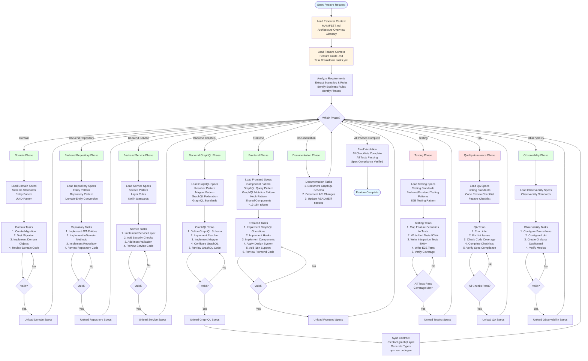

# Spec Context Strategy

> **Purpose**: Optimized context loading strategy for AI assistants working with NeoTool's comprehensive specification, ensuring efficient context usage while maintaining spec compliance.

## Overview

NeoTool's specification is comprehensive and RAG-optimized. This document provides strategies for AI assistants to efficiently navigate and use the specification while ensuring complete spec compliance.

## Core Principles

1. **Start Narrow, Expand as Needed**: Load minimal context initially, expand for specific phases
2. **Reference, Don't Copy**: Reference spec paths rather than copying full content
3. **Phase-Based Loading**: Load only specs relevant to current development phase
4. **Use Cross-References**: Leverage `related:` links in spec frontmatter
5. **Leverage MANIFEST**: Use MANIFEST.md for quick document discovery

## Context Loading Strategies

### Strategy 1: Essential Context (Always Load)

**When**: At the start of any development task

**Load**:
- `docs/MANIFEST.md` - Document index for navigation
- `docs/00-overview/architecture-overview.md` - System understanding
- `docs/02-domain/glossary.md` - Terminology

**Purpose**: Establish baseline understanding of system and terminology

### Strategy 2: Feature Context (Load for Feature Work)

**When**: Working on a specific feature

**Load**:
- Feature guide: `docs/03-features/<module>/<feature>/<feature>.md`
- Task breakdown: `docs/03-features/<module>/<feature>/<feature>.tasks.yml`

**Purpose**: Understand feature requirements and implementation plan

> **Note**: Feature guides are markdown files containing requirements, scenarios, business rules, runbooks, and implementation details. They replace the previous Gherkin `.feature` format. See [Feature Guide Template](../../08-templates/feature-templates/feature-guide-template.md) for structure.

### Strategy 3: Phase-Specific Context (Load Per Phase)

**When**: Entering a specific implementation phase

#### Backend Base (Load Once for Backend Work)
**Load**:
- `docs/05-standards/architecture-standards/layer-rules.md`
- `docs/05-standards/coding-standards/kotlin-standards.md`
- `docs/04-patterns/backend-patterns/domain-model-pattern.md`

#### Backend Add-ons (Load Per Sub-Phase)

**Domain add-on** (schema/migrations/IDs):
- `docs/05-standards/database-standards/schema-standards.md`
- `docs/04-patterns/backend-patterns/uuid-v7-pattern.md`
- `docs/09-adr/0005-postgresql-database.md`

**Repository add-on** (entities/repositories/domain conversion):
- `docs/04-patterns/backend-patterns/entity-pattern.md`
- `docs/04-patterns/backend-patterns/repository-pattern.md`
- `docs/04-patterns/backend-patterns/domain-entity-conversion.md`

**Service add-on** (business logic):
- `docs/04-patterns/backend-patterns/service-pattern.md`

**GraphQL add-on** (schema/resolvers/mapping/federation):
- `docs/04-patterns/backend-patterns/resolver-pattern.md`
- `docs/04-patterns/backend-patterns/mapper-pattern.md`
- `docs/04-patterns/api-patterns/graphql-query-pattern.md`
- `docs/05-standards/api-standards/graphql-standards.md`

**Pagination add-on** (lists/Relay connections):
- `docs/04-patterns/backend-patterns/pagination-pattern.md`

#### Frontend Base (Load Once for Frontend Work)
**Load**:
- `docs/09-adr/0004-typescript-nextjs-frontend.md`
- `docs/04-patterns/frontend-patterns/styling-pattern.md`
- `docs/04-patterns/frontend-patterns/shared-components-pattern.md`
- `docs/04-patterns/frontend-patterns/management-pattern.md`

#### Frontend Add-ons (Load When Needed)

**GraphQL add-on** (operations, cache updates, mutations):
- `docs/04-patterns/frontend-patterns/graphql-query-pattern.md`
- `docs/04-patterns/frontend-patterns/graphql-mutation-pattern.md`
- `docs/04-patterns/frontend-patterns/mutation-pattern.md`

**UX add-ons** (navigation/feedback):
- `docs/04-patterns/frontend-patterns/toast-notification-pattern.md`
- `docs/04-patterns/frontend-patterns/breadcrumb-pattern.md`

#### Testing Base + Add-ons
**Load**:
- `docs/05-standards/testing-standards/unit-test-standards.md`
- `docs/04-patterns/backend-patterns/testing-pattern.md` (if backend)
- `docs/04-patterns/frontend-patterns/testing-pattern.md` (if frontend)
- `docs/04-patterns/frontend-patterns/e2e-testing-pattern.md` (if E2E)

#### Common Conditional Standards (Load When Needed)
- **Security/authentication/authorization**: `docs/05-standards/security-standards/authentication-standards.md`
- **Linting / quality checks**: `docs/05-standards/coding-standards/linting-standards.md`
- **Observability work**: `docs/05-standards/observability-standards.md`

### Strategy 4: Standards Context (Load When Needed)

**When**: Need specific standards or rules

**Load on Demand**:
- `docs/05-standards/coding-standards/linting-standards.md` - During linting
- `docs/05-standards/security-standards/authentication-standards.md` - For auth features
- `docs/05-standards/observability-standards.md` - For observability setup

### Strategy 5: Pattern Reference (Load Patterns, Not Examples)

**When**: Need implementation guidance

**Strategy**:
- Load pattern documents (how to implement)
- Reference example documents (where to find examples)
- Don't load full example code unless needed

**Example**:
- ✅ Load: `docs/04-patterns/backend-patterns/resolver-pattern.md`
- ❌ Don't load: `docs/07-examples/backend/crud-example/` (reference path only)

## Context Optimization Techniques

### Technique 1: Spec Chunking

**Problem**: Large spec documents can be overwhelming

**Solution**: Load specific sections, not entire documents

**Example**:
```markdown
# Instead of loading entire entity-pattern.md
# Load only relevant sections:
- Entity structure
- JPA annotations
- Domain conversion
# Skip: Examples, advanced patterns (load if needed)
```

### Technique 2: Cross-Reference Navigation

**Problem**: Need related information

**Solution**: Use `related:` links in frontmatter to discover related docs

**Example**:
```yaml
# In entity-pattern.md frontmatter
related:
  - 04-patterns/backend-patterns/repository-pattern.md
  - 04-patterns/backend-patterns/domain-entity-conversion.md
```

**Action**: Load related docs only when needed

### Technique 3: MANIFEST Lookup

**Problem**: Need to find a specific document

**Solution**: Use MANIFEST.md as index, then load specific document

**Example**:
1. Search MANIFEST.md for "pagination"
2. Find: `04-patterns/backend-patterns/pagination-pattern.md`
3. Load only that document

### Technique 4: Pattern Over Example

**Problem**: Examples are large but patterns are concise

**Solution**: Load patterns, reference examples

**Example**:
- ✅ Load: `docs/04-patterns/backend-patterns/resolver-pattern.md`
- ❌ Avoid: `docs/07-examples/backend/crud-example/` (reference path only)
- ✅ Reference: "See `docs/07-examples/backend/crud-example/` for complete example"

### Technique 5: Phase Isolation

**Problem**: Loading all specs at once can be overwhelming

**Solution**: Load specs only for current phase, unload when phase complete

**Example**:
```
Phase 1: Domain
  Load: domain specs
  Implement: domain code
  Unload: domain specs

Phase 2: Backend
  Load: backend specs
  Implement: backend code
  Unload: backend specs
```

## LLM Feature Implementation Flow

The following flowchart illustrates how an LLM should implement a feature, breaking down tasks and subtasks based on requirements:



### Flow Explanation

**Initialization**:
1. **Load Essential Context**: Start with minimal context (MANIFEST, architecture, glossary)
2. **Load Feature Context**: Load feature guide markdown file and task breakdown
3. **Analyze Requirements**: Extract scenarios, business rules, and requirements from feature guide

**Phase-Based Implementation**:
- Each phase follows the pattern: **Load Specs → Execute Tasks → Validate → Unload Specs**
- Context is managed per phase for efficiency
- Validation gates ensure quality before proceeding

**Task Breakdown Per Phase**:

1. **Domain Phase**: Database migrations, domain objects
2. **Backend Repository**: JPA entities, repositories, conversions
3. **Backend Service**: Business logic, security, validation
4. **Backend GraphQL**: Schema, resolvers, mappers, federation
5. **Frontend**: GraphQL operations, hooks, components, design system
6. **Testing**: Unit, integration, E2E tests with coverage validation
7. **Quality Assurance**: Linting, checklists, spec compliance
8. **Observability**: Metrics, logging, dashboards
9. **Documentation**: API docs, breaking changes

**Context Management**:
- Load phase-specific specs only when entering phase
- Unload specs when phase complete to free context
- Keep feature context (feature guide, tasks) throughout
- Manage context efficiently by loading only what's needed per phase

**Validation Gates**:
- Each phase has validation before proceeding
- Final validation ensures all requirements met
- Spec compliance verified at each step

## Context Loading Workflows

### Workflow 1: New Feature Development

**Step 1: Initial Context**
- MANIFEST.md
- Architecture overview
- Glossary
- Feature guide (`.md`)
- Task breakdown

**Step 2: Domain Phase**
- Keep Step 1 context
- Add domain specs (entity, schema, UUID patterns)

**Step 3: Backend Phase**
- Keep feature context
- Replace domain specs with backend specs (repository, service, resolver)

**Step 4: Frontend Phase**
- Keep feature context
- Replace backend specs with frontend specs (component, query, mutation)

**Step 5: Testing Phase**
- Keep feature context
- Add testing specs (standards, patterns)

### Workflow 2: Code Review

**Step 1: Review Context**
- Feature guide (`.md`)
- Changed files (from PR)
- Relevant pattern docs (based on changes)

**Step 2: Spec Validation**
- Add standards docs
- Add checklist docs
- Compare against patterns

### Workflow 3: Bug Fix

**Step 1: Minimal Context**
- Architecture overview
- Relevant pattern doc (based on bug location)
- Bug description

**Step 2: Fix Context**
- Add related pattern docs
- Add standards if needed

## Best Practices

### Do's ✅

1. **Start with MANIFEST.md**: Use as navigation index
2. **Load phase-specific specs**: Only what you need for current phase
3. **Reference examples**: Don't load full examples, reference paths
4. **Use cross-references**: Follow `related:` links in frontmatter
5. **Unload after phase**: Remove specs when phase complete
6. **Load patterns, not examples**: Patterns are more concise
7. **Chunk large docs**: Load specific sections when possible

### Don'ts ❌

1. **Don't load everything**: Avoid loading entire spec at once
2. **Don't copy full examples**: Reference example paths instead
3. **Don't ignore MANIFEST**: It's optimized for quick lookup
4. **Don't load unrelated specs**: Only load what's needed
5. **Don't skip feature context**: Always load feature guide and task breakdown

## Context Loading Guidelines

| Context Type | When to Load | Notes |
|-------------|--------------|-------|
| Essential | Always | MANIFEST, architecture, glossary |
| Feature | Feature work | Feature guide (`.md`), task breakdown |
| Domain Phase | Domain implementation | Schema, entity, UUID patterns |
| Backend Phase | Backend implementation | Repository, service, resolver patterns |
| Frontend Phase | Frontend implementation | Component, query, mutation patterns |
| Testing Phase | Testing | Testing standards and patterns |
| Standards | When needed | Linting, security, observability |
| Patterns | Implementation | Load patterns, reference examples |
| Examples | Avoid | Reference paths only, don't load full examples |

## RAG Optimization Notes

The specification is optimized for RAG systems:

1. **YAML Frontmatter**: Metadata for filtering and search
2. **Cross-References**: `related:` links for navigation
3. **Semantic Tags**: `tags:` for semantic search
4. **Search Keywords**: `search_keywords:` for discovery
5. **Structured Hierarchy**: Numbered directories for organization

**For RAG Systems**:
- Index all markdown files with frontmatter
- Extract metadata for filtering
- Build semantic embeddings
- Maintain cross-reference graph
- Use MANIFEST.md for document discovery

## Related Documentation

- [Feature Development Workflow](./feature-development.md) - Development process
- [Code Review Workflow](./code-review.md) - Review process
- [Feature Guide Template](../08-templates/feature-templates/feature-guide-template.md) - Feature specification template
- [MANIFEST.md](../MANIFEST.md) - Specification index
- [Architecture Overview](../00-overview/architecture-overview.md) - System architecture
- [Core Principles](../00-overview/principles.md) - Design principles
