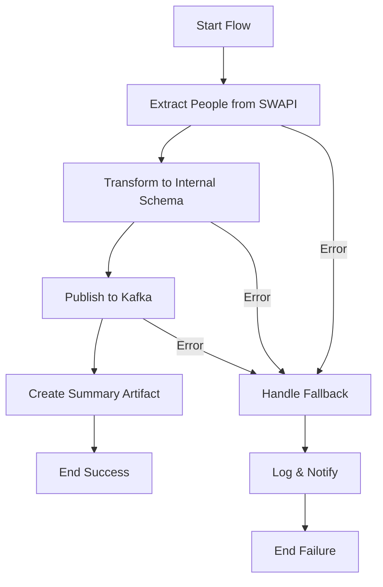

# SWAPI People ETL Workflow

> **Purpose**: Complete documentation for the SWAPI People ETL job that fetches data from SWAPI, transforms it, and publishes to Kafka for processing by Kotlin consumers.

## Metadata

| Field | Value |
| --- | --- |
| Workflow Name | `swapi-people-etl` |
| Description | ETL job that fetches people data from SWAPI (https://swapi.dev/), transforms it, and publishes to Kafka for processing by Kotlin consumers |
| Owner / Squad | Platform Team |
| Status | `ready` |
| Environments | `dev / staging / prod` |
| Schedule / Trigger | `0 2 * * *` (Daily at 2:00 AM UTC) |
| Runbook URL | [SWAPI ETL Runbook](./swapi-etl-runbook.md) |

## Objective & Scope

- **Business Goal**: Test and validate the Prefect + Kafka + Kotlin consumer architecture for batch ETL jobs. This is a proof-of-concept job to establish patterns and validate infrastructure.
- **Data Domain**: Star Wars people/characters data from SWAPI
- **In Scope**: 
  - Fetching people data from SWAPI REST API
  - Transforming data to internal schema
  - Publishing to Kafka
  - Processing via Kotlin consumer
  - Retry and DLQ mechanisms
  - Observability and metrics
- **Out of Scope**: 
  - Database persistence (mocked)
  - Other SWAPI entities (planets, starships, etc.)
  - Data enrichment or aggregation

## Flow Overview



1. **Extract**: Fetch all people from SWAPI API with pagination
2. **Transform**: Convert SWAPI format to internal message schema with batch_id, record_id, ingested_at
3. **Publish**: Send messages to Kafka topic `swapi.people.v1`
4. **Fallback**: Handle failures by logging and notifying (in production: persist to storage)

### Task Inventory

| Task | Description | Retries | Timeout | Inputs | Outputs | Observability |
| --- | --- | --- | --- | --- | --- | --- |
| `extract_people` | Fetch all people from SWAPI REST API with pagination | `3 @ 60s` | `120s` | `SWAPI_BASE_URL` | `List[Dict]` raw people data | Logs: batch_id, records_fetched |
| `transform_people` | Transform SWAPI format to internal schema | `2 @ 30s` | `60s` | `raw_people, batch_id` | `List[Dict]` transformed messages | Logs: records_transformed |
| `publish_to_kafka` | Publish messages to Kafka topic | `5 @ 30s` | `300s` | `messages` | `Dict` publish statistics | Logs: published/failed counts, Metrics |
| `handle_fallback` | Handle flow failures | `0` | `N/A` | `error, batch_id, context` | `None` | Logs: error details, context |

**Idempotency Rules**:
- Each message includes `batch_id` (UUID) and `record_id` (extracted from SWAPI URL)
- Kafka producer uses `enable.idempotence=true` to prevent duplicate messages
- Consumer uses `record_id` for idempotent processing

## Deployment & Scheduling

- **Flow File**: `workflow/example/swapi/flows/swapi_people_etl.py`
- **Flow Name**: `swapi-people-etl`
- **Prefect Version**: 3.6.5+ (uses Prefect 3.x work pools and work queues)
- **Deployment Command**:
  ```bash
  ./workflow/example/swapi/scripts/deploy.sh
  ```
  Or manually:
  ```bash
  prefect deploy --name swapi-people-etl-deployment
  ```
  This uses the `prefect.yaml` configuration file for Prefect 3.x deployments.
- **Prerequisites**:
  - Work pool must exist: `prefect work-pool create default --type process`
  - Work queue must exist: `prefect work-queue create swapi-etl --pool default`
  - Prefect server must be running (Prefect 3.x)
- **Parameters**: None (all configuration via environment variables)
- **Concurrency Guardrails**: Prefect 3.x work queues prevent overlapping runs
- **Environment Variables / Secrets**: 
  - `KAFKA_BROKERS` (default: `localhost:9092`)
  - `SWAPI_BASE_URL` (default: `https://swapi.dev/api`)
  - `PREFECT_API_URL` (default: `http://localhost:4200/api`)

## Kafka Contracts

| Topic | Direction | Key | Schema Link | Retention | DLQ |
| --- | --- | --- | --- | --- | --- |
| `swapi.people.v1` | Produce/Consume | `record_id` | [people_message.json](../../workflow/example/swapi/schemas/people_message.json) | `7d` | `swapi.people.dlq` |

- **Producer Settings**: 
  - `acks=all` (wait for all replicas)
  - `enable.idempotence=true` (prevent duplicates)
  - `compression.type=snappy` (efficient compression)
  - `linger.ms=10` (batch small messages)
  - `retries=5` (retry failed sends)
- **Consumer Module**: `service/kotlin/app/batch/swapi/` (see [Kafka Consumer Pattern](../../04-patterns/backend-patterns/kafka-consumer-pattern.md))
- **DLQ Strategy**: 
  - Failed messages after retries are published to `swapi.people.dlq` topic
  - DLQ messages include original message + error metadata
  - Alerts triggered on DLQ message count threshold

## Testing & Validation

- **Prefect Tests**: 
  - Unit tests: `workflow/example/swapi/tests/test_swapi_etl.py`
  - Mocks SWAPI API responses
  - Mocks Kafka producer
  - Tests retry logic and error handling
- **Consumer Tests**: 
  - Unit tests: `service/kotlin/app/batch/swapi/test/PeopleConsumerTest.kt`
  - Integration tests: `service/kotlin/app/batch/swapi/test/PeopleConsumerIntegrationTest.kt`
  - Uses Testcontainers Kafka for integration tests
  - Tests successful processing, retries, and DLQ flow
- **End-to-End Drill**: 
  ```bash
  # 1. Start infrastructure
  docker-compose -f infra/docker/docker-compose.yml --profile kafka --profile prefect up -d
  
  # 2. Deploy flow
  cd workflow/example/swapi
  ./scripts/deploy.sh
  
  # 3. Trigger manual run
  prefect deployment run swapi-people-etl/swapi-people-etl-deployment
  
  # 4. Monitor in Prefect UI
  open http://localhost:4201
  
  # 5. Check Kafka topics
  # (Use kafka-console-consumer or Kafka UI)
  
  # 6. Verify consumer processing
  # (Check logs and metrics)
  ```

### Readiness Checklist

- [x] Cron registered & documented
- [x] Topics + schemas provisioned
- [x] Observability (metrics/logs/events) defined
- [x] DLQ + fallback documented
- [x] Runbook attached ([SWAPI ETL Runbook](./swapi-etl-runbook.md))

## Notes

- **Prefect 3.x**: This workflow uses Prefect 3.x which requires work pools and work queues instead of the older deployment model
- **Storage**: For local development, answer "n" when asked about remote storage. For production (K8s/Docker), use remote storage (GitHub, S3, etc.)
- This is a proof-of-concept job to validate the batch workflow architecture
- No database persistence - processing is mocked (logs and metrics only)
- Future enhancements:
  - Add other SWAPI entities (planets, starships, etc.)
  - Implement actual data persistence
  - Add data validation and quality checks
  - Implement incremental loads (only fetch changed records)
