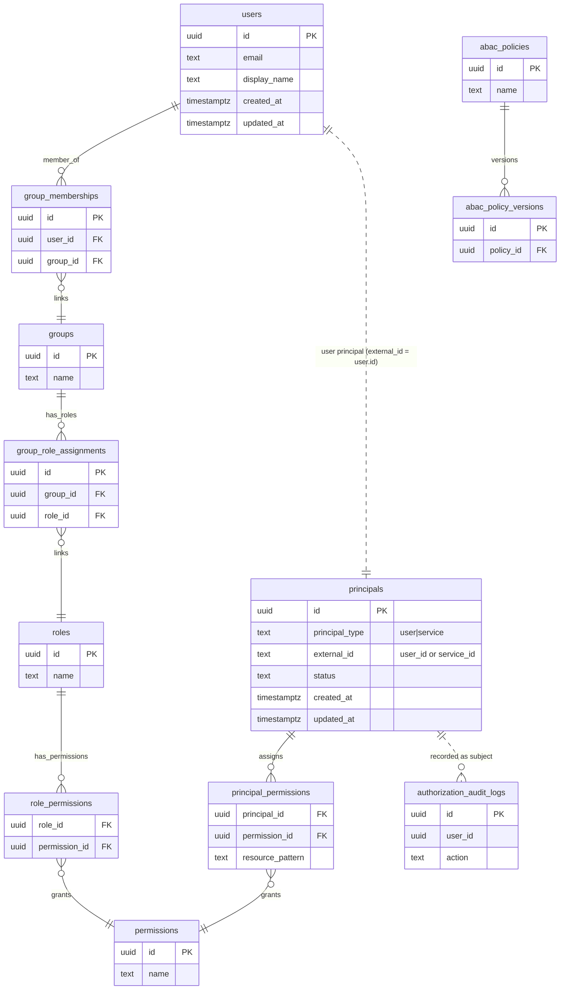

# Interservice Security Migration Plan

Purpose: implement the ADR-0008 baseline (JWT over TLS with service principals) using a unified permission model.

## Task 1: Schema (DB)
- Goal: introduce service principals without diverging permission vocabulary.
- Work:
  - Add `security.principals` (id, principal_type ENUM[user,service], external_id/service_id, status, created/updated).
  - Add `security.principal_permissions` (principal_id FK -> principals, permission_id FK -> permissions, resource_pattern nullable, PK (principal_id, permission_id, resource_pattern)).
  - Seed nothing yet for services; keep existing user data intact.
  - Keep `permissions` table as single source of permission keys.
- Tests:
  - Migration runs clean locally.
  - DB unit/integration tests for principal_permissions insert/select (if repo tests exist).
- Frontend impact: none.

## Task 2: JWT Profile
- Goal: support service tokens (and optional user context) in a provider-agnostic way.
- Work:
  - Define `type=service` claim; `sub` = service id; `aud` = target service; `permissions` = service permissions.
  - For propagated user context: include `user_id` and `user_permissions` computed by issuer (not caller).
  - Update JwtService (or equivalent) to parse/validate `type=service`, `aud`, `iss`, `exp/nbf`, `permissions`.
- Tests:
  - Unit tests for token parsing/validation for service token, and service+user context token.
- Frontend impact: none (tokens are backend-only).

## Task 3: Principal Model
- Goal: represent both users and services in the security domain.
- Work:
  - Extend `RequestPrincipal` to include `principalType` (user/service), `serviceId` (nullable), `userId` (nullable for service-only).
  - Add a `ServicePrincipal` model if preferred, or reuse `RequestPrincipal` with type.
- Tests:
  - Unit tests covering user principal and service principal creation.
- Frontend impact: none.

## Task 4: Principal Provider
- Goal: accept service tokens and optional user context.
- Work:
  - Update `RequestPrincipalProvider` to validate `type=service` tokens and create service principals.
  - Support dual-token or embedded user-context claims; ensure issuer-derived user claims, not caller-provided.
- Tests:
  - Unit tests for service token parsing, user token parsing, and combined flow.
- Frontend impact: none.

## Task 5: Authorization Routing
- Goal: route authorization by principal type while sharing permission vocabulary.
- Work:
  - Update `AuthorizationManager` to accept service principals; when user+service are present, enforce both.
  - Update/extend `AuthorizationService` to check permissions for `principal_permissions` when principal_type=service; keep existing user RBAC/ABAC flow for users.
  - Add a thin router that dispatches to the correct check based on principal_type.
- Tests:
  - Unit tests for service permission checks, user checks, and combined checks (service + user context).
- Frontend impact: none.

## Task 6: Repositories
- Goal: data access for principals and assignments.
- Work:
  - Add repositories for `principals` and `principal_permissions`.
  - Keep `PermissionRepository` as-is (shared keys).
- Tests:
  - Repository tests for CRUD and lookup by service_id/principal_id.
- Frontend impact: none.

## Task 7: Wiring (GraphQL/HTTP)
- Goal: ensure inbound request handling supports service principals.
- Work:
  - Update GraphQL wiring (e.g., `SecurityWiringFactory`) to extract principal (user or service) and handle dual-context if provided.
  - Ensure HTTP/filters reuse the provider changes.
- Tests:
  - Integration tests for GraphQL endpoints with service token and with user+service propagation.
- Frontend impact: none (only affects auth plumbing).

## Task 8: Observability
- Goal: trace caller service and user.
- Work:
  - Log serviceId and userId in auth decisions/audit when available.
  - Add metrics counters for service-token validation failures and authorization denials.
- Tests:
  - Unit tests for logging/metrics hooks if present; otherwise manual verification in integration tests.
- Frontend impact: none.

## Task 9: Seed/Config for Service Accounts
- Goal: enable initial service identities.
- Work:
  - Define how service principals are issued (IdP client credentials); avoid storing long-lived secrets locally if IdP can handle it.
  - Seed minimal service principals if needed for tests (via fixtures).
- Tests:
  - Integration tests using a service principal fixture to call a protected endpoint.
- Frontend impact: none.

## Task 10: mTLS Follow-up (TODO)
- Goal: prepare for optional mesh mTLS when K8s/mesh is introduced.
- Work:
  - Document mapping from mesh identity (e.g., SPIFFE ID) to service principal.
  - Plan non-prod pilot; no implementation now.
- Tests:
  - None now (deferred).
- Frontend impact: none.

## Schema overview (Mermaid)

