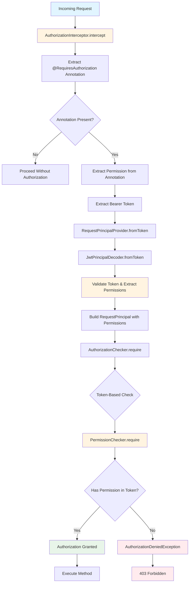
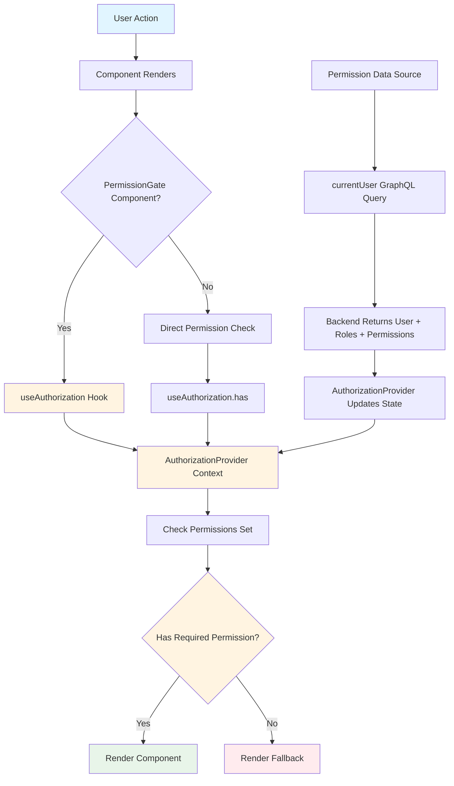
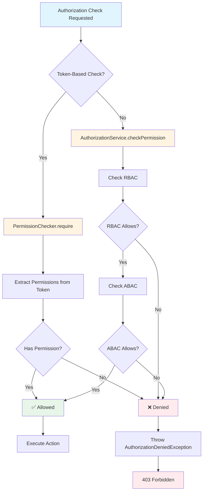

# Authorization

> **Purpose**: Comprehensive authorization rules and how NeoTool authorizes users and service accounts to perform actions.

## Authorization Overview

NeoTool uses a **hybrid RBAC+ABAC** authorization model:
- **RBAC (Role-Based Access Control)**: Permissions assigned to roles, roles assigned to users/groups
- **ABAC (Attribute-Based Access Control)**: Policy-based authorization using subject/resource attributes
- **Token-Based Validation**: Permissions embedded in JWT tokens for stateless, performant authorization

## Authorization Flow

### Backend Authorization Flow



### Frontend Authorization Flow



## Backend Authorization

### REST Endpoint Authorization

**Annotation-Based Authorization:**

```kotlin
@Controller("/api/users")
class UserController {
    
    @Get("/{id}")
    @RequiresAuthorization("security:user:view")
    fun getUser(id: UUID): HttpResponse<User> {
        // Method only executes if user has "security:user:view" permission
    }
    
    @Post
    @RequiresAuthorization("security:user:save")
    fun createUser(input: UserInput): HttpResponse<User> {
        // Method only executes if user has "security:user:save" permission
    }
}
```

**Class-Level Authorization:**

```kotlin
@Controller("/api/admin")
@RequiresAuthorization("security:admin")
class AdminController {
    // All methods require "security:admin" permission
    
    @Get("/settings")
    @RequiresAuthorization("security:settings:view")
    fun getSettings(): HttpResponse<Settings> {
        // Overrides class-level, requires "security:settings:view"
    }
}
```

### Authorization Components

#### 1. AuthorizationInterceptor

**Location**: `service/kotlin/security/src/main/kotlin/io/github/salomax/neotool/security/http/AuthorizationInterceptor.kt`

**Responsibilities:**
- Intercepts methods annotated with `@RequiresAuthorization`
- Extracts Bearer token from `Authorization` header
- Validates token and creates `RequestPrincipal` with permissions from token
- Calls `AuthorizationChecker.require()` to check permissions
- Throws `AuthorizationDeniedException` if permission denied

**Flow:**
1. Check for `@RequiresAuthorization` annotation
2. Extract permission from annotation
3. Extract Bearer token from HTTP request
4. Validate token via `RequestPrincipalProvider.fromToken()`
5. Check authorization via `AuthorizationChecker.require()`
6. Proceed if allowed, throw exception if denied

#### 2. PermissionChecker (Token-Based)

**Location**: `service/kotlin/common/src/main/kotlin/io/github/salomax/neotool/common/security/authorization/PermissionChecker.kt`

**Purpose**: Primary authorization mechanism using token-based validation.

**Key Features:**
- Validates permissions from JWT token claims (no database access)
- Stateless and performant - no database queries on every request
- Used by both REST (`AuthorizationInterceptor`) and GraphQL resolvers
- Marked as `@Primary` implementation of `AuthorizationChecker` interface

**How It Works:**
1. Permissions are embedded in JWT tokens at generation time via `AuthContextFactory`
2. On request, `PermissionChecker` extracts permissions from token claims
3. Validates required permission against token permissions
4. Throws `AuthorizationDeniedException` if permission is missing

**Example:**
```kotlin
// Token contains: permissions = ["security:user:view", "security:user:edit"]
val principal = RequestPrincipal(userId = userId, permissionsFromToken = ["security:user:view", "security:user:edit"])

// Check permission
permissionChecker.require(principal, "security:user:view")  // ✅ Allowed
permissionChecker.require(principal, "security:user:delete")  // ❌ Denied
```

#### 3. AuthorizationService (Database-Backed)

**Location**: `service/kotlin/security/src/main/kotlin/io/github/salomax/neotool/security/service/authorization/AuthorizationService.kt`

**Purpose**: Advanced authorization with RBAC and ABAC support.

**Key Features:**
- RBAC: Checks roles and permissions from database
- ABAC: Evaluates policy conditions using subject/resource attributes
- Hybrid evaluation: RBAC first (fast), then ABAC if needed
- Database-backed for dynamic permission checks

**When to Use:**
- Resource ownership checks (e.g., user can only edit their own resources)
- Dynamic permission evaluation based on resource attributes
- Policy-based authorization with complex conditions

**Example:**
```kotlin
val result = authorizationService.checkPermission(
    userId = userId,
    permission = "security:document:edit",
    resourceType = "document",
    resourceId = documentId,
    resourceAttributes = mapOf("ownerId" to document.ownerId)
)

if (result.allowed) {
    // Proceed with action
}
```

#### 4. AuthorizationManager

**Location**: `service/kotlin/security/src/main/kotlin/io/github/salomax/neotool/security/service/authorization/AuthorizationManager.kt`

**Purpose**: High-level interface for request-level authorization.

**Key Features:**
- Enriches subject attributes with permissions from token
- Throws `AuthorizationDeniedException` if denied
- Logs authorization decisions for observability
- Supports both token-based and database-backed authorization

### GraphQL Authorization

GraphQL resolvers use the same authorization mechanisms but without annotations:

```kotlin
@GraphQLResolver
class UserResolver(
    private val authorizationChecker: AuthorizationChecker
) {
    
    fun getUser(id: UUID, principal: RequestPrincipal): User {
        // Check permission programmatically
        authorizationChecker.require(principal, "security:user:view")
        return userService.getUser(id)
    }
}
```

### Service Account Authorization

Service accounts use service tokens with their own permissions:

```kotlin
// Service token contains:
// - type: "service"
// - sub: service-uuid
// - permissions: ["service:permission"]
// - user_id: user-uuid (optional, for user context propagation)
// - user_permissions: ["user:permission"] (optional)

val principal = RequestPrincipal(
    principalType = PrincipalType.SERVICE,
    serviceId = serviceId,
    permissionsFromToken = ["service:permission"],
    userId = userId,  // Optional user context
    userPermissions = ["user:permission"]  // Optional user permissions
)

// Check service permission
authorizationChecker.require(principal, "service:permission")  // ✅ Allowed

// Check user permission (if user context present)
authorizationChecker.require(principal, "user:permission")  // ✅ Allowed
```

## Frontend Authorization

### AuthorizationProvider

**Location**: `web/src/shared/providers/AuthorizationProvider.tsx`

**Purpose**: Manages authorization state (permissions and roles) for the frontend.

**Key Features:**
- Fetches user permissions and roles from `currentUser` GraphQL query
- Provides `has()`, `hasAny()`, `hasAll()` methods for permission checks
- Automatically refreshes on sign-in, clears on sign-out
- Wraps `AuthProvider` to add authorization capabilities

**Usage:**
```tsx
function App() {
  return (
    <AuthProvider>
      <AuthorizationProvider>
        {/* Your app components */}
      </AuthorizationProvider>
    </AuthProvider>
  );
}
```

### PermissionGate Component

**Location**: `web/src/shared/components/authorization/PermissionGate.tsx`

**Purpose**: Declarative component for conditional rendering based on permissions.

**Props:**
- `require`: Single permission or array of permissions (all required)
- `anyOf`: Array of permissions (at least one required)
- `fallback`: Component to render if permission denied
- `loadingFallback`: Component to render while checking permissions

**Examples:**
```tsx
// Single permission
<PermissionGate require="security:user:edit" fallback={<div>No access</div>}>
  <EditButton />
</PermissionGate>

// Multiple permissions (all required)
<PermissionGate require={["security:user:view", "security:user:edit"]}>
  <UserEditor />
</PermissionGate>

// Any of multiple permissions
<PermissionGate anyOf={["security:admin", "security:user:edit"]}>
  <AdminPanel />
</PermissionGate>
```

### useAuthorization Hook

**Location**: `web/src/shared/hooks/useAuthorization.ts`

**Purpose**: React hook for programmatic permission checks.

**Methods:**
- `has(permission: string)`: Check if user has specific permission
- `hasAny(permissions: string[])`: Check if user has any of the permissions
- `hasAll(permissions: string[])`: Check if user has all of the permissions
- `refreshAuthorization()`: Refresh permissions from backend

**Example:**
```tsx
function UserActions() {
  const { has, hasAny } = useAuthorization();
  
  return (
    <div>
      {has("security:user:edit") && <EditButton />}
      {hasAny(["security:admin", "security:user:delete"]) && <DeleteButton />}
    </div>
  );
}
```

### DisableIfNoPermission Component

**Location**: `web/src/shared/components/authorization/DisableIfNoPermission.tsx`

**Purpose**: Disables UI elements (buttons, inputs) if user lacks permission.

**Example:**
```tsx
<DisableIfNoPermission permission="security:user:edit">
  <button>Edit User</button>
</DisableIfNoPermission>
```

## Permission Format

NeoTool uses a hierarchical permission format:

```
{module}:{entity}:{action}
```

**Examples:**
- `security:user:view` - View users in security module
- `security:user:edit` - Edit users in security module
- `security:user:delete` - Delete users in security module
- `security:admin` - Admin access to security module
- `assets:file:upload` - Upload files in assets module

## Authorization Rules

### Rule: Token-Based Authorization (Primary)

**Rule**: Use token-based authorization for standard permission checks.

**Rationale**: 
- Stateless and performant (no database queries)
- Permissions embedded in JWT tokens at generation time
- Fast validation without network calls

**Implementation**: `PermissionChecker` validates permissions from token claims.

### Rule: Database-Backed Authorization (Advanced)

**Rule**: Use database-backed authorization for resource ownership and dynamic checks.

**Rationale**:
- Required for resource-level authorization (e.g., user can only edit their own documents)
- Supports ABAC policies with complex conditions
- Handles dynamic permission evaluation

**Implementation**: `AuthorizationService` performs database queries and ABAC evaluation.

### Rule: Frontend Authorization is UX Only

**Rule**: Frontend authorization controls UI visibility, not security.

**Rationale**:
- Frontend can be bypassed
- All authorization must be enforced on the backend
- Frontend authorization improves UX by hiding unavailable actions

**Implementation**: Backend always validates permissions regardless of frontend checks.

### Rule: Permission Format

**Rule**: Use hierarchical permission format: `{module}:{entity}:{action}`.

**Rationale**:
- Clear namespace organization
- Easy to understand and maintain
- Supports module-level permissions (e.g., `security:admin`)

## Error Handling

### Backend Errors

**AuthorizationDeniedException**:
- Thrown when user lacks required permission
- Automatically converted to HTTP 403 Forbidden
- Includes permission that was denied

**AuthenticationRequiredException**:
- Thrown when token is missing or invalid
- Automatically converted to HTTP 401 Unauthorized
- Includes reason for authentication failure

### Frontend Errors

**Permission Denied**:
- `PermissionGate` renders fallback component
- `DisableIfNoPermission` disables UI element
- No error thrown, just conditional rendering

## Authorization Decision Flow



## Related Documentation

- [Authentication](./authentication.md) - JWT token issuing and validation
- [Authorization Feature Docs](../../03-features/security/authorization/README.md) - Complete authorization feature documentation
- [Security Overview](../../03-features/security/README.md) - Complete security feature guide

