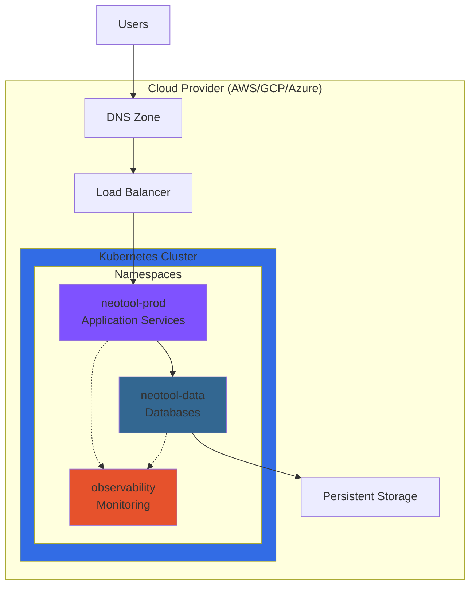

# Infrastructure & Operations

> **Purpose**: Operational guides, deployment procedures, runbooks, and infrastructure management for NeoTool in production.

## Overview

This section provides **operational documentation** for deploying, managing, and troubleshooting NeoTool infrastructure. While [Infrastructure Architecture](../02-architecture/infrastructure-architecture.md) describes the **design**, this section covers the **operations**.

### What's Here

- **Deployment Guides**: Step-by-step deployment procedures
- **Operations Runbooks**: Common operational tasks and procedures
- **Troubleshooting**: Issue diagnosis and resolution
- **Disaster Recovery**: Backup, restore, and failover procedures
- **Scaling Guides**: Horizontal and vertical scaling procedures
- **Maintenance**: Routine maintenance and update procedures

---

## Quick Links

### For DevOps/SRE

**First Day**:
1. [Deployment Guide](./deployment-guide.md) - Deploy to production
2. [Operations Runbook](./operations-runbook.md) - Day-to-day operations
3. [Monitoring Setup](./monitoring-setup.md) - Configure observability

**Ongoing**:
- [Troubleshooting Guide](./troubleshooting-guide.md) - Diagnose issues
- [Incident Response](./incident-response.md) - Handle outages
- [Scaling Guide](./scaling-guide.md) - Scale resources

### For Developers

**Deployment**:
- [Local Development Setup](../01-overview/getting-started.md)
- [Deploy to Staging](./deployment-guide.md#staging)
- [Deploy to Production](./deployment-guide.md#production)

**Debugging**:
- [Access Logs](./operations-runbook.md#viewing-logs)
- [Database Access](./operations-runbook.md#database-access)
- [Port Forwarding](./operations-runbook.md#port-forwarding)

---

## Documentation Structure

```
11-infrastructure/
├── README.md                    # This file (navigation)
├── deployment-guide.md          # Deployment procedures
├── operations-runbook.md        # Day-to-day operations
├── troubleshooting-guide.md     # Issue resolution
├── monitoring-setup.md          # Observability configuration
├── disaster-recovery.md         # Backup and restore
├── scaling-guide.md             # Resource scaling
├── security-operations.md       # Security procedures
└── maintenance-guide.md         # Routine maintenance
```

---

## Common Tasks

### Deployment

| Task | Documentation | Frequency |
|------|--------------|-----------|
| Deploy to staging | [Deployment Guide](./deployment-guide.md#staging) | Per PR |
| Deploy to production | [Deployment Guide](./deployment-guide.md#production) | Weekly |
| Rollback deployment | [Deployment Guide](./deployment-guide.md#rollback) | As needed |
| Blue-green deployment | [Deployment Guide](./deployment-guide.md#blue-green) | Major releases |

### Operations

| Task | Documentation | Frequency |
|------|--------------|-----------|
| View application logs | [Operations Runbook](./operations-runbook.md#logs) | Daily |
| Scale pods | [Scaling Guide](./scaling-guide.md#horizontal) | As needed |
| Database backup | [Disaster Recovery](./disaster-recovery.md#backup) | Daily (automated) |
| Certificate renewal | [Maintenance Guide](./maintenance-guide.md#certificates) | Quarterly |
| Security updates | [Maintenance Guide](./maintenance-guide.md#updates) | Monthly |

### Troubleshooting

| Issue | Documentation | Priority |
|-------|--------------|----------|
| Service down | [Incident Response](./incident-response.md#service-down) | P0 |
| Database connectivity | [Troubleshooting Guide](./troubleshooting-guide.md#database) | P1 |
| High latency | [Troubleshooting Guide](./troubleshooting-guide.md#latency) | P2 |
| Memory leak | [Troubleshooting Guide](./troubleshooting-guide.md#memory) | P2 |

---

## Environments

### Environment Overview

| Environment | Purpose | Infrastructure | Auto-Deploy | URL |
|-------------|---------|----------------|-------------|-----|
| **Development** | Local dev | Docker Compose | No | localhost:* |
| **Staging** | Pre-production testing | Kubernetes (small) | Yes (on PR merge) | staging.neotool.io |
| **Production** | Live system | Kubernetes (full) | Manual approval | neotool.io |

**See**: [Deployment Guide](./deployment-guide.md) for environment-specific procedures.

### Environment Parity

All environments use the **same Docker images** and **Kubernetes manifests** (with environment-specific overlays via Kustomize/Helm).

**Differences**:
- **Replicas**: Dev (1), Staging (2), Prod (3+)
- **Resources**: Dev (minimal), Staging (medium), Prod (production-grade)
- **Auto-scaling**: Staging (limited), Prod (full)
- **Monitoring**: Staging (basic), Prod (full + alerts)

---

## Architecture Components

### Infrastructure Stack



**See**: [Infrastructure Architecture](../02-architecture/infrastructure-architecture.md) for detailed design.

---

## Tools & Access

### Required Tools

| Tool | Purpose | Installation |
|------|---------|-------------|
| **kubectl** | Kubernetes CLI | [Install kubectl](https://kubernetes.io/docs/tasks/tools/) |
| **docker** | Container runtime | [Install Docker](https://docs.docker.com/get-docker/) |
| **terraform** | Infrastructure as Code | [Install Terraform](https://www.terraform.io/downloads) |
| **helm** | Kubernetes package manager | [Install Helm](https://helm.sh/docs/intro/install/) |
| **stern** | Multi-pod log tailing | `brew install stern` |
| **k9s** | Kubernetes TUI | `brew install k9s` |

**See**: [Operations Runbook](./operations-runbook.md#tools) for tool usage.

### Access & Permissions

**Production Access** (restricted):
- **Read-only**: All engineers (logs, metrics, dashboards)
- **Deployments**: SRE team + approved deployers
- **Database admin**: DBAs only
- **Infrastructure changes**: SRE lead approval required

**See**: [Security Operations](./security-operations.md) for access control.

---

## Monitoring & Alerting

### Key Metrics Dashboard

**Application Health**:
- Request rate (RPS)
- Error rate (%)
- Latency (p50, p95, p99)
- Availability (uptime %)

**Infrastructure Health**:
- CPU utilization
- Memory usage
- Disk I/O
- Network traffic

**Business Metrics**:
- Active users
- API calls per user
- Feature usage
- Error trends

**See**: [Monitoring Setup](./monitoring-setup.md) for configuration.

### Alert Severity

| Level | Response Time | Examples |
|-------|--------------|----------|
| **P0** | Immediate | Service completely down, data loss |
| **P1** | < 15 minutes | Partial outage, high error rate (>5%) |
| **P2** | < 1 hour | Degraded performance, elevated errors (>1%) |
| **P3** | Next business day | Minor issues, low-priority bugs |

**See**: [Incident Response](./incident-response.md) for procedures.

---

## Best Practices

### Deployment

✅ **Do**:
- Deploy during low-traffic windows
- Test in staging first
- Monitor for 30 minutes post-deployment
- Keep rollback plan ready
- Document changes in changelog

❌ **Don't**:
- Deploy on Fridays (unless critical)
- Skip staging validation
- Deploy without backup
- Make manual changes in production
- Ignore monitoring during deployment

### Operations

✅ **Do**:
- Use automation (Terraform, Kubernetes manifests)
- Document all manual interventions
- Review logs regularly
- Maintain runbooks up-to-date
- Practice disaster recovery procedures

❌ **Don't**:
- SSH into production pods (use kubectl exec)
- Modify resources manually (use GitOps)
- Ignore alerts
- Skip backups
- Make changes without peer review

---

## Disaster Recovery

### Recovery Time Objectives (RTO)

| Component | RTO | RPO | Backup Frequency |
|-----------|-----|-----|------------------|
| **Application** | < 5 minutes | 0 (stateless) | N/A |
| **Database** | < 30 minutes | < 5 minutes | Continuous WAL + hourly snapshots |
| **Configuration** | < 5 minutes | 0 (Git) | Every commit |
| **Secrets** | < 10 minutes | 0 (Vault backup) | Daily |

**See**: [Disaster Recovery](./disaster-recovery.md) for procedures.

### Backup Strategy

**Automated Backups**:
- Database: Continuous WAL archiving + hourly snapshots
- Configuration: Git repository (version controlled)
- Secrets: Encrypted backup to S3 (daily)
- Persistent volumes: Daily snapshots

**Retention**:
- Hourly: 7 days
- Daily: 30 days
- Weekly: 90 days
- Monthly: 1 year

---

## Security

### Security Checklist

- [x] TLS/HTTPS everywhere
- [x] Secrets in Kubernetes Secrets (encrypted at rest)
- [x] Network policies (pod-to-pod restrictions)
- [x] RBAC (role-based access control)
- [x] Image scanning (Trivy, Snyk)
- [x] Pod Security Standards
- [x] Audit logging enabled
- [x] Intrusion detection (planned)

**See**: [Security Operations](./security-operations.md)

---

## Related Documentation

### Architecture
- [Infrastructure Architecture](../02-architecture/infrastructure-architecture.md) - Design and components
- [System Architecture](../02-architecture/system-architecture.md) - Overall system design

### Workflows
- [Deployment Workflow](../08-workflows/deployment-workflow.md) - Deployment process
- [Feature Development](../08-workflows/feature-development.md) - Development workflow

### Observability
- [Observability Overview](../10-observability/observability-overview.md) - Monitoring setup
- [Metrics & Dashboards](../10-observability/) - Grafana dashboards

### Security
- [Security Overview](../09-security/) - Security practices
- [Authentication](../09-security/authentication.md) - Auth mechanisms

---

## Contributing

### Updating Runbooks

When operational procedures change:
1. Update relevant runbook document
2. Test procedure in staging
3. Create PR with changes
4. Get SRE team approval
5. Update operator training materials

### Adding New Procedures

1. Create document in `11-infrastructure/`
2. Follow [Documentation Standards](../12-specification-driven-dev/documentation-standards.md)
3. Include:
   - Prerequisites
   - Step-by-step instructions
   - Expected outcomes
   - Troubleshooting steps
   - Rollback procedure
4. Review with SRE team
5. Add to this README index

---

## Quick Reference

### Useful Commands

```bash
# View pod logs
kubectl logs -f deployment/backend -n neotool-prod

# Port forward to service
kubectl port-forward svc/backend 8080:8080 -n neotool-prod

# Scale deployment
kubectl scale deployment/backend --replicas=5 -n neotool-prod

# Restart deployment
kubectl rollout restart deployment/backend -n neotool-prod

# View recent events
kubectl get events -n neotool-prod --sort-by='.lastTimestamp'

# Database backup (manual)
kubectl exec -it postgresql-0 -n neotool-data -- pg_dump neotool > backup.sql
```

**See**: [Operations Runbook](./operations-runbook.md) for complete command reference.

---

**Version**: 1.0.0 (2026-01-02)
**Maintained By**: SRE Team
**Review Frequency**: Monthly or after incidents

*Reliable infrastructure. Smooth operations. Happy users.*
