# Neotool Infrastructure Guide

> **Complete guide to Neotool's cloud-native infrastructure**: Terraform provisioning, Kubernetes deployment, and GitOps with Flux CD.

---

## Table of Contents

1. [Overview](#overview)
2. [Infrastructure Summary](#infrastructure-summary)
3. [Platform Provisioning with Terraform](#platform-provisioning-with-terraform)
4. [K3S Cluster Setup](#k3s-cluster-setup)
5. [Kubernetes & GitOps with Flux](#kubernetes--gitops-with-flux)
6. [Running the Infrastructure](#running-the-infrastructure)
7. [Operations & Maintenance](#operations--maintenance)
8. [Cleanup & Teardown](#cleanup--teardown)
9. [Reference](#reference)

---

## Overview

### What is This?

Neotool uses a **cloud-native, Infrastructure as Code (IaC)** approach to deployment:

- **Terraform**: Provisions cloud infrastructure
- **Flux CD**: GitOps operator for automated deployments from Git
- **Kubernetes**: Container orchestration platform (For this case we're going to use a lightweight distribution: K3S)

**Note**: The current setup uses an **existing Hostinger VPS** (manually created via Hostinger control panel) with Terraform automating the K3S installation via SSH. This is a simple, cost-effective approach perfect for single-node or small clusters.

### Architecture Overview


### Key Technologies

| Technology | Purpose |
|-----------|---------|
| **Terraform** | Infrastructure provisioning |
| **K3S** | Lightweight Kubernetes |
| **Flux CD** | GitOps continuous deployment |
| **Vault** | Secrets management |
| **Cloudflare R2** | Object storage |
| **Prometheus** | Metrics collection |
| **Grafana** | Visualization |
| **Loki** | Log aggregation |

---

## Infrastructure Summary

### Cloud Provider Support

The current implementation uses a **simple, practical approach**:

#### ✅ Current Setup: Hostinger VPS + K3S

**How it works**:
1. **Manual VPS Creation**: Create VPS via Hostinger control panel
2. **Automated K3S Installation**: Terraform connects via SSH and installs K3S
3. **GitOps Deployment**: Flux CD automatically deploys applications from Git

**Benefits**:
- Simple and straightforward
- Infrastructure managed by code
- Container orchestration
- Works with any VPS provider (just change the IP)
- Cost-effective: ~$10-30/month for single VPS
- Easy to understand and troubleshoot

**Current Configuration**:
- **VPS**: Hostinger VPS (manually provisioned)
- **Cluster**: Single-node K3S
- **Storage**: K3S local-path provisioner
- **Access**: SSH-based (IP + private key)

### Component Versions

| Component | Purpose |
|-----------|---------|
| PostgreSQL | Database |
| PgBouncer | Connection pooler |
| Kafka | Event streaming (KRaft mode) |
| Vault | Secrets management |
| Apollo Router | GraphQL gateway |
| Prometheus | Metrics collection |
| Grafana | Dashboards |
| Loki | Log aggregation |
| Promtail | Log collection |

### Directory Structure

```
infra/
├── terraform/                    # Infrastructure provisioning
│   ├── cloud/                    # Cloud provider configurations
│   │   ├── modules/
│   │   │   ├── k3s/             # K3S cluster module (cloud-agnostic)
│   │   │   ├── networking/      # VPC and networking (multi-cloud)
│   │   │   └── storage/         # Storage classes (S3-compatible)
│   │   ├── environments/
│   │   │   ├── local/           # Local development
│   │   │   └── prod/            # Production (AWS/GCP/Azure)
│   │   └── scripts/             # Helper scripts
│   └── hostinger/                # Hostinger VPS configuration
│
└── kubernetes/                   # Kubernetes manifests
    ├── clusters/                 # Cluster-specific configurations
    │   ├── k3s/                 # K3S cluster setup
    │   │   └── foundation/      # Foundation setup scripts
    │   └── README.md
    ├── flux/                     # GitOps configuration (Flux CD)
    │   ├── clusters/
    │   │   └── production/      # Production cluster config
    │   ├── infrastructure/      # Platform services
    │   │   ├── external-secrets/ # External Secrets Operator
    │   │   ├── helm-sources/    # Helm repository sources
    │   │   ├── namespace/       # Namespace and resource quotas
    │   │   ├── network-policies/ # Network policy configurations
    │   │   ├── sources/         # Helm repositories
    │   │   └── vault/           # Vault Helm release
    │   ├── apps/                # Application manifests
    │   │   ├── database/        # PostgreSQL, PgBouncer
    │   │   ├── streaming/       # Kafka
    │   │   ├── observability/   # Prometheus, Grafana, Loki
    │   │   ├── services/        # Kotlin microservices
    │   │   └── web/             # Next.js, Apollo Router
    │   ├── bootstrap.sh         # Bootstrap Flux (production)
    │   ├── bootstrap-dev.sh     # Bootstrap Flux (dev branch)
    │   ├── apply-local.sh       # Apply Flux config locally
    │   └── vault-*.sh           # Vault management scripts
    ├── scripts/                 # Kubernetes helper scripts
    └── README.md
```

---

## Platform Provisioning with Terraform

### What Terraform Does

In our setup, Terraform **automates K3S installation on an existing VPS via SSH**:
- Connects to VPS via SSH
- Installs K3S (Kubernetes)
- Configures cluster settings
- Downloads kubeconfig to your local machine

**Note**: The VPS itself is **manually created** via Hostinger control panel. **Important**: It's not possible (at least in the current version) to import the VPS created by the console into Terraform, and no alternative has been found to manage that resource so far. We could revisit this topic in the future.

### Prerequisites

```bash
# Required tools
terraform --version  # >= 1.0
kubectl version      # >= 1.28

# Required access
# - Existing VPS (created via Hostinger control panel)
# - SSH private key for VPS access
# - VPS IP address
```

### How It Works

The Terraform configuration at `infra/terraform/hostinger/` uses **SSH provisioners** to:

1. Connect to your existing VPS via SSH
2. Run setup commands (apt-get update, etc.)
3. Install K3S using the official installer
4. Configure K3S with custom flags
5. Download kubeconfig to your local machine

**This approach works with ANY VPS provider** - just update the IP address!

### Configuration Files

**Location**: `infra/terraform/hostinger/`

#### terraform.tfvars (Your Actual Configuration)

This is what your `terraform.tfvars` actually looks like:

```hcl
# VPS Connection Details
vps_ip          = "72.60.13.72"      # Your VPS IP address
vps_user        = "root"              # SSH user
private_key_path = "~/.ssh/hostinger-vps"  # Path to SSH private key
ssh_port        = 22                  # SSH port

# Setup Commands (run before K3S installation)
setup_commands = [
  "apt-get update",
  "echo 'Basic setup completed'"
]

# Trigger re-provisioning by changing this value
trigger_on_change = "initial"

# K3S Configuration
k3s_version = ""  # Empty = stable release (recommended)
# k3s_version = "v1.28.5+k3s1"  # Or specify exact version

k3s_cluster_name = "neotool-hostinger"

# K3S token (auto-generated if empty)
# k3s_token = ""

# Components to disable (optional)
k3s_disable_components = []  # e.g., ["traefik"] to disable Traefik

# K3S server flags - adjust based on your VPS specs
k3s_server_flags = [
  "--kubelet-arg=system-reserved=cpu=200m,memory=512Mi",
  "--kubelet-arg=kube-reserved=cpu=200m,memory=512Mi",
  "--kubelet-arg=eviction-hard=memory.available<100Mi,nodefs.available<10%"
]

# Local path where kubeconfig will be saved
kubeconfig_path = "~/.kube/config-hostinger"
```

### Initial Setup

#### Step 1: Create VPS Manually

1. Login to [Hostinger](https://www.hostinger.com)
2. Go to VPS section
3. Create new VPS:
   - **OS**: Ubuntu latest version
   - **Location**: Choose closest to you
4. Note the **IP address**
5. Add your SSH public key (or save the password)

#### Step 2: Set Up SSH Key

```bash
# Generate SSH key (if you don't have one)
ssh-keygen -t ed25519 -f ~/.ssh/hostinger-vps -C "hostinger-k3s"

# Copy public key to VPS (one-time)
ssh-copy-id -i ~/.ssh/hostinger-vps root@YOUR_VPS_IP

# Test SSH connection
ssh -i ~/.ssh/hostinger-vps root@YOUR_VPS_IP
```

#### Step 3: Configure Terraform

```bash
cd infra/terraform/hostinger

# Edit terraform.tfvars with your VPS IP
vim terraform.tfvars
```

Update the IP address:
```hcl
vps_ip = "YOUR_VPS_IP"  # Change this!
```

#### Step 4: Initialize Terraform

```bash
terraform init
```

**Expected output**:
```
Initializing provider plugins...
- Finding latest version of hashicorp/null...
- Finding latest version of hashicorp/random...
Terraform has been successfully initialized!
```

#### Step 5: Review Plan

```bash
terraform plan
```

**Review**:
- null_resource.setup_vps: Run setup commands
- null_resource.k3s_install: Install K3S
- null_resource.k3s_verify: Verify cluster
- null_resource.kubeconfig_retrieve: Download kubeconfig

#### Step 6: Apply Configuration

```bash
terraform apply
```

**What happens**:
1. ✅ Connects to VPS via SSH
2. ✅ Runs setup commands (apt-get update, etc.)
3. ✅ Installs K3S with your configuration
4. ✅ Waits for K3S to be ready
5. ✅ Verifies cluster is healthy
6. ✅ Downloads kubeconfig to `~/.kube/config-hostinger`

#### Step 7: Verify K3S Installation

```bash
# Set kubeconfig
export KUBECONFIG=~/.kube/config-hostinger

# Check cluster
kubectl cluster-info

# Check nodes
kubectl get nodes

# Expected output:
# NAME                       STATUS   ROLES                  AGE   VERSION
# neotool-hostinger-node-0   Ready    control-plane,master   2m    v1.28.2+k3s1

# Check system pods
kubectl get pods -n kube-system
```

### Terraform Outputs

After successful deployment:

```bash
terraform output
```

**Outputs**:
- `vps_ip`: Your VPS IP address
- `k3s_api_endpoint`: Kubernetes API URL (https://your-ip:6443)
- `k3s_cluster_name`: Cluster name
- `k3s_version`: Installed K3S version
- `kubeconfig_path`: Local path to kubeconfig file

### Re-running Terraform

To re-run the provisioners (e.g., after changing K3S configuration):

```bash
# Change trigger in terraform.tfvars
trigger_on_change = "v2"  # Increment this

# Apply
terraform apply
```

Or target specific resources:

```bash
# Re-install K3S
terraform apply -target=null_resource.k3s_install

# Re-download kubeconfig
terraform apply -target=null_resource.kubeconfig_retrieve
```

---

## K3S Cluster Setup

### What is K3S?

K3S is a **lightweight, certified Kubernetes distribution** designed for:
- Edge computing
- IoT devices
- Development environments
- Resource-constrained environments (perfect for VPS)

**Key Features**:
- Single binary (~70MB)
- Built-in components (no separate installs)
- Production-ready
- Full Kubernetes API compatibility

### Why Ubuntu for K3S?

We chose **Ubuntu** as the operating system for our K3S platform for several important reasons:

- **Excellent K3S Compatibility**: Ubuntu is one of the most well-tested and supported operating systems for K3S. The K3S project maintains official support and regularly tests on Ubuntu, ensuring reliable operation.

- **Long-Term Support (LTS)**: Ubuntu LTS releases provide 5 years of security updates and maintenance, which is crucial for production infrastructure stability and security.

- **Wide Community Support**: Ubuntu has extensive documentation, community resources, and troubleshooting guides. This makes it easier to find solutions to common issues and get help when needed.

- **Package Management**: Ubuntu's `apt` package manager is mature, reliable, and well-integrated with K3S installation scripts and dependencies.

- **Security Updates**: Ubuntu receives regular security patches and updates, which is essential for maintaining a secure Kubernetes platform.

- **Resource Efficiency**: Ubuntu's minimal footprint and efficient resource usage align well with K3S's lightweight design, making it ideal for VPS environments with limited resources.

- **Proven in Production**: Ubuntu is widely used in production Kubernetes deployments, providing confidence in its stability and reliability for our infrastructure.

**Note**: While K3S supports other Linux distributions (Debian, RHEL, etc.), Ubuntu provides the best balance of compatibility, support, and ease of use for our use case.

### K3S Components

#### Included by Default
- **Traefik**: Ingress controller (can be disabled)
- **Local-path**: Storage provisioner
- **CoreDNS**: DNS service
- **Metrics Server**: Resource metrics
- **Flannel**: CNI (Container Network Interface)

#### Disabled in Our Setup
- **Traefik**: We use custom ingress configuration

### Node Specifications

| Environment | Nodes | CPU/Node | Memory/Node | Storage |
|-------------|-------|----------|-------------|---------|
| **Hostinger VPS (Current)** | 1 | Varies | Varies | K3S local-path |

**Note**: Adjust K3S resource reservations in `terraform.tfvars` based on your VPS specs (see configuration section).

### K3S Installation Process

When you run `terraform apply`, Terraform connects to your VPS via SSH and:

1. **Runs setup commands** (`apt-get update`, etc.)
2. **Installs K3S** using the official installer:
   ```bash
   curl -sfL https://get.k3s.io | sh -
   ```
3. **Applies your configuration** (resource reservations, disabled components, etc.)
4. **Waits for K3S to be ready** (checks service status, kubectl availability)
5. **Verifies cluster health** (checks nodes are Ready)
6. **Downloads kubeconfig** to your local machine (`~/.kube/config-hostinger`)

**Installation Command** (assembled from your terraform.tfvars):
```bash
# Example based on default configuration
INSTALL_K3S_EXEC='server --cluster-init \
  --kubelet-arg=system-reserved=cpu=200m,memory=512Mi \
  --kubelet-arg=kube-reserved=cpu=200m,memory=512Mi \
  --kubelet-arg=eviction-hard=memory.available<100Mi,nodefs.available<10%' \
curl -sfL https://get.k3s.io | sh -
```

### Manual K3S Management

#### Check K3S Status
```bash
# SSH to VPS
ssh root@<vps-ip>

# Check service status
systemctl status k3s        # Server node
systemctl status k3s-agent  # Agent nodes

# View logs
journalctl -u k3s -f
journalctl -u k3s-agent -f
```

#### Upgrade K3S
```bash
# Update terraform.tfvars
k3s_version = "v1.29.0+k3s1"

# Apply changes
terraform apply
```

**Note**: Upgrading K3S requires node draining and may cause brief downtime.

### Network Configuration

#### Required Ports
Ensure these ports are open in your firewall:

| Port | Protocol | Purpose |
|------|----------|---------|
| 6443 | TCP | Kubernetes API server |
| 10250 | TCP | Kubelet API |
| 8472 | UDP | Flannel VXLAN |
| 22 | TCP | SSH (management) |

**Port Details:**

- **Port 6443 (TCP) - Kubernetes API Server**: The main control plane endpoint for the Kubernetes cluster. Handles all API requests for creating, updating, deleting, and querying cluster resources. Used by `kubectl`, Kubernetes dashboard, and other cluster management tools. This is the primary entry point for cluster operations.

- **Port 10250 (TCP) - Kubelet API**: The node agent API running on each worker node. Allows the control plane to communicate with individual nodes to read metrics, execute commands in pods, retrieve logs, and perform health checks. The Kubelet is the primary node agent that manages pods and containers on each node.

- **Port 8472 (UDP) - Flannel VXLAN**: Used for pod-to-pod networking across nodes. Flannel is a Container Network Interface (CNI) plugin that provides networking for Kubernetes pods. VXLAN (Virtual eXtensible LAN) is the overlay network protocol that encapsulates pod network traffic, enabling pods on different nodes to communicate as if they were on the same network.

- **Port 22 (TCP) - SSH**: Secure Shell protocol for remote server management. Used for administrative access, troubleshooting, maintenance tasks, and manual intervention when needed.

#### Network Ranges
- **Service Network**: `10.43.0.0/16` (configurable via `--service-cidr`)
- **Pod Network**: `10.42.0.0/16` (Flannel CNI)
- **Cluster DNS**: `10.43.0.10` (CoreDNS)

---

## Kubernetes & GitOps with Flux

### What is GitOps?

**GitOps** is a methodology where **Git is the single source of truth** for infrastructure and application configurations.

**How it works**:
1. All Kubernetes manifests are stored in Git
2. Flux CD polls Git repository (every 1 minute)
3. When changes are detected, Flux applies them to the cluster
4. Cluster state always matches Git state

### Benefits of GitOps

| Benefit | Description |
|---------|-------------|
| **Declarative** | Infrastructure defined in YAML files |
| **Version Controlled** | All changes tracked in Git |
| **Automated** | Push to Git → Automatic deployment |
| **Auditable** | Full history of all changes |
| **Reversible** | Easy rollback via Git revert |
| **Consistent** | Same process for all environments |

### Flux CD Architecture

```mermaid
flowchart TD
    GitHub["GitHub Repository<br/>infra/kubernetes/flux/"]
    Polling["Git Polling<br/>(1 minute)"]
    FluxControllers["Flux Controllers<br/>(flux-system)"]
    GitRepoCtrl["GitRepository<br/>Controller"]
    KustomCtrl["Kustomization<br/>Controller"]
    HelmCtrl["HelmRelease<br/>Controller"]
    K3SResources["K3S Cluster Resources<br/>• Vault (Secrets)<br/>• PostgreSQL (Database)<br/>• Kafka (Streaming)<br/>• Prometheus, Grafana (Monitoring)<br/>• Kotlin Services (Apps)<br/>• Next.js (Web)"]
    
    GitHub -->|Git Polling| Polling
    Polling --> FluxControllers
    FluxControllers --> GitRepoCtrl
    FluxControllers --> KustomCtrl
    FluxControllers --> HelmCtrl
    GitRepoCtrl --> K3SResources
    KustomCtrl --> K3SResources
    HelmCtrl --> K3SResources
```



### Flux Components

#### 1. GitRepository
**Purpose**: Watches Git repository for changes

**Configuration** (`flux-system/gotk-sync.yaml`):
```yaml
apiVersion: source.toolkit.fluxcd.io/v1
kind: GitRepository
metadata:
  name: flux-system
  namespace: flux-system
spec:
  interval: 1m
  url: https://github.com/salomax/Neotool
  ref:
    branch: 20260108_3  # or main for production
```

#### 2. Kustomization
**Purpose**: Applies Kubernetes manifests from Git

**Infrastructure Kustomization** (`clusters/production/infrastructure.yaml`):
```yaml
apiVersion: kustomize.toolkit.fluxcd.io/v1
kind: Kustomization
metadata:
  name: infrastructure
  namespace: flux-system
spec:
  interval: 10m
  path: ./infra/kubernetes/flux/infrastructure
  sourceRef:
    kind: GitRepository
    name: flux-system
```

**Apps Kustomization** (`clusters/production/apps.yaml`):
```yaml
apiVersion: kustomize.toolkit.fluxcd.io/v1
kind: Kustomization
metadata:
  name: apps
  namespace: flux-system
spec:
  interval: 5m
  path: ./infra/kubernetes/flux/apps
  dependsOn:
    - name: infrastructure  # Apps wait for infrastructure
  sourceRef:
    kind: GitRepository
    name: flux-system
```

#### 3. HelmRelease
**Purpose**: Manages Helm chart deployments

**Example - Vault** (`infrastructure/vault/helmrelease.yaml`):
```yaml
apiVersion: helm.toolkit.fluxcd.io/v2beta1
kind: HelmRelease
metadata:
  name: vault
  namespace: flux-system
spec:
  interval: 30m
  chart:
    spec:
      chart: vault
      version: '0.27.0'
      sourceRef:
        kind: HelmRepository
        name: hashicorp
  values:
    server:
      dev:
        enabled: true  # Dev mode (for now)
```

### Reconciliation Intervals

| Component | Interval | Purpose |
|-----------|----------|---------|
| GitRepository | 1 minute | Check for Git changes |
| Kustomization (infrastructure) | 10 minutes | Apply infrastructure changes |
| Kustomization (apps) | 5 minutes | Apply application changes |
| HelmRelease | 30 minutes | Check for chart updates |
| ExternalSecret | 5 minutes | Sync secrets from Vault |

### Application Structure

All applications are organized in `flux/apps/`:

#### Database (`flux/apps/database/`)
- **PostgreSQL**: StatefulSet with 100Gi PVC
- **PgBouncer**: Connection pooler

#### Streaming (`flux/apps/streaming/`)
- **Kafka**: StatefulSet (KRaft mode, no Zookeeper)

#### Observability (`flux/apps/observability/`)
- **Prometheus**: Metrics collection
- **Grafana**: Dashboards and visualization
- **Loki**: Log aggregation
- **Promtail**: Log collection (DaemonSet on all nodes)

#### Services (`flux/apps/services/`)
- Kotlin microservices (to be added)

#### Web (`flux/apps/web/`)
- Next.js frontend (to be added)
- Apollo Router (GraphQL gateway) (to be added)

---

## Running the Infrastructure

### Complete Deployment Flow

This section provides the **complete, step-by-step process** to deploy Neotool infrastructure from scratch.

### Phase 1: Prerequisites

#### 1.1 Install Required Tools

```bash
# macOS
brew install terraform kubectl fluxcd/tap/flux helm jq

# Linux (Ubuntu/Debian)
curl -fsSL https://apt.releases.hashicorp.com/gpg | sudo apt-key add -
sudo apt-add-repository "deb [arch=amd64] https://apt.releases.hashicorp.com $(lsb_release -cs) main"
sudo apt-get update && sudo apt-get install terraform

curl -LO "https://dl.k8s.io/release/$(curl -L -s https://dl.k8s.io/release/stable.txt)/bin/linux/amd64/kubectl"
sudo install -o root -g root -m 0755 kubectl /usr/local/bin/kubectl

curl -s https://fluxcd.io/install.sh | sudo bash
```

#### 1.2 Verify Tool Installation

```bash
terraform --version  # >= 1.0
kubectl version --client  # >= 1.28
flux version  # >= 2.0
helm version  # >= 3.0
jq --version
```

#### 1.3 Prepare Cloud Credentials

**For Hostinger**:
1. Login to [Hostinger](https://www.hostinger.com)
2. Go to Account Settings → API
3. Generate API token
4. Save token securely

**For Cloudflare R2**:
1. Login to [Cloudflare Dashboard](https://dash.cloudflare.com)
2. Navigate to R2 → Create Bucket: `neotool-prod`
3. Generate R2 API tokens (Access Key ID + Secret)
4. Note your Account ID

### Phase 2: Provision Infrastructure with Terraform

#### 2.1 Create VPS (Manual)

1. Login to [Hostinger](https://www.hostinger.com)
2. Create a new VPS:
   - **OS**: Ubuntu latest version
   - **Location**: Choose closest to you
3. Note the **IP address**

#### 2.2 Set Up SSH Access

```bash
# Generate SSH key (if needed)
ssh-keygen -t ed25519 -f ~/.ssh/hostinger-vps -C "hostinger-k3s"

# Copy public key to VPS
ssh-copy-id -i ~/.ssh/hostinger-vps root@YOUR_VPS_IP

# Test connection
ssh -i ~/.ssh/hostinger-vps root@YOUR_VPS_IP
```

#### 2.3 Configure Terraform

```bash
cd infra/terraform/hostinger

# Edit terraform.tfvars
vim terraform.tfvars
```

Update with your VPS IP:
```hcl
# VPS Connection Details
vps_ip          = "YOUR_VPS_IP"  # ← Change this!
vps_user        = "root"
private_key_path = "~/.ssh/hostinger-vps"
ssh_port        = 22

# K3S Configuration (adjust for your VPS size)
k3s_version = ""  # Empty = stable
k3s_cluster_name = "neotool-hostinger"

# Resource reservations (adjust based on VPS RAM)
k3s_server_flags = [
  "--kubelet-arg=system-reserved=cpu=200m,memory=512Mi",
  "--kubelet-arg=kube-reserved=cpu=200m,memory=512Mi",
  "--kubelet-arg=eviction-hard=memory.available<100Mi,nodefs.available<10%"
]

kubeconfig_path = "~/.kube/config-hostinger"
```

#### 2.4 Initialize Terraform

```bash
terraform init
```

**Expected output**:
```
Initializing provider plugins...
- Finding latest version of hashicorp/null...
- Finding latest version of hashicorp/random...
Terraform has been successfully initialized!
```

#### 2.5 Apply Terraform Configuration

```bash
# Review what will happen
terraform plan

# Apply (installs K3S on your VPS)
terraform apply
```

**Duration**: 5-10 minutes

**What happens**:
1. ✅ Connects to VPS via SSH
2. ✅ Runs setup commands (apt-get update, etc.)
3. ✅ Installs K3S
4. ✅ Waits for K3S to be ready
5. ✅ Downloads kubeconfig to `~/.kube/config-hostinger`

#### 2.6 Verify K3S Installation

```bash
# Set kubeconfig
export KUBECONFIG=~/.kube/config-hostinger

# Check cluster
kubectl cluster-info

# Check nodes
kubectl get nodes

# Expected:
# NAME                       STATUS   ROLES                  AGE   VERSION
# neotool-hostinger-node-0   Ready    control-plane,master   2m    v1.28.2+k3s1

# Check system pods
kubectl get pods -n kube-system
```

### Phase 3: Bootstrap GitOps with Flux

#### 3.1 Prepare GitHub Access

Create GitHub Personal Access Token:
1. Go to https://github.com/settings/tokens
2. Generate new token (classic)
3. Scopes: `repo` (full control)
4. Copy token (you'll use it once)

#### 3.2 Run Flux Bootstrap

```bash
cd infra/kubernetes/flux

# For development branch:
./bootstrap-dev.sh

# For production (main branch):
./bootstrap.sh
```

**Interactive prompts**:
```
Enter GitHub username: salomax
Enter GitHub personal access token: ghp_xxxxxxxxxxxx
```

**What happens**:
1. ✅ Installs Flux controllers in `flux-system` namespace
2. ✅ Creates GitHub deploy key (read-only)
3. ✅ Commits Flux manifests to your repo
4. ✅ Sets up Git → Cluster synchronization

#### 3.3 Verify Flux Installation

```bash
# Check Flux health
flux check

# View all Flux resources
flux get all

# Watch reconciliation
flux get kustomizations --watch
```

**Expected output**:
```
NAME            READY   MESSAGE                         REVISION
flux-system     True    Applied revision: main/abc123   main/abc123
infrastructure  True    Applied revision: main/abc123   main/abc123
```

#### 3.4 Namespace Creation

The `production` namespace is **automatically created** by Flux when it applies the infrastructure kustomization. You don't need to create it manually!

**Where it's defined**:
- **File**: `infra/kubernetes/flux/infrastructure/namespace/namespace.yaml`
- **Included in**: Infrastructure kustomization (first resource applied)

**What happens**:
1. Flux applies the `infrastructure` kustomization (every 10 minutes)
2. The namespace is created automatically from the manifest in Git
3. Resource quotas and network policies are applied to the namespace

**To verify the namespace was created**:
```bash
# Check namespace exists
kubectl get namespace production

# Check namespace labels
kubectl get namespace production -o yaml

# Expected output shows:
# name: production
# labels:
#   linkerd.io/inject: enabled
#   toolkit.fluxcd.io/tenant: production
```

**Note**: If you need to create the namespace manually (before Flux syncs), you can:
```bash
kubectl create namespace production
```
However, this is **not recommended** - let Flux manage it via GitOps for consistency.

#### 3.5 Reconciliation

```bash
# 1. Check if infrastructure kustomization exists
flux get kustomizations

# 2. If it exists but namespace isn't created yet, force reconciliation:
flux reconcile kustomization infrastructure --with-source

# 3. If infrastructure kustomization doesn't exist yet, trigger flux-system first:
flux reconcile kustomization flux-system --with-source

# 4. Then wait a moment and trigger infrastructure:
flux reconcile kustomization infrastructure --with-source

# 5. Verify namespace was created:
kubectl get namespace production
```

### Phase 4: Initialize Vault (Secrets Management)

#### 4.1 Initialize Vault

```bash
cd infra/kubernetes/flux/scripts

# Initialize Vault (generates root token + unseal keys)
./vault-init.sh
```

**Output**:
```
Vault initialized!
Root Token: hvs.xxxxxxxxxxxx
Unseal Key 1: xxxxxxxxxxxx
Unseal Key 2: xxxxxxxxxxxx
Unseal Key 3: xxxxxxxxxxxx

Credentials saved to: ~/.neotool/vault-credentials.txt
⚠️  BACKUP THIS FILE IMMEDIATELY!
```

**Important**: The credentials file contains **unseal keys** and **root token** - without them, you cannot access Vault!

#### 4.2 Unseal Vault

```bash
# Unseal Vault (requires 3 of 5 keys)
./vault-unseal.sh
```

**What it does**: Vault starts in sealed state. Unsealing requires 3 unseal keys to decrypt the master key.

#### 4.3 Configure Kubernetes Authentication

```bash
# Configure Vault to authenticate Kubernetes service accounts
./vault-configure.sh
```

**What it does**:
- Enables Kubernetes auth method
- Creates Vault policy for External Secrets
- Configures Vault role for service account

#### 4.4 Store PostgreSQL Credentials

```bash
# Store database credentials in Vault
./vault-store-postgres.sh
```

**Prompts**:
```
Enter PostgreSQL username [postgres]: postgres
Enter PostgreSQL password: <your-password>
```

**What it does**: Stores credentials at `secret/postgres` in Vault.

#### 4.5 Verify Vault Setup

```bash
# Check Vault status
kubectl exec -n production vault-0 -- vault status

# Check External Secrets sync
kubectl get externalsecret -n production
kubectl get secret postgres-credentials -n production

# Verify secret data
kubectl get secret postgres-credentials -n production -o jsonpath='{.data.POSTGRES_USER}' | base64 -d
```

#### 4.6 Possible problems

**Vault in CrashLoopBackOff or Complete Reset Needed**:

If Vault is crashing, has invalid credentials, or you need a clean slate:

```bash
# 1. Delete the Vault HelmRelease (Flux will remove all resources)
kubectl delete helmrelease vault -n flux-system

# Wait for pod to be deleted (10-15 seconds)
kubectl get pods -n production -w

# 2. Delete the Persistent Volume Claim (IMPORTANT - ensures clean storage)
kubectl delete pvc data-vault-0 -n production

# 3. Recreate Vault via Flux
kubectl apply -f ~/src/Neotool/infra/kubernetes/flux/infrastructure/vault/helmrelease.yaml

# Wait for pod to be ready
kubectl wait --for=condition=ready pod/vault-0 -n production --timeout=120s

# 4. Initialize Vault with new credentials
INIT_OUTPUT=$(kubectl exec -n production vault-0 -- vault operator init -key-shares=5 -key-threshold=3 -format=json)

cat > ~/.neotool/vault-credentials.txt <<EOF
# Vault Credentials - KEEP SECURE!
# Generated: $(date)

ROOT_TOKEN=$(echo "$INIT_OUTPUT" | jq -r '.root_token')

UNSEAL_KEY_1=$(echo "$INIT_OUTPUT" | jq -r '.unseal_keys_b64[0]')
UNSEAL_KEY_2=$(echo "$INIT_OUTPUT" | jq -r '.unseal_keys_b64[1]')
UNSEAL_KEY_3=$(echo "$INIT_OUTPUT" | jq -r '.unseal_keys_b64[2]')
UNSEAL_KEY_4=$(echo "$INIT_OUTPUT" | jq -r '.unseal_keys_b64[3]')
UNSEAL_KEY_5=$(echo "$INIT_OUTPUT" | jq -r '.unseal_keys_b64[4]')
EOF

chmod 600 ~/.neotool/vault-credentials.txt

# 5. Unseal Vault
cd ~/src/Neotool/infra/kubernetes/scripts
./vault-unseal.sh

# 6. Configure Vault for Kubernetes auth
./vault-configure.sh

# 7. Store PostgreSQL credentials
./vault-store-postgres.sh
```

**Why this works**:
- Deleting the HelmRelease tells Flux to clean up all Vault resources
- Deleting the PVC ensures no corrupt state from previous installation
- Recreating via `kubectl apply` triggers Flux to redeploy from Git
- Fresh initialization creates new, valid credentials


### Phase 5: Verify Complete Deployment

#### 5.1 Check Infrastructure Components

```bash
# Vault
kubectl get pods -n production -l app.kubernetes.io/name=vault
kubectl get helmrelease vault -n flux-system

# External Secrets Operator
kubectl get pods -n production -l app.kubernetes.io/name=external-secrets
kubectl get helmrelease external-secrets -n flux-system
```

#### 5.2 Check Application Components

```bash
# Database
kubectl get pods -n production -l app=postgresql
kubectl get pods -n production -l app=pgbouncer

# Streaming
kubectl get pods -n production -l app=kafka

# Observability
kubectl get pods -n production -l app=prometheus
kubectl get pods -n production -l app=grafana
kubectl get pods -n production -l app=loki
```

#### 5.3 Access Grafana

```bash
# Port forward to Grafana
kubectl port-forward -n production svc/grafana 3000:80

# Open browser: http://localhost:3000
# Default credentials: admin/admin (change on first login)
```

### Phase 6: Deploy Your Applications

#### 6.1 Add Application Manifests

Applications are deployed via GitOps - just commit manifests to Git!

**Example - Deploy a new service**:

```bash
# Create deployment manifest
cat > infra/kubernetes/flux/apps/services/my-service.yaml <<EOF
apiVersion: apps/v1
kind: Deployment
metadata:
  name: my-service
  namespace: production
spec:
  replicas: 2
  selector:
    matchLabels:
      app: my-service
  template:
    metadata:
      labels:
        app: my-service
    spec:
      containers:
      - name: my-service
        image: my-service:1.0.0
        ports:
        - containerPort: 8080
EOF

# Add to kustomization
echo "  - my-service.yaml" >> infra/kubernetes/flux/apps/services/kustomization.yaml

# Commit and push
git add .
git commit -m "Add my-service deployment"
git push
```

**Flux automatically deploys** (within 5 minutes)!

#### 6.2 Monitor Deployment

```bash
# Watch Flux reconcile
flux get kustomizations apps --watch

# Check pods
kubectl get pods -n production -l app=my-service

# View logs
kubectl logs -f deployment/my-service -n production
```

### Phase 7: Post-Deployment Validation

#### 7.1 Run Smoke Tests

```bash
# Test database connection
kubectl exec -n production deployment/my-service -- curl http://pgbouncer.production.svc.cluster.local:6432

# Test Kafka connection
kubectl exec -n production deployment/my-service -- nc -zv kafka.production.svc.cluster.local:9092

# Test Vault connection
kubectl exec -n production deployment/my-service -- curl http://vault.production.svc.cluster.local:8200/v1/sys/health
```

#### 7.2 Check Resource Usage

```bash
# Node resources
kubectl top nodes

# Pod resources
kubectl top pods -n production

# Check quotas
kubectl describe resourcequota production-quota -n production
```

#### 7.3 Verify Monitoring

```bash
# Access Prometheus
kubectl port-forward -n production svc/prometheus 9090:9090
# Open: http://localhost:9090

# Access Grafana
kubectl port-forward -n production svc/grafana 3000:80
# Open: http://localhost:3000
```

### Deployment Complete! 🎉

Your Neotool infrastructure is now fully deployed with:
- ✅ K3S cluster on Hostinger VPS
- ✅ GitOps with Flux CD (automatic deployments)
- ✅ Secrets management with Vault
- ✅ Database (PostgreSQL + PgBouncer)
- ✅ Streaming (Kafka)
- ✅ Monitoring (Prometheus + Grafana + Loki)
- ✅ Auto-scaling and self-healing

**Next Steps**:
- Deploy your Kotlin services
- Deploy Next.js frontend
- Configure ingress/DNS
- Set up CI/CD pipelines
- Configure alerts

---

## Operations & Maintenance

### Daily Operations

#### Check System Health

```bash
# Flux health
flux check

# Cluster health
kubectl get nodes
kubectl top nodes
kubectl get pods -A | grep -v Running

# Flux reconciliation
flux get all
```

#### View Logs

```bash
# Application logs
kubectl logs -f deployment/my-service -n production

# Flux logs
flux logs --all-namespaces --follow

# Multiple pods (requires stern)
brew install stern
stern my-service -n production
```

#### Monitor Deployments

```bash
# Watch Flux apply changes
flux get kustomizations --watch

# View reconciliation events
flux events --for Kustomization/infrastructure

# Check deployment status
kubectl rollout status deployment/my-service -n production
```

### Common Operations

#### Update Application Image

```bash
# Edit deployment manifest
vim infra/kubernetes/flux/apps/services/my-service.yaml
# Change: image: my-service:1.0.0 → image: my-service:1.1.0

# Commit and push
git add .
git commit -m "Update my-service to v1.1.0"
git push

# Flux auto-deploys! (within 5 minutes)
```

#### Scale Application

```bash
# Edit deployment
vim infra/kubernetes/flux/apps/services/my-service.yaml
# Change: replicas: 2 → replicas: 5

# Commit and push
git add .
git commit -m "Scale my-service to 5 replicas"
git push
```

#### Rollback Deployment

```bash
# Revert Git commit
git revert HEAD
git push

# Flux automatically rolls back!
```

#### Database Access

```bash
# Interactive psql session
kubectl exec -it postgresql-0 -n production -- \
  psql -U postgres -d neotool

# Run SQL query
kubectl exec -it postgresql-0 -n production -- \
  psql -U postgres -d neotool -c "SELECT COUNT(*) FROM users;"

# Database backup
kubectl exec -it postgresql-0 -n production -- \
  pg_dump -U postgres neotool > backup-$(date +%Y%m%d).sql
```

#### Port Forwarding

```bash
# Access services locally
kubectl port-forward -n production svc/my-service 8080:8080
# Access: http://localhost:8080

# Database
kubectl port-forward -n production svc/postgresql 5432:5432
# Connect: psql -h localhost -U postgres -d neotool

# Grafana
kubectl port-forward -n production svc/grafana 3000:80
# Access: http://localhost:3000
```

### Weekly Maintenance

#### Update Helm Charts

```bash
# Check for updates
flux get helmrelease -n flux-system

# Update chart version
vim infra/kubernetes/flux/infrastructure/vault/helmrelease.yaml
# Change: version: '0.27.0' → version: '0.28.0'

git add .
git commit -m "Update Vault chart to 0.28.0"
git push

# Flux upgrades automatically!
```

#### Review Resource Usage

```bash
# Resource quotas
kubectl describe resourcequota production-quota -n production

# Top consumers
kubectl top pods -n production --sort-by=memory
kubectl top pods -n production --sort-by=cpu
```

#### Backup Vault Credentials

```bash
# Vault credentials are stored at:
cat ~/.neotool/vault-credentials.txt

# Back up to secure location
cp ~/.neotool/vault-credentials.txt /path/to/secure/backup/
```

### Troubleshooting

#### Flux Not Syncing

```bash
# Check GitRepository
flux get sources git flux-system

# Force reconcile
flux reconcile source git flux-system --with-source
flux reconcile kustomization infrastructure --with-source

# Check for errors
flux events --for GitRepository/flux-system
```

#### Pods Not Starting

```bash
# Check pod status
kubectl get pods -n production
kubectl describe pod <pod-name> -n production

# Check events
kubectl get events -n production --sort-by='.lastTimestamp'

# Check logs
kubectl logs <pod-name> -n production
```

#### Vault Sealed (After Restart)

```bash
# Vault requires manual unsealing after pod restart
source ~/.neotool/vault-credentials.txt

kubectl exec -n production vault-0 -- vault operator unseal "$UNSEAL_KEY_1"
kubectl exec -n production vault-0 -- vault operator unseal "$UNSEAL_KEY_2"
kubectl exec -n production vault-0 -- vault operator unseal "$UNSEAL_KEY_3"
```

#### External Secrets Not Syncing

```bash
# Check ExternalSecret
kubectl get externalsecret -n production
kubectl describe externalsecret postgres-credentials -n production

# Check SecretStore
kubectl get secretstore -n production
kubectl describe secretstore vault-backend -n production

# Check Vault connection
kubectl exec -n production vault-0 -- vault status
```

---

## Cleanup & Teardown

### Complete Environment Cleanup

**Warning**: This will delete **ALL infrastructure and data**. Make backups first!

### Step 1: Backup Important Data

```bash
# Backup database
kubectl exec -it postgresql-0 -n production -- \
  pg_dump -U postgres neotool > backup-$(date +%Y%m%d).sql

# Backup Vault credentials
cp ~/.neotool/vault-credentials.txt ~/vault-backup-$(date +%Y%m%d).txt

# Backup Kubernetes manifests (already in Git)
git pull
```

### Step 2: Uninstall Flux (Optional)

```bash
# Uninstall Flux
flux uninstall --namespace=flux-system

# Or keep Flux and just remove apps
flux suspend kustomization apps
flux delete kustomization apps
```

### Step 3: Delete Kubernetes Resources

```bash
# Delete all resources in production namespace
kubectl delete namespace production

# Delete flux-system if you uninstalled Flux
kubectl delete namespace flux-system
```

### How to remove K3S installation

If you need to completely remove K3S from the VPS, SSH into the server and run:

```bash
# SSH into the VPS
ssh -i ~/.ssh/hostinger-vps root@{vps_ip}

# Run the K3S uninstall script (if K3S was installed via the official installer)
/usr/local/bin/k3s-uninstall.sh
```

**Verify complete removal:**

```bash
# Check for any running K3S processes
ps aux | grep k3s | grep -v grep

# Check K3S binaries are removed
ls -la /usr/local/bin/k3s* 2>/dev/null
ls -la /usr/local/bin/kubectl 2>/dev/null

# Check K3S data directories are removed
ls -la /var/lib/rancher/k3s 2>/dev/null
ls -la /etc/rancher/k3s 2>/dev/null

# Check systemd services are removed
systemctl status k3s 2>/dev/null
systemctl list-unit-files | grep k3s

# Check for K3S network interfaces
ip link show | grep -E 'cni0|flannel'

# Check iptables rules (K3S creates many rules)
iptables -L -n | grep -i k3s
iptables -t nat -L -n | grep -i k3s
```

If all commands return "No such file or directory" or no output, K3S is completely removed.

If the uninstall script doesn't exist or fails, manually clean up:

```bash
# Stop and disable K3S service
systemctl stop k3s 2>/dev/null || true
systemctl disable k3s 2>/dev/null || true

# Remove K3S binaries and scripts
rm -f /usr/local/bin/k3s
rm -f /usr/local/bin/k3s-killall.sh
rm -f /usr/local/bin/k3s-uninstall.sh
rm -f /usr/local/bin/kubectl
rm -f /usr/local/bin/crictl
rm -f /usr/local/bin/ctr

# Remove K3S data and configuration directories
rm -rf /var/lib/rancher/k3s
rm -rf /etc/rancher/k3s

# Remove systemd service files
rm -f /etc/systemd/system/k3s.service
rm -f /etc/systemd/system/k3s-node.service
systemctl daemon-reload

# Optional: Remove any K3S-related network interfaces
ip link delete cni0 2>/dev/null || true
ip link delete flannel.1 2>/dev/null || true

# Verify K3S is completely removed
ps aux | grep k3s
```

After removing K3S from the VPS, clean up your local kubeconfig:

```bash
# Remove the local kubeconfig file
rm -f ~/.kube/config-hostinger

# Or if you merged it into your default kubeconfig, manually edit:
# vim ~/.kube/config
# (remove the neotool-hostinger context, cluster, and user entries)
```

**Note**: The VPS itself will remain running. This only removes K3S and its related files. If you want to destroy the Terraform state as well, run:

```bash
cd infra/terraform/hostinger
terraform state rm null_resource.setup_vps
terraform state rm null_resource.k3s_install
terraform state rm null_resource.k3s_verify
terraform state rm null_resource.kubeconfig_retrieve
```

### Step 5: Clean Up Local Files

```bash
# Remove kubeconfig (already done by terraform destroy, but can be done manually if needed)
rm -f ~/.kube/config-hostinger

# Remove Terraform state (if you're done)
rm -rf infra/terraform/hostinger/.terraform
rm infra/terraform/hostinger/terraform.tfstate*

# Keep Vault credentials backup!
# Keep database backup!
```

### Partial Cleanup

#### Remove Only Applications (Keep Infrastructure)

```bash
# Suspend apps Kustomization
flux suspend kustomization apps

# Delete apps namespace
kubectl delete namespace production

# Keep infrastructure running
```

#### Remove Only Kubernetes (Keep VPS)

```bash
# SSH to VPS
ssh root@<vps-ip>

# Uninstall K3S
/usr/local/bin/k3s-uninstall.sh

# Keep VPS running (managed outside Terraform)
```

### Re-deployment After Cleanup

To redeploy after cleanup:

1. **Restore from backup** (if needed)
2. **Re-run Terraform**: `terraform apply`
3. **Re-bootstrap Flux**: `./bootstrap.sh`
4. **Re-initialize Vault**: `./vault-init.sh` (or restore from backup)

---

## Reference

### Key Commands

#### Terraform
```bash
terraform init              # Initialize Terraform
terraform plan             # Preview changes
terraform apply            # Apply changes
terraform destroy          # Destroy infrastructure
terraform state list       # List resources
terraform output           # Show outputs
```

#### Kubernetes
```bash
kubectl get nodes          # List nodes
kubectl get pods -A        # List all pods
kubectl get services -A    # List all services
kubectl describe pod <pod> # Detailed pod info
kubectl logs -f <pod>      # Follow pod logs
kubectl exec -it <pod> -- /bin/sh  # Shell into pod
```

#### Flux
```bash
flux check                 # Check Flux health
flux get all              # List all Flux resources
flux get kustomizations   # List Kustomizations
flux reconcile source git flux-system  # Force Git sync
flux reconcile kustomization infrastructure  # Force reconcile
flux suspend kustomization apps  # Pause reconciliation
flux resume kustomization apps   # Resume reconciliation
flux logs --all-namespaces --follow  # View Flux logs
```

#### Vault
```bash
./vault-init.sh           # Initialize Vault
./vault-unseal.sh         # Unseal Vault
./vault-configure.sh      # Configure Vault
./vault-store-postgres.sh # Store database credentials

# Manual Vault operations
kubectl exec -n production vault-0 -- vault status
kubectl exec -n production vault-0 -- vault kv list secret/
kubectl exec -n production vault-0 -- vault kv get secret/postgres
```

### Important File Locations

| File/Directory | Purpose |
|----------------|---------|
| `infra/terraform/hostinger/` | Terraform configuration (Hostinger) |
| `infra/terraform/hostinger/terraform.tfvars` | Terraform variables (secrets) |
| `infra/terraform/hostinger/kubeconfig` | Kubernetes cluster credentials |
| `infra/kubernetes/flux/` | Flux GitOps manifests |
| `infra/kubernetes/flux/clusters/production/` | Production cluster config |
| `infra/kubernetes/flux/infrastructure/` | Infrastructure layer (Vault, etc.) |
| `infra/kubernetes/flux/apps/` | Application manifests |
| `~/.neotool/vault-credentials.txt` | Vault root token + unseal keys |
| `~/.kube/config-hostinger` | Local kubeconfig (alternative location) |

### Configuration Files

#### Terraform Variables (`terraform.tfvars`)

**Location**: `infra/terraform/hostinger/terraform.tfvars`

```hcl
# Hostinger API
hostinger_api_token       = "your-api-token"
hostinger_vps_plan       = "hostingercom-vps-kvm2-usd-1m"
hostinger_data_center_id = 13
hostinger_template_id    = 1002

# Cluster
cluster_name = "neotool-hostinger"
node_count   = 3
k3s_version  = "v1.28.2+k3s1"

# Cloudflare R2
cloudflare_account_id        = "your-account-id"
cloudflare_r2_bucket        = "neotool-prod"
cloudflare_r2_access_key_id = "your-access-key"
cloudflare_r2_secret_access_key = "your-secret-key"
```

#### Flux GitRepository

**Location**: `infra/kubernetes/flux/clusters/production/flux-system/gotk-sync.yaml`

```yaml
apiVersion: source.toolkit.fluxcd.io/v1
kind: GitRepository
metadata:
  name: flux-system
  namespace: flux-system
spec:
  interval: 1m
  url: https://github.com/salomax/Neotool
  ref:
    branch: 20260108_3  # Development
    # branch: main      # Production
```

### Environment Variables

```bash
# Set kubeconfig
export KUBECONFIG=infra/terraform/hostinger/kubeconfig

# Or use default location
export KUBECONFIG=~/.kube/config-hostinger

# Verify
echo $KUBECONFIG
kubectl cluster-info
```

### Network Ports

| Port | Service | Purpose |
|------|---------|---------|
| 6443 | Kubernetes API | Cluster management |
| 10250 | Kubelet | Node agent |
| 8472 | Flannel | Pod networking (UDP) |
| 22 | SSH | VPS access |
| 80/443 | Ingress | HTTP/HTTPS traffic |
| 5432 | PostgreSQL | Database |
| 6432 | PgBouncer | Connection pooler |
| 9092 | Kafka | Event streaming |
| 9090 | Prometheus | Metrics |
| 3000 | Grafana | Dashboards |

### Resource Quotas

**Production Namespace Limits**:
- **CPU Requests**: 8 cores
- **CPU Limits**: 12 cores
- **Memory Requests**: 16Gi
- **Memory Limits**: 24Gi
- **Pods**: 50 max
- **Storage**: 50Gi max

### Best Practices

#### Security
- ✅ Never commit secrets to Git (use Vault + External Secrets)
- ✅ Use SSH keys instead of passwords
- ✅ Rotate API tokens regularly
- ✅ Backup Vault credentials securely
- ✅ Enable network policies
- ✅ Use RBAC for access control

#### Operations
- ✅ All infrastructure changes via Git (GitOps)
- ✅ Test changes in development branch first
- ✅ Monitor Flux reconciliation after changes
- ✅ Set resource limits on all deployments
- ✅ Regular database backups
- ✅ Monitor resource usage weekly

#### Development
- ✅ Use descriptive commit messages
- ✅ Review Git diff before pushing
- ✅ Use `kubectl apply --dry-run` to test manifests
- ✅ Keep Terraform state backed up
- ✅ Document environment-specific configurations

### Useful Links

- [Terraform Documentation](https://www.terraform.io/docs)
- [K3S Documentation](https://docs.k3s.io/)
- [Kubernetes Documentation](https://kubernetes.io/docs/)
- [Flux CD Documentation](https://fluxcd.io/docs/)
- [HashiCorp Vault](https://www.vaultproject.io/docs)
- [Cloudflare R2](https://developers.cloudflare.com/r2/)
- [Hostinger Terraform Provider](https://www.hostinger.com/support/11080294-getting-started-with-the-hostinger-terraform-provider/)

---

**Version**: 2.0.0
**Last Updated**: 2026-01-13
**Maintained By**: DevOps Team

*Cloud-native infrastructure, automated deployments, production-ready.* 🚀
