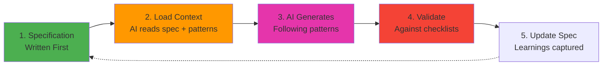

# AI Integration Guide

> **Purpose**: Comprehensive guide for using AI assistants (Claude, Cursor, ChatGPT) with NeoTool's specification-driven development approach.

## Overview

NeoTool documentation is **AI-optimized** for use with:
- **Claude Code** - RAG-powered CLI assistant
- **Cursor** - AI-enhanced IDE
- **ChatGPT** - General AI assistant
- **GitHub Copilot** - Code completion

This guide shows how to leverage these tools with NeoTool's specification-first approach.

---

## Why AI + Specifications Work

### The Problem AI Solves

❌ **Without Specs**:
- AI guesses requirements
- Inconsistent implementations
- Missing edge cases
- Wrong patterns used

✅ **With Specs**:
- AI follows documented patterns
- Consistent with existing code
- Complete implementations
- Type-safe end-to-end

### The SDD + AI Workflow



---

## Claude Code Integration

### Setup

**Installation**:
```bash
# Install Claude Code CLI
brew install anthropics/claude/claude-code

# Initialize in project
cd /path/to/neotool
claude-code init
```

**Configuration** (`.claude-code/config.yaml`):
```yaml
# Claude Code automatically indexes docs/
rag:
  enabled: true
  directories:
    - docs/
  file_types:
    - .md
    - .kt
    - .ts
    - .tsx
    - .graphql

context_window: 200000  # Claude Sonnet 4.5
```

### Workflow

**1. Feature Development**:
```bash
# AI reads feature spec + relevant patterns
claude "Implement user authentication feature from docs/03-features/authentication/"

# Claude Code:
# - Loads feature spec
# - Finds related patterns (entity, repository, service, resolver)
# - Reads GraphQL standards
# - Generates implementation following all patterns
```

**2. Code Review**:
```bash
# AI reviews code against standards
claude "Review UserService.kt against docs/05-backend/patterns/service-pattern.md"
```

**3. Documentation Updates**:
```bash
# AI updates docs with learnings
claude "Document the new caching pattern we implemented in docs/05-backend/patterns/"
```

### Best Practices

✅ **Do**:
- Reference specific documents: `@docs/05-backend/patterns/entity-pattern.md`
- Load related standards: Architecture, patterns, examples
- Ask for validation: "Does this follow the service pattern?"
- Request tests: "Generate tests following testing-standards.md"

❌ **Don't**:
- Ask to "guess" requirements
- Skip referencing patterns
- Generate without validation
- Ignore existing examples

**See**: [Context Strategy](../08-workflows/spec-context-strategy.md) for optimal context loading.

---

## Cursor Integration

### Setup

**Installation**:
1. Install Cursor IDE
2. Open NeoTool project
3. Configure `.cursorrules` file

**Configuration** (`.cursorrules`):
```markdown
# NeoTool - Specification-Driven Development

## Philosophy
- Specification drives implementation
- Code follows documented patterns
- Type safety end-to-end
- Clean architecture (Resolver → Service → Repository → Entity)

## Key Documents
Always reference:
- Architecture: docs/02-architecture/
- Patterns: docs/05-backend/patterns/, docs/07-frontend/patterns/
- Standards: docs/05-backend/kotlin/coding-standards.md
- Domain: docs/04-domain/domain-model.md

## Code Generation Rules
1. Follow entity-pattern.md for database entities
2. Follow repository-pattern.md for data access
3. Follow service-pattern.md for business logic
4. Follow resolver-pattern.md for GraphQL APIs
5. Generate tests following testing-standards.md

## Type Safety
- Use Kotlin data classes
- GraphQL schema → TypeScript types (auto-generated)
- UUID v7 for primary keys
- Micronaut Data for type-safe queries

## Validation
Before completing:
- Check against feature-checklist.md
- Verify pattern compliance
- Run tests
- Check linting
```

### Workflow

**1. Add Context** (Cursor Chat):
```
@docs/03-features/user-management/README.md
@docs/05-backend/patterns/entity-pattern.md
@docs/05-backend/patterns/repository-pattern.md
@docs/05-backend/patterns/service-pattern.md

Implement User entity, repository, and service following these patterns
```

**2. Generate Code**:
- Cursor reads all referenced documents
- Generates code following patterns
- Uses correct imports, annotations, naming
- Includes validation, error handling

**3. Inline Editing** (Ctrl+K):
```
// Select code block, then Ctrl+K
"Refactor to follow service-pattern.md"
```

**4. Code Review** (Cursor Chat):
```
@docs/94-validation/code-review-checklist.md

Review the changes against this checklist
```

### Cursor Composer (Multi-File Edits)

**Use Case**: Implementing features across multiple files

```
@docs/03-features/authentication/signin/README.md
@docs/05-backend/patterns/

Implement complete signin feature:
1. Create SignInInput DTO
2. Update AuthService with signin method
3. Add signin mutation to AuthResolver
4. Generate TypeScript types
5. Create React signin form
```

Cursor Composer:
- Edits multiple files simultaneously
- Maintains consistency across layers
- Follows cross-cutting patterns

---

## ChatGPT Integration

### Workflow

**1. Load Context** (Copy-paste or file upload):
```markdown
I'm working on NeoTool, a specification-driven development platform.

Context documents:
1. [Paste docs/01-overview/specification-driven-development.md]
2. [Paste docs/05-backend/patterns/service-pattern.md]
3. [Paste feature spec]

Task: Generate UserService following the service pattern
```

**2. Iterative Refinement**:
```
ChatGPT: [Generates code]

You: "Check against docs/05-backend/kotlin/coding-standards.md"
ChatGPT: [Refines to match standards]

You: "Add validation following the pattern"
ChatGPT: [Adds validation]
```

**3. Documentation Generation**:
```
You: "Generate ADR for this database choice following docs/92-adr/README.md"
ChatGPT: [Generates properly formatted ADR]
```

### Custom GPT (Recommended)

**Create "NeoTool Development Assistant" GPT**:

**Instructions**:
```
You are an expert NeoTool developer who follows Specification-Driven Development.

Core Principles:
1. Specification drives implementation
2. Type safety end-to-end
3. Clean architecture
4. GraphQL Federation

Always reference:
- Architecture docs (02-architecture/)
- Implementation patterns (05-backend/, 07-frontend/)
- Domain model (04-domain/)
- Coding standards

Never:
- Guess requirements
- Use different patterns than documented
- Skip validation
- Ignore type safety

When generating code:
1. Ask for feature spec location
2. Request relevant pattern documents
3. Generate following exact patterns
4. Validate against standards
5. Include tests
```

**Knowledge Base** (Upload):
- Upload all `docs/**/*.md` files
- GPT has instant access to all patterns

---

## GitHub Copilot Integration

### Setup

**File**: `.github/copilot-instructions.md`

```markdown
# NeoTool Copilot Instructions

## Context
This is a Kotlin + Micronaut + GraphQL backend with Next.js + React + TypeScript frontend.

## Patterns

### Backend (Kotlin)
- Entities: JPA entities with UUID v7 primary keys
- Repositories: Micronaut Data with type-safe queries
- Services: @Singleton with @Transactional
- Resolvers: @GraphQLQuery/@GraphQLMutation

### Frontend (TypeScript)
- Components: Functional React components
- State: React Context + Hooks
- API: Apollo Client with generated types
- Forms: React Hook Form

## Examples
Refer to docs/90-examples/ for reference implementations.
```

### Usage

**Code Completion**:
```kotlin
// Type comment, Copilot suggests following patterns
// Create User entity following entity-pattern.md
@Entity
@Table(name = "users")
data class UserEntity(  // Copilot completes correctly
    @Id val id: UUID,
    @Column(nullable = false, unique = true) val email: String,
    ...
)
```

**Inline Chat** (Ctrl+I):
```
"Generate UserRepository following repository-pattern.md"
```

---

## Context Management Strategies

### Minimal Context (Fast)

**Use Case**: Simple, isolated changes

```
Context:
- Feature spec
- 1 pattern document
- Coding standard

Example:
@docs/03-features/users/user-profile.md
@docs/05-backend/patterns/service-pattern.md
```

**Tokens**: ~5K

### Standard Context (Balanced)

**Use Case**: Feature implementation

```
Context:
- Feature spec
- All relevant patterns (entity, repository, service, resolver)
- Domain model
- Coding standards

Example:
@docs/03-features/authentication/
@docs/05-backend/patterns/entity-pattern.md
@docs/05-backend/patterns/repository-pattern.md
@docs/05-backend/patterns/service-pattern.md
@docs/05-backend/patterns/resolver-pattern.md
@docs/04-domain/domain-model.md
@docs/05-backend/kotlin/coding-standards.md
```

**Tokens**: ~20K

### Maximum Context (Comprehensive)

**Use Case**: Large features, architecture decisions

```
Context:
- Architecture overview
- All patterns
- Domain model
- Standards
- Examples

Example:
@docs/01-overview/
@docs/02-architecture/system-architecture.md
@docs/05-backend/patterns/
@docs/07-frontend/patterns/
@docs/04-domain/
@docs/90-examples/
```

**Tokens**: ~50K+

**See**: [Spec Context Strategy](../08-workflows/spec-context-strategy.md)

---

## Prompt Engineering

### Effective Prompts

✅ **Good Prompt**:
```
Context:
@docs/03-features/notifications/email-notifications.md
@docs/05-backend/patterns/service-pattern.md
@docs/05-backend/kotlin/coding-standards.md

Task: Implement EmailNotificationService following the service pattern.

Requirements:
1. Follow service-pattern.md structure
2. Use @Singleton and @Transactional correctly
3. Include error handling
4. Add logging
5. Generate unit tests

Validation:
Check against docs/05-backend/kotlin/coding-standards.md
```

❌ **Poor Prompt**:
```
Create an email service
```

### Prompt Templates

**Feature Implementation**:
```
Context: [Load feature spec + patterns]

Implement [Feature Name] with:
1. [Layer 1: Entity/Component]
2. [Layer 2: Repository/Hook]
3. [Layer 3: Service/Provider]
4. [Layer 4: Resolver/Page]
5. Tests for all layers

Validate against:
- Feature spec requirements
- Pattern compliance
- Coding standards
- Test coverage (>90%)
```

**Code Review**:
```
Context: [Load code + standards]

Review this code for:
1. Pattern compliance (docs/05-backend/patterns/)
2. Coding standards (docs/05-backend/kotlin/coding-standards.md)
3. Security issues (docs/09-security/)
4. Performance concerns
5. Test coverage

Provide specific feedback with line numbers.
```

---

## Validation with AI

### Pre-Commit Validation

```bash
# AI validates before commit
claude "Review all changes against docs/94-validation/feature-checklist.md"

# AI checks:
# - Pattern compliance
# - Test coverage
# - Documentation updates
# - Security considerations
```

### PR Description Generation

```bash
# AI generates PR description from changes
claude "Generate PR description following docs/94-validation/pr-checklist.md"

# Includes:
# - Summary of changes
# - Related issue/feature
# - Testing done
# - Checklist completion
```

---

## Common Workflows

### 1. New Feature (Backend)

```bash
# With Claude Code
claude "
Context:
@docs/03-features/user-management/README.md
@docs/05-backend/patterns/entity-pattern.md
@docs/05-backend/patterns/repository-pattern.md
@docs/05-backend/patterns/service-pattern.md
@docs/05-backend/patterns/resolver-pattern.md

Task: Implement User CRUD operations

Steps:
1. Create UserEntity with UUID v7
2. Create UserRepository with custom queries
3. Create UserService with validation
4. Create UserResolver with GraphQL mutations
5. Generate unit tests (>90% coverage)
6. Update feature spec with implementation notes

Validate:
- Pattern compliance
- Type safety
- Test coverage
"
```

### 2. Frontend Component

```bash
# With Cursor
[Add to context]
@docs/03-features/authentication/signin-form.md
@docs/07-frontend/patterns/graphql-mutation-pattern.md
@docs/07-frontend/patterns/shared-components-pattern.md

[Prompt in Chat]
Implement SignInForm component:
1. Use React Hook Form for form state
2. Use generated GraphQL types
3. Use Material-UI components
4. Handle errors with toast notifications
5. Follow shared-components-pattern.md
6. Generate tests with React Testing Library
```

### 3. Documentation Update

```bash
# With ChatGPT
I implemented a new caching pattern. Generate documentation:

Context:
[Upload docs/05-backend/patterns/service-pattern.md as reference]

Task:
Create docs/05-backend/patterns/caching-pattern.md following the same structure:
1. Overview
2. When to Use
3. Implementation
4. Example Code
5. Best Practices
6. Related Patterns
```

---

## Troubleshooting

### AI Generates Incorrect Code

**Cause**: Missing context or unclear prompt

**Solution**:
```
"This doesn't follow the pattern. Please review:
@docs/05-backend/patterns/service-pattern.md

Regenerate the code following this exact pattern."
```

### AI Hallucinates Non-Existent Patterns

**Cause**: AI inventing instead of reading docs

**Solution**:
```
"Only use patterns from:
@docs/05-backend/patterns/

Do not invent new patterns. Follow existing ones exactly."
```

### Context Window Exceeded

**Cause**: Too many documents loaded

**Solution**: Use tiered context (minimal → standard → maximum)

---

## Related Documentation

- [SDD Overview](./README.md)
- [Documentation Standards](./documentation-standards.md)
- [Specification-Driven Development](../01-overview/specification-driven-development.md)
- [Context Strategy](../08-workflows/spec-context-strategy.md)
- [Feature Development Workflow](../08-workflows/feature-development.md)

---

**Version**: 1.0.0 (2026-01-02)
**Tools Covered**: Claude Code, Cursor, ChatGPT, GitHub Copilot
**Philosophy**: Specifications guide AI. AI accelerates implementation. Validation ensures quality.

*Leverage AI to build faster. Specifications ensure consistency.*
