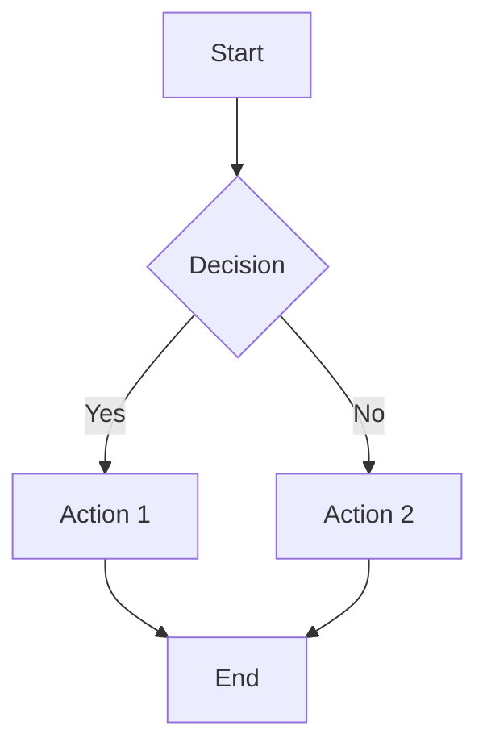
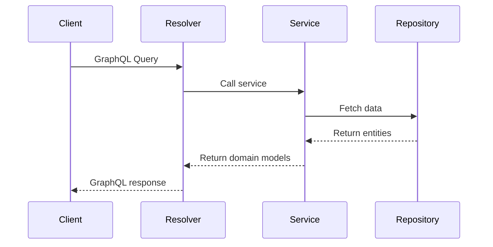
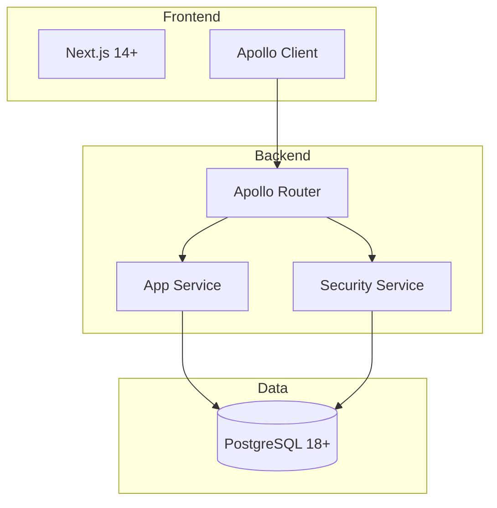
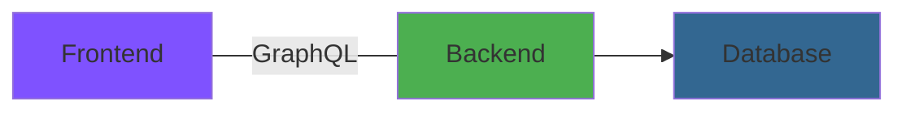

# Documentation Standards

> **Purpose**: Comprehensive standards for writing, formatting, and maintaining NeoTool documentation to ensure consistency, AI-readability, and developer usability.

## Overview

NeoTool documentation follows **Specification-Driven Development** principles where documentation is:
- **AI-optimized**: Structured for RAG (Retrieval-Augmented Generation) indexing
- **Developer-first**: Written for human comprehension and quick lookup
- **Version-controlled**: Treated as code with Git history
- **Cross-referenced**: Interconnected for discoverability
- **Validated**: Automatically checked for consistency

---

## File Naming Conventions

### Naming Rules

✅ **Correct**:
```
lowercase-with-hyphens.md
user-management.md
entity-pattern.md
getting-started.md
```

❌ **Incorrect**:
```
UpperCamelCase.md
SCREAMING_CASE.MD
under_scores.md
spaces in names.md
mixedCase-Names.md
```

**Exceptions**:
- `README.md` - uppercase (GitHub convention)
- `LICENSE` - uppercase (standard)
- `.cursorrules` - tool-specific naming

### File Organization

**Directory structure follows numeric taxonomy**:
```
docs/
├── 01-overview/              # What is NeoTool?
├── 02-architecture/          # System design
├── 03-features/              # Feature specifications
├── 04-domain/                # Domain model
├── 05-backend/               # Backend patterns
├── 06-contracts/             # API contracts (GraphQL)
├── 07-frontend/              # Frontend patterns
├── 08-workflows/             # Development processes
├── 09-security/              # Security practices
├── 10-observability/         # Monitoring & logging
├── 11-infrastructure/        # Operations & deployment
├── 12-specification-driven-dev/  # SDD methodology
├── 90-examples/              # Code examples
├── 91-templates/             # Boilerplate templates
├── 92-adr/                   # Architecture Decision Records
├── 93-reference/             # Quick reference guides
└── 94-validation/            # Checklists & validators
```

**Naming pattern**: `[01-12]` = core learning path, `[90-94]` = supporting resources

---

## YAML Frontmatter

### Required Frontmatter

**All documentation files MUST include**:

```yaml
---
title: Document Title
type: architecture|pattern|feature|workflow|standard|reference|template
category: specific-category
status: current|draft|deprecated
version: 1.0.0
tags: [tag1, tag2, tag3]
ai_optimized: true
search_keywords: [keyword1, keyword2, keyword3]
related:
  - path/to/related-doc.md
  - path/to/another-doc.md
last_updated: 2026-01-02
---
```

### Frontmatter Fields

| Field | Required | Description | Example |
|-------|----------|-------------|---------|
| `title` | ✅ Yes | Human-readable title | `Entity Pattern` |
| `type` | ✅ Yes | Document type | `pattern`, `architecture`, `feature` |
| `category` | ✅ Yes | Specific category | `backend-pattern`, `deployment` |
| `status` | ✅ Yes | Document status | `current`, `draft`, `deprecated` |
| `version` | ✅ Yes | Semantic version | `1.0.0`, `2.1.0` |
| `tags` | ✅ Yes | Search tags (array) | `[kotlin, jpa, database]` |
| `ai_optimized` | ✅ Yes | AI readability flag | `true` |
| `search_keywords` | ✅ Yes | Keywords for search | `[entity, repository, jpa]` |
| `related` | ✅ Yes | Related docs (array) | `- 05-backend/patterns/repository-pattern.md` |
| `last_updated` | ✅ Yes | Last edit date | `2026-01-02` |
| `author` | ❌ Optional | Document author | `Engineering Team` |
| `reviewers` | ❌ Optional | Reviewers | `[alice, bob]` |

### Type Values

**Allowed values for `type` field**:
- `architecture` - System/component architecture
- `pattern` - Implementation pattern
- `feature` - Feature specification
- `workflow` - Development workflow
- `standard` - Coding/design standard
- `reference` - Quick reference guide
- `template` - Boilerplate template
- `methodology` - SDD methodology docs
- `infrastructure` - Operations/deployment
- `security` - Security practices
- `observability` - Monitoring/logging

### Example Frontmatter

**Pattern document**:
```yaml
---
title: Entity Pattern
type: pattern
category: backend-pattern
status: current
version: 2.0.0
tags: [kotlin, jpa, entity, database, persistence]
ai_optimized: true
search_keywords: [entity, jpa, hibernate, database, orm, postgresql]
related:
  - 05-backend/patterns/repository-pattern.md
  - 05-backend/patterns/service-pattern.md
  - 02-architecture/data-architecture.md
  - 90-examples/backend/user-entity-example.md
last_updated: 2026-01-02
author: Backend Team
---
```

**Feature specification**:
```yaml
---
title: User Authentication
type: feature
category: authentication
status: current
version: 1.0.0
tags: [feature, authentication, security, jwt]
ai_optimized: true
search_keywords: [auth, login, signin, jwt, authentication]
related:
  - 09-security/authentication.md
  - 05-backend/patterns/resolver-pattern.md
  - 07-frontend/patterns/graphql-mutation-pattern.md
last_updated: 2026-01-02
---
```

---

## Document Structure

### Standard Sections

**All documentation should follow this structure**:

```markdown
---
[frontmatter]
---

# Document Title

> **Purpose**: One-sentence description of this document's purpose.

## Overview

High-level summary (2-4 paragraphs) covering:
- What this document is about
- Why it matters
- Who should read it
- How it fits into the larger system

### Quick Links (optional)

- [Section 1](#section-1)
- [Section 2](#section-2)

---

## [Main Content Sections]

### Section 1

Content with code examples, diagrams, explanations...

### Section 2

More content...

---

## Examples (if applicable)

### Example 1: [Description]

\`\`\`kotlin
// Code example
\`\`\`

---

## Best Practices

✅ **Do**:
- Item 1
- Item 2

❌ **Don't**:
- Item 1
- Item 2

---

## Related Documentation

- [Related Doc 1](../path/to/doc.md)
- [Related Doc 2](../path/to/doc.md)

---

**Version**: 1.0.0 (2026-01-02)
**Last Updated**: 2026-01-02
[Additional metadata]
```

### Section Guidelines

**Purpose statement**:
- Always start with `> **Purpose**: [one sentence]`
- Clarifies document's goal immediately
- Helps readers decide if they're in the right place

**Overview section**:
- 2-4 paragraphs max
- High-level context
- No code examples yet
- Links to related concepts

**Main content**:
- Use `---` horizontal rules to separate major sections
- Keep sections focused (one concept per section)
- Include code examples inline
- Use subsections (`###`) for sub-topics

**Examples section**:
- Real, working code examples
- Include comments explaining key parts
- Show both correct and incorrect usage
- Reference actual files in codebase when possible

**Best Practices section**:
- Use ✅/❌ emojis for visual clarity
- Be specific (not vague)
- Explain *why* (not just *what*)

**Footer metadata**:
- Version number
- Last updated date
- Review frequency (if applicable)
- Contact/ownership info (if applicable)

---

## Markdown Formatting

### Headings

**Hierarchy**:
```markdown
# H1 - Document Title (once per file)
## H2 - Major Section
### H3 - Subsection
#### H4 - Sub-subsection (use sparingly)
```

**Rules**:
- Only ONE `#` H1 per document (the title)
- Use `##` for major sections
- Don't skip levels (no H1 → H3)
- Keep headings concise (3-7 words)
- Use sentence case (not Title Case)

### Code Blocks

**With syntax highlighting**:
````markdown
```kotlin
data class User(
    val id: UUID,
    val email: String
)
```

```typescript
interface User {
  id: string;
  email: string;
}
```

```bash
kubectl get pods -n neotool-prod
```

```yaml
apiVersion: v1
kind: Service
metadata:
  name: backend
```
````

**Inline code**:
```markdown
Use `UserService` to manage users.
The `@Transactional` annotation enables transactions.
```

**File paths**:
```markdown
See [UserService.kt](../../service/kotlin/src/main/kotlin/UserService.kt)
```

### Lists

**Unordered lists**:
```markdown
- Item 1
- Item 2
  - Nested item 2.1
  - Nested item 2.2
- Item 3
```

**Ordered lists**:
```markdown
1. First step
2. Second step
3. Third step
```

**Task lists**:
```markdown
- [x] Completed task
- [ ] Pending task
- [ ] Another pending task
```

### Links

**Internal links** (relative paths):
```markdown
[Entity Pattern](../05-backend/patterns/entity-pattern.md)
[Architecture Overview](../../02-architecture/README.md)
```

**External links**:
```markdown
[Micronaut Documentation](https://docs.micronaut.io)
[Next.js 14 Docs](https://nextjs.org/docs)
```

**Anchor links** (within document):
```markdown
[Jump to Examples](#examples)
```

### Tables

**Standard table**:
```markdown
| Column 1 | Column 2 | Column 3 |
|----------|----------|----------|
| Value 1  | Value 2  | Value 3  |
| Value 4  | Value 5  | Value 6  |
```

**Aligned columns**:
```markdown
| Left | Center | Right |
|:-----|:------:|------:|
| L1   | C1     | R1    |
| L2   | C2     | R2    |
```

### Emphasis

```markdown
**Bold** for strong emphasis
*Italic* for mild emphasis
`code` for inline code
~~Strikethrough~~ for deprecated content
```

### Blockquotes

**Single-line quote**:
```markdown
> **Note**: This is an important note.
```

**Multi-line quote**:
```markdown
> This is a longer quote
> that spans multiple lines
> and provides detailed context.
```

### Horizontal Rules

```markdown
---
```

Use `---` to separate major sections (creates `<hr>` in HTML).

---

## Mermaid Diagrams

### Diagram Types

**Use Mermaid for**:
- Architecture diagrams
- Data flow diagrams
- Sequence diagrams
- State diagrams
- Entity relationships
- Workflows

**Example: Flowchart**:


**Example: Sequence Diagram**:


**Example: Architecture Diagram**:


### Mermaid Best Practices

✅ **Do**:
- Use consistent node naming
- Add descriptive labels
- Use subgraphs for grouping
- Apply colors/styling for clarity
- Keep diagrams focused (one concept)

❌ **Don't**:
- Create overly complex diagrams (>15 nodes)
- Use cryptic abbreviations
- Mix abstraction levels
- Omit critical relationships

**Color scheme** (NeoTool standard):


- Frontend: `#7f52ff` (purple)
- Backend: `#4caf50` (green)
- Database: `#336791` (postgres blue)
- Infrastructure: `#326CE5` (kubernetes blue)
- Monitoring: `#e6522c` (prometheus orange)

---

## Cross-Referencing

### Internal Links

**Always use relative paths**:
```markdown
<!-- From 05-backend/patterns/entity-pattern.md -->
[Repository Pattern](./repository-pattern.md)  # Same directory
[Architecture](../../02-architecture/README.md)  # Up 2, down 1
[Examples](../../90-examples/backend/user-entity.md)  # Cross-category
```

**Anchor links to sections**:
```markdown
[Jump to Examples](#examples)
[See Prerequisites](#prerequisites)
```

### Related Documentation Section

**Every document MUST include**:
```markdown
## Related Documentation

- [Direct Parent/Overview](../README.md)
- [Related Pattern 1](./related-pattern.md)
- [Related Pattern 2](./another-pattern.md)
- [Architecture Context](../../02-architecture/system-architecture.md)
- [Example Implementation](../../90-examples/backend/example.md)
```

**Guidelines**:
- List 3-8 related documents
- Order by relevance (most related first)
- Include both parent (context) and sibling (related) docs
- Link to examples when available

### Forward vs Backward References

**Forward reference** (linking to details):
```markdown
For implementation details, see [Entity Pattern](../05-backend/patterns/entity-pattern.md).
```

**Backward reference** (linking to context):
```markdown
This pattern is part of the broader [Clean Architecture](../../02-architecture/system-architecture.md#clean-architecture) approach.
```

**Use both** to create interconnected documentation web.

---

## Code Examples

### Example Guidelines

✅ **Good Example**:
```kotlin
// UserEntity.kt - JPA entity with UUID v7 primary key
@Entity
@Table(name = "users")
data class UserEntity(
    @Id
    val id: UUID,  // UUID v7 generated via UuidV7.generate()

    @Column(nullable = false, unique = true)
    val email: String,

    @Column(nullable = false)
    val passwordHash: String,

    @CreatedDate
    @Column(nullable = false, updatable = false)
    val createdAt: Instant = Instant.now(),

    @UpdatedDate
    @Column(nullable = false)
    val updatedAt: Instant = Instant.now()
)
```

**Why good**:
- Includes file name
- Comments explain key parts
- Shows real annotations
- Uses actual types
- Demonstrates best practices

❌ **Bad Example**:
```kotlin
// User
class User {
    var id: String
    var name: String
}
```

**Why bad**:
- No context (file name)
- No annotations
- Wrong types (String vs UUID)
- No comments
- Doesn't match actual codebase

### Example Structure

**Minimal example**:
```kotlin
// Single concept demonstration
@Transactional
fun createUser(input: UserCreateInput): UserDomain {
    return userRepository.save(input.toDomain())
}
```

**Complete example**:
```kotlin
// Complete implementation with error handling
@Singleton
class UserService(
    private val userRepository: UserRepository,
    private val passwordEncoder: PasswordEncoder
) {
    @Transactional
    fun createUser(input: UserCreateInput): UserDomain {
        // Validate email uniqueness
        require(!userRepository.existsByEmail(input.email)) {
            "Email ${input.email} already exists"
        }

        // Hash password
        val passwordHash = passwordEncoder.encode(input.password)

        // Create domain model
        val user = UserDomain(
            id = UuidV7.generate(),
            email = input.email,
            passwordHash = passwordHash
        )

        // Persist and return
        return userRepository.save(user)
    }
}
```

**Link to full implementation**:
```markdown
**See**: [UserService.kt](../../service/kotlin/src/main/kotlin/services/UserService.kt) for complete implementation.
```

---

## AI Optimization

### RAG-Friendly Content

**Why AI-optimization matters**:
- Claude Code indexes docs/ with RAG
- Cursor reads context from referenced docs
- ChatGPT parses uploaded markdown files
- Clear structure improves retrieval accuracy

**Optimization techniques**:

1. **Clear headings** - AI uses headings to chunk content
2. **Semantic keywords** - Include search terms in `search_keywords` frontmatter
3. **Code examples** - AI learns patterns from code blocks
4. **Consistent structure** - Predictable sections improve parsing
5. **Cross-references** - Help AI build knowledge graph

### Search Keywords

**Include in frontmatter**:
```yaml
search_keywords: [entity, jpa, hibernate, database, orm, postgresql, kotlin]
```

**Guidelines**:
- 5-10 keywords per document
- Include synonyms (e.g., "auth", "authentication", "login")
- Add technology names (e.g., "kotlin", "micronaut", "graphql")
- Include common abbreviations (e.g., "dto", "orm", "jpa")

### Descriptive Titles and Summaries

**Title**: Match document content precisely
```yaml
title: Entity Pattern  # ✅ Clear
title: Entities  # ❌ Too vague
```

**Purpose statement**: Single sentence describing document
```markdown
> **Purpose**: Defines the standard pattern for creating JPA entities with UUID v7 primary keys, timestamps, and soft deletes.
```

---

## Version Control

### Changelog

**For major updates** (version bump), include changelog:
```markdown
## Changelog

### Version 2.0.0 (2026-01-02)
- **Breaking**: Changed from UUID v4 to UUID v7
- Added soft delete pattern
- Updated examples to use Kotlin 2.0

### Version 1.1.0 (2025-12-01)
- Added caching examples
- Clarified transaction boundaries

### Version 1.0.0 (2025-10-15)
- Initial version
```

### Versioning Rules

**Semantic versioning** for documentation:
- **Major** (1.0.0 → 2.0.0): Breaking changes, major restructuring
- **Minor** (1.0.0 → 1.1.0): New sections, significant additions
- **Patch** (1.0.0 → 1.0.1): Typo fixes, minor clarifications

**Update `last_updated` field** on every change:
```yaml
last_updated: 2026-01-02
```

---

## Validation

### Automated Checks

**Run validation before commit**:
```bash
# Validate all documentation
./neotool validate docs

# Specific checks
./neotool validate docs --check=frontmatter
./neotool validate docs --check=links
./neotool validate docs --check=markdown
```

**CI/CD validation** (GitHub Actions):
```yaml
- name: Validate Documentation
  run: |
    ./neotool validate docs
    ./neotool validate links
```

### Manual Checklist

Before committing documentation changes:

- [ ] YAML frontmatter includes all required fields
- [ ] `last_updated` reflects today's date
- [ ] `version` incremented if needed
- [ ] Code examples tested and working
- [ ] Internal links verified (not broken)
- [ ] Mermaid diagrams render correctly
- [ ] Cross-references updated
- [ ] Spelling/grammar checked
- [ ] Follows naming convention (lowercase-with-hyphens.md)
- [ ] Related documentation section complete

---

## Best Practices

### Writing Style

✅ **Do**:
- Write concisely (short sentences, active voice)
- Use present tense ("The service handles..." not "The service will handle...")
- Include "why" (not just "how")
- Add examples for every concept
- Use consistent terminology
- Write for both humans and AI

❌ **Don't**:
- Use jargon without explaining
- Write overly long paragraphs (>5 sentences)
- Assume knowledge without context
- Skip code examples
- Use ambiguous pronouns ("it", "this", "that")
- Mix abstraction levels in single section

### Documentation Debt

**When making code changes**:
1. Update related documentation IMMEDIATELY
2. Check for broken cross-references
3. Update code examples if patterns changed
4. Increment version if breaking change
5. Add to changelog

**Technical debt indicators**:
- Outdated code examples
- Broken links
- Missing frontmatter
- Inconsistent formatting
- No related docs section

**Quarterly review**:
- Check `last_updated` dates (>6 months old?)
- Verify links still valid
- Update deprecated sections
- Refresh examples with latest patterns

---

## Templates

### New Document Template

**Use this for all new documentation**:

````markdown
---
title: [Document Title]
type: [architecture|pattern|feature|workflow|standard|reference|template]
category: [specific-category]
status: current
version: 1.0.0
tags: [tag1, tag2, tag3]
ai_optimized: true
search_keywords: [keyword1, keyword2, keyword3]
related:
  - path/to/related-doc.md
last_updated: YYYY-MM-DD
---

# [Document Title]

> **Purpose**: [One-sentence description of this document's purpose]

## Overview

[2-4 paragraphs covering what, why, who, how]

---

## [Main Section 1]

### [Subsection]

Content with examples...

```kotlin
// Code example
```

---

## Examples

### Example 1: [Description]

```[language]
// Working code example
```

---

## Best Practices

✅ **Do**:
- Item 1
- Item 2

❌ **Don't**:
- Item 1
- Item 2

---

## Related Documentation

- [Related Doc 1](../path/to/doc.md)
- [Related Doc 2](../path/to/doc.md)

---

**Version**: 1.0.0 (YYYY-MM-DD)
````

**See**: [91-templates/](../../91-templates/) for more templates.

---

## Related Documentation

- [SDD Overview](./README.md)
- [AI Integration Guide](./ai-integration-guide.md)
- [Specification-Driven Development](../01-overview/specification-driven-development.md)
- [Feature Development Workflow](../08-workflows/feature-development.md)

---

**Version**: 1.0.0 (2026-01-02)
**Review Frequency**: Quarterly
**Maintained By**: Documentation Team

*Write once. Read many times. Maintain consistency.*
