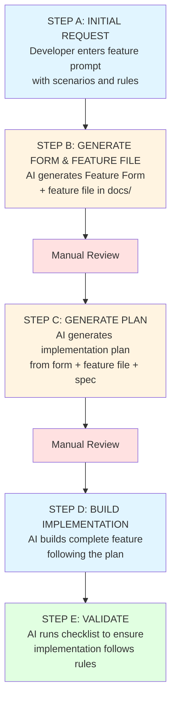

# Feature Development Workflow

> **Purpose**: Step-by-step workflow for creating features using Spec-Driven Development with AI assistance.

## Overview

This workflow guides you through creating features from initial idea to implementation, using structured prompts and AI assistance to ensure spec compliance and minimize review cycles.

## Workflow Steps



## Step A: Initial Feature Request

### Purpose
Developer provides a simple feature request with scenarios and rules.

### Actions
1. Developer enters a prompt using the format from `04-templates/ai-prompts/step-a-initial-feature-request.md`
2. Include:
   - Feature name
   - Scenarios (A, B, C, etc.)
   - Rules (X, Y, Z, etc.)
   - Any additional context

### Example Prompt
```
Create feature signup. 

The scenarios are:
- User signs up with email and password
- User signs up with Google OAuth
- User signs up with invalid email format

The rules are:
- Email must be unique
- Password must be at least 8 characters with uppercase, lowercase, number and special character
- User must verify email before accessing the app
```

### Output
- ✅ Feature request prompt ready for AI

### Next Step
Proceed to Step B: AI generates Feature Form and feature file

## Step B: Generate Feature Form and Feature File

### Purpose
AI generates both the Feature Form and the feature file in Gherkin format based on the initial request.

### Actions
1. AI uses prompt: `04-templates/ai-prompts/step-b-generate-form-and-feature-file.md`
2. AI generates:
   - Complete Feature Form following `04-templates/feature-creation/feature-form.md`
   - Feature file in Gherkin format following pattern from `docs/03-features/authentication/signin.feature`
3. AI saves feature file to: `docs/03-features/[category]/[feature-name].feature`

### Output
- ✅ Complete Feature Form
- ✅ Feature file saved to `docs/03-features/[category]/[feature-name].feature`

### Next Step
**Manual Review Required** → Proceed to Step C after approval

## Step C: Generate Implementation Plan

### Purpose
AI generates comprehensive implementation plan from Feature Form + feature file + spec after manual review.

### Actions
1. After manual review of Step B output, AI uses prompt: `04-templates/ai-prompts/step-c-generate-implementation-plan.md`
2. AI generates implementation plan with:
   - Complete artifact checklist (all files, tests, schemas, migrations)
   - Implementation phases in correct order (Backend → Schema/Types → Frontend → Integration)
   - Exact file paths for all artifacts
   - Spec references for each artifact
   - Dependencies between artifacts
   - Validation steps

### Output
- ✅ Complete implementation plan
- ✅ Artifact checklist with checkboxes
- ✅ Phase-by-phase breakdown

### Next Step
**Manual Review Required** → Proceed to Step D after approval

## Step D: Build Implementation

### Purpose
AI builds the complete feature implementation following the approved plan.

### Actions
1. After manual review of Step C output, AI uses prompt: `04-templates/ai-prompts/step-d-build-implementation.md`
2. AI implements all artifacts following the plan:
   - Phase 1: Backend (migrations, entities, repositories, services, resolvers, schemas)
   - Phase 2: Schema & Types (sync schema, generate TypeScript types)
   - Phase 3: Frontend (GraphQL operations, components, pages, hooks, i18n)
   - Phase 4: Testing (unit tests, integration tests, E2E tests)
   - Phase 5: Observability (Grafana dashboard for business metrics)
3. AI follows all spec patterns and rules
4. AI runs schema sync and type generation after each phase

### Testing Requirements (REQUIRED)
- **Unit Tests**: 90%+ line coverage, 85%+ branch coverage, all conditional branches tested
- **Integration Tests**: 80%+ line coverage, 75%+ branch coverage, all API endpoints tested
- **E2E Tests**: All scenarios from feature file covered
- See `spec/05-standards/testing-rules.md` for detailed requirements

### Observability Requirements (REQUIRED)
- **Grafana Dashboard**: Create dashboard for business metrics (if applicable)
  - Location: `infra/observability/grafana/dashboards/{feature-name}-metrics.json`
  - Track success/failure rates, latency percentiles, operation counts
  - Use PromQL queries filtering by operation name and module
- See `spec/05-standards/observability-rules.md` for detailed requirements

### Output
- ✅ All backend artifacts implemented
- ✅ All frontend artifacts implemented
- ✅ **Unit tests** created (90%+ coverage, all branches tested)
- ✅ **Integration tests** created (80%+ coverage)
- ✅ **E2E tests** created (all scenarios covered)
- ✅ **Grafana dashboard** created (if applicable)
- ✅ Schema synced to contracts
- ✅ TypeScript types generated
- ✅ All tests passing

### Next Step
Proceed to Step E: Validation

## Step E: Validate Implementation

### Purpose
AI validates the implementation against all rules and checklists.

### Actions
1. AI uses prompt: `04-templates/ai-prompts/step-e-validate-implementation.md`
2. AI runs validation:
   - Feature Checklist (`07-validation/feature-checklist.md`)
   - All rules from `spec/05-standards/`
   - All patterns from `spec/04-patterns/`
   - Verify implementation matches feature file
   - Run automated validations (linting, type checking, tests, schema validation)
   - Check for common issues
3. AI generates validation report with:
   - ✅ Passed checks
   - ❌ Failed checks (with details and fixes)
   - ⚠️ Warnings (with recommendations)
   - 📝 Missing items

### Output
- ✅ Validation report
- ✅ All checks passing (or list of issues to fix)

### Next Step
If validation passes → Feature complete. If issues found → Fix and re-validate.

## Quick Reference

### Prompts Used
- Step A: `04-templates/ai-prompts/step-a-initial-feature-request.md` (Developer enters)
- Step B: `04-templates/ai-prompts/step-b-generate-form-and-feature-file.md`
- Step C: `04-templates/ai-prompts/step-c-generate-implementation-plan.md`
- Step D: `04-templates/ai-prompts/step-d-build-implementation.md`
- Step E: `04-templates/ai-prompts/step-e-validate-implementation.md`

### Key Commands
```bash
# Schema sync
./neotool graphql sync

# Schema validation
./neotool graphql validate

# Generate types
npm run codegen

# Run tests
npm test
./gradlew test
```

## Related Documentation

- [Feature Development Workflow](../06-workflows/feature-development.md) - Detailed workflow
- [Feature Form](./feature-form.md) - Feature form template
- [Step A Prompt](../ai-prompts/step-a-initial-feature-request.md) - Initial feature request prompt
- [Step B Prompt](../ai-prompts/step-b-generate-form-and-feature-file.md) - Generate form and feature file
- [Step C Prompt](../ai-prompts/step-c-generate-implementation-plan.md) - Generate implementation plan
- [Step D Prompt](../ai-prompts/step-d-build-implementation.md) - Build implementation
- [Step E Prompt](../ai-prompts/step-e-validate-implementation.md) - Validate implementation

