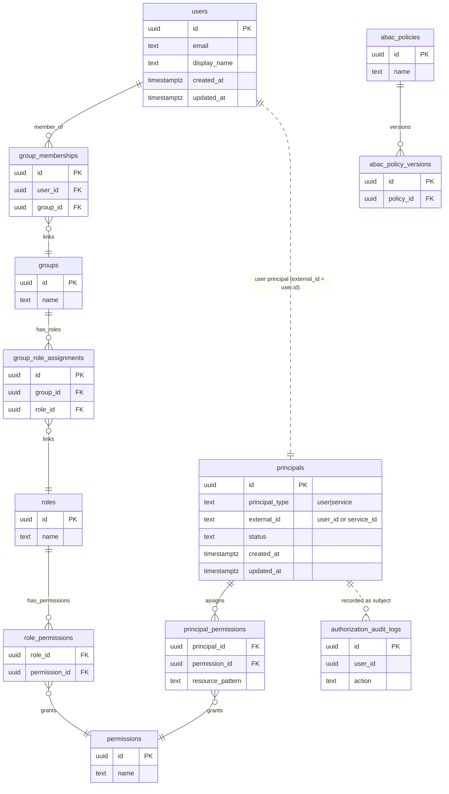

# Interservice Security Migration Plan

Purpose: implement the ADR-0008 baseline (JWT over TLS with service principals) using a unified permission model.

## Task 1: Schema (DB)
- Goal: introduce service principals without diverging permission vocabulary.
- Work:
  - Add `security.principals` (id, principal_type ENUM[user,service], external_id/service_id, status, created/updated).
  - Add `security.principal_permissions` (principal_id FK -> principals, permission_id FK -> permissions, resource_pattern nullable, PK (principal_id, permission_id, resource_pattern)).
  - Seed nothing yet for services; keep existing user data intact.
  - Keep `permissions` table as single source of permission keys.
- Tests:
  - Migration runs clean locally.
  - DB unit/integration tests for principal_permissions insert/select (if repo tests exist).
- Frontend impact: none.

## Task 2: JWT Profile
- Goal: support service tokens (and optional user context) in a provider-agnostic way.
- Work:
  - Define `type=service` claim; `sub` = service id; `aud` = target service; `permissions` = service permissions.
  - For propagated user context: include `user_id` and `user_permissions` computed by issuer (not caller).
  - Update JwtService (or equivalent) to parse/validate `type=service`, `aud`, `iss`, `exp/nbf`, `permissions`.
- Tests:
  - Unit tests for token parsing/validation for service token, and service+user context token.
- Frontend impact: none (tokens are backend-only).

## Task 3: Principal Model
- Goal: represent both users and services in the security domain.
- Work:
  - Extend `RequestPrincipal` to include `principalType` (user/service), `serviceId` (nullable), `userId` (nullable for service-only).
  - Add a `ServicePrincipal` model if preferred, or reuse `RequestPrincipal` with type.
- Tests:
  - Unit tests covering user principal and service principal creation.
- Frontend impact: none.

## Task 4: Principal Provider
- Goal: accept service tokens and optional user context.
- Work:
  - Update `RequestPrincipalProvider` to validate `type=service` tokens and create service principals.
  - Support dual-token or embedded user-context claims; ensure issuer-derived user claims, not caller-provided.
- Tests:
  - Unit tests for service token parsing, user token parsing, and combined flow.
- Frontend impact: none.

## Task 5: Authorization Routing
- Goal: route authorization by principal type while sharing permission vocabulary.
- Work:
  - Update `AuthorizationManager` to accept service principals; when user+service are present, enforce both.
  - Update/extend `AuthorizationService` to check permissions for `principal_permissions` when principal_type=service; keep existing user RBAC/ABAC flow for users.
  - Add a thin router that dispatches to the correct check based on principal_type.
- Tests:
  - Unit tests for service permission checks, user checks, and combined checks (service + user context).
- Frontend impact: none.

## Task 6: Repositories
- Goal: data access for principals and assignments.
- Work:
  - Add repositories for `principals` and `principal_permissions`.
  - Keep `PermissionRepository` as-is (shared keys).
- Tests:
  - Repository tests for CRUD and lookup by service_id/principal_id.
- Frontend impact: none.

## Task 7: Wiring (GraphQL/HTTP)
- Goal: ensure inbound request handling supports service principals.
- Work:
  - Update GraphQL wiring (e.g., `SecurityWiringFactory`) to extract principal (user or service) and handle dual-context if provided.
  - Ensure HTTP/filters reuse the provider changes.
- Tests:
  - Integration tests for GraphQL endpoints with service token and with user+service propagation.
- Frontend impact: none (only affects auth plumbing).

## Task 8: Observability
- Goal: trace caller service and user.
- Work:
  - Log serviceId and userId in auth decisions/audit when available.
  - Add metrics counters for service-token validation failures and authorization denials.
- Tests:
  - Unit tests for logging/metrics hooks if present; otherwise manual verification in integration tests.
- Frontend impact: none.

## Task 9: Seed/Config for Service Accounts
- Goal: enable initial service identities.
- Work:
  - Define how service principals are issued (IdP client credentials); avoid storing long-lived secrets locally if IdP can handle it.
  - Seed minimal service principals if needed for tests (via fixtures).
- Tests:
  - Integration tests using a service principal fixture to call a protected endpoint.
- Frontend impact: none.

## Task 10: mTLS Follow-up (TODO)
- Goal: prepare for optional mesh mTLS when K8s/mesh is introduced.
- Work:
  - Document mapping from mesh identity (e.g., SPIFFE ID) to service principal.
  - Plan non-prod pilot; no implementation now.
- Tests:
  - None now (deferred).
- Frontend impact: none.

### mTLS Integration Plan (Future)

When a service mesh (e.g., Istio with SPIFFE/SPIRE) is introduced, the following mapping strategy should be used:

1. **Mesh Identity to Service Principal Mapping**:
   - Extract SPIFFE ID from mTLS certificate (e.g., `spiffe://example.com/ns/prod/sa/my-service`)
   - Parse service identifier from SPIFFE ID (e.g., `my-service` from the service account)
   - Look up service principal in `security.principals` table by `external_id` matching the service identifier
   - If principal exists, use it for authorization; if not, create a new service principal or deny access

2. **Dual Authentication**:
   - mTLS provides transport-level authentication (proves the workload identity)
   - JWT provides application-level authorization (proves permissions)
   - Both should be validated: mTLS cert must match service principal, JWT must be valid and have required permissions

3. **Non-Prod Pilot**:
   - Deploy mesh mTLS in staging environment first
   - Validate mapping logic and performance impact
   - Test service-to-service communication with both mTLS and JWT
   - Monitor for any issues before production rollout

4. **Implementation Notes**:
   - Create a `MeshIdentityProvider` that extracts SPIFFE ID from mTLS context
   - Update `RequestPrincipalProvider` to support mesh identity extraction
   - Add configuration to enable/disable mTLS validation per environment
   - Ensure backward compatibility: JWT-only mode should still work

## Schema overview (Mermaid)

## Token Issuer (REST) Implementation Plan

T1: Endpoint contract  
- Goal: Define a REST token endpoint for service principals (client credentials).  
- Do: Specify `POST /oauth/token` (or `/service-token`) accepting `client_id`, `client_secret`, `audience`; response `{access_token, token_type=bearer, expires_in}`. Document required headers (Basic auth optional), rate limits, and error codes (400 invalid request, 401 invalid creds, 403 disabled principal/audience not allowed).  
- Tests: Contract/unit tests for DTOs or controller stubs.

T2: Service principal lookup & validation  
- Goal: Validate service credentials and status.  
- Do: In issuer service, fetch principal by `service_id`/`client_id` from `principals` where `principal_type=service`; verify `enabled`; verify secret hash (Argon2id); optionally check allowed audiences list if modeled.  
- Tests: Unit tests for valid/invalid secret, disabled principal, missing principal, disallowed audience.

T3: Permission load for services  
- Goal: Populate token claims with the correct permissions.  
- Do: Load permissions via `principal_permissions` (shared permission keys). No caller-supplied permissions. Handle empty set gracefully.  
- Tests: Unit tests ensuring correct permission list returned for a given principal.

T4: JWT minting  
- Goal: Issue signed JWTs per ADR profile.  
- Do: Create token with `type=service`, `sub=<service_id>`, `aud=<audience>`, `iss=<security-service>`, `permissions=[...]`, `iat/nbf/exp` (short TTL 15–60 min). Use existing signing keys and JWKS exposure.  
- Tests: Unit tests validating claims, TTL bounds, and signature using local JWKS.

T5: Controller/handler  
- Goal: Wire REST handler to validation + issuance.  
- Do: Implement controller to parse request, call validation (T2), load permissions (T3), mint token (T4), and return response. Add rate limiting and audit logging hooks (success/failure).  
- Tests: Integration tests hitting the endpoint with valid/invalid creds, disabled principal, wrong audience.

T6: Audit and metrics  
- Goal: Observe issuance attempts and failures.  
- Do: Emit audit log entries (service_id, outcome, reason) and metrics counters for successes/failures, auth errors, rate-limit hits.  
- Tests: Unit/integration where applicable; otherwise manual verification via logs/metrics in test runs.

T7: Consumer validation update  
- Goal: Ensure services validate service tokens.  
- Do: Update token validation code to accept `type=service`, enforce `aud`, check `permissions`, and verify signature/exp/nbf/iss. Reject if type/audience mismatch.  
- Tests: Unit tests on validation logic; integration tests calling a protected endpoint with/without correct permissions.

T8: Documentation  
- Goal: Publish how to obtain and use service tokens.  
- Do: Add docs with request/response examples, required claims, expected audiences, TTLs, and validation rules. Include rate limits and error responses.  
- Tests: Doc review; optionally doc lint if used.

T9: Frontend impact check  
- Goal: Confirm no frontend changes needed.  
- Do: Note that frontend is unaffected (backend-only flow).  
- Tests: None.

T10: Rollout plan  
- Goal: Deploy safely.  
- Do: Enable endpoint in non-prod first, seed a test service principal, validate end-to-end with a target service; then promote to prod. Ensure secrets are provisioned securely.  
- Tests: Non-prod E2E scenario.

## Service Credential Provisioning (Admin) Plan

T11: Admin endpoint/CLI for service credentials  
- Goal: Allow creation/rotation of service credentials securely.  
- Do: Add an admin-only REST endpoint (or CLI) to create/rotate credentials for `principal_type=service`. Require admin auth (existing security roles), rate limit, and audit. Inputs: `service_id` (client_id), optional allowed audiences. Outputs: one-time clear `client_secret` plus metadata; store only Argon2id hash. Support enable/disable and rotation.  
- Tests: Integration tests for admin issuance (happy path, disabled principal, rotation) and that clear secret is only returned at creation.  
- Notes: Keep this internal-only; log/audit all operations; never expose stored secrets; enforce audience allowlist if modeled.
