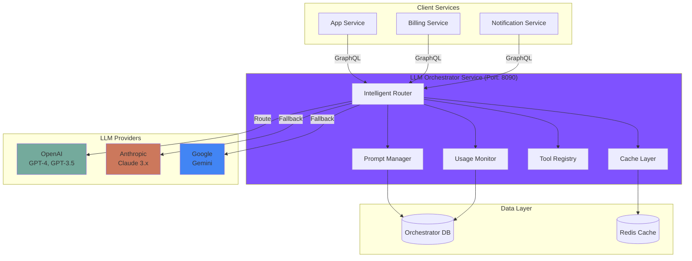

# ADR-0011: LLM Orchestrator Service

## Status

Accepted

## Context

NeoTool needs to integrate Large Language Model (LLM) capabilities across multiple features (content generation, summarization, intelligent search, chatbots, code assistance, etc.). As more services require LLM functionality, we face several architectural challenges:

### Current Pain Points

1. **Duplication**: Each service implementing its own LLM client code
2. **Inconsistency**: Different services using different prompts for similar tasks
3. **Cost Visibility**: No centralized tracking of LLM costs per service/feature/user
4. **Provider Lock-in**: Direct dependencies on specific providers (e.g., OpenAI)
5. **No Fallbacks**: Single provider failure = complete feature failure
6. **Uncontrolled Costs**: No rate limiting or budgets = runaway expenses
7. **Security Risks**: No PII detection or content filtering
8. **Poor Observability**: Can't track token usage, latency, or quality across system

### Requirements

- **Centralized Management**: Single place to manage prompts, models, and configurations
- **Provider Abstraction**: Easy to switch between OpenAI, Anthropic, Google, etc.
- **Intelligent Routing**: Automatically select optimal model based on cost, performance, features
- **Cost Control**: Track usage, enforce budgets, optimize costs
- **Reliability**: Retries, fallbacks, circuit breakers, caching
- **Observability**: Comprehensive metrics on usage, costs, latency, quality
- **Security**: PII detection/redaction, content filtering, audit logging
- **Developer Experience**: Simple, consistent API for all services

### Industry Context

Major tech companies have similar orchestration layers:

| Company | Approach |
|---------|----------|
| **Microsoft** | Semantic Kernel - orchestration framework |
| **LangChain** | LangChain/LangSmith - chains, agents, monitoring |
| **AWS** | Bedrock - unified API for multiple models |
| **Google Cloud** | Vertex AI - model management and serving |
| **Anthropic** | Claude API with prompt caching |
| **OpenAI** | OpenAI API with function calling |

## Decision

We will implement a **dedicated LLM Orchestrator microservice** that acts as a centralized intelligent routing layer for all LLM interactions in the NeoTool platform.

### Core Architecture



### Key Components

#### 1. Provider Abstraction Layer

Unified interface across all LLM providers:

```kotlin
interface LLMProviderClient {
    suspend fun complete(request: ProviderCompletionRequest): ProviderCompletionResponse
    suspend fun streamComplete(request: ProviderCompletionRequest): Flow<ProviderCompletionChunk>
    fun estimateTokens(text: String): Int
}

// Implementations
class OpenAIProviderClient : LLMProviderClient
class AnthropicProviderClient : LLMProviderClient
class GoogleProviderClient : LLMProviderClient
```

**Benefit**: Services never call providers directly. Switch providers by changing configuration.

#### 2. Intelligent Model Router

Selects optimal model based on:
- **Requirements**: Context window, features (tools, vision, streaming)
- **Cost**: Estimated cost per request
- **Performance**: Historical latency (P50, P95, P99)
- **Health**: Circuit breaker state, rate limit availability
- **Routing Rules**: Custom rules for specific scenarios

```kotlin
fun selectModel(request: CompletionRequest): LLMModel {
    val candidates = filterByRequirements(request)
    val ruleMatch = applyRoutingRules(request, candidates)
    return ruleMatch ?: scoreAndSelectBest(candidates)
}
```

**Benefit**: Automatic cost optimization without changing client code.

#### 3. Prompt Management

Prompts as versioned, testable assets:

```kotlin
data class Prompt(
    val id: UUID,
    val name: String,
    val category: String,
    val activeVersion: PromptVersion
)

data class PromptVersion(
    val id: UUID,
    val version: Int,
    val template: String,
    val variables: List<PromptVariable>,
    val performanceMetrics: PerformanceMetrics
)
```

**Benefit**:
- A/B test prompts without code changes
- Track which prompts work best
- Versioning for rollback
- Share prompts across services

#### 4. Tool Calling Framework

Centralized tool registry and execution:

```kotlin
interface ToolExecutor {
    suspend fun execute(input: JsonObject): Result<JsonObject>
}

@Singleton
class ToolRegistry {
    fun register(toolName: String, executor: ToolExecutor)
    fun execute(toolName: String, input: JsonObject): Result<JsonObject>
}
```

**Benefit**: Reusable tools across all LLM interactions. Services register tools once.

#### 5. Multi-Level Caching

- **L1: Exact Match** (5 min TTL) - Identical requests
- **L2: Semantic Cache** (1 hour TTL) - Similar questions
- **L3: Prompt Cache** (24 hour TTL) - Common prompt responses

**Benefit**: Massive cost savings (cache hit = $0.00 cost).

#### 6. Comprehensive Observability

```kotlin
// Metrics
llm_requests_total{service, model, status}
llm_tokens_total{service, model, token_type}
llm_cost_total{service, model}
llm_cache_hit_rate{cache_level}
llm_provider_latency_ms{provider, p50, p95, p99}
llm_circuit_breaker_state{provider}
```

**Benefit**: Full visibility into costs, usage, and performance.

## Consequences

### Positive

#### Cost Management
- ✅ **Centralized cost tracking**: Know exactly what each service/user costs
- ✅ **Budget enforcement**: Prevent runaway costs with per-service/user limits
- ✅ **Automatic optimization**: Router selects cheapest model that meets requirements
- ✅ **Caching savings**: Eliminate duplicate LLM calls
- ✅ **Usage analytics**: Identify expensive features and optimize

#### Reliability
- ✅ **Provider independence**: Not locked to single provider
- ✅ **Automatic fallback**: If OpenAI down, auto-switch to Anthropic
- ✅ **Circuit breakers**: Failing providers marked unhealthy
- ✅ **Retry logic**: Automatic retry with exponential backoff
- ✅ **Rate limit handling**: Graceful degradation when limits hit

#### Developer Experience
- ✅ **Simple API**: Services call one GraphQL endpoint
- ✅ **No provider knowledge**: Services don't need to know OpenAI vs Anthropic
- ✅ **Reusable prompts**: Share prompts across services
- ✅ **Built-in tools**: Common tools available out-of-box
- ✅ **Type safety**: GraphQL schema + codegen

#### Security & Compliance
- ✅ **PII detection**: Automatic detection and redaction
- ✅ **Content filtering**: Block harmful/inappropriate content
- ✅ **Audit logging**: Complete trail of all LLM interactions
- ✅ **Centralized secrets**: Provider API keys in one place
- ✅ **Access control**: Control which services can use which features

#### Observability
- ✅ **Comprehensive metrics**: Tokens, costs, latency, cache hits
- ✅ **Distributed tracing**: Track requests across services
- ✅ **Structured logging**: Consistent log format
- ✅ **Alerting**: Budget thresholds, error rates, high latency
- ✅ **Quality tracking**: Monitor prompt performance over time

### Negative

#### Complexity
- ❌ **New service**: Another microservice to deploy, monitor, scale
- ❌ **Learning curve**: Team needs to learn new API
- ❌ **Migration effort**: Existing LLM code needs to be migrated

#### Performance
- ❌ **Extra hop**: Additional network call vs direct provider call
- ❌ **Latency**: Router adds ~10-50ms overhead
- ❌ **Single point of failure**: If orchestrator down, all LLM features down

#### Operational
- ❌ **Monitoring complexity**: More metrics, logs, traces to monitor
- ❌ **Debugging**: Harder to debug issues (more layers)
- ❌ **Capacity planning**: Need to scale orchestrator independently

### Risks

| Risk | Impact | Mitigation |
|------|--------|-----------|
| **Orchestrator becomes bottleneck** | All LLM features slow | Horizontal scaling, caching, async processing |
| **Single point of failure** | Complete outage | Multi-instance deployment, health checks, fallback to direct provider calls (emergency mode) |
| **Provider API changes** | Breaking changes | Provider abstraction layer isolates changes, versioned adapters |
| **Cost explosion** | Unexpected bills | Budget limits, rate limiting, alerts, kill switches |
| **Cache poisoning** | Incorrect cached responses | Cache TTL, invalidation API, versioned cache keys |
| **PII leakage** | Compliance violation | PII detection, redaction, audit logging, provider agreements |

### Mitigation Strategies

#### High Availability
- Deploy 3+ instances with load balancing
- Health checks and auto-recovery
- Graceful degradation when degraded
- Emergency "direct mode" bypass (feature flag)

#### Performance
- Redis caching for hot paths
- Async processing for non-blocking operations
- Connection pooling to providers
- Request batching where supported

#### Operations
- Comprehensive runbooks
- Automated alerts and remediation
- Cost dashboards and reports
- Provider health dashboards

## Problems This Choice Solves

### Before (Without Orchestrator)

```kotlin
// App Service - direct OpenAI call
val openai = OpenAI(apiKey = config.openaiKey)
val response = openai.complete(prompt) // ❌ Provider lock-in
// ❌ No cost tracking
// ❌ No caching
// ❌ No fallback
// ❌ No PII detection
```

### After (With Orchestrator)

```kotlin
// App Service - via orchestrator
val response = llmOrchestrator.generateCompletion(
    promptId = "summarize-transaction",
    variables = mapOf("transaction" to txData)
)
// ✅ Provider-agnostic
// ✅ Automatic cost tracking
// ✅ Automatic caching
// ✅ Automatic fallback
// ✅ PII detection
// ✅ Observability
```

## Alternatives Considered

### Alternative 1: Shared Library/SDK

Provide a shared library that services import.

```kotlin
// Shared library approach
dependencies {
    implementation("neotool:llm-client:1.0.0")
}

val client = LLMClient(config)
val response = client.complete(request)
```

**Why Rejected:**

| Issue | Impact |
|-------|--------|
| **No centralized state** | Can't track costs across services |
| **Duplicated effort** | Each service manages caching, retries |
| **Inconsistent configuration** | Each service configures providers differently |
| **Hard to upgrade** | Need to update all services to change providers |
| **No unified observability** | Metrics scattered across services |
| **Provider credentials** | Every service needs provider API keys |

**When It Would Work:**
- Very simple use case (single provider, no advanced features)
- Small number of services using LLMs
- No cost tracking requirements

### Alternative 2: Provider-Managed Services (e.g., AWS Bedrock)

Use cloud provider's managed LLM service (AWS Bedrock, Azure OpenAI Service, Google Vertex AI).

```kotlin
val bedrock = BedrockRuntime(region = "us-east-1")
val response = bedrock.invokeModel(
    modelId = "anthropic.claude-v2",
    body = request
)
```

**Why Rejected:**

| Issue | Impact |
|-------|--------|
| **Cloud lock-in** | Tied to AWS/Azure/GCP |
| **Limited customization** | Can't add custom caching, routing logic |
| **Cost overhead** | Cloud markup on top of model costs |
| **Limited observability** | CloudWatch/Azure Monitor only |
| **Deployment complexity** | Requires cloud-specific infrastructure |
| **Multi-cloud complexity** | Hard to use multiple clouds |

**When It Would Work:**
- Already heavily invested in one cloud provider
- Want fully managed solution (less ops burden)
- Don't need advanced routing/caching logic
- Cost markup acceptable

### Alternative 3: Direct Provider Integration (Status Quo)

Each service calls LLM providers directly.

```kotlin
// App Service
val openai = OpenAI(apiKey)
val appResponse = openai.complete(...)

// Billing Service
val anthropic = Anthropic(apiKey)
val billingResponse = anthropic.complete(...)
```

**Why Rejected:**

This is the current state and the reason we're building the orchestrator.

| Problem | Impact |
|---------|--------|
| **No cost visibility** | Don't know which features cost most |
| **No cost control** | Can't enforce budgets |
| **Provider lock-in** | Each service tied to specific provider |
| **Duplication** | Every service reimplements retries, caching |
| **Inconsistent security** | PII handling varies by service |
| **No shared learning** | Can't share prompt optimizations |

### Alternative 4: LangChain/Semantic Kernel Framework

Use an existing LLM orchestration framework.

```kotlin
// Using LangChain (Python) or Semantic Kernel (C#)
val chain = LLMChain(
    llm = ChatOpenAI(),
    prompt = promptTemplate
)
val response = chain.run(variables)
```

**Why Rejected:**

| Issue | Impact |
|-------|--------|
| **Language mismatch** | NeoTool is Kotlin, LangChain is Python |
| **Integration complexity** | Need to run Python service alongside Kotlin services |
| **Less control** | Framework dictates architecture |
| **Dependency risk** | Dependent on external framework evolution |
| **Overhead** | Framework adds abstractions we don't need |

**When It Would Work:**
- Team already experienced with the framework
- Application primarily in Python or C#
- Need complex agent workflows (future consideration)

## Decision Drivers

The orchestrator service was chosen because:

1. **Cost Control**: Centralized tracking and budgets prevent runaway costs
2. **Reliability**: Provider failover ensures LLM features stay up
3. **Developer Velocity**: Simple API means services integrate in minutes, not days
4. **Provider Independence**: Easy to switch providers or use multiple
5. **Security**: Centralized PII detection and content filtering
6. **Observability**: Full visibility into usage, costs, and performance
7. **Consistency**: All services use same prompts and patterns
8. **Microservices Alignment**: Fits naturally into existing architecture

## Implementation Notes

### Service Structure

```
services/kotlin/assistant/
├── src/main/kotlin/com/neotool/assistant/
│   ├── api/
│   │   ├── graphql/           # GraphQL resolvers
│   │   └── rest/              # REST endpoints (webhooks)
│   ├── domain/
│   │   ├── model/             # Domain entities
│   │   ├── service/           # Business logic
│   │   └── repository/        # Data access
│   ├── provider/
│   │   ├── LLMProviderClient.kt
│   │   ├── ollama/            # Ollama adapter (open-source)
│   │   ├── openai/            # OpenAI adapter
│   │   └── anthropic/         # Anthropic adapter
│   ├── routing/
│   │   ├── ModelRouter.kt
│   │   └── RoutingRule.kt
│   ├── cache/
│   │   ├── CacheManager.kt
│   │   └── SemanticCache.kt
│   ├── tools/
│   │   ├── ToolRegistry.kt
│   │   └── executors/
│   ├── observability/
│   │   ├── MetricsCollector.kt
│   │   └── UsageTracker.kt
│   └── security/
│       ├── PIIDetector.kt
│       └── ContentFilter.kt
└── src/main/resources/
    ├── application.yml
    ├── schema.graphql
    └── db/migration/
```

### Database Schema (PostgreSQL)

```sql
-- Prompts
CREATE TABLE prompts (...);
CREATE TABLE prompt_versions (...);

-- Providers & Models
CREATE TABLE llm_providers (...);
CREATE TABLE llm_models (...);
CREATE TABLE model_routing_rules (...);

-- Completions
CREATE TABLE completion_requests (...);
CREATE TABLE completion_responses (...);
CREATE TABLE completion_errors (...);

-- Tools
CREATE TABLE tools (...);
CREATE TABLE tool_executions (...);

-- Usage & Cost
CREATE TABLE usage_log (...);
CREATE TABLE usage_budgets (...);

-- Caching
CREATE TABLE cache_entries (...);

-- Conversations
CREATE TABLE conversations (...);
CREATE TABLE conversation_messages (...);
```

### Configuration

```yaml
# application.yml
llm-orchestrator:
  providers:
    openai:
      api-key: ${OPENAI_API_KEY}
      base-url: https://api.openai.com/v1
      timeout: 30s
    anthropic:
      api-key: ${ANTHROPIC_API_KEY}
      base-url: https://api.anthropic.com/v1
      timeout: 30s

  routing:
    default-model: gpt-4-turbo
    fallback-chain:
      - claude-3-sonnet
      - gpt-3.5-turbo

  cache:
    enabled: true
    ttl:
      exact: 5m
      semantic: 1h
      prompt: 24h
    backend: redis

  rate-limiting:
    enabled: true
    global:
      requests-per-minute: 1000
      tokens-per-minute: 1000000
    per-service:
      requests-per-minute: 100
      tokens-per-minute: 100000

  security:
    pii-detection: true
    content-filtering: true
    audit-logging: true
```

### GraphQL Federation

```graphql
# schema.graphql
extend schema
  @link(url: "https://specs.apollo.dev/federation/v2.0",
        import: ["@key", "@shareable"])

type Query {
  prompts(category: String, tags: [String!]): [Prompt!]!
  availableModels(capabilities: [ModelCapability!]): [LLMModel!]!
  myUsage(period: UsagePeriod!): UsageStats!
}

type Mutation {
  generateCompletion(input: CompletionInput!): CompletionResponse!
  createConversation(metadata: JSON): Conversation!
}

type Subscription {
  completionStream(input: CompletionInput!): CompletionChunk!
}
```

### Inter-Service Communication

Services call orchestrator via GraphQL:

```kotlin
// In App Service
@GraphQLClient("llm-orchestrator")
interface LLMOrchestratorClient {
    @GraphQLQuery
    suspend fun generateCompletion(input: CompletionInput): CompletionResponse
}

// Usage
val response = llmOrchestratorClient.generateCompletion(
    CompletionInput(
        promptId = "summarize-article",
        promptVariables = mapOf("article" to article.text),
        modelPreference = "gpt-4-turbo"
    )
)
```

## Rollout Strategy

### Phase 1: Foundation (2 weeks)
- Set up service skeleton (Kotlin + Micronaut)
- Implement database schema and migrations
- Build OpenAI provider client
- Create basic completion endpoint (no routing, no caching)
- Deploy to development environment

### Phase 2: Core Features (3 weeks)
- Add prompt management (CRUD, versioning)
- Implement exact-match caching
- Add token counting and cost tracking
- Build rate limiting
- Set up observability (metrics, logging)

### Phase 3: Resilience (2 weeks)
- Implement retry logic with exponential backoff
- Add circuit breakers
- Build intelligent model routing
- Implement fallback chains
- Add Anthropic provider client

### Phase 4: Advanced (3 weeks)
- Add tool calling framework
- Implement semantic caching
- Build PII detection and redaction
- Add content filtering
- Implement conversation management

### Phase 5: Migration (4 weeks)
- Migrate App Service to use orchestrator
- Migrate Billing Service
- Migrate Notification Service
- Migrate other services
- Deprecate direct provider integrations

### Phase 6: Optimization (2 weeks)
- Optimize routing algorithms
- Fine-tune caching strategies
- Add usage-based budgeting
- Build admin dashboard
- Create operational runbooks

## Related Documentation

- [LLM Orchestrator Blueprint](../03-features/ai/llm-orchestrator/llm-orchestrator-blueprint.md)
- [Service Architecture](../02-architecture/service-architecture.md)
- [ADR-0003: Kotlin/Micronaut Backend](./0003-kotlin-micronaut-backend.md)
- [ADR-0008: Interservice Security](./0008-interservice-security.md)

## References

- [OpenAI API Best Practices](https://platform.openai.com/docs/guides/production-best-practices)
- [Anthropic Claude API](https://docs.anthropic.com/claude/reference)
- [Microsoft Semantic Kernel](https://learn.microsoft.com/en-us/semantic-kernel/)
- [LangChain Documentation](https://python.langchain.com/docs/get_started/introduction)
- [AWS Bedrock](https://docs.aws.amazon.com/bedrock/)
- [Google Vertex AI](https://cloud.google.com/vertex-ai/docs)
- [Caching Strategies for LLMs](https://www.anthropic.com/index/prompt-caching)
