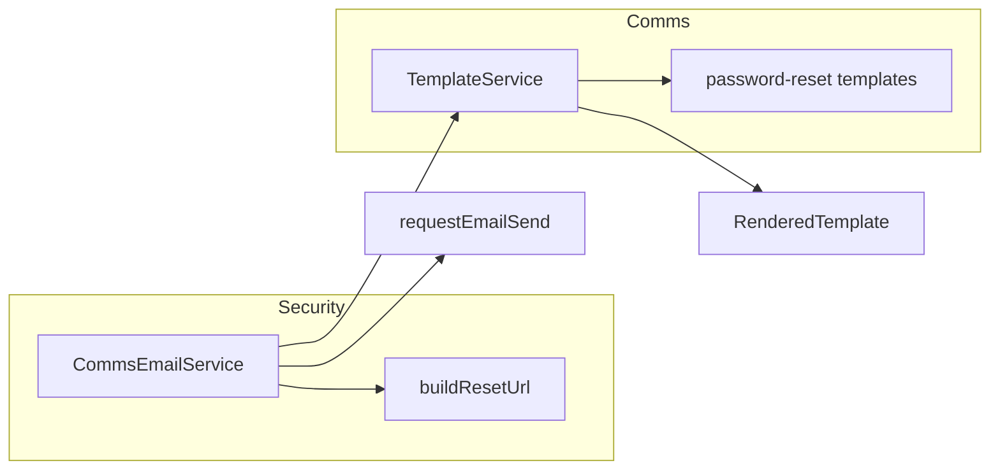

# Password Reset Email — Template Engine Migration

**Type:** Backend  
**Module:** comms (templates) + security (email service)  
**Status:** Draft  

**References:** [password-reset-template-implementation.md](../../../docs/03-features/comms/password-reset-template-implementation.md) (authoritative task list)

---

## Problem / Context

- Password reset email today: Security’s [CommsEmailService](../../../service/kotlin/security/src/main/kotlin/io/github/salomax/neotool/security/service/email/CommsEmailService.kt) uses base class helpers `loadEmailTemplate(locale)`, `getSubject(locale)`, and manual `{{RESET_URL}}` replacement.
- Templates live under `/emails/password-reset/{locale}.html` (legacy); no use of Comms template engine, locale fallback, or variable validation.
- **Goal:** Use the same template engine as `user-welcome` and `order-confirmation`: single template key, variables, locale fallback, CSS inlining.

---

## Solution Approach

- Add **`auth.password-reset`** template under Comms: `template.yml` + `body.{en,pt,pt-BR}.html` in [service/kotlin/comms/src/main/resources/templates/email/](../../../service/kotlin/comms/src/main/resources/templates/email/) (same layout as `user-welcome`).
- Refactor **CommsEmailService** to call **TemplateService** (`renderTemplate`) with `resetUrl` and `expiresInMinutes`, then send the rendered subject/body via existing `requestEmailSend` (keep content `kind: RAW`).
- Remove or deprecate legacy template helpers from **EmailService** base class in Security; keep **`buildResetUrl(token)`** in Security.

---

## Success Criteria (measurable)

- Template key **`auth.password-reset`** resolves for `en`, `pt`, `pt-BR` with locale fallback (e.g. pt-BR → pt → en).
- Required variable **`resetUrl`** and optional **`expiresInMinutes`** (default 60) are validated and substituted; rendered body contains reset link and expiration text.
- **CommsEmailService.sendPasswordResetEmail** uses **TemplateService.renderTemplate**; no `loadEmailTemplate` or manual `{{RESET_URL}}` replacement.
- Unit tests: template resolution, variable substitution, default `expiresInMinutes`, missing `resetUrl` throws.
- Integration test: **CommsEmailService** with mocked GraphQL client sends request with subject/body from rendered template.
- EmailService base: legacy methods removed or deprecated; **buildResetUrl** retained.

---

## Integration Points (code to explore)

| Purpose | Path |
|--------|------|
| Template definition pattern | [user-welcome/template.yml](../../../service/kotlin/comms/src/main/resources/templates/email/user-welcome/template.yml) |
| HTML body pattern | [user-welcome/body.en.html](../../../service/kotlin/comms/src/main/resources/templates/email/user-welcome/body.en.html) |
| Template rendering API | [TemplateService.kt](../../../service/kotlin/comms/src/main/kotlin/io/github/salomax/neotool/comms/template/service/TemplateService.kt) — `renderTemplate(templateKey, locale, channel, variables)` → `RenderedTemplate(subject, body, …)` |
| Rendered shape | [TemplateRenderer.kt](../../../service/kotlin/comms/src/main/kotlin/io/github/salomax/neotool/comms/template/renderer/TemplateRenderer.kt) — `RenderedTemplate` |
| Current password-reset sender | [CommsEmailService.kt](../../../service/kotlin/security/src/main/kotlin/io/github/salomax/neotool/security/service/email/CommsEmailService.kt) |
| Legacy base to trim | [EmailService.kt](../../../service/kotlin/security/src/main/kotlin/io/github/salomax/neotool/security/service/email/EmailService.kt) — `loadEmailTemplate`, `getSubject`, `getDefaultTemplate` |
| Existing template tests | [TemplateServiceTest.kt](../../../service/kotlin/comms/src/test/kotlin/io/github/salomax/neotool/comms/template/service/TemplateServiceTest.kt), [EmailRendererTest.kt](../../../service/kotlin/comms/src/test/kotlin/io/github/salomax/neotool/comms/template/renderer/EmailRendererTest.kt) |

---

## Technical Constraints

- **Locales:** `en`, `pt`, `pt-BR`; follow existing locale resolution (e.g. [FileBasedTemplateRegistry](../../../service/kotlin/comms/src/main/kotlin/io/github/salomax/neotool/comms/template/registry/FileBasedTemplateRegistry.kt)).
- **Dependency:** Security must gain access to **TemplateService**. Options: (a) add `implementation(project(":comms"))` in [service/kotlin/security/build.gradle.kts](../../../service/kotlin/security/build.gradle.kts), or (b) introduce a thin “comms-template-api” used by Security. The implementation doc assumes injection of **TemplateService** into **CommsEmailService**, so (a) is the direct match.
- **GraphQL:** Keep sending rendered content as **RAW** (no schema change). Optional future: TEMPLATE kind with template key + variables.
- **Conventions:** Follow [template-authoring-guide.md](../../../docs/03-features/comms/template-authoring-guide.md) and [template-engine-requirements.md](../../../docs/03-features/comms/template-engine-requirements.md).

---

## Open Decisions

- **Spec location:** This spec lives under `spec/features/comms/`; implementation plan remains in `docs/03-features/comms/`.
- **EmailService cleanup:** Remove legacy methods vs. deprecate with migration note (if any other code still uses them).

---

## For LLM Implementation

1. Add `password-reset/template.yml` and `body.*.html` in Comms.
2. Add Security dependency on Comms and refactor **CommsEmailService** to use **TemplateService** and **RenderedTemplate**.
3. Remove or deprecate legacy methods on **EmailService**.
4. Add unit and integration tests per implementation doc.
5. Update template-authoring-guide with password-reset example.

Use the [implementation doc](../../../docs/03-features/comms/password-reset-template-implementation.md) for exact YAML, HTML snippets, and test cases; use this spec for intent, criteria, and pointers.

---

## Architecture (optional)

